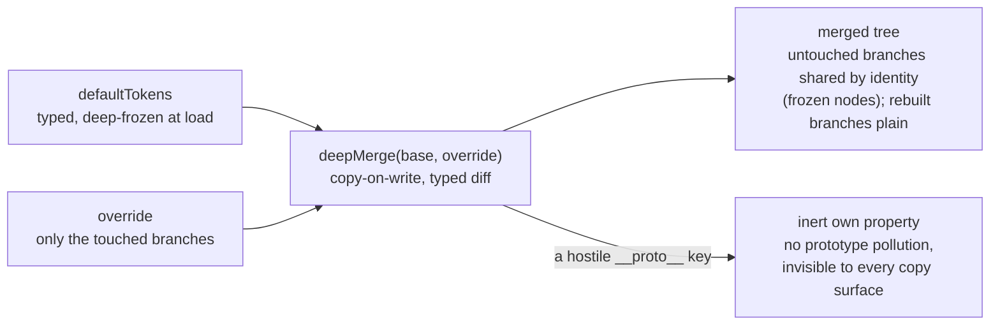

# tokens: design tokens as frozen data

`@speed/tokens` is the platform's design-token tree as pure,
dependency-free data: the typed `defaultTokens` assembly, and the
`deepMerge` mechanism by which a host overrides it. Zero runtime
dependencies, no React, no CSS-in-JS — consumers import data and types
only. It is the bottom of the frontend's dependency floor, and its
design is mostly about the two invariants everything above it relies
on: the default tree never changes, and the rows that must agree with
MUI cannot silently drift from MUI.

## Responsibility and boundary

- **It owns values, not semantics.** The tree answers *what the
  product looks like* — colors, type, spacing, shape, breakpoints,
  z-index, shadows. It does not decide how those values reach a
  browser: the theme adapter is `@speed/ui-kit`'s job, and keeping it
  out of this package is what lets a consumer override a palette
  without importing anything React-bearing.
- **It renders nothing and speaks nothing.** No components, no hooks,
  no user-facing text, no locale files — a token tree has no language.
- **It ships no MUI.** The parity tests below import MUI's real
  `createTheme` as a dev-only dependency, so the package keeps its zero
  runtime dependencies while still pinning itself against the real
  thing.
- **It does not enforce product policy.** Nothing here says a tenant
  may override `primary.main` — the override mechanism is open to any
  caller; who may supply a layer is a host-side question.

## Design: the default tree is frozen by construction

`defaultTokens` is assembled once and deep-frozen at module load; the
types mark every section `readonly`. Immutability is therefore enforced
by runtime, not convention: a write attempt through `defaultTokens`
itself — or through any branch a merge result shares with it by
identity — throws in strict mode instead of silently polluting the tree
every override starts from. The freeze matters because `deepMerge` is
copy-on-write: untouched branches of the base keep their identity, so
merged results genuinely share nodes with the defaults. If those shared
nodes were writable, one host's careless mutation would corrupt the
base for every other consumer of the module in the same bundle. The
freeze converts that failure mode from silent corruption to an
immediate throw.

## Design: `deepMerge` lives here, and merges are typed diffs

Merge is defined *over* the `SpeedTokens` type
(`TokensOverride = DeepPartial<SpeedTokens>`), and `tokens` is its
deliberate home: the only current consumer is a token factory, and
placing the merge in a React-bearing package would force a plain tokens
consumer to pay for one. The semantics are pinned by tests: no input
mutation; later overrides win; plain objects merge recursively while
arrays and scalars replace wholesale; `undefined` override values are
skipped so a partial override can never blank a token; and every own
key of the base survives an override that omits it. Two details are
worth naming:

- **A hostile `__proto__` key lands as an inert own property.** Token
  layers can arrive from data a host did not author by hand, and a
  naive merge would make such a key pollute the result's prototype —
  and, through a later copy, anything downstream. Here it is
  deep-merged but invisible to every copy surface, so neither the
  result's prototype nor any `Object.assign`/spread over it can be
  polluted.
- **Shape drift is a compile-time error.** Because overrides are typed
  diffs, an unknown section or a string where a hex belongs fails
  `tsc`, never a silent runtime drop of a misspelled key.

## Design: MUI-parity rows are pinned against the live theme

The token sections are deliberately structured so `createAppTheme` can
map them onto the MUI theme without contortions. Some rows are *equal
by contract* — spacing unit (8), `breakpoints.values`,
`zIndex.values` — and those are pinned against MUI's own live defaults
in tests: the tests import MUI's real `createTheme` and compare the
token rows to it. A stale in-tree expectation could only agree with the
tokens it was copied from, so an MUI major that changes a default fails
here, in the token package, before any theme adapter ships
silently-wrong chrome. The one deliberate deviation is recorded the
same way: `shape.borderRadius` ships 8 where MUI defaults to 4, and a
test fails if MUI's default ever converges on the token value — the
deviation is a decision, and decisions that stop being deviations are
caught, not quietly absorbed. Rows where the mapping is genuinely an
adapter decision (neutral ramp to `palette.grey`, shadows, typography
roles) are documented as such and mapped in ui-kit, not force-fit
here.

## Stable surface

The `SpeedTokens` type and its section vocabulary (roles, ramp steps,
slots); `defaultTokens`'s assembled shape and values, frozen; the
`TokensOverride`/`DeepPartial` diff type; and the full `deepMerge`
semantics listed above — no-input-mutation, copy-on-write, skip
`undefined`, replace arrays, later wins, faithful base copy. Package
exports are data and types only.

## Source

- Design: [docs/internal/12-frontend.md](https://github.com/vislake/speed/blob/main/docs/internal/12-frontend.md)
  (package layers and the theme path)
- Package contract: [web/packages/tokens/README.md](https://github.com/vislake/speed/blob/main/web/packages/tokens/README.md)

## Related pages

- [Frontend architecture](/docs/developer-docs/frontend-architecture/)
  — where the token tree sits in the layer graph
- Web group: [group guide](/docs/developer-docs/modules/web/), then
  [ui-kit](/docs/developer-docs/modules/web/ui-kit/) — the theme
  factory that consumes this tree
- How to use it: [@speed/tokens in the user guide](/docs/user-guide/modules/web/tokens/)
