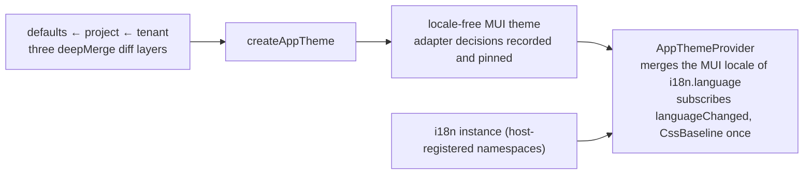

# ui-kit: theme adapter and controlled components

`@speed/ui-kit` is the web group's first DOM-rendering package. It has
two halves: the theme factory (`createAppTheme`, `AppThemeProvider`)
that maps the merged `@speed/tokens` tree onto an MUI v9 theme, and
seven controlled core components (`PageHeader`, `EmptyState`,
`ConfirmDialog`, `FormField`, `FormLayout`, `DataTable`,
`FileUploader`). Both halves exist to answer one question the packages
below it are not allowed to answer: how the platform's look and
interaction primitives reach a browser. Everything above the theme and
the primitives — screens, flows, data — is host composition.

## Responsibility and boundary

- **It owns adapter decisions, not token values.** The token tree
  already pinned the equal-by-contract rows against MUI; what remains
  here is the mapping of the rest, and every mapping decision is
  recorded and test-pinned in this package rather than improvised.
- **Components render only state hosts give them.** Sorting,
  selection, pagination and filtering appear as echoed state plus
  callbacks; a component never fetches, stores, navigates or decides a
  tenant. `FileUploader` extends the contract to its limit: the queue
  renders from the host's own `rows` prop, the upload transport —
  validation, concurrency, abort — is host code, and the component
  holds no `File` past the event handler that reported it. The reason
  is structural: package code cannot know a host's routing, identity or
  data flow, so rendering only given state is what keeps a component
  correct in every host and testable without a server.
- **It ships no screens and no business components.**
- **Its text is its own namespace, never inline code.** Built-in
  strings render from the bilingual `ui-kit` namespace, and the
  workspace's `speed/no-literal-text` rule refuses user-facing text
  written in package `src`. Hosts reword the kit by registering their
  own bundle pair under `UI_KIT_NAMESPACE`; host content (a title, a
  column header) is the host's own translation surface.
- **The provider registers nothing and wraps nothing but the theme.**
  `AppThemeProvider` deliberately renders no `I18nextProvider` and
  registers no namespace — both belong to the host bootstrap.
- **Accessibility is a per-component property, audited by axe in
  every test** — with the two documented exceptions whose reasons are
  structural: `color-contrast` (jsdom does no layout or color
  computation, and contrast lives in the theme the tokens package
  pins) and `region` (the units are components, not full pages).
  Heading structure is a first-class prop (`headingLevel`, real `h1`s)
  because only the host knows the page's order.

## Design: the theme factory maps where deviations are recorded

Token layers are diffs applied over the built-in defaults in order:
`createAppTheme(projectTokens, tenantOverrides)` merges copy-on-write
through the tokens package's `deepMerge` and maps the merged tree onto
MUI's theme surface. Equal rows map key-for-key; the adapter rows
record their decisions — the neutral ramp becomes `palette.grey` with
MUI's own A100–A700 aliasing, tone 950 having no MUI slot stays
token-only; typography sizes land on variant roles; and the six
elevation slots floor onto MUI's 25-entry shadow ramp, never exceeding
the design scale — interpolation would invent shadows the design never
specified. The returned theme is
locale-free on purpose: MUI's built-in texts (pagination, tooltips) are
language-bearing, so the locale merge happens at render time.
`AppThemeProvider` merges the MUI locale of the active language over
the base theme, subscribes to `languageChanged` so MUI texts follow
every switch, and renders the theme-aware `CssBaseline` once. A
language outside MUI's locale table never throws mid-render: MUI's
built-ins fall back to its en-US locale while the app's own
translations keep rendering in the active language.

## Design: fully controlled, and why the exceptions stay tiny

The "no local state" rule has exactly one named carve-out:
`ConfirmDialog`'s double-confirm arming, interaction state that resets
whenever the dialog closes. The arm exists because a destructive
confirmation must survive a double click: the button relabels on the
first click and fires `onConfirm` only on the second, and the
`CONFIRM_ARM_LOCKOUT_MS` window (600ms) deliberately outlasts the
platform double-click threshold, so two fast clicks cannot skip the
guard.

Two component contracts deserve their design spelled out:

- **`DataTable` refuses to re-sort or re-slice what it is given.**
  `rows` is by contract the set the host wants shown right now. An
  implicit client-side second sort would corrupt the server-side page
  the host just fetched, and slicing would hide rows the pagination
  counter still counts; sorting and filtering therefore appear as
  state echo plus callbacks, and the host applies them to the data it
  passes in. Its horizontal-scroll container and the opt-in column
  `priority` reflow are stated, tested contracts — pure CSS at
  shared-scale breakpoints, never a JS layout decision.
- **The form family's error text resolves in one namespace only.**
  `FormField` renders a validation message that is a ui-kit namespace
  key as its translation; anything else — already-localized host text,
  a host-specific code — renders verbatim. ui-kit never guesses
  another namespace's codes.

## Stable surface

`createAppTheme` and its two optional token layers; `AppTheme` (the
merged token tree plus the locale-free theme); `AppThemeProvider` and
its props (i18n instance, token layers, children); the seven
components' prop contracts as documented; the `UI_KIT_NAMESPACE`
constant and `uiKitResources` bundle; the validation-error text
contract and `REQUIRED_ERROR_KEY`; the `headingLevel`/
`emptyHeadingLevel` obligation; and the recorded adapter decisions the
factory's tests pin.

## Source

- Design: [docs/internal/12-frontend.md](https://github.com/vislake/speed/blob/main/docs/internal/12-frontend.md)
  (theme path, controlled-component contract, bilingual text)
- Package contract: [web/packages/ui-kit/README.md](https://github.com/vislake/speed/blob/main/web/packages/ui-kit/README.md)

## Related pages

- [Frontend architecture](/docs/developer-docs/frontend-architecture/)
  — the controlled-components thread this package originates
- Web group: [tokens](/docs/developer-docs/modules/web/tokens/),
  [i18n](/docs/developer-docs/modules/web/i18n/) — the tree and the
  namespaces it maps — and
  [layout-kit](/docs/developer-docs/modules/web/layout-kit/), whose
  denied fallback is this package's `EmptyState`
- How to use it: [@speed/ui-kit in the user guide](/docs/user-guide/modules/web/ui-kit/)
