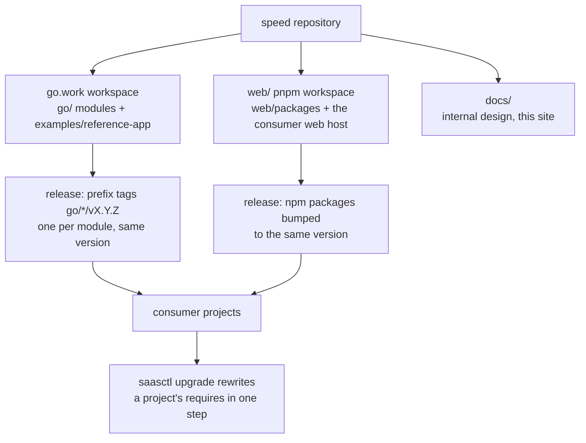

# Repository and release

The `speed` repository is one monorepo with two deliberately
non-overlapping workspace roots, and it releases everything it ships
under one version number. This page explains the layout, the version
strategy and the reasoning behind both — for the developer working in
the repository and for the consumer project trying to understand what
it depends on.

## One repo, two workspace roots

The repo root is a Go workspace (`go.work` listing the reference app
and the modules under `go/`); the frontend half is a pnpm workspace
rooted at `web/` with its own lockfile. The two roots never overlap,
on purpose: Go tooling walks module roots and pnpm's workspace
protocol wants a root of its own, nothing Go-side ever needs to
resolve an npm package and nothing npm-side needs a Go module, so
sharing a root would only invite cross-tool confusion. CI mirrors the
boundary — Go checks run from module directories, npm checks from
`web/`.

The module directories under `go/` are the release units of the
backend. Each is an independent Go module with its own `go.mod`, its
own `AGENTS.md` and its own migrations, locale files and API fragment
where the module ships them — not a service, a *library*, compiled
into whatever binary the assembling application builds. Two packaging
rules follow. Implementation details live under `internal/` so
consumers cannot import them. And a backend implementation never sits
in the same package as the interface it implements — which backends a
binary contains is the application's decision, and the interfaces stay
importable without dragging in any backend's dependencies.

## Lockstep versioning, and why

All Go modules and all npm packages share **one version number and
release together**. Only same-version combinations are supported;
"tenancy v1.2 with billing v1.5" does not exist. The simplification is
the point: releasing is a one-shot event with no per-module impact
analysis, CI validates exactly one combination instead of an
exponential compatibility matrix, diamond dependency conflicts are
impossible because every module requires the same version, and "what
version are you on" in a support conversation is one number.

The costs are accepted explicitly. A consumer upgrade is a
whole-platform upgrade — mitigated by tooling, since `saasctl upgrade`
rewrites a consumer `go.mod`'s speed requires to the target version in
one step, byte-preserving and idempotent, while the npm side rides the
same version through the changesets fixed group. A module with no
changes in a
release still gets the new version — acceptable noise, noted as such
in the changelog. Breaking changes concentrate in major versions and
ship with an upgrade guide.

Multi-module publishing mechanics follow from Go's rules and from the
unified version: each module is tagged with the subdirectory-prefix
form `go/<module>/vX.Y.Z`, and the whole plan — every module, every
package, the same version — is derived at runtime by the release
coordinator (`tools/release/lockstep-release.py`), which exits 0 only
when the plan is consistent: version syntax, no existing tags, the
`go.work` module list and the directory tree agreeing in both
directions, the npm versions uniform, the changesets fixed group
covering exactly the packages that exist. Scripted verification is
non-negotiable because hand-tagging a multi-module release is exactly
the step humans get wrong; the reference app is excluded from the
release set by design — it is the repository's consumer module, the
proof shape, never a deliverable. The release workflow
(`release.yml`) runs this verification and the coordinator's own
self-tests on manual dispatch. No publish credential is wired, so the
pipeline verifies and cannot publish: the read-only design keeps
verification honest before real publishing has anything to push.
Locally, `task release:plan VERSION=vX.Y.Z` runs the same check.

## The CI matrix

The CI that guards the repository is described in full in the root
CLAUDE.md's Repository Status section (the authoritative, always
current account); the shape, in brief:

- **fast-check** runs on every pull request and every direct push to
  main: per-module legs (lint, vet, unit tests under the race
  detector, workspace and standalone builds) across the module and
  package matrices, plus repo-checks — the architecture-discipline
  semgrep rules, tenant-isolation coverage, i18n key parity, toolchain
  drift gates and the workspace ESLint rules' own tests.
- **full-check** runs on `full-ci`-labeled PRs and on pushes to main:
  the Docker-backed integration tiers (real PostgreSQL, Redis, RustFS
  via testcontainers) and the reference-app job, including the
  two-replica distributed-mode boot proof.
- The narrower pipelines fire on what they guard: docs-check on
  doc/i18n-touching changes, api-contract on spec-toolchain changes
  (regenerating everything and porcelain-gating the committed
  artifacts), security scans on every PR plus a daily schedule, and
  scaffold-verify daily — materializing a generated consumer project,
  tidying, building, migrating and booting it under both deployment
  modes.

Two rules give the matrix its teeth. Every implemented module and
package genuinely passes its own legs (the CLAUDE.md status section
names each one). And the mandatory-first-consumer rule means a module
API nothing real uses is not done: the reference app exercises every
module end to end, and consumer-shaped proof runs through the
scaffold-verify pipeline on real generated projects.

## Documentation ships with the code

Docs follow the code to the same version. Each module and package
carries its authoritative documentation inside itself — the
`AGENTS.md` that ships in the module (written for AI agents as first-
class readers: boundaries, public API, prohibitions in imperative
form) plus usage material and, for npm packages, the README in the
published package. Design rationale lives in `docs/internal/`
alongside the code that implements it, and the pages of this site —
this one included — distill those documents and link back to them, so
any claim can be verified against its source. Site pages are written
in both English and Chinese, and every page's Source section points at
the originals.

## Source

- [Repository-and-release design notes (internal)](https://github.com/vislake/speed/blob/main/docs/internal/02-repo-and-release.md) —
  the internal design document this page distills.
- [web/README.md](https://github.com/vislake/speed/blob/main/web/README.md) —
  why `web/` is its own workspace root.
- [Taskfile.yml](https://github.com/vislake/speed/blob/main/Taskfile.yml) —
  the planned commands, including `release:plan`.
- [Release coordinator](https://github.com/vislake/speed/blob/main/tools/release/lockstep-release.py) —
  the offline one-version plan verifier.
- [web/.changeset/config.json](https://github.com/vislake/speed/blob/main/web/.changeset/config.json) —
  the npm fixed version group.
- [fast-check.yml](https://github.com/vislake/speed/blob/main/.github/workflows/fast-check.yml) —
  the per-PR pipeline's module and package matrix.
- [saasctl AGENTS.md](https://github.com/vislake/speed/blob/main/go/saasctl/AGENTS.md) —
  the consumer-facing CLI (`new`, `upgrade`, `db migrate`, `config print`).
