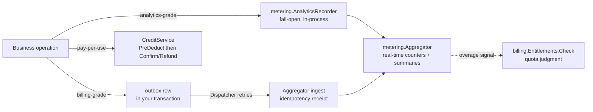

# Metering, billing and compliance

This domain covers the money side of a product and its legal
obligations: `metering` records what happened, `billing` decides what
a tenant may do and moves credits, and `compliance` operates the
retention, erasure and export obligations on your data.



## Metering: choose a reliability tier per use

`metering.Recorder` has two tiers, and which one you use is a business
decision about the cost of a lost record:

- **Analytics-grade** (`AnalyticsRecorder`) fails open: usage recording
  must never take the business operation down. Use it for product
  analytics — what features were used, when.
- **Billing-grade** (`Enqueue` + `Dispatcher`) must not silently drop:
  the outbox row is written in *your* transaction, and the dispatcher
  retries delivery indefinitely, escalating a permanently failing row
  after a stated horizon. Its ingest carries an idempotency receipt, so
  a redelivery after an interrupted attempt cannot double-count.

Both feed the same in-process `Aggregator`: real-time counters,
database-backed summary rows, and overage-threshold events. The
`billing` module's quota judgment reads the *real-time* counter through
the `UsageReader` seam — never a summary table, which would let an
over-quota request through on aggregation delay.

## Billing: entitlements and the credits ledger

- **Plans and entitlements.** A `Plan` bundles `Grant`s (feature keys
  with boolean or quota values) resolved per tenant — a tenant-custom
  plan overrides the platform-wide one for the same key. Business code
  asks the single judgment entry point,
  `EntitlementsService.Check`, before letting an operation through.
- **Credits are a reserve-then-settle ledger.** For pay-per-use that
  might fail, the shape is `CreditService.PreDeduct` (reserve) *before*
  the expensive call, then `Confirm` on success or `Refund` on failure —
  both idempotent under retry, concurrency-safe through one
  database-arbitrated update per mutation. The reference app runs this
  exact shape against its AI generation path with a durable
  reservation store and a reconciliation sweep, so a crash mid-flight
  cannot strand a reservation.
- **The read surface is HTTP, the writes are service calls.** The
  billing fragment ships two GETs (`/api/v1/billing` balance and
  transactions) for dashboards; granting, reserving and refunding are
  in-process Go calls, never HTTP operations.

## Compliance: retention, erasure and export

`compliance` owns no table — its three services operate *your* data
through participants that register onto the kernel's `Registry.Retention`
seat:

- `RetentionService` sweeps each participant's data past the retention
  window.
- `ErasureService` performs right-to-erasure, tenant-bounded: an erase
  can never touch another tenant's rows.
- `ExportService` gathers a manifest of a tenant's data and hands it
  over through a real share link — time-limited and single-view.

## Minimal integration steps

1. **Wire the modules.** `metering.NewModule(db)` and
   `billing.NewModule(db, usage, opts...)` join the bootstrap module
   set — `usage` is the `billing.UsageReader` quota checks read (a real
   host passes its metering module's `Aggregator()`, which satisfies
   the interface structurally; `nil` is accepted only when no quota
   grant will ever be checked); billing's payment-gateway registry and
   polling fallback come from the provider subpackages
   (`go/billing/gateway/...`) a host imports deliberately.
2. **Record at the right tier.** Analytics: keep an
   `AnalyticsRecorder` and call `Record` from your business paths.
   Billing-grade: `Enqueue` a usage event in the same transaction as
   the business write and let the dispatcher deliver.
3. **Gate the paid path.** Before a quota- or grant-gated operation,
   call `EntitlementsService.Check`; treat a denial as the coded
   refusal it is.
4. **Reserve before the expensive call, settle after.** Wrap the
   call in `PreDeduct` / `Confirm` / `Refund` with one idempotency key
   per operation, and persist the key so a crash cannot strand the
   reservation.
5. **Register your compliance participants.** A module that owns
   data with a retention policy implements `RetentionParticipant` and
   declares itself on `reg.Retention` during `Register`; the sweep,
   erase and export orchestrations then cover your rows.

## Complete example: one AI call, entitled, metered and paid in credits

A clinic product charges each AI smile simulation against a plan
entitlement and a credit balance. Every request first passes the
entitlement gate — the tenant's monthly `ai.generations` quota, ten
generations, overage blocked — then the credit ledger reserves the
call's cost before the provider is dialled and settles it afterwards;
a reservation that must be refunded shows the ledger absorbing failure
the same way a dead-lettered call would. The walk below runs that whole
money path in one process over an in-memory SQLite database — the same
shape the standalone deployment mode runs in production.

Your consumer module's `go.mod` replaces the speed module paths onto a
local checkout (`go mod tidy` after the `replace` lines — the modules'
own `example_test.go` files compile under exactly this arrangement);
paste the code into a file of your own `main` package and run it.

```go
import (
	"context"
	"fmt"
	"time"

	"gorm.io/gorm"

	"github.com/vislake/speed/go/billing"
	"github.com/vislake/speed/go/dbkit"
	_ "github.com/vislake/speed/go/dbkit/dialect/sqlite" // registers DialectSQLite
	"github.com/vislake/speed/go/metering"
	"github.com/vislake/speed/go/pkgcore"
)

// must keeps the walk readable; a real host returns coded errors instead.
func must(err error) {
	if err != nil {
		panic(err)
	}
}

func entitledMeteredAndCharged() {
	ctx := context.Background()
	// One database, two modules: metering measures, billing decides. The
	// Aggregator satisfies billing.UsageReader structurally (compile-time
	// assertion in go/billing/module.go), so quota checks read the
	// real-time counter, never a summary table.
	db, err := dbkit.Open(ctx, dbkit.Options{Dialect: dbkit.DialectSQLite, DSN: "file:money?mode=memory&cache=shared"})
	must(err)
	usage := metering.NewModule(db)
	money := billing.NewModule(db, usage.Aggregator())
	registry := dbkit.NewMigrationRegistry()
	must(registry.Register(usage))
	must(registry.Register(money))
	must(registry.Apply(ctx, db, dbkit.DialectSQLite))
	usage.Start(ctx) // flush loop + billing dispatcher poll loop
	defer usage.Stop()
	tenantCtx := pkgcore.WithTenant(ctx, "tenant-acme")

	// Sell "pro": 10 AI generations per month, overage blocked.
	plan := &billing.Plan{Key: "pro", Name: "Pro"}
	plan.SetPrice(billing.Money{Cents: 4900, Currency: "USD"})
	plan.Interval = string(billing.BillingIntervalMonth)
	must(plan.SetGrants([]billing.Grant{{
		FeatureKey: "ai.generations", Value: int64(10),
		Period: billing.ResetPeriodMonthly, OverageMode: billing.OverageModeBlock,
	}}))
	must(money.Plans().Create(ctx, plan))
	sub, err := money.Subscriptions().Create(tenantCtx, billing.CreateInput{PlanID: plan.ID})
	must(err)
	_, err = money.Subscriptions().Activate(tenantCtx, sub.ID)
	must(err)
	fmt.Println("subscribed to pro")
	credits := money.Credits()
	_, err = credits.Grant(tenantCtx, billing.GrantInput{Amount: 100, Reason: "promo:welcome"})
	must(err)
	// One AI call = one gate check, one reservation, one usage record, one settlement.
	decision, err := money.Entitlements().Check(tenantCtx, "ai.generations", 1)
	must(err)
	fmt.Printf("check #1 allowed=%v remaining=%d\n", decision.Allowed, *decision.Remaining)

	// Reserve BEFORE the expensive call, one idempotency key per call.
	_, err = credits.PreDeduct(tenantCtx, billing.PreDeductInput{
		Amount: 30, IdempotencyKey: "ai_call:job-1", Reason: "ai_call:job-1",
	})
	must(err)
	fmt.Println("reserved 30 for ai_call:job-1")

	// ...run the call (omitted), then record usage billing-grade in YOUR transaction.
	must(db.Transaction(func(tx *gorm.DB) error {
		_, enqErr := metering.Enqueue(ctx, tx, metering.UsageEvent{
			TenantID:       "tenant-acme",
			Feature:        "ai.generations",
			Quantity:       1,
			IdempotencyKey: "ai_call:job-1-usage",
			OccurredAt:     time.Now(),
		})
		return enqErr
	}))
	_, err = usage.Dispatcher().RunOnce(ctx)
	must(err)
	fmt.Println("usage 1 delivered for ai.generations")

	// Settle: confirm on success — a dead-lettered call refunds instead.
	_, err = credits.Confirm(tenantCtx, "ai_call:job-1")
	must(err)

	// The counter moved, so the next request's headroom shrank.
	decision, err = money.Entitlements().Check(tenantCtx, "ai.generations", 1)
	must(err)
	fmt.Printf("check #2 allowed=%v remaining=%d\n", decision.Allowed, *decision.Remaining)

	// An over-limit request is refused, never admitted-and-billed-later.
	over, err := money.Entitlements().Check(tenantCtx, "ai.generations", 11)
	must(err)
	fmt.Printf("check #3 (11 requested) allowed=%v\n", over.Allowed)

	// The ledger refuses what the balance cannot cover, refunds what a failed call reserved.
	_, err = credits.PreDeduct(tenantCtx, billing.PreDeductInput{
		Amount: 999, IdempotencyKey: "ai_call:job-x", Reason: "ai_call:job-x",
	})
	fmt.Println("refused deduction:", err) // billing.insufficient_credits
	_, err = credits.PreDeduct(tenantCtx, billing.PreDeductInput{
		Amount: 20, IdempotencyKey: "ai_call:job-2", Reason: "ai_call:job-2",
	})
	must(err)
	_, err = credits.Refund(tenantCtx, "ai_call:job-2")
	must(err)
	fmt.Println("refunded reservation ai_call:job-2")

	balance, err := credits.Balance(tenantCtx)
	must(err)
	fmt.Printf("available: %d reserved: %d\n", balance.Available, balance.Reserved)

	rows, err := credits.Transactions(tenantCtx)
	must(err)
	for _, row := range rows {
		fmt.Printf("ledger %s %s %d\n", row.Type, row.Status, row.Amount)
	}
}
```

Three contract facts this walk demonstrates: the
`PreDeduct`/`Confirm`/`Refund` trio is keyed and idempotent, so a
replayed settlement converges on the first call's row instead of
deducting twice; the quota decision reads the real-time counter through
the `UsageReader` seam, so overage cannot slip past on aggregation
delay; and a billing-grade usage record is written in *your*
transaction, so it can never be silently dropped the way a
fire-and-forget analytics record may be. (The analytics tier is the
same pipeline: an `AnalyticsRecorder.Record` call with its own feature
key — never a feature the billing-grade path also measures — folds into
the same counters.) Your module's compliance obligations ride the same
`Register` call: implementing the `Registry.Retention` seat's
participant shape covers your rows with retention, erasure and export
orchestration — see the module pages' `AGENTS.md` files for the exact
participant wiring.

To run it:

1. Add the `replace` lines for `go/dbkit`, `go/pkgcore`, `go/metering`
   and `go/billing` to your consumer `go.mod`, then `go mod tidy`.
2. Put the code above in a file of your `main` package and run
   `go run .`.
3. The program opens an in-memory SQLite database, applies both
   modules' versioned migrations from zero and exits — nothing is left
   running and nothing needs Docker.

Expected output:

```text
subscribed to pro
check #1 allowed=true remaining=9
reserved 30 for ai_call:job-1
usage 1 delivered for ai.generations
check #2 allowed=true remaining=8
check #3 (11 requested) allowed=false
refused deduction: billing.insufficient_credits
refunded reservation ai_call:job-2
available: 70 reserved: 0
ledger deduct refunded 20
ledger deduct confirmed 30
ledger grant confirmed 100
```

(Remaining counts what is left *after* the checked request; the ledger
lists newest first.)

See it in the reference app:

- [go/billing/example_test.go](https://github.com/vislake/speed/blob/main/go/billing/example_test.go)
  and [go/metering/example_test.go](https://github.com/vislake/speed/blob/main/go/metering/example_test.go)
  — the identical walks, compiled and executed by each module's own
  unit suite.
- [examples/reference-app/flowtests/billing_credit_flow_test.go](https://github.com/vislake/speed/blob/main/examples/reference-app/flowtests/billing_credit_flow_test.go)
  — the same reserve/confirm/refund journey driven through the real
  composed HTTP stack of the reference app.

## Next steps

The full API lives in the `metering`, `billing` and `compliance` module
pages of the module reference.

## Source

- [metering AGENTS.md](https://github.com/vislake/speed/blob/main/go/metering/AGENTS.md)
- [billing AGENTS.md](https://github.com/vislake/speed/blob/main/go/billing/AGENTS.md)
- [compliance AGENTS.md](https://github.com/vislake/speed/blob/main/go/compliance/AGENTS.md)
