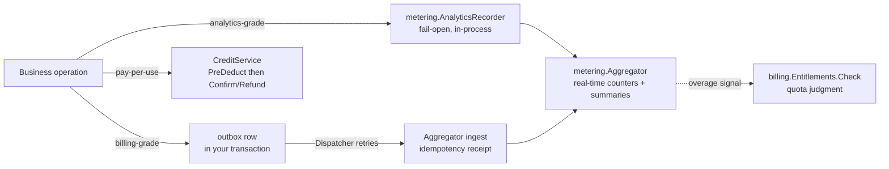

# Metering, billing and compliance

This domain covers the money side of a product and its legal
obligations: `metering` records what happened, `billing` decides what
a tenant may do and moves credits, and `compliance` operates the
retention, erasure and export obligations on your data.

## Metering: choose a reliability tier per use

`metering.Recorder` has two tiers, and which one you use is a business
decision about the cost of a lost record:

- **Analytics-grade** (`AnalyticsRecorder`) fails open: usage recording
  must never take the business operation down. Use it for product
  analytics — what features were used, when.
- **Billing-grade** (`Enqueue` + `Dispatcher`) must not silently drop:
  the outbox row is written in *your* transaction, and the dispatcher
  retries delivery indefinitely, escalating a permanently failing row
  after a stated horizon. Its ingest carries an idempotency receipt, so
  a redelivery after an interrupted attempt cannot double-count.

Both feed the same in-process `Aggregator`: real-time counters,
database-backed summary rows, and overage-threshold events. The
`billing` module's quota judgment reads the *real-time* counter through
the `UsageReader` seam — never a summary table, which would let an
over-quota request through on aggregation delay.

## Billing: entitlements and the credits ledger

- **Plans and entitlements.** A `Plan` bundles `Grant`s (feature keys
  with boolean or quota values) resolved per tenant — a tenant-custom
  plan overrides the platform-wide one for the same key. Business code
  asks the single judgment entry point,
  `EntitlementsService.Check`, before letting an operation through.
- **Credits are a reserve-then-settle ledger.** For pay-per-use that
  might fail, the shape is `CreditService.PreDeduct` (reserve) *before*
  the expensive call, then `Confirm` on success or `Refund` on failure —
  both idempotent under retry, concurrency-safe through one
  database-arbitrated update per mutation. The reference app runs this
  exact shape against its AI generation path with a durable
  reservation store and a reconciliation sweep, so a crash mid-flight
  cannot strand a reservation.
- **The read surface is HTTP, the writes are service calls.** The
  billing fragment ships two GETs (`/api/v1/billing` balance and
  transactions) for dashboards; granting, reserving and refunding are
  in-process Go calls, never HTTP operations.

## Compliance: retention, erasure and export

`compliance` owns no table — its three services operate *your* data
through participants that register onto the kernel's `Registry.Retention`
seat:

- `RetentionService` sweeps each participant's data past the retention
  window.
- `ErasureService` performs right-to-erasure, tenant-bounded: an erase
  can never touch another tenant's rows.
- `ExportService` gathers a manifest of a tenant's data and hands it
  over through a real share link — time-limited and single-view.

## Minimal integration steps

1. **Wire the modules.** `metering.NewModule(db)` and
   `billing.NewModule(db, opts...)` join the bootstrap module set;
   billing's payment-gateway registry and polling fallback come from
   the provider subpackages (`go/billing/gateway/...`) a host imports
   deliberately.
2. **Record at the right tier.** Analytics: keep an
   `AnalyticsRecorder` and call `Record` from your business paths.
   Billing-grade: `Enqueue` a usage event in the same transaction as
   the business write and let the dispatcher deliver.
3. **Gate the paid path.** Before a quota- or grant-gated operation,
   call `EntitlementsService.Check`; treat a denial as the coded
   refusal it is.
4. **Reserve before the expensive call, settle after.** Wrap the
   call in `PreDeduct` / `Confirm` / `Refund` with one idempotency key
   per operation, and persist the key so a crash cannot strand the
   reservation.
5. **Register your compliance participants.** A module that owns
   data with a retention policy implements `RetentionParticipant` and
   declares itself on `reg.Retention` during `Register`; the sweep,
   erase and export orchestrations then cover your rows.

## Next steps

The full API lives in the `metering`, `billing` and `compliance` module
pages of the module reference.

## Source

- [metering AGENTS.md](https://github.com/vislake/speed/blob/main/go/metering/AGENTS.md)
- [billing AGENTS.md](https://github.com/vislake/speed/blob/main/go/billing/AGENTS.md)
- [compliance AGENTS.md](https://github.com/vislake/speed/blob/main/go/compliance/AGENTS.md)
