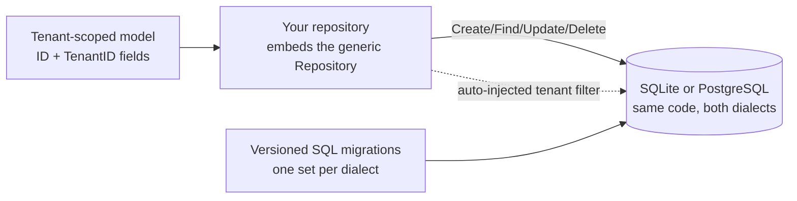

# Data and configuration

This domain is the persistence floor of your product: how your own
tables are declared, migrated and queried under tenant isolation
(`dbkit`), and how runtime configuration and feature flags are served
to every layer of your product (`config`).

## The dbkit shape



Every tenant-owned model declares `ID` and `TenantID` (the tenant as
the leftmost key column), and every repository embeds
`dbkit.Repository[T]` — you never hold a raw `*gorm.DB` and hand-write
`WHERE tenant_id = ?`. Repository methods take the tenant from the
context, so a caller without tenant context fails closed rather than
leaking rows across tenants.

## Minimal integration steps

1. **Declare the model.** `dbkit.Repository[T]` requires the
   `dbkit.TenantScoped` marker: `ID` and `TenantID` with the exact
   field shapes the repository documents, tenant first in every
   composite index.
2. **Embed the repository.** Your repository type embeds
   `dbkit.Repository[YourModel]`; the generic base supplies the
   tenant-filtered CRUD plus the `dbkit.WithTenantSession` transaction
   shape for multi-statement writes.
3. **Migrate with versioned SQL, never `AutoMigrate`.** Each module
   ships dual-dialect migration sets (SQLite and PostgreSQL) as its
   component's `Migrations` embed, which `dbkit`'s ledger applies — the
   selected db component runs them in the assembly's `Verify` stage,
   and `saasctl db migrate` applies the same sets ahead of a boot.
   Both dialects are first-class — avoid PostgreSQL-only features
   (`gen_random_uuid()`, native arrays, `NOW()`); generate IDs in the
   application.
4. **Classify every table before designing it.** Tenant data is
   tenant-scoped and runs `tenancytest.AssertIsolated`; identity data
   (a person who may belong to several tenants) and platform data
   (globally shared, tenants read only) never implement
   `TenantScoped` and run `AssertNotTenantScoped` instead.
5. **Encrypt what must be queryable.** A field that is both sensitive
   and a lookup key (a phone number used as a login identifier) is
   encrypted at rest *and* blind-indexed through
   `dbkit.NewBlindIndexer` — HMAC over the canonical form — never
   queried in plaintext.

## The config shape

`config` serves values and feature flags to every layer of a speed
product: tenant-facing branding and support settings, capability
switches, AI keys. Two decisions shape its use:

- **Register vs Attach.** Modules *declare* their config items and
  flags on the registry during `Register`; `Attach` — exactly once,
  after the assembly's declaration turn has finished — folds every
  module's declarations into one schema and refuses a cipher-less
  startup while any `Sensitive` item exists. A host keeps the
  `*Service` Attach returns.
- **Scope tiers and fallback.** Every value lives at one tier
  (tenant / system); reads fall back narrow-to-wide: tenant row, then
  system row, then the schema default. A tenant-less context never
  sees tenant rows.

Reads go through `Service.Get` (typed variants `GetTyped[string]`,
`GetTyped[bool]`, ...). Writes are attributed to the context's tenant;
a system-tier write requires the audited system context. Sensitive
values are sealed with your `dbkit.Cipher` and redacted everywhere a
boundary would leak them — events, logs, watch deliveries.

The two pre-auth endpoints — `/api/v1/config/public` (public items only)
and `/api/v1/config/features` (the resolved enabled-flag list) — serve the
login page and the frontend's channel visibility. Name them in your
tenant middleware's allowlist via the exported `PathPublic` and
`PathSystemFeatures` constants.

## Boundaries worth knowing

- Configuration is dynamic by design: a write publishes
  `config.item.changed`, every process invalidates its cache on the
  event *and* polls as an anti-loss backstop. Reads are not
  snapshot-consistent across replicas for the write's own duration —
  design pages that tolerate eventual config convergence.
- The `configs` table is platform data by deliberate exception: the
  system tier must stay visible to every tenant's fallback lookup. Do
  not copy the exception for tenant-owned data.

## Next steps

The full API lives in the `dbkit` and `config` module pages of the
module reference; see the tenancy and organizations domain page for
how repositories get their tenant.

## Complete example: a tenant-scoped subscriptions table and runtime settings

This example gives one business module both halves of this page. A
`subscriptions` table is declared as a tenant-scoped model and driven
through `dbkit.Repository[T]` — a write with no tenant context fails
closed. The same module declares `support.email` (a public string item)
and `support.live_chat` (a feature flag) on the registry, and after
`config`'s `Attach` freezes the schema, reads fall back narrow-to-wide:
the schema default until a tenant-scoped write overrides it for that
tenant alone. Every symbol is taken from the real APIs — `go/dbkit`'s,
`go/config`'s, `go/pkgcore`'s and `go/app`'s, the same calls their own
example suites run. The host's own bootstrap wiring (the configuration
target, the loader options and the composition override that selects
these components) stays placeholders, since it belongs to each host.

```go
package main

import (
	"context"
	"embed"
	"fmt"

	"gorm.io/gorm"

	"github.com/vislake/speed/go/app"
	"github.com/vislake/speed/go/config"
	"github.com/vislake/speed/go/dbkit"
	_ "github.com/vislake/speed/go/dbkit/dialect/sqlite" // registers DialectSQLite
	"github.com/vislake/speed/go/pkgcore"
)

// subscription is a tenant-scoped model: exported ID and TenantID string
// fields by those exact names, tenant_id the leftmost primary-key column.
type subscription struct {
	ID       string `gorm:"primaryKey;size:26"`
	TenantID string `gorm:"primaryKey;size:26;not null"`
	PlanID   string `gorm:"size:64;not null"`
	Status   string `gorm:"size:32;not null"`
}

func (s subscription) GetTenantID() pkgcore.TenantID { return pkgcore.TenantID(s.TenantID) }
func (subscription) TableName() string               { return "subscriptions" }

// subscriptionsModule is the module carrying both halves of this example:
// the tenant-scoped repository over the subscriptions table, and the
// declarations (one public item, one feature flag) its Register folds into
// config's one schema.
type subscriptionsModule struct {
	repo *dbkit.Repository[subscription]
}

// NewSubscriptionsModule builds the module over the database handle.
func NewSubscriptionsModule(db *gorm.DB) *subscriptionsModule {
	return &subscriptionsModule{repo: dbkit.NewRepository[subscription](db)}
}

// Name implements the module contract.
func (*subscriptionsModule) Name() string { return "subscriptions" }

// DependsOn implements the module contract: infrastructure only, never
// another business module.
func (*subscriptionsModule) DependsOn() []string { return nil }

// Migrations implements the module contract; a real module returns its
// embedded dual-dialect set.
func (*subscriptionsModule) Migrations() embed.FS { return embed.FS{} }

// Locales implements the module contract.
func (*subscriptionsModule) Locales() embed.FS { return embed.FS{} }

// OpenAPISpec implements the module contract: nil -- the module mounts no
// HTTP route here.
func (*subscriptionsModule) OpenAPISpec() []byte { return nil }

// Register is the module contract's declaration entry point: the assembly's
// Init stage runs it, and the config module folds what it declares into the
// one schema.
func (m *subscriptionsModule) Register(reg *pkgcore.ComponentRegistry) error {
	if err := reg.ConfigSeat().Add(pkgcore.ConfigItem{
		Key: "support.email", Type: "string", Default: "support@example.com",
		Public: true, Description: "The address shown to this tenant's users",
		Group:  "support",
	}); err != nil {
		return err
	}
	return reg.FeaturesSeat().Add(pkgcore.FeatureFlag{
		Key: "support.live_chat", Default: false,
		Description: "Whether the tenant gets the live-chat widget",
	})
}

// subscriptionsComponent is the module's component descriptor: the
// selection key a composition configuration names, and the callbacks that
// construct the module and run its one declaration entry point inside the
// assembly. Without a registered component the module's Register never
// runs and its declarations never reach the schema.
var subscriptionsComponent = pkgcore.Component{
	Name:   "subscriptions",
	Module: "subscriptions",
	Requires: []pkgcore.Requirement{
		{Token: (*gorm.DB)(nil)},
	},
	New: func(_ context.Context, reg *pkgcore.ComponentRegistry, _ pkgcore.ComponentConfig) (any, error) {
		db, err := pkgcore.Get[*gorm.DB](reg)
		if err != nil {
			return nil, err
		}
		return NewSubscriptionsModule(db), nil
	},
	Init: func(_ context.Context, reg *pkgcore.ComponentRegistry, instance any) error {
		return instance.(*subscriptionsModule).Register(reg)
	},
}

func init() { pkgcore.MustRegister(subscriptionsComponent) }

func main() {
	ctx := context.Background()

	// The host's assembly: the composition selects the db component, the
	// config component and the subscriptions component registered above;
	// the engine constructs each one and drives the eight stages. Register
	// runs in the Init stage, and the config component's Start turn attaches
	// the schema snapshot and publishes the *Service. (hostConfig,
	// loaderOpts and the composition override that names those selections
	// are the host's own bootstrap wiring -- placeholders in this schematic
	// program.) A served host closes the service from its own component's
	// Close on shutdown.
	reg := pkgcore.NewComponentRegistry()
	if err := app.Assemble(ctx, reg, app.LoadSpec{Host: &hostConfig, Options: loaderOpts}); err != nil {
		panic(err)
	}
	svc, err := pkgcore.Get[*config.Service](reg) // the service the assembly attached
	if err != nil {
		panic(err)
	}
	db, err := pkgcore.Get[*gorm.DB](reg) // the assembled connection
	if err != nil {
		panic(err)
	}

	// Versioned SQL only -- never AutoMigrate. A real module ships its own
	// dual-dialect migration files, which the db component applies at the
	// assembly's Verify stage; this raw CREATE TABLE stands in for the ones
	// the subscriptions module would declare.
	if err = db.Exec(`CREATE TABLE subscriptions (
		id        VARCHAR(26)  NOT NULL,
		tenant_id VARCHAR(26)  NOT NULL,
		plan_id   VARCHAR(64)  NOT NULL,
		status    VARCHAR(32)  NOT NULL,
		PRIMARY KEY (tenant_id, id)
	)`).Error; err != nil {
		panic(err)
	}

	// Repository half: the module owns the repository over the assembled
	// connection; the tenant comes from the context, never from an argument,
	// so a caller without tenant context fails closed.
	subs, err := pkgcore.Get[*subscriptionsModule](reg)
	if err != nil {
		panic(err)
	}
	acmeCtx := pkgcore.WithTenant(ctx, "tenant-acme")
	sub := &subscription{ID: "01ARZ3NDEKTSV4RRFFQ69G5FAV", PlanID: "plan_pro", Status: "active"}
	if err = subs.repo.Create(acmeCtx, sub); err != nil {
		panic(err)
	}
	got, err := subs.repo.FindByID(acmeCtx, sub.ID)
	if err != nil {
		panic(err)
	}
	fmt.Println("subscription:", got.PlanID, got.Status)

	if err = subs.repo.Create(ctx, sub); err != nil {
		fmt.Println("create without tenant:", err)
	}

	// Config half: with nothing written, the schema default is what every
	// tenant reads; reads fall back narrow-to-wide (tenant, system, default).
	email, err := config.GetTyped[string](svc, ctx, "support.email")
	if err != nil {
		panic(err)
	}
	fmt.Println("default:", email)

	if err = svc.Set(acmeCtx, config.ScopeTenant, "support.email",
		config.Value{Data: "help@acme.example"}, "alice"); err != nil {
		panic(err)
	}
	acmeEmail, err := config.GetTyped[string](svc, acmeCtx, "support.email")
	if err != nil {
		panic(err)
	}
	fmt.Println("tenant-acme:", acmeEmail)

	globexEmail, err := config.GetTyped[string](svc, pkgcore.WithTenant(ctx, "tenant-globex"), "support.email")
	if err != nil {
		panic(err)
	}
	fmt.Println("tenant-globex:", globexEmail)

	enabled, err := svc.IsEnabled(acmeCtx, "support.live_chat")
	if err != nil {
		panic(err)
	}
	fmt.Println("live_chat:", enabled)
}
```

**What each step of the program does.** The repository methods take the
tenant from the context — `pkgcore.WithTenant` stands in for what
`tenancy.Middleware` injects in a served request — so the uncontexted
`Create` fails before the database is touched. On the config side,
`Register` only declares; the module component's `Start` turn is what
attaches the schema snapshot, and the host reads the attached `*Service`
back with `pkgcore.Get`. `svc.Set` writes at one scope tier
(`config.ScopeTenant` here; a `ScopeSystem` write needs the audited system
context), and the write publishes `config.item.changed`, which every
process listens for — plus the poller every replica polls as the
anti-loss backstop.

**How to run it.** From a checkout of this repository, put the file in a
throwaway module next to the checkout and point the imports at it with
`replace` lines — one per module the program imports (`go/app`,
`go/config`, `go/dbkit`, `go/pkgcore`), for example
`replace github.com/vislake/speed/go/dbkit => /path/to/checkout/go/dbkit` —
fill in the host placeholders (`hostConfig`, `loaderOpts` and the
composition override selecting the db, config and subscriptions
components), then run `go mod tidy` and `go run .` with `GOWORK=off` (the
checkout's own `go.work` must not leak into the build). The tidy step
fetches third-party dependencies once.

**Expected result.** The program prints the six stdout lines below; the
assembly's own capability-validation log lines go to stderr first:

```
subscription: plan_pro active
create without tenant: pkgcore: no tenant in context; tenant-scoped access requires a context built with WithTenant
default: support@example.com
tenant-acme: help@acme.example
tenant-globex: support@example.com
live_chat: false
```

The row lands and reads back under `tenant-acme`; the very same `Create`
on a context without a tenant is refused with `pkgcore.ErrNoTenant`'s own
text before any SQL runs. The config reads show the fallback tiers in
action: the schema default everywhere until `tenant-acme` overrides
`support.email` for itself, after which a second tenant (`tenant-globex`)
still reads the default. The feature flag resolves to its declared
`false` default.

**See it in the reference app.** The reference app's notes module is the
same shape in real code:
[`internal/notes/repository.go`](https://github.com/vislake/speed/blob/main/examples/reference-app/internal/notes/repository.go)
embeds `dbkit.Repository[Note]` instead of holding a raw `*gorm.DB`, and
[`internal/notes/module.go`](https://github.com/vislake/speed/blob/main/examples/reference-app/internal/notes/module.go)
declares its configuration items and feature flags through
`reg.ConfigSeat().Add` / `reg.FeaturesSeat().Add` during `Register` — the exact
declarations the reference app's `internal/app/server.go` then folds into
the schema `configModule.Attach` freezes.

## Source

- [dbkit AGENTS.md](https://github.com/vislake/speed/blob/main/go/dbkit/AGENTS.md)
- [config AGENTS.md](https://github.com/vislake/speed/blob/main/go/config/AGENTS.md)
- [tenancy AGENTS.md](https://github.com/vislake/speed/blob/main/go/tenancy/AGENTS.md)
