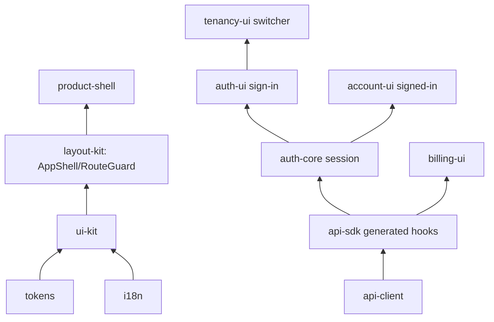

# Building the frontend

The frontend half of speed is twelve `@speed/*` npm packages that
compose into your own app shell. The packages are deliberately
layered: foundational design and i18n at the bottom, one hand-written
HTTP client in the middle, the session and sign-in family above it,
and assembly shells on top. None of them fetches or stores data on
its own — every interaction reports through a callback or a session
operation, and HTTP happens in exactly one place.



## The layers

- **Design and text** — `@speed/tokens` is the design-token tree as
  dependency-free data; `@speed/i18n` wraps react-i18next with the
  same no-fallback discipline as the backend catalog (missing-key
  renders the key, never another language's text); `@speed/ui-kit`
  maps tokens onto an MUI v9 theme and ships seven controlled
  components.
- **One HTTP client** — `@speed/api-client` is the single home of
  hand-written HTTP: an injectable `fetch`, a memory-only token
  store, single-flight 401 refresh, conservative transient retries,
  every failure normalized into one `ApiError` with the API
  envelope's code. No other package performs HTTP of its own.
- **Generated surface** — `@speed/api-sdk` is the generated typed
  client of the merged API document, bound to your client through one
  hand-written seam (`bindRequestFn`), with react-query hooks on the
  shared QueryClient.
- **Session and identity** — `@speed/auth-core` is a headless session
  state machine (access token in the store, refresh token only in the
  session closure); `auth-ui` renders the sign-in family; `account-ui`
  the signed-in account pages; `tenancy-ui` the tenant switcher.
- **Chrome and assembly** — `layout-kit` provides `AppShell` and
  `RouteGuard` (auth-agnostic); `product-shell` composes the whole
  three-branch view machine (signed out → sign-in surface, signed in
  → frame, dead session → session-ended); `billing-ui` renders the
  billing read surface.

## Composition steps

1. **Build your client once.** `createClient(fetch, ...)` wires the
   transport, the token store, and the silent-refresh leg
   (`refreshAccessToken: () => session.refresh()`); bind it into the
   SDK: `bindRequestFn(client.request)`.
2. **Attach the session.** `createAuthSession(store)` over the
   generated authn operations; `attachSession(session)` feeds the
   hooks. Permission checks are host-attached lists
   (`setPermissionSet('tenant' | 'system', codes)`), never fetched by
   package code.
3. **Register the language bundles.** Every package ships its
   bilingual resources (`ui-kit`, `auth-ui`, `tenancy-ui`,
   `account-ui`, `product-shell`, `billing-ui` namespaces — plus your
   own app bundle); `registerNamespace` validates key-set parity
   before use. Wrap the tree in `AppThemeProvider` and the
   `QueryClientProvider`.
4. **Gate your routes.** `RouteGuard` takes a host-computed status
   (`allowed` / `denied` / `pending`) — derive it from a permission
   fetch or a query the server answers (a refused read fails closed
   to denied). Compose `ProductShell` (or your own shell over
   `AppShell`) as the frame.

## Next steps

- The full per-package pages for all twelve `@speed/*` packages
  (options, examples) land in the module reference section of these
  guides.

## Complete example: assembling a sign-in-first app shell

Say you are building the web app for a delivered product — a clinic
staff tool, in the reference app's shape — and want the whole frontend
composition in one place before the business surfaces grow around it.
The three files below are a complete minimal shell: a bilingual bundle
under your own namespace, a bootstrap that wires i18n, the session and
the single HTTP client, and a view machine over `ProductShell` that
shows the sign-in surface while anonymous and the `AppShell` frame
(nav, tenant switcher, sign-out) once signed in. Every name in them is
an export of a real `@speed` package — the same composition the
reference app's `src/main.tsx` runs.

```ts
// resources.ts -- your app's own message bundle. The two JSON files
// must carry identical key sets (registerNamespace refuses a mismatch).
import type { ResourceBundle } from '@speed/i18n'
import enUS from './locales/en-US.json' with { type: 'json' }
import zhCN from './locales/zh-CN.json' with { type: 'json' }

export const APP_NAMESPACE = 'clinic-app' as const

export const appResources: Readonly<Record<string, ResourceBundle>> = {
  'en-US': enUS as ResourceBundle,
  'zh-CN': zhCN as ResourceBundle,
}
```

```tsx
// main.tsx -- one composition per page load: i18n, the session, the
// client, then the providers, in the order the packages expect.
import { StrictMode } from 'react'
import { createRoot } from 'react-dom/client'
import { QueryClient, QueryClientProvider } from '@tanstack/react-query'
import { createClient, createMemoryAccessTokenStore } from '@speed/api-client'
import { bindRequestFn } from '@speed/api-sdk/runtime'
import { attachSession, createAuthSession } from '@speed/auth-core'
import { createI18n, I18nextProvider, registerNamespace } from '@speed/i18n'
import { AppThemeProvider, UI_KIT_NAMESPACE, uiKitResources } from '@speed/ui-kit'
import { LAYOUT_KIT_NAMESPACE, layoutKitResources } from '@speed/layout-kit'
import { AUTH_UI_NAMESPACE, authUiResources } from '@speed/auth-ui'
import { TENANCY_UI_NAMESPACE, tenancyUiResources } from '@speed/tenancy-ui'
import { PRODUCT_SHELL_NAMESPACE, productShellResources } from '@speed/product-shell'
import { App } from './app.js'
import { APP_NAMESPACE, appResources } from './resources.js'

const container = document.getElementById('root')
if (container === null) {
  throw new Error('index.html must mount the app into #root')
}

// 1. i18n, negotiated per visitor; every namespace a rendered unit
//    reads is registered exactly once.
const i18n = createI18n({
  supportedLanguages: ['zh-CN', 'en-US'],
  defaultLanguage: 'zh-CN',
})
registerNamespace(i18n, UI_KIT_NAMESPACE, uiKitResources)
registerNamespace(i18n, LAYOUT_KIT_NAMESPACE, layoutKitResources)
registerNamespace(i18n, AUTH_UI_NAMESPACE, authUiResources)
registerNamespace(i18n, TENANCY_UI_NAMESPACE, tenancyUiResources)
registerNamespace(i18n, PRODUCT_SHELL_NAMESPACE, productShellResources)
registerNamespace(i18n, APP_NAMESPACE, appResources)

// 2. The memory-only session over the generated authn operations; the
//    hooks read it after attachSession, and a reload starts anonymous.
const accessTokenStore = createMemoryAccessTokenStore()
const session = createAuthSession(accessTokenStore)
attachSession(session)

// 3. The app's one HTTP client, bound into the generated SDK's seam.
bindRequestFn(
  createClient({
    baseUrl: window.location.origin,
    accessTokenStore,
    refreshAccessToken: () => session.refresh(),
  }),
)

// 4. The providers; a session end also empties the shared query cache.
const queryClient = new QueryClient()

createRoot(container).render(
  <StrictMode>
    <I18nextProvider i18n={i18n}>
      <AppThemeProvider i18n={i18n}>
        <QueryClientProvider client={queryClient}>
          <App session={session} />
        </QueryClientProvider>
      </AppThemeProvider>
    </I18nextProvider>
  </StrictMode>,
)
```

```tsx
// app.tsx -- the three-branch view machine: sign-in while anonymous,
// the frame once authenticated, session-ended when a session dies
// mid-use. All views are host content.
import { Typography } from '@mui/material'
import type { ReactElement } from 'react'
import type { AuthSession } from '@speed/auth-core'
import { useCurrentTenant } from '@speed/auth-core'
import { useTranslation } from '@speed/i18n'
import type { AppShellNavItem } from '@speed/layout-kit'
import { SignInScreen, SignOutButton } from '@speed/auth-ui'
import { TenantSwitcher } from '@speed/tenancy-ui'
import { ProductShell } from '@speed/product-shell'
import { APP_NAMESPACE } from './resources.js'

export function App({ session }: { session: AuthSession }): ReactElement {
  const { t } = useTranslation(APP_NAMESPACE)
  const currentTenant = useCurrentTenant()

  // Host-computed nav: items carry their own `selected`; the shell
  // never path-matches. Labels come from your bundle.
  const navItems: readonly AppShellNavItem[] = [
    { id: 'notes', label: t('nav.notes'), href: '#/notes', selected: true },
    { id: 'account', label: t('nav.account'), href: '#/account', selected: false },
  ]

  const tenants = [
    { id: 'tenant-acme', name: t('tenants.acme') },
    { id: 'tenant-globex', name: t('tenants.globex') },
  ]

  return (
    <ProductShell
      navItems={navItems}
      header={t('brand')}
      userMenu={
        <>
          <TenantSwitcher
            session={session}
            tenants={tenants}
            currentTenantId={currentTenant?.tenantId ?? null}
          />
          <SignOutButton session={session} />
        </>
      }
      signIn={<SignInScreen session={session} channels={['password']} />}
    >
      {/* Surface content in the frame's main landmark: reads go through
          your app-owned SDK's generated react-query hooks; a refused
          read (403) feeds a route gate's status. */}
      <Typography variant="h6">{t('notes.heading')}</Typography>
    </ProductShell>
  )
}
```

The src/locales JSON files hold the keys the snippet uses — `brand`,
`nav.notes`, `nav.account`, `notes.heading`, `tenants.acme`,
`tenants.globex` — in both languages with identical key sets; only the
values differ. The two tenant ids match the reference app's demo
roster, so the same host data works against it unchanged.

**Run it.** Inside the repository, the cleanest place is an external
member of the `web/` pnpm workspace, exactly where
`examples/reference-app/web` lives (`web/pnpm-workspace.yaml` lists
the path; one shared frozen lockfile). Published consumers install the
same packages from the registry at the lockstep version, with
`react`, `react-dom`, `@mui/material` and `@tanstack/react-query` as
peer dependencies (the reference app's `package.json` is the exact
dependency list). Then:

1. Create the project with a vite React + TypeScript template,
   `index.html` carrying `<div id="root">`, and add the dependencies
   from the list above.
2. Copy in the three files above plus the two locale JSON files.
3. Run the backend your session will talk to (in-repo: the reference
   app server, booted with `APP_DEMO_USERS_PASSWORD` set so
   `demo-owner@example.com` is seeded into both demo tenants), then
   `pnpm dev` in the web host — the reference app's vite config
   proxies `/api` calls to the backend's default port. Open the
   dev-server URL.

**What you should see.** The first render shows the sign-in screen
(password channel only, as the snippet declares); the login answers
come from your backend — the authn operations behind the bound client —
never from package code. Signing in as the seeded demo owner answers
with a principal whose tenant is `tenant-acme`, so the frame appears
with the two nav items, the tenant switcher (the current tenant's row
disabled) and the sign-out button; switching to `tenant-globex` fires
a session switch through the bound client. A server-side session death
— a refresh the server refuses — converges the page to the
session-ended screen, whose action returns to sign-in.

**See it in the reference app** — the real, larger composition of this
exact shape:
[`examples/reference-app/web/src/main.tsx`](https://github.com/vislake/speed/blob/main/examples/reference-app/web/src/main.tsx)
(bootstrap) and
[`examples/reference-app/web/src/app.tsx`](https://github.com/vislake/speed/blob/main/examples/reference-app/web/src/app.tsx)
(the `ProductShell` frame with host chrome and hash-routed surfaces).

One key point: nothing in the three files performs HTTP, reads
storage or navigates — the session and the bound client are the only
moving parts, which is why the same composition carries any surface
you add on top.
