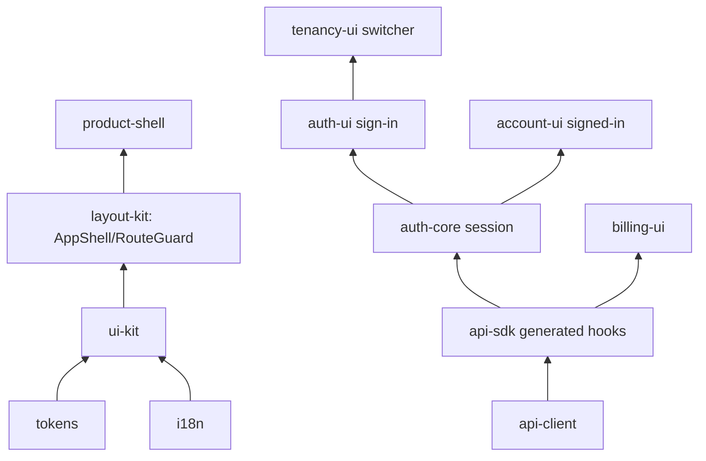

# Building the frontend

The frontend half of speed is twelve `@speed/*` npm packages that
compose into your own app shell. The packages are deliberately
layered: foundational design and i18n at the bottom, one hand-written
HTTP client in the middle, the session and sign-in family above it,
and assembly shells on top. None of them fetches or stores data on
its own — every interaction reports through a callback or a session
operation, and HTTP happens in exactly one place.

## The layers

- **Design and text** — `@speed/tokens` is the design-token tree as
  dependency-free data; `@speed/i18n` wraps react-i18next with the
  same no-fallback discipline as the backend catalog (missing-key
  renders the key, never another language's text); `@speed/ui-kit`
  maps tokens onto an MUI v9 theme and ships seven controlled
  components.
- **One HTTP client** — `@speed/api-client` is the single home of
  hand-written HTTP: an injectable `fetch`, a memory-only token
  store, single-flight 401 refresh, conservative transient retries,
  every failure normalized into one `ApiError` with the API
  envelope's code. No other package performs HTTP of its own.
- **Generated surface** — `@speed/api-sdk` is the generated typed
  client of the merged API document, bound to your client through one
  hand-written seam (`bindRequestFn`), with react-query hooks on the
  shared QueryClient.
- **Session and identity** — `@speed/auth-core` is a headless session
  state machine (access token in the store, refresh token only in the
  session closure); `auth-ui` renders the sign-in family; `account-ui`
  the signed-in account pages; `tenancy-ui` the tenant switcher.
- **Chrome and assembly** — `layout-kit` provides `AppShell` and
  `RouteGuard` (auth-agnostic); `product-shell` composes the whole
  three-branch view machine (signed out → sign-in surface, signed in
  → frame, dead session → session-ended); `billing-ui` renders the
  billing read surface.

## Composition steps

1. **Build your client once.** `createClient(fetch, ...)` wires the
   transport, the token store, and the silent-refresh leg
   (`refreshAccessToken: () => session.refresh()`); bind it into the
   SDK: `bindRequestFn(client.request)`.
2. **Attach the session.** `createAuthSession(store)` over the
   generated authn operations; `attachSession(session)` feeds the
   hooks. Permission checks are host-attached lists
   (`setPermissionSet('tenant' | 'system', codes)`), never fetched by
   package code.
3. **Register the language bundles.** Every package ships its
   bilingual resources (`ui-kit`, `auth-ui`, `tenancy-ui`,
   `account-ui`, `product-shell`, `billing-ui` namespaces — plus your
   own app bundle); `registerNamespace` validates key-set parity
   before use. Wrap the tree in `AppThemeProvider` and the
   `QueryClientProvider`.
4. **Gate your routes.** `RouteGuard` takes a host-computed status
   (`allowed` / `denied` / `pending`) — derive it from a permission
   fetch or a query the server answers (a refused read fails closed
   to denied). Compose `ProductShell` (or your own shell over
   `AppShell`) as the frame.

## Next steps

- The full per-package pages for all twelve `@speed/*` packages
  (options, examples) land in the module reference section of these
  guides.
