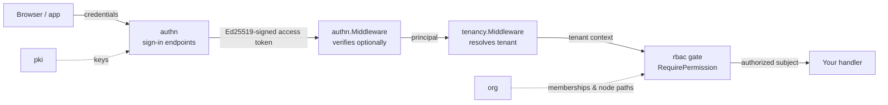

# Identity and access

This domain is who your users are, how they sign in, and what they may
do: the `authn` module owns authentication (passwords, sessions, MFA,
social and enterprise sign-in), `rbac` owns authorization (deny by
default, exact `resource:action` grants), and `org` supplies the
organization tree and memberships that give grants their scope. `pki`
sits underneath as the signing-key source authn's access tokens are
verified against.



The middleware order is load-bearing and is the composition this
codebase pins with real tests: `authn.Middleware` verifies a presented
token if there is one (a bad token is a 401; an absent one stays
anonymous) and never guesses a tenant, and the layer after it —
`tenancy.Middleware(authn.NewPrincipalResolver())` — turns a verified
principal into the tenant context every tenant-scoped repository
requires. Your routes must never sit downstream of a tenant-guessing
middleware, and the tenant never comes from a request header.

## Minimal integration steps

1. **Select the modules in your composition.** Add `authn`, `rbac`
   and `org` (plus `pki` as authn's key source) to the component set
   your composition configuration selects. Each module's component
   carries its own migrations, and the selected db component applies
   them in the assembly's `Verify` stage; the app's boot-time comments
   in `examples/reference-app/cmd/server/server.go` walk the exact
   wiring order.
2. **Give authn its mandatory modules.** `authn.NewModule` validates
   options eagerly: a `KeySource` (pki's `Service` satisfies it) and a
   blind-index key are required — there is no safe default for either —
   and a `MembershipReader` answers "is this user a member of this
   tenant" at sign-in; absent means refuse, never allow.
3. **Mount the chain in order.** Route authn's own subtree straight
   from `authn.Middleware`'s output — never through `tenancy.Middleware`,
   because sign-in happens before any tenant exists — and dispatch
   admin's console from that same output *ahead of both* the
   impersonation decorator and the tenancy chain: admin's permissions
   are judged against the caller's own real, unsubstituted principal, so
   an impersonated identity or a tenant's own Owner role must never
   reach it. Protect everything else with
   `tenancy.Middleware(authn.NewPrincipalResolver())` downstream.
4. **Gate your routes on permissions.** rbac attaches inside (or
   right after) the assembly's declaration turn — its `Attach` freezes
   every module's declared permission vocabulary, so granting anything
   else is refused. Protect an operation with
   `rbac.RequirePermission("notes", "write")` or its `*Func` variant;
   org exports the four permissions its own routes declare
   (`PermissionRead`, `PermissionManage`, `PermissionInviteMember`,
   `PermissionRemoveMember`) for you to gate on the same way.
5. **Drive identity data through org's flow.** Register a user, then
   invite them into a tenant node through `org`'s invitation flow; the
   accepted membership is what your `MembershipReader` and rbac's
   subject resolution see.

## Boundaries worth knowing

- Access tokens are short-lived and Ed25519-signed; refresh tokens are
  single-use, and replaying one rotates the whole token family and
  revokes the session — clients must serialise refreshes.
- Social/enterprise sign-in binds by verified email from a trusted
  provider, never by matching email alone; a last-login-method
  constraint keeps a social-only account from shedding its channel.
- Every existence-disclosing answer (user exists, email taken, provider
  bound) is suppressed: enumeration learns nothing.
- Login, registration and step-up sit behind sliding-window rate limits
  with progressive lockout, and step-up verification survives exactly
  one access token.

## Next steps

The complete API surface of each module — options, handlers, error
codes — lives in its per-module page: `authn`, `rbac`, `org` and `pki`
(in the module reference). The error codes this domain answers with are
in the [error code index](../../error-codes/).

## Complete example: password sign-in behind a read-only permission gate

This example wires the chain from the diagram at the top of this page into
one runnable program. A user registers and signs in with a password;
`authn` mints the Ed25519-signed access token over keys owned by a real
`pki` module; and a notes handler sits behind `tenancy.Middleware` plus an
`rbac` gate, so a member holding the `note-reader` role can list notes but
cannot write one. Everything is self-contained — in-memory SQLite and the
in-process components — with every symbol taken from the modules' real APIs
(the same wiring their own example suites run).

```go
package main

import (
	"context"
	"embed"
	"fmt"
	"net/http"
	"net/http/httptest"
	"strings"

	"github.com/vislake/speed/go/authn"
	"github.com/vislake/speed/go/dbkit"
	_ "github.com/vislake/speed/go/dbkit/dialect/sqlite" // registers DialectSQLite
	"github.com/vislake/speed/go/pkgcore"
	"github.com/vislake/speed/go/pkgcore/componenttest"
	"github.com/vislake/speed/go/pki"
	"github.com/vislake/speed/go/rbac"
	"github.com/vislake/speed/go/tenancy"
)

// notesLikeModule declares the "notes" surface's permission vocabulary --
// what rbac.Attach freezes and grants may name.
type notesLikeModule struct{}

func (notesLikeModule) Name() string         { return "notes" }
func (notesLikeModule) DependsOn() []string  { return nil }
func (notesLikeModule) Migrations() embed.FS { return embed.FS{} }
func (notesLikeModule) Locales() embed.FS    { return embed.FS{} }
func (notesLikeModule) OpenAPISpec() []byte  { return nil }
func (notesLikeModule) Register(reg *pkgcore.ComponentRegistry) error {
	return reg.PermissionsSeat().Add("notes:read", "notes:write")
}

// everyMember answers authn's membership question at sign-in; a real host
// answers from org's membership rows.
type everyMember struct{}

func (everyMember) ActiveMembership(context.Context, string, pkgcore.TenantID) (bool, error) {
	return true, nil
}
func (everyMember) TenantsOf(context.Context, string) ([]pkgcore.TenantID, error) {
	return []pkgcore.TenantID{"tenant-a"}, nil
}

func must(err error) {
	if err != nil {
		panic(err)
	}
}

func main() {
	ctx := context.Background()

	// The serializers register before dbkit.Open -- GORM resolves a model's
	// serializer while parsing the schema. The two keys stay separate.
	authCipher, err := dbkit.NewCipher([]byte("01234567890123456789012345678901"))
	must(err)
	must(authn.RegisterPIISerializer(authCipher))
	pkiCipher, err := dbkit.NewCipher([]byte("abcdefghijklmnopqrstuvwxyz123456"))
	must(err)
	must(pki.RegisterLocalKeySerializer(pkiCipher))

	db, err := dbkit.Open(ctx, dbkit.Options{Dialect: dbkit.DialectSQLite, DSN: "file:iam_example?mode=memory&cache=shared"})
	must(err)

	// The signing keys come from a real pki.Service, the same wiring the
	// reference app uses; pki owns the key lifecycle behind the KeySource.
	pkiModule := pki.NewModule(db)
	authnModule, err := authn.NewModule(db,
		authn.WithKeySource(pkiModule.Service()),
		authn.WithBlindIndexKey([]byte("blind-index-key-0123456789abcdef")),
		authn.WithMembershipReader(everyMember{}),
		authn.WithRevocationMode(authn.RevocationModeImmediate),
	)
	must(err)
	rbacModule := rbac.NewModule(db)

	migrations := dbkit.NewMigrationRegistry()
	must(migrations.Register(pkiModule))
	must(migrations.Register(authnModule))
	must(migrations.Register(rbacModule))
	must(migrations.Apply(ctx, db, dbkit.DialectSQLite))

	// The declarations and rbac's Attach run inside the assembly's Init
	// window -- the only stage the declaration seats accept writes in, and
	// therefore where Attach's subscription and job-handler wiring lands.
	// DeclareAll drives that window over the hand-constructed modules the
	// way their own example suites do; a config-driven host reaches it
	// through app.Assemble over the components its composition selects.
	reg := componenttest.NewRegistry()
	var az *rbac.Service
	must(componenttest.DeclareAll(reg,
		pkiModule.Register, authnModule.Register, rbacModule.Register, notesLikeModule{}.Register,
		func(r *pkgcore.ComponentRegistry) error {
			var attachErr error
			az, attachErr = rbacModule.Attach(r) // freezes the permission catalog
			return attachErr
		},
	))
	svc := authnModule.Service()

	// Password sign-in: Register creates the account, Login verifies the
	// password and mints the token pair whose claims sit in tenant-a (the
	// MembershipReader's single answer).
	user, err := svc.Register(ctx, authn.RegisterInput{Email: "dentist@example.com", Password: "correct horse battery staple"})
	must(err)
	pair, err := svc.Login(ctx, authn.LoginInput{Identifier: "dentist@example.com", Password: "correct horse battery staple"})
	must(err)

	// Roles and grants are tenant data: seed them under the tenant context.
	tenantCtx := pkgcore.WithTenant(ctx, "tenant-a")
	_, err = az.DefineRole(tenantCtx, rbac.RoleDefinition{Key: "note-reader", DescriptionKey: "rbac.role.member", Permissions: []string{"notes:read"}})
	must(err)
	must(az.AssignRole(tenantCtx, rbac.Subject{TenantID: "tenant-a", UserID: user.ID}, "note-reader", rbac.Scope{}))

	// The gate: a GET needs notes:read, any other method notes:write. A
	// method the table forgot asks for "" and is denied -- never
	// "no permission required".
	gate := rbac.RequirePermissionFunc(az, func(r *http.Request) string {
		if r.Method == http.MethodGet {
			return rbac.Permission("notes", "read")
		}
		return rbac.Permission("notes", "write")
	})(http.HandlerFunc(func(w http.ResponseWriter, _ *http.Request) { w.WriteHeader(http.StatusOK) }))

	// subjectBridge is the host's own glue -- the reference app's
	// internal/app/demo/demo_subject.go does the same: the Principal authn.Middleware
	// verified becomes the rbac.Subject the gate decides against. rbac
	// never imports authn; the two meet only in this structural shape.
	subjectBridge := func(next http.Handler) http.Handler {
		return http.HandlerFunc(func(w http.ResponseWriter, r *http.Request) {
			if p, ok := authn.PrincipalFromContext(r.Context()); ok {
				r = r.WithContext(rbac.WithSubject(r.Context(), rbac.Subject{
					TenantID: p.TenantID, UserID: p.UserID,
				}))
			}
			next.ServeHTTP(w, r)
		})
	}

	// The documented order: authn.Middleware verifies optionally (a bad
	// token 401s here), tenancy.Middleware injects the tenant context, and
	// the rbac gate decides last.
	chain := authn.Middleware(svc.Verifier())(
		tenancy.Middleware(authn.NewPrincipalResolver())(subjectBridge(gate)),
	)

	call := func(method, token string) (int, string) {
		req := httptest.NewRequest(method, "/api/v1/notes", nil)
		if token != "" {
			req.Header.Set("Authorization", "Bearer "+token)
		}
		rec := httptest.NewRecorder()
		chain.ServeHTTP(rec, req)
		return rec.Code, strings.TrimSpace(rec.Body.String())
	}

	code, _ := call(http.MethodGet, pair.AccessToken)
	fmt.Println("member GET notes:", code)
	code, body := call(http.MethodPost, pair.AccessToken)
	fmt.Println("member POST notes:", code, body)
	code, _ = call(http.MethodGet, "")
	fmt.Println("anonymous GET notes:", code)
	code, body = call(http.MethodGet, "not-a-real-token")
	fmt.Println("bad token GET notes:", code, body)
}
```

**What each step of the program does.** Register and Login are the same
service calls the HTTP endpoints under `/api/v1/authn` perform; the
middleware chain afterwards is exactly what a host mounts in front of its
own protected routes. The `subjectBridge` adapter is your code, not a
platform layer: `rbac` declares `Subject{TenantID, UserID}` and never
imports `authn`, so the authenticating side is where the two meet.

**How to run it.** From a checkout of this repository, put the file in a
throwaway module next to the checkout and point the imports at it with
`replace` lines — one per module the program imports, for example
`replace github.com/vislake/speed/go/authn => /path/to/checkout/go/authn` —
then run `go mod tidy` and `go run .` with `GOWORK=off` (the checkout's own
`go.work` must not leak into the build). The tidy step fetches third-party
dependencies once.

**Expected result.** The four request outcomes print on stdout, exactly as
a composed deployment answers them: the member's `GET` passes the gate
(`200`); the same member's `POST` is refused with `403` and the
`rbac.permission_denied` envelope naming `notes:write`; an anonymous
request never reaches the gate — `tenancy.Middleware` fails closed with
`403` because no tenant can be resolved; and a token that does not verify
is answered by `authn.Middleware` itself with `401` and the
`authn.token_invalid` envelope. (A composed deployment also logs the
assembly's capability-validation warnings — the `WARN` lines that the
in-memory components do not survive a restart — to stderr before its stdout
lines; this hand-wired program drives the declaration window directly
and writes nothing to stderr.)

**See it in the reference app.** The reference app gates its own notes
route exactly this way: [`internal/app/demo/demo_subject.go`](https://github.com/vislake/speed/blob/main/examples/reference-app/internal/app/demo/demo_subject.go)
holds the route table (`DemoRouteRules`, applied by `rbac.GuardRoutes`), the
Principal-to-Subject bridge (`DemoSubjectResolver`), and the
`note-reader`-style role seeding (`SeedDemoGrants`), and
[`internal/notes/module.go`](https://github.com/vislake/speed/blob/main/examples/reference-app/internal/notes/module.go)
declares the very `notes:read` / `notes:write` constants this example
grants. Run `go run ./cmd/server` in `examples/reference-app` and compare
against the seeded `demo-owner` / `demo-reader` accounts.

## Source

- [authn AGENTS.md](https://github.com/vislake/speed/blob/main/go/authn/AGENTS.md)
- [rbac AGENTS.md](https://github.com/vislake/speed/blob/main/go/rbac/AGENTS.md)
- [org AGENTS.md](https://github.com/vislake/speed/blob/main/go/org/AGENTS.md)
- [pki AGENTS.md](https://github.com/vislake/speed/blob/main/go/pki/AGENTS.md)
