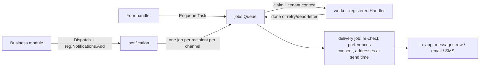

# Jobs and notifications

Two modules carry the asynchronous half of a product: `jobs` runs
background work (a portable queue contract with two implementations),
and `notification` is the messaging surface — every message your
product sends goes through a declared notification type, delivered to
an inbox, an email address or a phone number.



## Background work: the jobs queue

Any operation that must not run synchronously inside an HTTP request —
long-running work, work that should retry, work that happens after the
response is already sent — goes through a `jobs.Queue`. The queue is a
small portable contract (`Enqueue` / `Get` / `Cancel`) with two
implementations behind one seam: `StandaloneQueue` (SQLite-backed, the
single-process deployment) and `go/jobs/queue/asynq`'s Redis-backed
`asynq.Queue` (the distributed deployment). Your code speaks only to
the `Queue` interface; which implementation runs is an assembly
decision.

- A task is a `Task{Type, TenantID, Payload, IdempotencyKey}` — the
  tenant rides **on the task**, never inherited from the caller's
  context, because the worker runs minutes later on a different
  context. The queue rebuilds tenant context before every `Handle`
  call, and the registered `Handler`'s `ctx` already carries
  `job.TenantID`.
- Register one `Handler` per task type (`NewHandlerFunc(type, fn)`
  adapts a plain function), before `Start`; the handler reports
  progress through a `ProgressFn` callback, and the job record's
  status walks `pending → running → retrying → succeeded` (or
  `dead-letter`).
- Retries and backoff are the queue's business
  (`DefaultMaxRetries = 3`, per-call `WithMaxRetries`/`WithDelay`/`WithPriority`
  options). **Compensation is not**: when a job exhausts its retries
  and dead-letters, a handler may implement `OnFailure` to run
  business compensation (refund a credit, close a reservation) — that
  hook belongs to your business module, never to the queue layer.

Minimal wiring (standalone):

```go
q := jobs.NewStandaloneQueue(db)   // db from dbkit.Open
q.RegisterHandler(jobs.NewHandlerFunc("notes.export", exportHandler))
q.Start(ctx)                        // before any Enqueue
defer q.Close(ctx)
```

## The messaging surface: notification

Every notification type is **declared, not stored as a template**: your
module registers its types on the kernel registry during `Register`
(`reg.Notifications.Add(...)`), each carrying its preference group,
default channels and whether recipients may unsubscribe (verification
codes are transactional and not unsubscribable). The copy lives in the
declaring module's own bilingual locale bundles, rendered at delivery
in the recipient's locale — never captured at registration time.

Six options are mandatory when wiring `notification.NewModule`, each
failing `Register` with its own error when absent: the SMS sender, the
mail from-address, the two contact blind indexers (encrypted contact
addresses are only queryable through them), the delivery queue, and a
`UserAddressResolver` that reads a user recipient's outbound addresses
at send time.

Three recipient paths, one rule — **everything is re-checked at send
time, never frozen into the payload**:

- **User delivery** — `Dispatch` resolves the recipient's channels
  through the live preference matrix (the type's declared defaults,
  overridden by per-type × per-channel choices, opt-out is terminal
  per type), renders the copy, lands one `in_app_messages` row for the
  inbox channel and settles a `send_records` row per channel.
- **External contacts** — a contact address must complete consent
  verification first (`double_opt_in` codes hashed on the row; the
  verification message itself is the sole exception to the
  consent-before-send rule). `unsubscribed` and `bounced` are terminal
  states every delivery refuses. Verify attempts pay a per-address
  budget before the code is even checked.
- **Inbox delivery** — the row commits before
  `notification.inbox.created` is published, and the SSE stream
  (`GET /api/v1/notifications/stream`) announces rows in
  row-then-event order.

## Next steps

- The full per-module pages for `jobs` and `notification` (usage,
  options, examples) land in the module reference section of these
  guides.
- [Error code index](../../error-codes/) — every code these modules
  can answer with.
