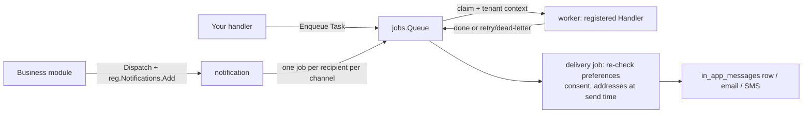

# Jobs and notifications

Two modules carry the asynchronous half of a product: `jobs` runs
background work (a portable queue contract with two implementations),
and `notification` is the messaging surface — every message your
product sends goes through a declared notification type, delivered to
an inbox, an email address or a phone number.



## Background work: the jobs queue

Any operation that must not run synchronously inside an HTTP request —
long-running work, work that should retry, work that happens after the
response is already sent — goes through a `jobs.Queue`. The queue is a
small portable contract (`Enqueue` / `Get` / `Cancel`) with two
implementations behind one seam: `StandaloneQueue` (SQLite-backed, the
single-process deployment) and `go/jobs/queue/asynq`'s Redis-backed
`asynq.Queue` (the distributed deployment). Your code speaks only to
the `Queue` interface; which implementation runs is an assembly
decision.

- A task is a `Task{Type, TenantID, Payload, IdempotencyKey}` — the
  tenant rides **on the task**, never inherited from the caller's
  context, because the worker runs minutes later on a different
  context. The queue rebuilds tenant context before every `Handle`
  call, and the registered `Handler`'s `ctx` already carries
  `job.TenantID`.
- Register one `Handler` per task type (`NewHandlerFunc(type, fn)`
  adapts a plain function), before `Start`; the handler reports
  progress through a `ProgressFn` callback, and the job record's
  status walks `pending → running → retrying → succeeded` (or
  `dead-letter`).
- Retries and backoff are the queue's business
  (`DefaultMaxRetries = 3`, per-call `WithMaxRetries`/`WithDelay`/`WithPriority`
  options). **Compensation is not**: when a job exhausts its retries
  and dead-letters, a handler may implement `OnFailure` to run
  business compensation (refund a credit, close a reservation) — that
  hook belongs to your business module, never to the queue layer.

Minimal wiring (standalone):

```go
q := jobs.NewStandaloneQueue(db)   // db from dbkit.Open
q.RegisterHandler(jobs.NewHandlerFunc("notes.export", exportHandler))
q.Start(ctx)                        // before any Enqueue
defer q.Close(ctx)
```

## The messaging surface: notification

Every notification type is **declared, not stored as a template**: your
module registers its types on the kernel registry during `Register`
(`reg.Notifications.Add(...)`), each carrying its preference group,
default channels and whether recipients may unsubscribe (verification
codes are transactional and not unsubscribable). The copy lives in the
declaring module's own bilingual locale bundles, rendered at delivery
in the recipient's locale — never captured at registration time.

Six options are mandatory when wiring `notification.NewModule`, each
failing `Register` with its own error when absent: the SMS sender, the
mail from-address, the two contact blind indexers (encrypted contact
addresses are only queryable through them), the delivery queue, and a
`UserAddressResolver` that reads a user recipient's outbound addresses
at send time.

Three recipient paths, one rule — **everything is re-checked at send
time, never frozen into the payload**:

- **User delivery** — `Dispatch` resolves the recipient's channels
  through the live preference matrix (the type's declared defaults,
  overridden by per-type × per-channel choices, opt-out is terminal
  per type), renders the copy, lands one `in_app_messages` row for the
  inbox channel and settles a `send_records` row per channel.
- **External contacts** — a contact address must complete consent
  verification first (`double_opt_in` codes hashed on the row; the
  verification message itself is the sole exception to the
  consent-before-send rule). `unsubscribed` and `bounced` are terminal
  states every delivery refuses. Verify attempts pay a per-address
  budget before the code is even checked.
- **Inbox delivery** — the row commits before
  `notification.inbox.created` is published, and the SSE stream
  (`GET /api/v1/notifications/stream`) announces rows in
  row-then-event order.

## Complete example: exporting notes in the background, then telling the user

A user clicks "export my notes" in the browser. The HTTP request does
one thing — enqueue a `notes.export` task and return its `JobID`
immediately — and a worker runs the export minutes later, reporting
progress along the way; a transient failure is retried, and a task that
exhausts its retries dead-letters and runs the business compensation
hook (here: undoing the credit reservation the request made, the shape
the reference app's smile-simulation path uses). When the export
succeeds, the handler dispatches a "your export is ready" notification
to the requester, whose channels the notification module re-resolves
from the preference matrix at send time. The walk below is the
producer/consumer pair of that contract; it runs standalone over an
in-memory SQLite database.

Your consumer module's `go.mod` replaces the speed module paths onto a
local checkout (`go mod tidy` after the `replace` lines); paste the
code into a file of your own `main` package and run it. The second
block shows the notification half, which needs the notification module
wired and bootstrapped (its six wiring options, below) plus the type's
copy in your own bilingual locale bundle — so it is shown as host code,
not run in this walk.

```go
import (
	"context"
	"encoding/json"
	"errors"
	"fmt"
	"time"

	"github.com/vislake/speed/go/dbkit"
	_ "github.com/vislake/speed/go/dbkit/dialect/sqlite" // registers DialectSQLite
	"github.com/vislake/speed/go/jobs"
	"github.com/vislake/speed/go/pkgcore"
)

func must(err error) {
	if err != nil {
		panic(err)
	}
}

// exportPayload is the HTTP layer's Task.Payload — the queue never interprets it.
type exportPayload struct {

	RequesterID string `json:"requester_id"`
	NoteCount   int    `json:"note_count"`
	AlwaysFail  bool   `json:"always_fail,omitempty"`
}

// The consumer: one Handler per task Type, registered before Start;
// Handle's ctx already carries job.TenantID, rebuilt from the job record.
type notesExportHandler struct{}

func (notesExportHandler) Type() string { return "notes.export" }

func (notesExportHandler) Handle(ctx context.Context, job *jobs.Job, progress jobs.ProgressFn) (jobs.Result, error) {
	var p exportPayload
	if err := json.Unmarshal(job.Payload, &p); err != nil {
		return jobs.Result{}, err
	}
	fmt.Printf("[export] attempt %d: exporting %d notes\n", job.Attempts, p.NoteCount)
	if p.AlwaysFail { // every attempt fails: retries, then dead-letter
		return jobs.Result{}, errors.New("notes provider unreachable")
	}
	if job.Attempts == 1 {
		return jobs.Result{}, errors.New("transient provider timeout") // attempt 2 succeeds
	}
	progress(40, "writing rows")
	progress(100, "done")
	return jobs.Result{Data: []byte("id,title\n1,Caries 101\n")}, nil
}

// OnFailure compensates at most once, after the final attempt — refund here
// the reservation made with billing.CreditService.PreDeduct.
func (notesExportHandler) OnFailure(ctx context.Context, job *jobs.Job, cause error) {
	fmt.Printf("[export] job %s dead-lettered: %v — refunding the reservation\n", job.ID, cause)
}

// waitForTerminal polls tenant-scoped Queue.Get until the job is terminal.
func waitForTerminal(ctx context.Context, queue jobs.Queue, id jobs.JobID) {
	deadline := time.Now().Add(5 * time.Second)
	for {
		job, err := queue.Get(ctx, id)
		if err == nil && job.Status.Terminal() {
			fmt.Printf("[queue] %s: %s after %d attempts\n", job.ID, job.Status, job.Attempts)
			return
		}
		if time.Now().After(deadline) {
			fmt.Println("[queue] timed out waiting for", id)
			return
		}
		time.Sleep(10 * time.Millisecond)
	}
}

func runExportWalk() {
	ctx := context.Background()
	db, err := dbkit.Open(ctx, dbkit.Options{Dialect: dbkit.DialectSQLite, DSN: "file:export-walk?mode=memory&cache=shared"})
	must(err)
	queue := jobs.NewStandaloneQueue(db, jobs.WithPollInterval(5*time.Millisecond))
	must(queue.RegisterHandler(notesExportHandler{}))
	must(queue.Start(ctx)) // before any Enqueue

	// The producer — what an HTTP handler body boils down to.
	enqueue := func(key string, alwaysFail bool) {
		payload, _ := json.Marshal(exportPayload{
			RequesterID: "user-7", NoteCount: 3, AlwaysFail: alwaysFail,
		})
		id, err := queue.Enqueue(ctx, jobs.Task{
			Type:           "notes.export",
			TenantID:       pkgcore.TenantID("tenant-acme"),
			Payload:        payload,
			IdempotencyKey: "notes.export:" + key, // replay dedupes onto the first job
		}, jobs.WithMaxRetries(2)) // 2 retries beyond the first attempt
		must(err)
		fmt.Println("enqueued", id, "(the HTTP response returns this JobID immediately)")
		waitForTerminal(pkgcore.WithTenant(ctx, "tenant-acme"), queue, id)
	}

	enqueue("2026-09-09-001", false) // succeeds on attempt 2
	enqueue("2026-09-09-002", true)  // dead-letters, compensation runs
}
```

The notification half of the same story — your module declares the
type while registering, the export handler dispatches it on success:

```go
// In your module's Register: the type lands in the preference matrix;
// its copy lives in your bilingual locale bundle under
// <type_key>.<channel>.<part> ids, rendered in the recipient's locale.
if err := reg.Notifications.Add(pkgcore.NotificationType{
	Key:                   "reports.export_ready",
	Group:                 "reports",
	DefaultChannels:       []string{"in_app", "email"},
	RecipientVisibleParams: []string{"export_id"},
	Unsubscribable:        true, // the recipient may silence this type
}); err != nil {
	return err
}

// In the export handler's success path. deliveries is the host module's
// DeliveryService (module.Deliveries()), wired with its six required
// options and bootstrapped, as the reference app does.
notifCtx := pkgcore.WithTenant(context.WithoutCancel(ctx), job.TenantID)
_, err := deliveries.Dispatch(notifCtx, notification.Dispatch{
	TypeKey: "reports.export_ready",
	Recipient: notification.DispatchRecipient{
		Class:  notification.RecipientClassUser,
		UserID: requesterID, // from the export payload
	},
	Locale: recipientLocale, // e.g. i18n.LocaleZHCN — never guessed by the module
	Params: map[string]any{"export_id": exportID},
})
```

Two contract facts the walk demonstrates: the queue owns retries,
scheduling and dead-lettering, while *compensation* (the refund in
`OnFailure`) stays in your business handler — and a notification
dispatch never freezes delivery decisions: the type's `DefaultChannels`
apply only until the recipient's stored preference overrides them, and
the delivery job re-checks preferences, addresses and consent at send
time.

To run it:

1. Add the `replace` lines for `go/dbkit`, `go/pkgcore` and `go/jobs`
   to your consumer `go.mod`, then `go mod tidy`.
2. Paste the first block into a file of your `main` package and run
   `go run .`.
3. The second block is host code for the app that has wired the
   notification module — for a full runnable composition, boot the
   reference app and drive its notification flows instead (links
   below).

Expected output (the two `dead-lettered`/`dead-letter` lines can print
in either order — `OnFailure` runs right after the dead-letter write):

```text
enqueued <job id> (the HTTP response returns this JobID immediately)
[export] attempt 1: exporting 3 notes
[export] attempt 2: exporting 3 notes
[queue] <job id>: succeeded after 2 attempts
enqueued <job id> (the HTTP response returns this JobID immediately)
[export] attempt 1: exporting 3 notes
[export] attempt 2: exporting 3 notes
[export] attempt 3: exporting 3 notes
[export] job <job id> dead-lettered: notes provider unreachable — refunding the reservation
[queue] <job id>: dead_letter after 3 attempts
```

`<job id>` is the id `Enqueue` returned — print it yourself, or read
the job record back through `Queue.Get` the way `waitForTerminal`
does.

See it in the reference app:

- [examples/reference-app/internal/app/server.go](https://github.com/vislake/speed/blob/main/examples/reference-app/internal/app/server.go)
  — after `Bootstrap`, the app drains `reg.Jobs.Handlers()` onto its
  standalone queue and starts it; every module's handlers (storage
  derivation, notification delivery, this pattern's shape) ride the
  same queue.
- [examples/reference-app/internal/app/demo_notification.go](https://github.com/vislake/speed/blob/main/examples/reference-app/internal/app/demo_notification.go)
  — the note-created event turned into a real `Deliveries().Dispatch`
  call, and [examples/reference-app/flowtests/notification_flow_test.go](https://github.com/vislake/speed/blob/main/examples/reference-app/flowtests/notification_flow_test.go)
  drives the whole delivery through the composed HTTP stack.
- [go/jobs/example_test.go](https://github.com/vislake/speed/blob/main/go/jobs/example_test.go)
  — this walk's queue half, compiled and executed by the module's own
  unit suite.

## Next steps

- The full per-module pages for `jobs` and `notification` (usage,
  options, examples) land in the module reference section of these
  guides.
- [Error code index](../../error-codes/) — every code these modules
  can answer with.
