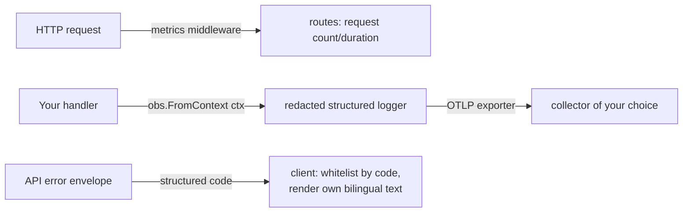

# Observability and operations

`observability` is the one module every speed-based service touches:
it initializes OpenTelemetry, provides the structured logger your code
takes from the context, and mounts an HTTP middleware that records
request metrics. This page also covers the operational contract that
matters most to a client of your API — the structured error codes
every answer carries.

## Wiring

Initialize once at boot: `observability.Init(ctx, opts...)`. No
deployment mode is declared — the exporter choice is the option set:
with `WithOTLPEndpoint` set, logs, metrics and traces export over OTLP
to that endpoint (the distributed shape); without it, output stays
local (console diagnostics). An HTTP `Middleware` records
request-count and duration metrics behind a cardinality-bounded route
label.

## Structured logging

Take the logger from the context, never a package-level one:
`obs.FromContext(ctx)` returns a logger that carries trace and tenant
correlation. Two rules are load-bearing:

- The message is a constant string; everything variable goes into
  key-value attributes (`tenant_id`, `user_id`, `job_id`,
  `duration_ms` — snake_case everywhere).
- A redaction layer sits in front of every sink, on by default,
  masking sensitive attribute keys and secret-shaped values. There is
  no per-call opt-out: plaintext secrets cannot reach logs, traces or
  metrics by accident. One consequence your metrics must respect:
  `tenant_id` never becomes a metric label (high cardinality) — tenant
  dimensions belong in span attributes and log fields only.

## The error-code contract

Every refusal your API answers carries a structured code —
`module.snake_case` — in the response envelope, and the code is the
contract. Client-side handling follows three rules:

1. Branch on the code, never on the HTTP status or a message string:
   the status separates broad classes, the message text varies by
   locale, the code is stable.
2. Text you show a user comes from your own bilingual resources,
   keyed by the code — the code's locale entry is for reference, not
   for display.
3. Maintain a reachable-code whitelist with a fallback, so a code you
   never expected renders as your own `unknown` text, never a raw key.

The complete list of codes a speed-based service can answer with —
status, locale message, triggering condition and source — is the
[error code index](../../error-codes/).

## Next steps

- The full per-module page for `observability` (options, exporter
  detail) lands in the module reference section of these guides.
