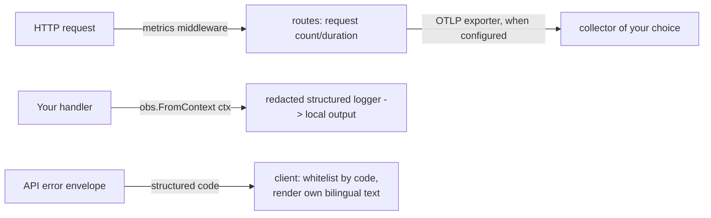

# Observability and operations

`observability` is the one module every speed-based service touches:
it initializes OpenTelemetry, provides the structured logger your code
takes from the context, and mounts an HTTP middleware that records
request metrics. This page also covers the operational contract that
matters most to a client of your API — the structured error codes
every answer carries.



## Wiring

Initialize once at boot: `observability.Init(ctx, opts...)`. No
deployment mode is declared — the exporter choice is the option set:
with `WithOTLPEndpoint` set, metrics and traces export over OTLP to
that endpoint (the distributed shape, via the `exporter/otlp` blank
import); logs stay local in every composition — the redacted structured
logger writes to the process's own output, and no OTLP log exporter
ships. Without the endpoint, output stays local entirely. An HTTP
`Middleware` records
request-count and duration metrics behind a cardinality-bounded route
label.

## Structured logging

Take the logger from the context, never a package-level one:
`obs.FromContext(ctx)` returns a logger that carries trace and tenant
correlation. Two rules are load-bearing:

- The message is a constant string; everything variable goes into
  key-value attributes (`tenant_id`, `user_id`, `job_id`,
  `duration_ms` — snake_case everywhere).
- A redaction layer sits in front of every sink, on by default,
  masking sensitive attribute keys and secret-shaped values. There is
  no per-call opt-out: plaintext secrets cannot reach logs, traces or
  metrics by accident. One consequence your metrics must respect:
  `tenant_id` never becomes a metric label (high cardinality) — tenant
  dimensions belong in span attributes and log fields only.

## The error-code contract

Every refusal your API answers carries a structured code —
`module.snake_case` — in the response envelope, and the code is the
contract. Client-side handling follows three rules:

1. Branch on the code, never on the HTTP status or a message string:
   the status separates broad classes, the message text varies by
   locale, the code is stable.
2. Text you show a user comes from your own bilingual resources,
   keyed by the code — the code's locale entry is for reference, not
   for display.
3. Maintain a reachable-code whitelist with a fallback, so a code you
   never expected renders as your own `unknown` text, never a raw key.

The complete list of codes a speed-based service can answer with —
status, locale message, triggering condition and source — is the
[error code index](../../error-codes/).

## Next steps

- The full per-module page for `observability` (options, exporter
  detail) lands in the module reference section of these guides.

## Complete example: wiring observability into a small Go service

Say you are starting your own product's backend service and want the
observability wiring in place before business code grows around it.
The example below is a complete, runnable skeleton of that wiring —
the same shape the reference app's boot follows: initialize the module
once at startup with a service name and an optional OTLP endpoint,
attach a JSON logger to the base context, log one structured line from
a request handler, and wrap the mux in the metrics middleware.

```go
// main.go -- a complete runnable skeleton of the observability wiring.
package main

import (
	"context"
	"log/slog"
	"net"
	"net/http"
	"os"
	"time"

	obs "github.com/vislake/speed/go/observability"
	// Registers the OTLP exporter factory Init consults when a
	// non-empty WithOTLPEndpoint is supplied; without this blank
	// import, that same Init fails with obs.ErrOTLPExporterNotRegistered.
	_ "github.com/vislake/speed/go/observability/exporter/otlp"
	// Registers the local scrape reader behind obs.MetricsHandler, so
	// GET /metrics answers while no OTLP endpoint is configured.
	_ "github.com/vislake/speed/go/observability/exporter/prometheus"
)

func main() {
	if err := run(); err != nil {
		// The one unlogged exit: nothing is initialized yet.
		os.Exit(1)
	}
}

func run() error {
	// A JSON logger on the base context. Request handlers reach it
	// through obs.FromContext(r.Context()), which attaches
	// trace_id/span_id when the middleware's span is in the context.
	baseCtx := obs.WithLogger(context.Background(), slog.New(slog.NewJSONHandler(os.Stdout, nil)))

	shutdown, err := obs.Init(baseCtx,
		obs.WithServiceName("notes-api"),
		obs.WithOTLPEndpoint(os.Getenv("OTLP_ENDPOINT")), // empty keeps the local exporters
	)
	if err != nil {
		return err
	}
	defer shutdown(context.Background()) // flushes spans and metrics on exit

	mux := http.NewServeMux()
	mux.HandleFunc("GET /healthz", func(w http.ResponseWriter, r *http.Request) {
		w.WriteHeader(http.StatusOK)
	})
	mux.Handle("GET /metrics", obs.MetricsHandler())
	mux.HandleFunc("GET /api/v1/notes", func(w http.ResponseWriter, r *http.Request) {
		start := time.Now()
		// In a composed service this handler sits behind
		// tenancy.Middleware, which answers anonymous callers itself
		// before the handler ever runs (the refusal demo below).
		noteID := "9f8a1c2e-0000-4000-8000-000000000001"
		obs.FromContext(r.Context()).Info("note opened",
			"note_id", noteID,
			"duration_ms", time.Since(start).Milliseconds(),
		)
		w.Header().Set("Content-Type", "application/json")
		w.Write([]byte(`{"id":"` + noteID + `"}`))
	})

	instrumented := obs.Middleware(mux)

	srv := &http.Server{
		Addr:    ":8080",
		Handler: instrumented,
		// Every request's context descends from baseCtx, so the logger
		// attachment above reaches handler code.
		BaseContext: func(net.Listener) context.Context { return baseCtx },
	}
	obs.FromContext(baseCtx).Info("server listening", "addr", srv.Addr)
	return srv.ListenAndServe()
}
```

Walk the wiring top to bottom. `obs.WithLogger` attaches the hand-built
JSON logger to a base context every request inherits through
`http.Server.BaseContext`. `obs.Init` returns the shutdown function the
process defers, so buffered spans and metrics flush on exit. Inside the
handler, `obs.FromContext(r.Context())` returns that same logger with
the `trace_id`/`span_id` of the span the middleware runs for the
request attached. The two blank imports are load-bearing: `exporter/otlp`
registers the exporter factory `Init` needs the moment an endpoint is
configured (without it, `Init` fails with
`obs.ErrOTLPExporterNotRegistered`, whose text names exactly this
import), and `exporter/prometheus` is what turns `obs.MetricsHandler()`
from its explanatory 404 into a real scrape endpoint. An empty
`OTLP_ENDPOINT` keeps the local exporters — traces and metrics to
stdout; a non-empty one pushes both signals over OTLP/gRPC to that
collector instead, with TLS the default and no silent fallback.

**What a coded refusal looks like.** In a composed service the route
above sits behind `tenancy.Middleware`, which answers a request that
carries no tenant before your handler runs. Boot the reference app
(`go run ./cmd/server` from `examples/reference-app/`; it listens on
port 8080 by default) and ask it for the notes list without any
credentials:

```console
$ curl -i http://localhost:8080/api/v1/notes
HTTP/1.1 403 Forbidden
...
{"code":"tenancy.tenant_unresolved"}
```

That body is the whole contract: status for the broad class, the code
for the branch, no message text to parse. The app's own flow tests pin
this exact body byte for byte.

**Run it.** Save the file as `main.go` in a module that requires
`github.com/vislake/speed/go/observability`, then:

1. `go run .` — the server logs `server listening` and starts on
   `:8080`.
2. `curl -i http://localhost:8080/api/v1/notes` — answers `200` with
   the note JSON, and stdout shows the structured line
   `{"time":...,"level":"INFO","msg":"note opened","trace_id":...,
   "span_id":...,"note_id":...,"duration_ms":0}` — the two id fields
   came from the context, never from your call site.
3. `curl -s http://localhost:8080/metrics` — shows the request counter
   `http_server_request_count_total` labeled by method, status and
   route; the same request added one to it.
4. Re-run with `OTLP_ENDPOINT=collector.example.com:4317 go run .` —
   both signals are now pushed there, and `GET /metrics` answers its
   explanatory 404 (no local registry to scrape). Point the endpoint at
   a plaintext listener only with the explicit `WithOTLPInsecure`
   opt-in.

**See it in the reference app** — the same wiring, with the collector
endpoint read from bootstrap config and both exporters blank-imported:
[`examples/reference-app/cmd/server/main.go`](https://github.com/vislake/speed/blob/main/examples/reference-app/cmd/server/main.go)
and
[`examples/reference-app/internal/app/server.go`](https://github.com/vislake/speed/blob/main/examples/reference-app/internal/app/server.go).

One key point: every log line and metric above came from the wiring,
not from business code — your handlers only ever call
`obs.FromContext(ctx)` and the middleware, and the trace/tenant
correlation follows.
