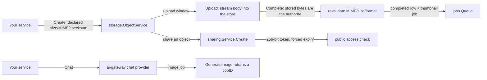

# Storage, sharing and AI

Three modules cover the media-and-intelligence side of a product:
`storage` owns object bytes and their metadata lifecycle, `sharing`
turns an object into a time-limited public link, and `ai-gateway`
fronts LLM chat and image generation behind one vendor-agnostic
gateway.



## storage: bytes never touch your database

`storage` keeps metadata in tenant-scoped tables and sends the bytes
through the kernel's `ObjectStore` seam, under keys the module itself
derives — never keys you supply. The upload lifecycle is a three-step
protocol:

1. `Create` opens an upload window against your declared size, MIME
   type, checksum and optional requested retention (capped by the
   host's ceiling). The row is `uploading`.
2. `Upload` streams the request body into the store.
3. `Complete` revalidates what actually arrived — **the stored bytes
   are the authority over your claims**: real size and MIME, byte and
   pixel limits, and a structural metadata strip (JPEG APP segments,
   PNG eXIf; a file the walker cannot verify structurally is refused).
   It finalizes the row and enqueues the thumbnail-derive task.

Deleting is a crash-convergent protocol (`LifecycleService`): mark the
row `deleting`, remove the object's bytes, remove each derivative's
bytes, then remove the rows in one transaction — an interruption at
any step is converged by the next run, never duplicated. The per-tenant
expiry sweep (`EnqueueExpirySweep`) resumes interrupted deletions and
reclaims expired `uploading` rows whose window closed.

## sharing: five rules, no exceptions

`sharing.Service` turns a resource into a public link and enforces
five mandatory rules: 256-bit `crypto/rand` tokens; a forced default
expiry with no never-expiring option; revocation that takes effect on
the very next access check (no caching anywhere in the module); full
access logging; and refusal answers that are outward-identical across
every refusal reason (so a link probe learns nothing about why). A
single view is consumed on delivery — serving reserves, then confirms
or refunds, in the settle-after-serve shape the credits ledger
established. The module's public access route (`GET /api/v1/sharing/access`)
answers unauthenticated requests with `Cache-Control: no-store`; your
host supplies a `ResourceResolver` that turns a granted share into
actual bytes, and rate limiting guards both creation and access.

## ai-gateway: one surface, many vendors

`ai-gateway` is vendor-agnostic by construction: every provider
implements `ChatProvider` (`Chat` / `ChatStream`), registered by name
on a seam registry; the default implementation is OpenAI-compatible,
so most vendors need no adapter at all. Chat is synchronous by
default. Image generation is async-only: `Gateway.GenerateImage`
enqueues exactly one job and returns its `JobID` — image work never
runs inside an HTTP request. Provider credentials are BYOK, stored
encrypted at rest in scope tiers (platform and tenant), writable
through the credential HTTP surface, and the tenant-writable base URL
is SSRF-guarded at dial time. Usage recording and entitlement checks
are optional structural seams your host can wire to `metering` and
`billing`.

## Complete example: a patient photo's journey — upload, derive, share

A clinic uploads a patient's smile-simulation result (a PNG) to
`storage`; once the three-step transfer protocol completes, `storage`
enqueues the thumbnail-derive task and the queue's worker (wired from
`reg.Jobs` through `jobs.Wire`, exactly as the reference app assembles
it) writes the derivative row. The clinic then mints a share link over the
completed object for the patient, the patient opens it without any
authentication, and a later revocation refuses the very next access.
The walk runs all of it in one process over an in-memory SQLite
database and a real kernel bootstrap — the standalone deployment mode's
ordinary shape.

Your consumer module's `go.mod` replaces the speed module paths onto a
local checkout (`go mod tidy` after the `replace` lines); paste the
code into a file of your own `main` package and run it. The AI half at
the end is host code shown for its real call shapes — it needs
provisioned BYOK credentials, so it does not run in this walk.

```go
import (
	"bytes"
	"context"
	"fmt"
	"image"
	"image/color"
	"image/png"
	"time"

	"github.com/vislake/speed/go/dbkit"
	_ "github.com/vislake/speed/go/dbkit/dialect/sqlite" // registers DialectSQLite
	"github.com/vislake/speed/go/jobs"
	"github.com/vislake/speed/go/pkgcore"
	"github.com/vislake/speed/go/sharing"
	"github.com/vislake/speed/go/storage"
)

// must keeps the walk readable; a real host returns coded errors instead.
func must(err error) {
	if err != nil {
		panic(err)
	}
}

func uploadDeriveAndShare() {
	ctx := pkgcore.WithTenant(context.Background(), pkgcore.TenantID("acme-dental"))
	db, err := dbkit.Open(ctx, dbkit.Options{Dialect: dbkit.DialectSQLite, DSN: "file:media-walk?mode=memory&cache=shared"})
	must(err)

	// storage completes onto this queue; jobs.Wire hands it every handler
	// the modules declared so a real worker derives the thumbnail.
	queue := jobs.NewStandaloneQueue(db, jobs.WithPollInterval(5*time.Millisecond))
	media := storage.NewModule(db, storage.WithQueue(queue))
	links := sharing.NewModule(db)
	registry := dbkit.NewMigrationRegistry()
	must(registry.Register(media))
	must(registry.Register(links))
	must(registry.Apply(ctx, db, dbkit.DialectSQLite))
	// A real kernel: Bootstrap runs both modules' Register, attaching
	// the object store, event bus and registry seats their services read
	// at call time — the same path a host takes.
	reg, err := pkgcore.NewKernel().Bootstrap(ctx, media, links)
	must(err)
	must(jobs.Wire(ctx, queue, reg.Jobs))
	must(queue.Start(ctx))
	// An 8x8 PNG stands in for the simulation result image.
	var buf bytes.Buffer
	img := image.NewRGBA(image.Rect(0, 0, 8, 8))
	for y := 0; y < 8; y++ {
		for x := 0; x < 8; x++ {
			img.SetRGBA(x, y, color.RGBA{uint8(16 * x), uint8(16 * y), 128, 255})
		}
	}
	must(png.Encode(&buf, img))
	content := buf.Bytes()
	svc := media.ObjectService()
	// Transfer step 1: declare the upload (row is uploading; the store
	// key is derived by the module itself, never caller-supplied).
	row, err := svc.Create(ctx, storage.CreateParams{
		DeclaredSize: int64(len(content)),
		DeclaredType: "image/png",
	})
	must(err)
	fmt.Println("upload declared:", row.State)
	// Transfer step 2: stream the bytes into the object store.
	must(svc.Upload(ctx, row.ID, nil, bytes.NewReader(content)))
	// Transfer step 3: Complete revalidates what actually arrived (size,
	// MIME, the structural metadata strip) and enqueues the
	// thumbnail-derive task.
	completed, err := svc.Complete(ctx, row.ID)
	must(err)
	fmt.Println("object completed:", *completed.MIME)
	// The queue's worker derives the thumbnail; wait for the row.
	deadline := time.Now().Add(5 * time.Second)
	for {
		derivatives, err := media.Derivatives().List(ctx)
		must(err)
		if len(derivatives) > 0 {
			fmt.Println("thumbnail derived:", derivatives[0].Kind)
			break
		}
		if time.Now().After(deadline) {
			fmt.Println("timed out waiting for the thumbnail")
			return
		}
		time.Sleep(10 * time.Millisecond)
	}
	// Mint the patient's link. ResourceRef is opaque to sharing; your
	// ResourceResolver maps the "storage:" form back to bytes on serve.
	created, err := links.Service().Create(ctx, sharing.CreateParams{
		ResourceRef: "storage:" + row.ID,
	})
	must(err)
	fmt.Println("share created (token returned exactly once)")
	// The patient opens the link — unauthenticated, exactly like the
	// public access route's handler.
	_, err = links.Service().AccessPublic(context.Background(), created.Token, sharing.AccessParams{
		IP: "203.0.113.7",
	})
	must(err)
	fmt.Println("patient access granted (access logged)")
	// Revocation takes effect on the very next access check: no cache
	// anywhere in the module to invalidate.
	must(links.Service().Revoke(ctx, created.Share.ID))
	_, err = links.Service().AccessPublic(context.Background(), created.Token, sharing.AccessParams{})
	fmt.Println("access after revoke:", err)
}
```

The AI half of the same product — the gateway module bootstrapped with
`WithModelRoute` keys (and, for images, `WithImageGeneration(queue,
objects)`), BYOK credentials provisioned on the platform or tenant
tier, business code only calls two entry points:

```go
import aigateway "github.com/vislake/speed/go/ai-gateway"

gateway := aiModule.Gateway() // aiModule: aigateway.NewModule(db, opts...)

// Chat is synchronous by default: one round trip, then the reply.
reply, err := gateway.Chat(tenantCtx, aigateway.ChatRequest{
	Model: "chat:default", // a WithModelRoute key, resolved at NewModule time
	Messages: []aigateway.ChatMessage{
		{Role: aigateway.RoleUser, Content: "Summarize this case in one sentence."},
	},
})
if err != nil {
	fmt.Println("chat:", err)
	return
}
fmt.Println("ai summary:", reply.Message.Content)

// Image generation is async-only: GenerateImage enqueues exactly one
// job and returns its JobID — image work never runs inside an HTTP
// request; the result is a go/storage object id read back via Queue.Get.
imageJobID, err := gateway.GenerateImage(tenantCtx, aigateway.ImageRequest{
	Model:        "image:default",
	Operation:    aigateway.ImageOperationImageToImage,
	Prompt:       "Make the smile more natural",
	InputObjectID: row.ID, // the object completed in the walk above
})
if err != nil {
	fmt.Println("generate image:", err)
	return
}
fmt.Println("image job enqueued:", imageJobID)
```

The contract facts this walk demonstrates: the three-step protocol
makes the *stored bytes* the authority — `Complete` revalidates size,
MIME and structure instead of trusting the uploader's claims, and only
then does the object become readable and the derive task go out;
sharing's five rules hold with no exceptions — the token is minted once
and the revocation refuses the very next check; and AI image work is
asynchronous by construction, with the bytes crossing module boundaries
only as `go/storage` object ids.

To run it:

1. Add the `replace` lines for `go/dbkit`, `go/pkgcore`, `go/jobs`,
   `go/storage` and `go/sharing` to your consumer `go.mod`, then
   `go mod tidy`.
2. Paste the first block into a file of your `main` package and run
   `go run .`.
3. The walk migrates both modules from zero, bootstraps a real kernel,
   derives the thumbnail through a real queue worker and exits —
   nothing needs Docker.

Expected output:

```text
upload declared: uploading
object completed: image/png
thumbnail derived: thumbnail
share created (token returned exactly once)
patient access granted (access logged)
access after revoke: sharing.not_accessible
```

See it in the reference app:

- [examples/reference-app/flowtests/storage_flow_test.go](https://github.com/vislake/speed/blob/main/examples/reference-app/flowtests/storage_flow_test.go)
  and [examples/reference-app/flowtests/sharing_flow_test.go](https://github.com/vislake/speed/blob/main/examples/reference-app/flowtests/sharing_flow_test.go)
  — the same journey (upload, sanitize, derive, download, delete;
  create, access, revoke) driven over real HTTP through the composed
  stack, plus [examples/reference-app/flowtests/smilesim_flow_test.go](https://github.com/vislake/speed/blob/main/examples/reference-app/flowtests/smilesim_flow_test.go)
  for the async image-generation leg.
- [go/storage/example_test.go](https://github.com/vislake/speed/blob/main/go/storage/example_test.go)
  — this walk's transfer lifecycle, compiled and executed by the
  module's own unit suite.

## Next steps

- The full per-module pages for `storage`, `sharing` and `ai-gateway`
  (options, examples) land in the module reference section of these
  guides.
- [Error code index](../../error-codes/) — every code these modules
  can answer with.
