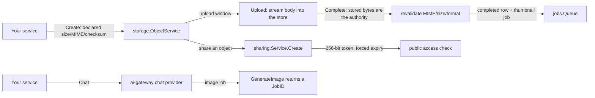

# Storage, sharing and AI

Three modules cover the media-and-intelligence side of a product:
`storage` owns object bytes and their metadata lifecycle, `sharing`
turns an object into a time-limited public link, and `ai-gateway`
fronts LLM chat and image generation behind one vendor-agnostic
gateway.

## storage: bytes never touch your database

`storage` keeps metadata in tenant-scoped tables and sends the bytes
through the kernel's `ObjectStore` seam, under keys the module itself
derives — never keys you supply. The upload lifecycle is a three-step
protocol:

1. `Create` opens an upload window against your declared size, MIME
   type, checksum and optional requested retention (capped by the
   host's ceiling). The row is `uploading`.
2. `Upload` streams the request body into the store.
3. `Complete` revalidates what actually arrived — **the stored bytes
   are the authority over your claims**: real size and MIME, byte and
   pixel limits, and a structural metadata strip (JPEG APP segments,
   PNG eXIf; a file the walker cannot verify structurally is refused).
   It finalizes the row and enqueues the thumbnail-derive task.

Deleting is a crash-convergent protocol (`LifecycleService`): mark the
row `deleting`, remove the object's bytes, remove each derivative's
bytes, then remove the rows in one transaction — an interruption at
any step is converged by the next run, never duplicated. The per-tenant
expiry sweep (`EnqueueExpirySweep`) resumes interrupted deletions and
reclaims expired `uploading` rows whose window closed.

## sharing: five rules, no exceptions

`sharing.Service` turns a resource into a public link and enforces
five mandatory rules: 256-bit `crypto/rand` tokens; a forced default
expiry with no never-expiring option; revocation that takes effect on
the very next access check (no caching anywhere in the module); full
access logging; and refusal answers that are outward-identical across
every refusal reason (so a link probe learns nothing about why). A
single view is consumed on delivery — serving reserves, then confirms
or refunds, in the settle-after-serve shape the credits ledger
established. The module's public access route (`GET /api/v1/sharing/access`)
answers unauthenticated requests with `Cache-Control: no-store`; your
host supplies a `ResourceResolver` that turns a granted share into
actual bytes, and rate limiting guards both creation and access.

## ai-gateway: one surface, many vendors

`ai-gateway` is vendor-agnostic by construction: every provider
implements `ChatProvider` (`Chat` / `ChatStream`), registered by name
on a seam registry; the default implementation is OpenAI-compatible,
so most vendors need no adapter at all. Chat is synchronous by
default. Image generation is async-only: `Gateway.GenerateImage`
enqueues exactly one job and returns its `JobID` — image work never
runs inside an HTTP request. Provider credentials are BYOK, stored
encrypted at rest in scope tiers (platform and tenant), writable
through the credential HTTP surface, and the tenant-writable base URL
is SSRF-guarded at dial time. Usage recording and entitlement checks
are optional structural seams your host can wire to `metering` and
`billing`.

## Next steps

- The full per-module pages for `storage`, `sharing` and `ai-gateway`
  (options, examples) land in the module reference section of these
  guides.
- [Error code index](../../error-codes/) — every code these modules
  can answer with.
