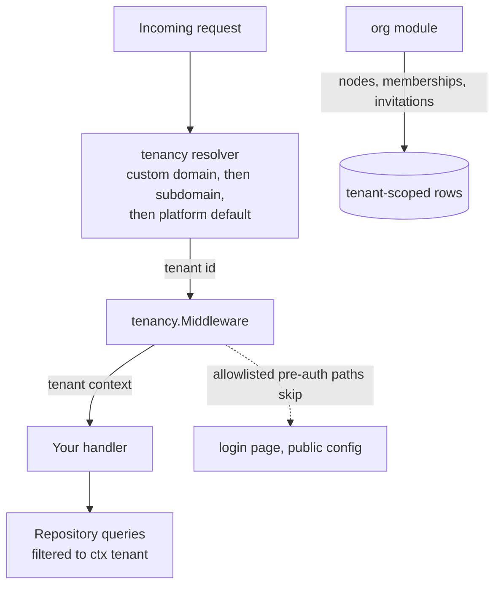

# Tenancy and organizations

Every request in a speed-based product runs as *some* tenant — that is
the isolation model, and it is guarded three ways (a GORM plugin that
injects the tenant filter, the mandatory `dbkit.Repository[T]` base,
and PostgreSQL row-level security in distributed deployments). The
`tenancy` module resolves which tenant a request belongs to; the `org`
module gives each tenant its organization tree, the memberships bound
to it, and the invitations that create them.



The resolver is a host-supplied function: `tenancy.NewDomainResolver`
maps a request to a tenant by host through the host's own lookup
function — whether a Host is a tenant's custom domain or a platform
subdomain is entirely the lookup's business, and the reference app's
lookup is a flat, deployment-configured host-to-tenant map — falling
back to the one default tenant it was constructed with when the lookup
misses (the reference app leaves it empty, so an unmatched host reads
the platform-defaults tier); a resolution that fails still serves that
fallback with a 200 for the login-page endpoints, never an error.
Where a request's tenant comes from is the framework's job: your
handler reads it out of the context with
`pkgcore.TenantFromContext(ctx)` and never accepts one from a header,
parameter or body.

## Minimal integration steps

1. **Mount the middleware.** `tenancy.Middleware(resolver, opts...)`
   wraps your mux; pre-auth paths (login page, `/api/v1/config/public`)
   go on the allowlist, everything else fails closed when the tenant
   cannot be resolved.
2. **Order it after authentication.** In the composed chain the
   tenant layer sits downstream of `authn.Middleware` and turns a
   verified principal into tenant context — see the identity domain
   page for the full order.
3. **Wire the org module.** `org.NewModule(db, opts...)` needs its two
   required wirings at boot (the email blind-indexer and the
   invitation-link builder — `WithInvitationEmailDisabled` exists for
   hosts that send no email); `Tree()`, `Members()` and `Invitations()`
   are the three runtimes.
4. **Shape the tree.** Create nodes under a parent; every node carries
   a materialized path and depth. A move updates every descendant's
   path in one operation — subscribers of `org.node.moved` (rbac's
   subtree grants among them) converge on the event.
5. **Add people by invitation.** Invitations are the tenant's own
   flow: the raw token is never stored (only its hash), the invitee's
   address is encrypted at rest under a blind index, and delivery is
   rate limited per tenant and per recipient. Accepting creates the
   membership; members can then be listed subtree-scoped or removed.
6. **Prove isolation in your own module.** Every repository of
   tenant-owned data must run `tenancytest.AssertIsolated` — the suite
   that would catch a missing filter. Identity and platform tables run
   `AssertNotTenantScoped` instead.

## Boundaries worth knowing

- `users` are deliberately **not** tenant-scoped: a person can belong
  to several tenants; `memberships` is the link table. Classify every
  table into one of the four data domains (tenant / identity /
  platform / link) before designing it.
- The one legitimate cross-tenant path is the audited
  `WithSystemContext` escape hatch, and its use is restricted to the
  platform's own widening purposes (admin, compliance, jobs, authn) —
  business code never widens.
- Soft-deleted nodes keep their names out of the way of a deleted
  sibling: unique indexes are partial (`WHERE deleted_at IS NULL`), so
  a deleted sibling's name or a removed member's seat is reusable.

## Next steps

See the `tenancy` and `org` module pages in the module reference for
the full API; the data-and-config domain page covers how tenant-scoped
models are declared and migrated.

## Complete example: a dental group, its store tree, and an invitation

This example plays out both halves of this page against one concrete
scenario: a multi-store dental group. First the tenancy half — a request
whose Host is `acme.example.com` resolves to `tenant-a`, an unknown Host
falls back to the configured default tenant, and a client-supplied tenant
hint is silently ignored. Then the org half runs inside that resolved
tenant: the tree grows a group with two stores, the owner joins the group,
and a dentist is invited into the north store and accepts — so the roster
and the `Scope` answers show exactly which nodes each user can see.
Everything is self-contained (in-memory SQLite, no mailer — the invitation
email is disabled), with every symbol taken from `go/org`'s and
`go/tenancy`'s real APIs (the same calls `go/org`'s own example suite
runs).

```go
package main

import (
	"context"
	"fmt"
	"net/http"
	"net/http/httptest"

	"github.com/vislake/speed/go/dbkit"
	_ "github.com/vislake/speed/go/dbkit/dialect/sqlite" // registers DialectSQLite
	"github.com/vislake/speed/go/org"
	"github.com/vislake/speed/go/pkgcore"
	"github.com/vislake/speed/go/tenancy"
)

func main() {
	ctx := context.Background()

	// org stores invitation addresses encrypted at rest and queryable by an
	// HMAC blind index. Two separate secrets: the encryption key and the
	// blind-index key must never be the same bytes.
	cipher, err := dbkit.NewCipher([]byte("example-email-cipher-key-32bytes"))
	if err != nil {
		panic(err)
	}
	dbkit.RegisterEncryptedSerializer(org.EmailSerializerName, cipher)
	indexer, err := dbkit.NewBlindIndexer(org.EmailIndexColumn,
		[]byte("example-blind-index-key-32-bytes"), dbkit.NormalizeEmail)
	if err != nil {
		panic(err)
	}

	db, err := dbkit.Open(ctx, dbkit.Options{Dialect: dbkit.DialectSQLite, DSN: "file:org_example?mode=memory&cache=shared"})
	if err != nil {
		panic(err)
	}

	// WithInvitationEmailDisabled keeps this example free of a real mailer;
	// a host that delivers invitations wires WithMailFrom and
	// WithInvitationLinkBuilder instead.
	module := org.NewModule(db,
		org.WithEmailIndexer(indexer),
		org.WithInvitationEmailDisabled(),
	)
	migrations := dbkit.NewMigrationRegistry()
	if err = migrations.Register(module); err != nil {
		panic(err)
	}
	if err = migrations.Apply(ctx, db, dbkit.DialectSQLite); err != nil {
		panic(err)
	}
	reg := pkgcore.NewComponentRegistry()
	if err = app.Assemble(ctx, reg, app.LoadSpec{Host: &hostConfig, Options: loaderOpts}); err != nil {
		panic(err)
	}

	// Tenancy half: the host maps a Host to a tenant; an unknown Host falls
	// back to the configured default, and a client-supplied tenant hint is
	// silently ignored -- the Host is the only tenant source.
	lookup := func(host string) (pkgcore.TenantID, bool) {
		if host == "acme.example.com" {
			return pkgcore.TenantID("tenant-a"), true
		}
		return "", false
	}
	mw := tenancy.Middleware(tenancy.NewDomainResolver(lookup, "public"))(
		http.HandlerFunc(func(w http.ResponseWriter, r *http.Request) {
			tenant, ok := pkgcore.TenantFromContext(r.Context())
			fmt.Printf("handler saw tenant=%q ok=%t\n", tenant, ok)
		}),
	)
	for _, host := range []string{"acme.example.com", "unknown.example.com"} {
		req := httptest.NewRequest(http.MethodGet, "/dashboard", nil)
		req.Host = host
		mw.ServeHTTP(httptest.NewRecorder(), req)
	}
	forged := httptest.NewRequest(http.MethodGet, "/dashboard", nil)
	forged.Host = "acme.example.com"
	forged.Header.Set("X-Tenant-ID", "someone-elses-tenant")
	mw.ServeHTTP(httptest.NewRecorder(), forged)

	// Org half: in a served request the tenant below is the one
	// tenancy.Middleware injected; here it is built explicitly.
	ctx = pkgcore.WithTenant(ctx, "tenant-a")
	tree, members, invitations := module.Tree(), module.Members(), module.Invitations()

	group, err := tree.CreateRoot(ctx, "Acme Dental", "group")
	if err != nil {
		panic(err)
	}
	north, err := tree.CreateChild(ctx, group.ID, "North Store", "store")
	if err != nil {
		panic(err)
	}
	if _, err = tree.CreateChild(ctx, group.ID, "South Store", "store"); err != nil {
		panic(err)
	}
	if _, err = members.Add(ctx, "user-owner", group.ID); err != nil {
		panic(err)
	}

	// The invitation token is returned exactly once and is a bearer
	// credential: it belongs in the message to the invitee, nowhere else.
	invite, err := invitations.Invite(ctx, org.InviteRequest{
		Email: "dentist@example.test", NodeID: north.ID,
		InviterUserID: "user-owner", Locale: "en-US",
	})
	if err != nil {
		panic(err)
	}
	if _, err = invitations.Accept(ctx, invite.Token, "user-dentist"); err != nil {
		panic(err)
	}

	roster, err := members.List(ctx, group.ID)
	if err != nil {
		panic(err)
	}
	fmt.Printf("members under the group: %d\n", len(roster))

	scope := module.Scope()
	for _, userID := range []string{"user-owner", "user-dentist", "user-stranger"} {
		visible, err := scope.MemberNodeIDs(ctx, userID)
		if err != nil {
			panic(err)
		}
		fmt.Printf("%s can see %d node(s)\n", userID, len(visible))
	}
}
```

**What each step of the program does.** `tenancy.Middleware` resolves the
tenant from the request's Host — never from a header — and injects it into
the context; the handler (and every org call below) reads it back with
`pkgcore.TenantFromContext`. Note that no org call takes a tenant
argument: the tenant travels in the context and nowhere else, which is
what makes it impossible for a caller to name someone else's tenant. The
blind indexer's column argument is org's exported `org.EmailIndexColumn`
constant, never a hand-typed string.

**How to run it.** From a checkout of this repository, put the file in a
throwaway module next to the checkout and point the imports at it with
`replace` lines — one per module the program imports, for example
`replace github.com/vislake/speed/go/org => /path/to/checkout/go/org` —
then run `go mod tidy` and `go run .` with `GOWORK=off` (the checkout's own
`go.work` must not leak into the build). The tidy step fetches third-party
dependencies once.

**Expected result.** The program prints the seven stdout lines below; the
assembly's own capability-validation log lines (the in-memory components'
`WARN` lines included) go to stderr first:

```
handler saw tenant="tenant-a" ok=true
handler saw tenant="public" ok=true
handler saw tenant="tenant-a" ok=true
members under the group: 2
user-owner can see 3 node(s)
user-dentist can see 1 node(s)
user-stranger can see 0 node(s)
```

The first three lines are the tenancy half: the recognized custom domain
resolves to `tenant-a`, the unknown Host falls back to the `public`
default tenant (enough to render a login page — never an error), and the
forged `X-Tenant-ID` header changes nothing. The rest is the org half: a
subtree-scoped listing under the group names both members (the owner at
the group, the dentist at the north store), while `Scope.MemberNodeIDs`
answers three nodes for the owner (group, north, south), one for the
dentist (their store alone), and zero for a stranger who was never
invited.

**See it in the reference app.** The reference app drives the same shapes
through its real composed HTTP stack in
[`flowtests/org_flow_test.go`](https://github.com/vislake/speed/blob/main/examples/reference-app/flowtests/org_flow_test.go) —
a multi-level tree, an invitation accepted, and a roster read back scoped
to a subtree — and
[`internal/app/demo/demo_subject.go`](https://github.com/vislake/speed/blob/main/examples/reference-app/internal/app/demo/demo_subject.go)
shows how org's HTTP surface is additionally gated by `rbac` at the edge.
Run `go run ./cmd/server` in `examples/reference-app` and compare against
its seeded demo tenants.

## Source

- [tenancy AGENTS.md](https://github.com/vislake/speed/blob/main/go/tenancy/AGENTS.md)
- [org AGENTS.md](https://github.com/vislake/speed/blob/main/go/org/AGENTS.md)
- [dbkit AGENTS.md](https://github.com/vislake/speed/blob/main/go/dbkit/AGENTS.md)
