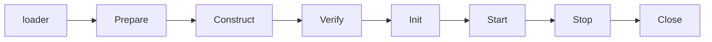

# app

app is speed's **application assembly layer**: the structure every
application's own boot code is built from. The [architecture
page](/docs/developer-docs/architecture/) draws it as the top node of
the module graph, and it is the one module with **no business domain**: no tables,
no routes, no permissions, no module contract. What it
owns is the half of a host's boot that would otherwise be written by
hand in every host: the configuration load, the composition plan, the
seven-stage component drive, the shutdown sequence and the HTTP helpers
(see the [design page](/docs/developer-docs/modules/app/) for why a
domain-less module is still warranted).

## What it is for

A speed application is assembled from components: platform modules,
infrastructure implementations and the host's own pieces, each a
`pkgcore.Component` registered on one
`pkgcore.ComponentRegistry`. The engine drives that registry:

- **The loader** (`app.Assemble` runs it first) resolves the host's
  configuration target, the composition configuration (which components
  compose, with which values) and every component's declared bootstrap
  keys, then publishes all three into the registry — so the assembly
  cannot even choose its components until the composition exists.
- **The driver** walks the registry through the assembly's stages:
  **Prepare → Construct → Verify → Init → Start**.
- **`app.Shutdown`** performs the two-phase close: the non-blocking
  **Stop** notification in reverse order, then the reverse-order
  **Close** that releases resources and aggregates errors.
- **`app.RunAssembly`** is the sugar for a host with no HTTP face of
  its own: it builds the registry, drives it, waits for the context
  (SIGINT/SIGTERM overlaid) and shuts down.

The engine contains **no HTTP assembly and no listening** — a host's
own application component composes the routes and owns the listener.
The host-neutral HTTP helpers live beside the engine for hosts to
compose with: `app.AuthnAPIPath` (authn's mount point),
`app.ReadHeaderTimeout` / `app.ShutdownTimeout` (the serve bounds) and
`app.PreAuthAllowlist()` (the tenancy options exempting healthz,
metrics and config's two pre-auth endpoints under GET and HEAD).

The engine also ships one component of its own: the **observability
component**, registered by the module's `init` and selected by the
builtin composition defaults, so it participates unless a higher layer
deselects it. Its `Prepare` initializes OTel from its resolved
`service_name` / `otlp_endpoint` block; its `Close` shuts the providers
down and flushes.

## When to choose it

Every speed-based host imports it — this is the module a host's
`cmd/server` is built on, whatever else it composes. The two mandatory
consumers are the reference app
(`examples/reference-app` — the full composition) and the project
skeleton `saasctl new` materializes (the minimal selections). Which
entry point you use is your call: `app.Assemble` + `app.Shutdown` when
your own component owns a listener, `app.RunAssembly` when the process
has no HTTP face of its own.

## Package layout and dependency cost

| Package | Concern | Who pays it |
|---|---|---|
| `go/app` (root) | the engine: loader, driver, `RunAssembly`, the observability component, the shared HTTP helpers | every composition |
| `go/app/chain` | the fixed middleware chain: `chain.Standard` (registry-derived) and `chain.Chain` (custom layouts) | hosts that compose a chain |
| `go/app/bridges` | the no-import seam bridges: `Entitlements`, `UsageRecorder`, `OrgFeatureGate`, `AuthnFeatureGate`, `ShareExpiryReader` | hosts that wire those modules |

The split is by dependency cost, not by taste: a bare consumer of the
root package pays the root's closure — 36 `// indirect` entries,
including the GORM stack `config` pulls — so the root never imports the
chain's or the bridges' participants; the chain's closure is bounded by
the chain's own participants (authn and rbac included); the bridges are
paid only by hosts that wire the modules on both ends of a seam.

## Wiring it in

```go
// 1. The host's components register on a fresh registry, in order.
reg := pkgcore.NewComponentRegistry()
for _, c := range hostComponents {           // step components, provider components
    if err := reg.Register(c); err != nil {
        return err
    }
}

// 2. The loader's input: the host's config target and load options.
spec := app.LoadSpec{
    Host:    &hostConfig,                    // non-nil pointer to your own struct
    Options: []app.ConfigOption{             // no implicit source configuration
        app.ConfigEnvPrefix("APP_"),
        app.ConfigRootKeyEnv("APP_ROOT_KEY"),
        app.ConfigKeyDerivation(dbkit.DeriveBootstrapKey),
        app.ConfigDevDefaults(devDefaults),  // your documented dev table, if any
    },
    Args: os.Args[1:],                       // the composition flags are scanned here
}

// 3. Drive: loader, then Prepare → Construct → Verify → Init → Start.
if err := app.Assemble(ctx, reg, spec); err != nil {
    return err   // a failure from Construct on already rolled back
}

// 4. Your own component serves; when it stops:
return app.Shutdown(context.WithoutCancel(ctx), reg)
```

`LoadSpec` names the host's bootstrap configuration target (`Host`),
the `pkgcore/config` options the load runs with (`Options`), and the
argument slice the composition flags are scanned from (`Args`; nil
reads the process's own arguments). `Overrides` is the optional
code-override layer for a caller that does not hold the registry —
which is exactly the `RunAssembly` spelling:

```go
// A host with no HTTP face of its own: signal handling and the
// shutdown are the engine's; pass your base context.
return app.RunAssembly(ctx, spec, extraComponents...)
```

The configuration options are the `app.Config*` constructors
(`ConfigFile`, `ConfigArgs`, `ConfigEnvPrefix`, `ConfigRootKey`,
`ConfigRootKeyEnv`, `ConfigKeyDerivation`, `ConfigDevDefaults`) —
aliases of `pkgcore/config`'s own options, which you may pass directly
too.

### The composition configuration, and its spelling

Which components compose the application, with which values, is the
**composition configuration** — resolved from five sources, later
wins: builtin defaults, project file, environment, command line, and
the host's code override (`app.CompositionOverrides` Put into the
registry, or `LoadSpec.Overrides`). The whole tree travels under the
`composition` envelope key, and component names appear with their dots
spelled as single underscores in files and the environment (the double
underscore already marks one level of nesting), literal on the command
line:

| Source | Spelling |
|---|---|
| project file | `composition: {…}` — `mailer.smtp` reads as `mailer_smtp` |
| environment | `APP_COMPOSITION__COMPONENTS__MAILER_SMTP__…` |
| command line | `--composition.components.mailer.smtp.…` |

A selection value spelled `false` (or `true`) in a text source reads as
its boolean. A key no source supplies stays unset — the loader ships no
implicit default except the builtin layer (the standalone deployment
default and the default-participating observability component), both
overridable from any higher source.

## The middleware chain

`go/app/chain` is the platform's fixed HTTP middleware order, around
your own protected handler and route branches. The order is
**authn.Middleware(verifier) outermost → the optional impersonation
decorator → tenancy.Middleware (with the pre-auth allowlist) → your
protected handler**, with two branches dispatched from authn's output
ahead of the tenancy chain entirely, by structure rather than by
allowlist:

- **authn's own subtree** (`app.AuthnAPIPath`): its operations resolve
  the tenant from the Principal's own claim, and enterprise SSO's
  dynamic `oidc:<tenant>` login-start path is not expressible as an
  exact (method, path) allowlist at all.
- **admin's route** (split out by the prefix you declare,
  `admin.APIPath`): its permissions are evaluated against the caller's
  own real, unsubstituted Principal, so neither tenancy resolution nor
  impersonation substitution may run ahead of it.

`chain.Standard(reg, verifier, protectedMux, opts...)` derives that
whole composition from the bootstrapped registry's mounted routes: it
admits every route through your route-authorization table
(`chain.WithAuthorization` — an `rbac.GuardRoutes` rule set, checked
for exhaustiveness and wrapped in the fail-closed gate before
mounting), splits the authn and admin subtrees out, mounts the rest on
your protected mux and delegates the order to `chain.Chain`. The host
supplies the business half through options: `WithAdminPrefix`,
`WithImpersonation`, `WithTenantStatusResolver`,
`WithExtraAllowlist`. A host with a custom route layout composes
`chain.Chain`/`chain.Config` directly instead — and a selection with no
authn module composes no chain at all.

## The seam bridges

Two modules can be structurally compatible without either being able to
import the other — their named types differ just enough that a direct
assignment does not compile. `go/app/bridges` holds the mechanical
adapter per pair, so each host writes the wiring as one call:

| Bridge | Connects | Wire it as |
|---|---|---|
| `Entitlements` | billing's entitlement check → ai-gateway's entitlements seam | `aigateway.WithEntitlements(bridges.Entitlements(billingModule.Entitlements()))` |
| `UsageRecorder` | metering's analytics recorder → ai-gateway's usage seam | `aigateway.WithUsageRecorder(bridges.UsageRecorder(meteringModule.Recorder()))` |
| `OrgFeatureGate` | config's lazy handle → org's feature-gate seam | `org.WithFeatureGate(bridges.OrgFeatureGate(configModule.Handle()))` |
| `AuthnFeatureGate` | config's lazy handle → authn's feature-gate seam | `authn.WithFeatureGate(bridges.AuthnFeatureGate(configModule.Handle()))` |
| `ShareExpiryReader` | config's lazy handle → sharing's tenant-config reader | `sharing.WithTenantConfigReader(bridges.ShareExpiryReader{Handle: configModule.Handle()})` |

The three feature-gate bridges exist for the same ordering reason:
`sharing.Module` (and the gates' consumers) are constructed before the
assembly publishes config's `*Service` — config attaches only once
every component's `Init` turn has run — so reading through the handle
defers resolution to read time and fails closed in the window before
it.

## Lifecycle and failure semantics

The engine's stages, and what a failure at each means:



- **Prepare → Start** are `app.Assemble`'s walk of the registry.
  A failed **Prepare** leaves nothing to roll back — nothing was
  constructed.
- A failure from **Construct** on has already rolled the assembly back:
  every constructed component closed in reverse order, exactly once,
  before the error returns. The caller never attempts a teardown of its
  own.
- **Stop → Close** are `app.Shutdown`'s two phases: the non-blocking
  Stop notification (failures ignored — a notification that cannot be
  delivered must not keep the Close that waits for the drain from
  running), then the Close stage, which releases every constructed
  component's resources in reverse order, aggregating failures. Both
  run exactly once, whatever the registry's state; a registry whose
  assembly never constructed anything closes as a no-op.

## Known limitations

- `chain.Chain` installs `authn.NewPrincipalResolver()` and the
  platform pre-auth allowlist by construction; a host whose chain needs
  a different resolver or a different pre-auth set assembles
  `tenancy.Middleware` itself rather than bending `chain.Config`.
- A route conflict **panics at assembly time** rather than returning an
  error (`pkgcore.MountRoutes`' documented contract): a wiring error
  gets the loudest available report, and no rollback runs on a panic.

## Source

- [go/app/AGENTS.md](https://github.com/vislake/speed/blob/main/go/app/AGENTS.md) — the authoritative document (charter, engine, chain, bridges, known limitations)

## Related pages

- [core group](/docs/user-guide/modules/core/) — pkgcore, whose
  `Component`/`ComponentRegistry` contract this page's engine drives
- Design: [app design page](/docs/developer-docs/modules/app/) — why
  the module is shaped the way it is
- Consumers: [saasctl](/docs/user-guide/modules/tools/saasctl/) — the
  skeleton it generates assembles through this engine — and the
  [reference-app walkthrough](/docs/user-guide/walkthrough-reference-app/)
