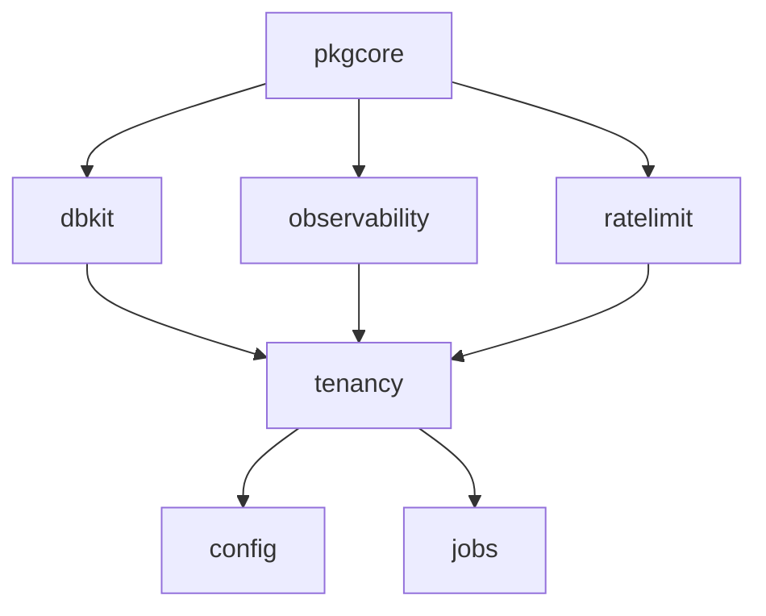

# Core modules

Every speed-based binary — and every other Go module in the platform —
sits on these seven modules. Nothing above them can exist without them,
and a consumer `go get`s them directly: they are not an application
framework you inherit but libraries you call, with the assembly
contract (`pkgcore`'s `ComponentRegistry`/`Component`) that lets business
modules register themselves into one binary.

The pages below follow that order:

- [pkgcore](./pkgcore/) — the dependency floor: the wiring contract,
  tenant context, the infrastructure module interfaces, structured
  errors and the message catalog.
- [dbkit](./dbkit/) — dual-dialect data access: the mandatory
  tenant-scoped `Repository[T]`, migrations, encryption and blind
  indexes.
- [tenancy](./tenancy/) — the input side of isolation: which tenant a
  request carries, and the audited system-context escape hatch.
- [observability](./observability/) — OpenTelemetry wiring, the
  context logger with redaction on by default, HTTP instrumentation.
- [config](./config/) — the schema-first, database-backed settings and
  feature-flag store that changes values hot.
- [jobs](./jobs/) — the asynchronous task queue contract with its two
  implementations: `StandaloneQueue` and the Redis-backed
  `queue/asynq`.
- [ratelimit](./ratelimit/) — the shared KVStore-backed rate limiter,
  one dimension per call.

## Why these sit at the bottom

The dependency direction is the release discipline: `pkgcore` imports
no other speed module and carries no third-party dependency in its
root package, and every layer above only adds what its own concern
requires. For a consumer this means two things. First, most business
modules you write ship a `Component` descriptor and declare routes,
config schema, permissions, events and job handlers in one
`Register` body — the assembly drives them. Second, several core
pieces are used directly rather than through the assembly: `tenancy`'s
middleware guards your HTTP entry points, `observability.Init` runs at
process startup, `config` needs its `Attach` once every component has
declared,
`jobs` queues are constructed and started by the host, and `ratelimit`
is a pure library. Each page's "Wiring and minimal use" section shows
which shape applies.

The in-process implementations of the infrastructure modules (the memory
`KVStore` and `EventBus`, the console mailer, the local object store)
double as test doubles, which is why module suites across the platform
need no external services in their default test run.
