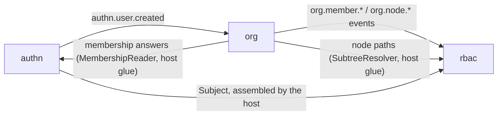

# Identity modules

These three Go modules are the identity-and-access face of a
speed-based product. In dependency order — also the order of a
request — they answer **who is calling** (`authn`), **may they do
this** (`rbac`), and **over which part of the organization** (`org`).
All three sit on the core group's `tenancy`/`jobs` tier and are
libraries you compose, never an application you run.

- [authn](./authn/) — authentication: who a caller is, never what
  they may do. Accounts, password/phone/social/enterprise sign-in,
  Ed25519 access tokens, refresh rotation, sessions, MFA and step-up.
- [rbac](./rbac/) — authorization: whether a `Subject` may perform an
  action on a resource, and over which slice of the organization
  tree. Deny by default, exact `resource:action` grants, no wildcards.
- [org](./org/) — a tenant's organization tree, the memberships bound
  to its nodes, and the invitations that create them — the data
  behind both neighbours' questions.

None of the three imports another; that absence is the design. authn
never imports org: membership is asked through the host's
`MembershipReader` seam, which org's roster is the canonical
implementation of. rbac never imports authn: authorization knows
exactly one thing about identity, `Subject{TenantID, UserID}`, and
whoever authenticates assembles it. rbac never imports org: a node's
place in the tree is asked through the `SubtreeResolver` seam the host
implements over org's read-only `Scope` view. org never imports authn:
it learns that a user exists from the `authn.user.created` event. The
composing host is the only place all three names appear together.

## How they work together

One request shows the division. `authn.Middleware` verifies the access
token **optionally** — a bad token is refused at once, an absent one
stays anonymous — and never decides a tenant. `tenancy.Middleware`
turns a verified principal into tenant context, from the token's own
claims. A gated route then runs `rbac.RequirePermission`, which
answers the coarse "holds it anywhere in the tenant" question and
fails closed on 403; a handler returning rows still filters them with
`DataScope`, whose subtree narrowing resolves through org's tree at
decision time. The account behind the chain exists through the
vertical flow: registration publishes `authn.user.created`, org's
subscriber idempotently ensures a root and a membership, an invitation
accepts another member into a node, and the next sign-in re-verifies
that membership before minting anything.

## Relationship to the other guides

The [identity and access](/docs/user-guide/domains/identity-access/)
and [tenancy and
organizations](/docs/user-guide/domains/tenancy-and-org/) domain
guides walk the same ground from the product side; the [error code
index](/docs/user-guide/error-codes/) lists every code these modules
answer with. The signing keys authn's tokens are verified against come
from the [pki](/docs/user-guide/modules/services/pki/) module of the
services group; the frontend counterparts — session management,
sign-in screens, tenant switching — are the `@speed` packages of the
web workspace, documented in a later section of this reference. Start
with the [Quickstart](/docs/user-guide/quickstart/): the generated starter
project wires these three modules for you.
