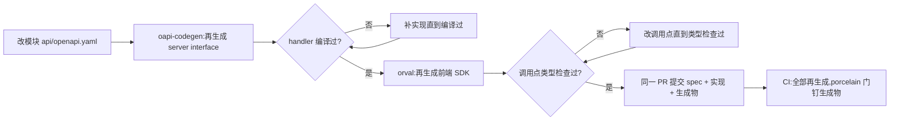

# API 契约

平台的每个对外 REST API 都始于一份 OpenAPI 文档,而每一行说 HTTP
的代码——后端的 handler、前端的调用——都由它生成。目标不是"有文
档",而是更强的主张:前后端不可能漂移,因为让它们"各自为政还不被
发现"的机制已经被移除。**先契约后代码,永不走 code-first**,顺序不
可谈判:先改 spec;先改实现就等于退回 code-first,丢掉全部意义。

为什么不从代码注释生成 spec?注释与代码没有绑定:改了 handler 忘了
注释,没有任何机制会注意到——这是文档腐化的经典路径。反方向是机
械绑定的:spec 生成每个 handler 必须实现的 Go server interface,改
了 spec 不改实现就编译失败;spec 生成每个调用点必须满足的
TypeScript 客户端,契约变了前端不跟上就过不了类型检查。约定与评审
拦不住的漂移,编译器拦得住。

## Fragment、合并与归属

每个模块在自己目录维护 `api/openapi.yaml`,与迁移、语言文件并列——
模块自带资产,归实现它的模块所有。fragment 共享命名规范——路径前
缀 `/api/v1/<module>/`、operationId `<module>_<action><Resource>`、
schema 名 `<Module><Type>`——因为合并文档与生成出来的名字都依赖它
们:operationId 会字面变成生成的函数名与 hook 名,所以规范由 redocly
lint 规则强制,不靠自觉。

合并文档是 `contracts/speed.yaml`,由钉定的 redocly `join`(`api:merge`
任务)把十个平台模块 fragment 并成,提交为发布物之一。合并成员由模
块归属决定:凡带 HTTP fragment 的平台模块一律进合并与平台 SDK,不
论工作区里有没有页面消费它。speed 是以库分发的平台,SDK 覆盖的是
平台本身,不是 demo 应用碰巧调用的那部分——而没人调用的生成面不会
腐化,因为它与有人调用的面受同一组一致性门钉住。某个面有没有真实
消费者是另一回事,由 reference-app 规则回答,不属于合并策略。

reference app 自有的 notes、cases、smilesim fragment 刻意不是成
员:它们是应用的 API,不是平台的。它们走应用自有生成腿
(`api:gen:app`),并入应用自己的合并文档
(`examples/reference-app/web/app-openapi.yaml`),生成应用 web 宿
主 import 的应用自有 SDK——这正是交付型消费方项目管理自有 fragment
的形态。两个 SDK(平台与自有)骑同一个绑定接缝与同一个 QueryClient。

## 编译就是那道门

每个 handler 都以 `var _ api.ServerInterface` 编译期断言实现其
fragment 的生成接口。往 spec 里加一个操作再生成:接口变大,没跟上
的 handler 停止编译——失败点名的就是缺什么。这就是全部机制,也是
生成物要提交而不是按需生成的原因:编译检查跑在普通构建里,每个提
交都过,不需要任何流水线。

前端半边反方向同理。再生成 SDK 改变类型,类型检查失败随即枚举出契
约变更触及的每个调用点。生成 SDK 本身不携带任何 HTTP:每次生成调用
都经包内唯一手写接缝(`runtime.ts` 的 `bindRequestFn`)适配,宿主启
动时把它绑定到自己 `@speed/api-client` 实例上一次——last bind
wins——生成代码因此继承客户端的认证、重试与错误处理而无需知道它
们存在。生成包与手写运行时分开是覆盖边界决定:SDK 入口每次再生成
整体覆盖、标记 DO NOT EDIT,手写机制必须住在再生成永远够不到的地
方。

## 一致性门:再生成再比对

api-contract 流水线(`api-contract.yml`)在 spec 侧文件变动时触发
——任一 fragment、生成器配置、合并工具——PR 与直接推送都跑。它重
复 `api:gen` 任务的每一个生成步骤(后端 fragment、合并文档、前端
SDK,各自钉定生成器版本),每个步骤之后跑一次一致性门,实现为
`git status --porcelain`,刻意不用 `git diff --exit-code`:一次
*新建*文件的再生成会静默通过 diff 门,而 porcelain 连未跟踪文件一
起报告。任何"不是 spec 生成出来的"已提交生成物都失败该任务。最后
流水线构建 reference app——它 import 全部平台模块——所以任何平台
fragment 的生成接口超出其 handler 都无法编译;authn fragment 另有
自己的再生成加构建腿,编译答案不必等较慢的全量矩阵。spec、实现与
再生成产物在同一 PR 提交,门随后验证三者一致。

## 契约刻意不携带什么

两个设计决定让契约在平台范围内保持干净。其一,**任何地方没有租户
头**。租户上下文在访问令牌里,服务端只从令牌的 claims 解析——绝不
来自调用方可控的头部、参数或请求体。生成代码因此没有租户概念,
query key 是裸 spec 路径;租户命名空间化是宿主纪律。其二,**契约不
下发 i18n 资源**。每个错误响应共用同一个信封——`code`、`traceId`、
可选 `params` 与 `details`——`message` 字段被明确标注为不得展示:
展示文案是前端的事,按 code 在消费包的双语目录里查
(错误码索引在服务端覆盖同一批 code)。统一信封正是让生成客户端把
401 刷新、429 退避与错误映射各做一次、而不是每端点一套的原因。

契约也记录自己的边界,而不是假装 OpenAPI 无所不包:server-sent
events 不是 OpenAPI 3.0 媒体类型,通知流端点因此手挂载、省略记录
在 fragment 头部;外发 webhook 与支付渠道回调是平台*发出*的请求或
第三方格式的回调,单独文档化,永不进 spec。文件上传不需要例外:上
传经服务端中转、是普通三步协议,全程可由 OpenAPI 表达。

## Source

- [Taskfile 的 api:gen/api:merge 任务](https://github.com/vislake/speed/blob/main/Taskfile.yml)——
  钉定的生成命令。
- [api-contract.yml](https://github.com/vislake/speed/blob/main/.github/workflows/api-contract.yml)——
  流水线及其 porcelain 门。
- [contracts/speed.yaml](https://github.com/vislake/speed/blob/main/contracts/speed.yaml)——
  平台合并文档。
- [redocly.yaml](https://github.com/vislake/speed/blob/main/redocly.yaml)——
  合并与命名 lint 规则。
- [api-sdk 运行时接缝](https://github.com/vislake/speed/blob/main/web/packages/api-sdk/src/runtime.ts)——
  唯一手写绑定接缝。
