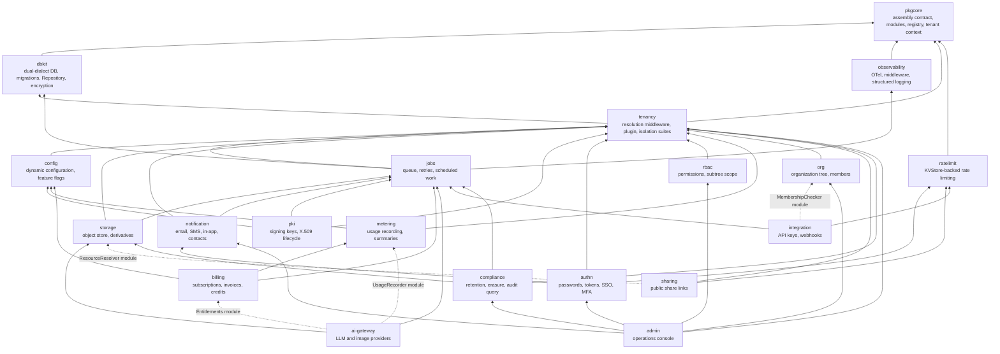
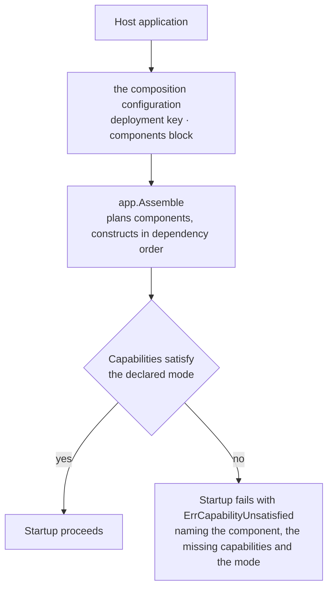

# 总体架构

在 speed 之上构建服务?从[用户指南](/zh-cn/docs/user-guide/)开始。本页回答用户指南引出的问题:模块是什么、它们如何组合、框架替你决定什么、不决定什么。

## 一种形态:以库分发的模块化单体

speed **不是应用**——这里没有任何东西能独立运行。它是一组独立发布的 Go module 与 npm 包,由业务项目以 `go get` / `npm install` 引入,组装成自己的二进制。它**也不是微服务架构**:模块编译进同一个二进制,进程内互相调用——没有服务发现,没有模块间的网络跳。它同样**不是通常意义上的框架**:它不替组装它的应用做决定。只有最小启动骨架由 CLI 生成(`saasctl new`),且可自由修改——真实项目的胶水代码属于项目自己。

为什么这个形态是第一件要内化的事?因为"分发"驱动了这里的绝大多数设计决策:

- **每一条导出签名变更都会传播到每个已交付项目。** 公开 API 默认冻结,除非有意且协调地做破坏性变更——这正是下文接线契约把"新增横切机制"设计成永不触及核心接口的原因。
- **这里新增的每个依赖都会进入别人的 `go.sum` 或产物。** 加依赖要在 PR 里给出理由与实测代价——越靠近依赖底座,代价越会向每个上层模块复利。
- **实现细节归属 `internal/`**,消费者无法 import。模块暴露什么是有意划定的边界,不是 Go 可见性规则的偶然结果。
- **所有模块与包以同一个锁步版本一起发布。** 只支持同版本组合,彻底消除兼容矩阵,代价是消费者必须整体升级(`saasctl upgrade` 完成这次改写)。
- **每个模块 API 必须在参考应用里有真实消费者。** 没有被真实消费者用起来的 API 不算完成——这是防止闭门造车的闸门:每个模块在发布前都先在一个组装好、运行中的系统里得到验证。

## 模块依赖方向

Go 模块的依赖严格自底向上;下图按依赖方向自下而上绘制:

实线边是真实的 Go import——一个模块的 `go.mod` require 另一个模块。虚线边与"尚未补齐的依赖"恰恰相反:它们标记真实存在、但**刻意永久不建立 import** 的协作。消费方在自己的包内声明一个结构化类型接口(只由标准库类型构成),由宿主应用在装配时注入具体实现——`org` 的 `FeatureGate`、`rbac` 的 `SubtreeResolver`、`authn` 的 `KeySource`(由 `pki` 结构化满足,而 `authn` 从不 import 它)都是同一手法。两条规则让这张图可以独立发布(详见[设计原则](/zh-cn/docs/developer-docs/design-principles/)):

- `rbac` 永不 import `authn`——授权只认 `Subject{TenantID, UserID}`,由认证一侧拼装后调用。
- 业务模块之间不为数据库关系 import 对方的 struct——跨模块关系是 ID 引用加领域事件(`authn` 发布 `authn.user.created`,`org` 订阅后建成员关系);跨模块外键同样不存在。

`admin` 位于顶端,是唯一受认可的例外:运营后台天然是下层一切的组合者,因此被明确允许直接 import 下层模块的具体包。

web 包以分层 npm workspace 镜像同一形态——设计令牌与 i18n 在底层,生成的 API 客户端与无头会话层在中层,组合式 UI 壳在顶层。分层详见[前端构建领域页](/zh-cn/docs/user-guide/domains/frontend-building/)与 [modules 索引](/zh-cn/docs/user-guide/modules/)下各包页面。

## 部署模式与实现组装:两条正交轴

两件事互不决定,把它们焊成一个开关是设计错误:

- **部署模式**——这套系统以几个副本运行、可依赖哪些外部设施。
- **实现组装**——每个基础设施模块具体选用哪套实现。

反例说明为什么:单进程部署对接真实 Stripe、真实 SMTP、真实 S3,是小客户安装的常规生产形态;分布式部署同样可以在联调环境挂 Mailpit 与支付沙箱。"外部服务真不真"是环境与凭证问题,不是副本数问题。

因此:**部署模式不选择实现,它只约束实现。** `pkgcore` 的每个基础设施模块(`KVStore`、`EventBus`、`Mailer`、`ObjectStore`)都是带 N 套实现的接口,N ≥ 1——绝不是固定两套。每个组件声明它所提供实现的能力:`MultiReplicaSafe`(多副本可共享这份状态)、`SurvivesRestart`(状态跨进程重启仍在)、`Stateless`(没有重启会丢失的东西——控制台发信器因此跳过对它毫无意义的横幅警告)。每种部署模式声明自己要求什么,装配的 Prepare 阶段把每个被选组件的声明与该模式做比较。无法在所声明模式下运行的组装**启动即失败**,报 `ErrCapabilityUnsatisfied`,点名组件、缺失的能力位与模式——绝不会是"缺少分布式实现"这类泛化错误,因为一旦存在 N 套实现,这句话就不再有任何含义。仅缺 `SurvivesRestart` 是响亮的启动横幅而非失败:组装可以运行,但操作者必须确切知道哪些数据不跨重启存活。

约束是单向的:分布式(多副本)排除进程内实现;单进程**不排除任何东西**。框架不预设"生产"或"测试"组合——哪组组装算生产、生产环境能不能出现 mock,是组装应用自己的判断。

由于 Go 按**包**而非按符号解析依赖,同一立场延伸到打包:**二进制包含哪些实现,由应用组装者决定。** 每套实现住在自己的子包里(`go/pkgcore/kv/redis`、`go/jobs/queue/asynq`……),在自己的 `init()` 中自我注册;确定只用 SQLite 的应用只 import 一个方言包、只承担一套方言的依赖——`database/sql` 就是模型。要接受的代价也是 `database/sql` 的:没人 import 的实现会以启动错误现身,报错信息点名修复它所需的 import。

业务代码永远看不到这两条轴——模块逻辑里没有 `if mode == "standalone"`,因为模块逻辑根本不持有模式;模式与实现只活在装配的代码里。进程内那批实现的附带收益是它们同时充当测试替身,多数单元测试因此不需要容器。

## 模块接线契约

每个后端模块携带一个 `pkgcore.Component` 描述符,由它的 `Init` 回调执行模块**唯一的一次 `Register(reg *pkgcore.ComponentRegistry)` 声明体**;该声明体注册模块贡献的一切——路由、配置 schema、功能开关、权限、任务处理器、通知类型、事件、审计动作。声明面就是 `*pkgcore.ComponentRegistry`:十个注册席,每种机制一个,只在装配的 Init 阶段接受写入。

**为什么是一个声明体,而不是八个描述符回调?** 因为在锁步版本下,改动描述符契约是同时打破所有模块的破坏性变更。新的横切机制变成声明面上的一个新注册席——`*pkgcore.ComponentRegistry` 上的一个席位访问器加上它背后的注册器;既有模块不用改、不用重编译。声明面的存在意义,正是让"新增机制"永远不改变每个模块描述符所携带的契约。

注册是声明式的,这在外界换来三份红利:权限清单自动汇入运营后台的角色配置界面,配置与开关 schema 自动汇入生成的配置文档,通知类型自动汇入用户可见的偏好矩阵。每个模块还把自己的资产——双方言 SQL 迁移、`zh-CN`/`en-US` 语言包、自己的 OpenAPI 片段——与代码一同发布,模块版本与资产永不脱节。

装配由组合配置驱动,而不是由一个模式参数——`app.Assemble(ctx, reg, spec)` 的 `LoadSpec` 点名宿主的配置目标与加载器选项;组合配置的 `deployment` 键声明拓扑,`components` 块选择哪些组件参与。引擎的 `Assemble` 规划组件图、按依赖序构造、按模式校验每个被选组件的声明能力,再逐阶段驱动;模块在自己的 `Register` 窗口内声明,在此之后读取已解析的状态。

HTTP 中间件链有一个固定、不可随意调整的顺序,`go/app/chain` 是它唯一
的实现:`authn.Middleware(verifier)` 包住整个组合,把两个结构性豁免
的分支先派发出去——admin 控制台(不经 tenancy 也不经冒名替换,因为它
的权限按调用者自己未替换的 principal 判定),然后是 authn 自己的子树
(登录发生在任何租户存在之前)。落到默认分支的请求先经可选的冒名装
饰器,再过 `tenancy.Middleware(authn.NewPrincipalResolver())` 与预认证
白名单,进入宿主的受保护处理器。认证必须先于租户解析,因为只有这个
次序让 token 恰好验证一次——租户解析器从上下文里读已验的 Principal。
权限门不是链上的一环:rbac 的路由授权表(`rbac.GuardRoutes`)在路由层
包裹已挂载的处理器,与这条链平行。[身份与访问领域页](/zh-cn/docs/user-guide/domains/identity-access/)按操作讲解这条链。

## 多租户:隔离是平台属性

租户共享一个数据库,以 `tenant_id` 隔离,三重防护:GORM 插件把租户过滤自动注入每条查询;业务模块的租户数据仓库必须内嵌强制的 `dbkit.Repository[T]`;分布式部署下再加 PostgreSQL 行级安全。每个租户数据仓库都要跑 `tenancytest.AssertIsolated`;身份数据与平台数据表跑 `AssertNotTenantScoped`,反向断言一张全局可见的表永远不会被错误过滤。两套件都由 CI 强制。

哪些表带 `tenant_id`,是在设计任何表之前就要做的分类决策:

| 分域 | 含义 | 是否租户域 |
|---|---|---|
| 租户数据 | 归属某个租户,对其它租户绝对不可见 | 是 |
| 身份数据 | 归属自然人,跨租户 | 否 |
| 平台数据 | 全局共享,租户只读 | 否 |
| 关联数据 | 连接身份与租户 | 是 |

`users` 刻意**不**租户化——一个人可以属于多个组织——用户的租户来自 `memberships` 关联表,绝不来自用户记录。身份数据靠*权限*隔离;写平台数据要走经审计的系统上下文路径。两条绝对规则,因为违反它们就是经典的横向越权洞:服务端永不接受调用方提供的 `tenant_id`——租户来自访问令牌的 claims;且不存在跨模块外键,只有 ID 引用,因为模块独立发布、独立迁移。

## 设计详情所在

用户指南讲*怎么做*:装模块、驱动装配、搭组织树、操作生成的项目。本栏(Developer docs)讲*为什么*。姊妹页[设计原则](/zh-cn/docs/developer-docs/design-principles/)是这一页的搭档:每个模块都遵守的纪律清单,每条规则附理由与执行处。

## 相关页面

- [开发者文档](/zh-cn/docs/developer-docs/) hub、[用户指南](/zh-cn/docs/user-guide/)
