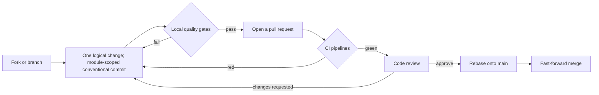

# 贡献指南

speed 由独立发布的 Go module 与 npm 包构成,所谓"做贡献"就是在
这个仓库里打磨其中某一个单元——或是它们之间的共享层:API 契约、
仓库规范、CI 流水线、本站。公共 API 是冻结的——每一个导出签名
的变更都会传导到已交付的业务项目,你新增的一个依赖也会落到别人
的 `go.sum` 里。重大的设计变更会先记录成文;见
[设计决策档案](/zh-cn/docs/developer-docs/design-decisions/)。

## 准备开发环境

`task setup` 通过 mise 安装钉定版本的工具链,并同步 Go workspace:

```sh
task setup
```

每个工具都有钉定的版本,镜像自各自的权威源——Go 在 `go.work`、
Node 在 `web/.nvmrc`、pnpm 在 `web/package.json`、golangci-lint 与
Hugo 在安装它们的 CI action 里——仓库根的 `.mise.toml` 是本地镜像,
由一道漂移闸门把关:权威源与镜像必须同一次改动一起升。`task` 与
`mise` 本尊不一定在全新 checkout 的 `PATH` 上;它们包装的命令
(`go test ./...`、`go vet ./...`、`golangci-lint run ./...`)始终
可以直接运行。

两个 workspace 根互不重叠:仓库根的 Go workspace(`go.work`)与
`web/` 下的 pnpm workspace。Go 命令在模块目录内运行,或从根目录
带完整 import path 运行;web 命令在 `web/` 下运行。
`examples/reference-app/` 下的 reference app 是每个模块**强制性的
第一个消费者**——一个它实际没用过的 API 不算做完——端到端开发
就在这里发生:

```sh
go run ./cmd/server   # 在 examples/reference-app/ 内运行
```

其余入口:`task test`(单元测试)、`task test:full`(全量矩阵)、
`task lint`、`task api:gen`(重新生成 API 契约产物)、
`task docs:serve`(本地预览本站;先初始化 hugo-book 主题子模块)。
目前还没有热重载的组合开发循环——`task dev` 是一个只打印说明的
stub——所以上面的命令才是真正跑起应用的方式;前端工作在
`examples/reference-app/web` 里进行。

## 分支与合并

开发是 trunk-based——短生命周期分支,`main` 随时可发布——`main`
上的历史由仓库纪律保持线性、靠评审执行:合并前先 rebase 到目标分
支,只做 fast-forward 合并(`git merge --ff-only`),merge commit
会被拒绝。`main` 无原生分支保护(直接推送是团队约定),纪律落在
评审上,不落在 GitHub 开关上。线性历史在这里不止是美学问题:
lockstep 版本下,定位"某个版本包含哪些提交"与二分排查回归都依赖
它。

`pkgcore`、`dbkit` 与 `tenancy` 是依赖地基——对它们的改动会波及
每个模块与每个交付项目——所以 `CODEOWNERS` 为这三个目录登记
foundation 评审人。它记录的是预期评审门:分支保护尚未开启、团队句
柄仍是占位符,该要求目前不由 GitHub 强制。

## 提交规范

提交信息遵循 [Conventional Commits](https://www.conventionalcommits.org/):
`<type>(<scope>): <祈使句摘要>`,英文,header 最好控制在 72 字符
以内。一次提交只做一个逻辑改动,每个提交都能独立编译并通过自己
的测试。

| Type | 何时使用 |
|---|---|
| `feat` / `fix` | 新功能 / 缺陷修复 |
| `docs` | 仅文档(设计文档、ADR、AGENTS.md) |
| `test` | 新增或更新测试 |
| `api` | OpenAPI spec 变更,连同重新生成的产物一起提交 |
| `i18n` | 新增或更新 zh-CN / en-US 资源 |
| `chore` | 构建、工具、依赖、CI |
| `style`, `refactor`, `perf` | 仅格式化 / 重构 / 性能 |

scope 指明被改动的单元:Go module 或 npm 包名(`pkgcore`、`billing`、
`auth-ui`)皆可,另有横切的 `reference-app`、`openapi`、`deps`、
`ci`、`compose`、`templates`、`adr`、`release`,以及仓库级
`internal`(设计文档)、`repo`(根规范)与 `site`(本站)。
破坏性变更——对交付库而言,任何导出签名变更都是——在 scope 后加
`!`,并带 `BREAKING CHANGE:` footer。摘要与正文写为什么,绝不叙述
流程产物(内部代号、轮次名)。

## 质量门

下面的清单是每个 pull request 合入前必须通过的——即本站
[设计原则](/zh-cn/docs/developer-docs/design-principles/)一页的纪
律清单,由 code review 执行,凡有工具处由 CI 执行。

- **缺陷修复必须带复现测试**——在修复前失败的那种。若确实无法
  添加,PR 里说明原因并指名后续动作;由 reviewer 确认。
- **警告是一等问题。** 编译、lint、废弃 API、console、可访问性与
  竞态检测警告一律不得静默忽略或压制——修掉它们,或说明理由与
  后续。
- **面向用户的文案是双语的**,zh-CN 与 en-US 同一次提交给出,
  key 集合一致性由 CI 检查。
- **接口变更 spec 先行。** 先改 spec;重新生成的接口与前端 SDK
  在同一改动里提交,然后才是实现。没有对应实现的 spec 变更无法
  通过编译。
- **新 Repository 要证明隔离。** 租户数据仓库跑
  `tenancytest.AssertIsolated` 套件;身份与平台表跑
  `AssertNotTenantScoped`。两类都不许绕过到裸 `*gorm.DB`。
- **新的基础设施依赖要自带实现。** 新模块至少要有一套零外部
  依赖的实现;每套实现都声明能力并通过该模块的契约测试套件。
- **给外部联系人的消息走同意流程。** 向未验证地址发送被拒绝——
  验证消息本身是唯一例外,且有限频。
- **依赖带理由与实测成本。** 新增第三方依赖需要在 PR 里给出理由
  与替代方案评估;内置的组件实现还要报告裸消费者会付的
  `// indirect` 条数。

## 文档义务

文档与代码同 PR 一起走:新的公共 API 同 PR 带使用文档、可编译示例
与所属模块 AGENTS.md 的条目——Go 的 `Example` 函数与每个包自带
的 usage-example 测试都由 CI 编译并运行。语言遵循仓库规则:代码
与面向模块的文档是英文,内部设计文档是中文,本站是双语——新页
面要带真实的 zh-CN 译文。本栏页面都带 Source 小节,指向相关材料,
每个论断都能回到底层核验。

## CI 何时跑什么

| 流水线 | 触发 | 跑什么 |
|---|---|---|
| `fast-check.yml` | 每一个 pull request,每一次推送到 `main` | 逐模块 Go 矩阵(lint、vet、race 测试、构建)覆盖整个 `go.work`;逐包 web 矩阵(lint、typecheck、测试、构建);仓库级检查(CJK 扫描、漂移闸门、semgrep 规则) |
| `full-check.yml` | 打了 `full-ci` 标签的 PR,每一次推送到 `main` | 同一份模块矩阵,加上基于 Docker 的真实 PostgreSQL/Redis/RustFS 集成层,以及 reference app 的组合式 HTTP 套件 |
| `docs-check.yml` | 触碰文档或 i18n 资源的 PR | i18n key 集合一致性、markdown 示例编译、本站对照真实 Hugo 构建的结构检查 |
| `api-contract.yml` | 触碰 API 契约工具链的 PR,及路径匹配的推送 | 从 spec 重新生成后端接口与前端 SDK,对提交产物做一致性闸门,并重建 reference app |
| `security.yml` | 每一个 PR,加每日定时 | 依赖审计、gitleaks 密钥扫描、CodeQL、许可证扫描 |
| `scaffold-verify.yml` | 每日定时 | 生成、构建、迁移并启动一个起始项目,两种部署模式各一遍 |
| `e2e.yml` | 每日定时,手动触发,推送到 `main` | 在真实 runner 上跑参考应用的浏览器端到端套件:三个 Playwright 项目(chromium、webkit、iPad)共两个浏览器引擎——iPad 设备档跑在 webkit 上——各占一个矩阵行,对准刚启动的服务器 |
| `docs-site-deploy.yml` | 触碰 `docs/site/**` 的推送,手动触发 | 构建并部署本站 |
| `release.yml` | 手动触发 | 离线校验 lockstep 发布计划,随后对已验证版本执行真实发布:推送模块 tag 与仓库根 tag,并把 `web/packages` 下每个 `@speed` 包发布到 GitHub Packages registry |
| `docker-image-ci.yml` | 触碰镜像构建输入路径的推送到 `main`,加手动触发 | 构建容器镜像 |

`nightly.yml` 是刻意门控的 stub,不会在任何 pull request 上触发;
`e2e.yml` 在每日定时与手动触发之外,推送到 `main` 时也会运行——
推送触发器已在首次手动运行全绿后开启。



## Source

- [提交规范 skill](https://github.com/vislake/speed/blob/main/.claude/skills/commit-convention/SKILL.md)
