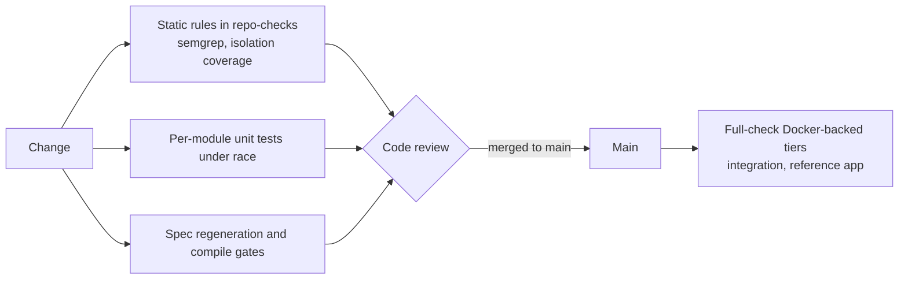

# 设计原则

[总体架构](/zh-cn/docs/developer-docs/architecture/)讲 speed 的形态;本页讲让形态不散架的规则:每条禁什么或要求什么、为什么、在哪里执行——code review、CI,或两者。这些不是风格建议——违反它们的代码不应合入。执行处按类别如实标注(semgrep 规则、ESLint 规则、契约套件);每条流水线当下实际跑什么见[仓库与发布](/zh-cn/docs/developer-docs/repo-and-release/)。

## 模块边界纪律

边界让独立发布成为可能——互相随意 import 的模块会永远一起重编译。

- **`rbac` 永不 import `authn`。** 授权只认 `Subject{TenantID, UserID}`,由认证一侧拼装。否则每一次认证变化都会波及权限引擎。code review 执行;import 图本身就是文档。
- **业务模块之间不为数据库关系 import 对方的 struct。** 跨模块关系是 ID 引用加领域事件:`authn` 发布 `authn.user.created`,`org` 订阅。struct import 会把两张表的 schema 拴在一起;事件则可以忽略、延迟或重放。code review 执行。
- **业务代码只依赖 `pkgcore` 接口,永不 import 具体基础设施**——`billing` 用 `KVStore`,不用 `go-redis`。code review 加 depguard 规则执行,后者把各后端 SDK 关进自己的实现包。
- **接口按该接缝已注册实现中最弱的一方设计。** `KVStore` 不暴露 Redis 专属能力;它暴露的原子原语(`IncrByFloat`、`CompareAndSwap`)是每套实现都能满足的语义。code review 执行。
- **实现与接口永不共包。** Go 按包解析依赖,实现若内联在接口所在的包,它的 SDK 就会进入每个消费者的构建。实现各自住在子包并自我注册;二进制包含哪些实现由应用组装者决定(`database/sql` 即此模型),新增内置实现的 PR 必须实测它对裸消费者的代价。code review 与打包感知的 CI 构建执行。

## 多租户隔离纪律

隔离是平台的核心承诺,靠机制与强制测试守护,不靠自觉。

- **租户数据仓库必须内嵌 `dbkit.Repository[T]`;持有裸 `*gorm.DB` 被禁止。** 三个绕过入口(`db.Table`、`db.Model`、`db.Raw`)由 CI 的 semgrep 规则捕获。身份与平台表——它们*不能*租户化——使用裸 `*gorm.DB`,这是刻意、有文档记录的例外。
- **永不手写 `WHERE tenant_id = ?`**——租户过滤由 GORM 插件注入;手写就是绕过防护。
- **API 层永不接受调用方提供的 `tenant_id`**——不从 header、参数或 body。租户来自访问令牌的 claims;接受调用方提供的值就是经典的横向越权洞。code review 执行。
- **每个仓库都要跑隔离套件。** 租户数据过 `tenancytest.AssertIsolated`;身份与平台数据过 `AssertNotTenantScoped`,反向断言一张全局可见的表永远不会被错误过滤。隔离覆盖检查器在 CI 强制。
- **唯一合法的跨租户路径是经审计的系统上下文。** 跨租户加宽只限于平台自己的组合者(`admin`、`compliance`、`jobs`、`authn`),每次授权都经 `tenancy` 的审计包装进入——它发布审计记录,发布失败即关闭;平台行写入闸门是另一类更窄的用途。业务代码永不加宽。code review 执行;白名单写在两个 `WithSystemContext` 函数自身的文档里。

四类数据域与 `users` 为何不租户化,见[总体架构](/zh-cn/docs/developer-docs/architecture/)与[租户与组织领域页](/zh-cn/docs/user-guide/domains/tenancy-and-org/)。

## 先契约后代码

API 契约只有一个真源——每个模块自己的 OpenAPI 片段——工具链让漂移成为编译错误,而不是评审意见。

- **先改 spec,再改实现,顺序不可颠倒**:改片段、重新生成、让编译失败指出每个要修的 handler、实现、更新前端、一起提交。生成的 Go 服务端接口参与编译,因此"改了 spec 却没改实现"无法编译。CI 强制:api-contract 流水线从每个 spec 重新生成全部片段,任何已提交产物不是其 spec 的生成结果即失败——用 porcelain 检查,因为一次*新建*文件的再生成会静默通过 diff 检查——然后构建参考应用。
- **前端永不手写后端调用。** `fetch` 与 `axios` 只允许存在于 `@speed/api-client`;应用代码使用 `@speed/api-sdk` 的生成 hooks。CI 的 `no-direct-http` ESLint 规则强制。
- **生成代码永不手改**——SDK 与 `*.gen.go` 接口在下次再生成时整份覆盖。同一批一致性闸门在 CI 强制。

机制级细节——合并后的平台文档、应用自有生成腿——属于本栏的 API 契约设计页。

## 异步工作纪律

队列与事件总线切断模块间的同步耦合,但把上下文问题搬进了 worker。

- **永不假设 worker 自带租户上下文。** job handler 必须用任务自身的数据显式重建 `tenantctx`,否则 Repository 关闭式失败;关闭行为由测试钉住。
- **业务补偿不进队列层。** 队列的 `OnFailure` 钩子只做记账;退还信用点这类补偿属于持有账本的业务模块。code review 执行。
- **长任务必须进 jobs 队列并报告进度**——绝不在 HTTP 请求内同步执行。code review 执行。

## 部署纪律

- **业务代码永不按部署模式分支。** 模块逻辑里没有 `if mode == "standalone"`——模式与实现只活在 Kernel 装配代码里,模块代码根本拿不到模式。code review 执行。
- **新增基础设施依赖必须至少带一套零外部依赖的实现**(可用于单进程组装并充当测试替身),**且每套实现都声明能力、通过该接缝的契约测试套件**(`eventbustest.AssertConforms`、`kvstoretest.AssertConforms`……)——这是防止 N 套实现语义漂移的唯一防线,而漂移面随 N 呈 N² 增长;CI 矩阵因此是"契约套件 × 实现",不是"同一组测试跑两遍"。对每套已发布实现都由 CI 强制。

## 日志与安全纪律

其中几条之所以成文,是因为违反它们就是数据泄露,而不是质量问题。

- **只用结构化日志**——logger 从 context 取(`obs.FromContext(ctx)`),消息是常量字符串(绝不拼接或 `fmt.Sprintf` 构造),变量数据进 snake_case 属性;禁用 `fmt.Println`/`log.Printf`/`console.log`。
- **日志、trace 与 API 响应中不得出现明文 PII、秘密或令牌**——脱敏默认开启,无逐调用退出。code review 与脱敏层自身测试执行。
- **`tenant_id` 永不作 Prometheus 指标 label**——高基数会打垮 Prometheus;租户维度属于 span 属性与日志字段。
- **外发 webhook 不得触达内网地址。** SSRF 防护强制,且含 DNS 重绑定防护——拨号时再次检查,不只是创建时拒绝。code review 与集成测试执行。
- **永不向未验证的手机号或邮箱发消息。** 外部联系人先完成同意验证;验证消息本身是唯一例外且被限流。
- **社交登录账号绝不只凭邮箱相同就合并。** 只有提供商报告已验证邮箱*且*在可信列表上才自动关联(企业 SSO 再加一条:在配置该连接的租户里有活跃成员身份);否则先登录、后绑定。
- **模拟操作的审计记录必须携带双重身份**——被模拟用户为 `Actor`,真实管理员为 `OnBehalfOf`。
- **任何语言都不得硬编码用户可见文本。** UI 代码没有裸文本节点;后端返回结构化错误码。新文本必须同时交付 `zh-CN` 与 `en-US` 资源——key 集合一致在编译期由目录构建器强制、对原始文件由 CI 检查——后端生成内容按收件人 locale 渲染,绝不用操作者的语言。错误码见[错误码参考](/zh-cn/docs/user-guide/error-codes/)。

## 测试分层纪律

这些规则让"测试通过"有精确含义:普通单测运行快且不需要容器,重负载运行显式触发,bug fix 自证。

- **单测按层定义,不按文件一一对应**——单测是普通运行执行的同包、无外部依赖测试,一文件对一目标(`registry_test.go` 在 `registry.go` 旁);跨源的行为套件按行为命名,禁用 `misc` 或 `extra`。
- **每类非单测测试都进以目的命名的专属目录,绝不进源码目录**——真实后端集成进 `integration_test/`,浏览器端到端进 `e2e/`,组合 HTTP/装配流进应用级测试目录,跨实现契约套件进自己的支撑包。Go 包规则强制的包内例外被显式点名(godoc `Example*` 函数、白盒基准);共享测试助手集中到 `internal/testutil` 包或 `test-utils/` 目录,绝不跨测试文件复制。
- **每个 bug fix 必须带复现该 bug 的测试**——修复前失败、修复后通过。在未修复代码上也会通过的测试不算数;确实无法添加时,必须说明理由与后续安排。
- **CI 跑双矩阵**:每个接缝的契约套件 × 它的每套实现,以及每个模块的迁移与仓库 × 两种 SQL 方言。单测层不需要容器——进程内实现同时充当测试替身。

完整的分层定义与布局规则在前后端编码规范 skill 里。

## 设计决策自带理由

这里的每条原则都曾是带被否决方案的决策;为什么不用 ent、为什么不用 Casbin、为什么不用微服务,都留有成文的推理。

## 相关页面

- [总体架构](/zh-cn/docs/developer-docs/architecture/)、[开发者文档](/zh-cn/docs/developer-docs/) hub
