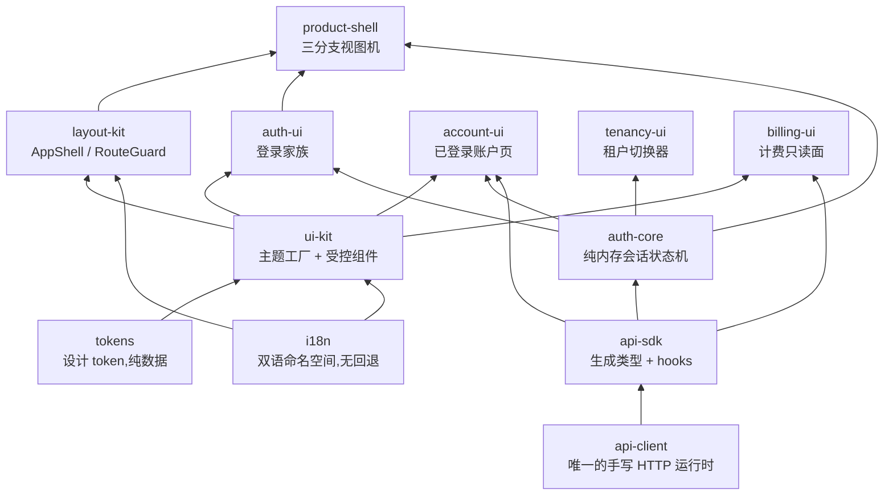

# 前端架构

speed 的后端是以库分发的模块化单体。前端是同一个决定在浏览器里
的翻版:不是一个应用,而是 `web/packages` 下十二个 `@speed/*` npm
包,由产品宿主组合进自己的应用。它们与 Go 模块共享同一个锁步版本
号,而且没有一个是拿来直接跑的应用——每一个都是以刻意收窄的契约为
边界的库。[web 包](/zh-cn/docs/user-guide/modules/web/)的使用页讲
每个包是干什么的、怎么接线;本页讲整套架构:分层为什么落在这几层、
边界为什么靠工具而非评审强制执行、各包又如何对齐 API 背后的 Go
模块。

## 包分层

边自下而上读:下方的包是上方包的依赖。按这个顺序分层:

- **与认证无关的基础。** `@speed/tokens` 是零依赖的设计 token 树;
  `@speed/i18n` 是带"无回退"缺键纪律的 react-i18next 包装;
  `@speed/ui-kit` 把 token 映射成 MUI v9 主题并交付七个受控组件;
  `@speed/layout-kit` 提供共享应用外框(`AppShell`、`RouteGuard`)。
  这些包不知道认证和租户是什么——`RouteGuard` 只吃宿主注入的
  `allowed | denied | pending` 值,不碰任何认证形态的东西。这是刻
  意的:外框与组件必须能在任何产品、任何身份方案、任何权限模型下复
  用,所以包不持立场,由宿主的组合补上。
- **唯一 HTTP 客户端。** `@speed/api-client` 是手写 HTTP 的唯一之
  家;`@speed/api-sdk` 是合并 API 文档的生成类型化面,调用经由该客
  户端。
- **会话与身份。** `@speed/auth-core` 是生成 authn 面之上的无头会
  话状态机;`auth-ui`、`account-ui` 与 `tenancy-ui` 在它之上渲染登
  录、已登录账户与租户切换三个面。
- **组装。** `@speed/product-shell` 把外框、登录家族与会话 hooks
  组合成三分支视图机(登出、已登录、会话死亡)。
- **业务只读。** `@speed/billing-ui` 渲染生成 billing 操作暴露的
  账单文档——领域只读面所遵循的形态。

## 受控组件:不取数

每个组件包遵守同一条契约:**状态经 props 流入,事件经回调流出,组
件从不取数、存数、导航或裁定租户。** 表单提交走会话操作或宿主接好
的 mutation;列表渲染宿主传入的行;`FileUploader` 渲染宿主自己的队
列状态、上报 pick/取消/重试/移除——上传传输是宿主的代码,永远不是
包代码。

理由在结构层面:包代码无法知道产品的数据流、路由或身份提供方,而这
些决定每一个都是宿主做的组合决定。只渲染给定的状态,组件在任何宿
主里都正确,包也不需要服务器就能测试。唯一的交互局部例外——比如
确认对话框的二次确认武装——在交互结束时复位。凡是生成面表达不了
的会话操作(索要 authorize URL、step-up 验证),会话以 prop 进组
件;没有一处是包自己 attach、观察或驱动会话状态的。

## 手写 HTTP 只有一个家

前端所有 HTTP 流量都是生成流量,除了一处:`@speed/api-client` 内
部——可注入的 `fetch`(构造时捕获,绝不是隐式全局)、纯内存访问令
牌存储、静默单飞 401 刷新、每请求超时、限定幂等方法的保守瞬态重
试,以及把每个失败归一成一个 `ApiError`。工作区 ESLint 规则
`speed/no-direct-http` 把"只有一个家"做成结构性事实:任何其它包
的 `src` 里出现裸 `fetch`、`window.fetch`、`XMLHttpRequest` 或
`axios`/`node-fetch` import 都是错误,`api-client` 是唯一的配置级
白名单。

规则存在是因为手写调用曾是前后端漂移的唯一入口,而靠自觉的约定活
不过截止日期——CI 强制才活得过。同样的逻辑把 `api-client` 与
`api-sdk` 分开:SDK 的生成入口每次再生成都被整体覆盖(文件头写着
DO NOT EDIT),手写运行时必须住在再生成永远够不到的独立包里。生成
代码自己不碰网络:每次调用都经包内唯一手写绑定(`bindRequestFn`)
适配,宿主启动时把自己的客户端绑定一次,last-bind-wins。一次绑定
因此给全平台每一次生成调用同一套认证、重试与错误语义——reference
app 的 web 宿主就是该组合成立的证明,它把唯一一个真实客户端绑给
了它的全部表面。完整的生成机制是
[API 契约](/zh-cn/docs/developer-docs/api-contract/)页的主题。

## 会话状态:纯内存

登录后的前端握有两种凭据,两者都刻意不进任何存储 API。访问令牌住
在调用方提供的内存 store 里,每次发送前重读,所以刷新后的重试永远
携带新令牌。刷新令牌只存在于会话闭包(`@speed/auth-core` 的会话状
态机)里:不写 `localStorage`、不写 cookie、没有 `restore`——刷新
页面即回到匿名。

为什么这么严?XSS 读得到的令牌就是 XSS 能外带走的令牌;`localStorage`
对页面上任何脚本可读,把刷新令牌放进去等于一次 XSS 换来账户的永久
钥匙。凭据留在内存里,把暴露面收窄到页面生命周期,代价是刷新即登
出——接受且刻意。这个设计也如实反映 authn API 的形态:签发响应的
响应体里携带刷新令牌、不设 refresh cookie,所以即使会话想要依赖
HttpOnly 存储也没有可依赖的对象。

会话层可观察、不可命令:hooks 经 `attachSession` 读状态机快照
(last bind wins),从不驱动它——登录登出从事件处理器发起——并且
每个 hook 在 attach 之前与登出之后都失败关闭。刷新按所持令牌单飞、
静默,并有代数守卫保证已完成的登出永远赢过其后才解析的刷新;一次
被服务端拒绝的刷新把会话在本地登出。权限检查是对宿主 attach 的按
域列表(`tenant` 与 `system`)做纯集合查找,主体验证变更时套用存活
规则。宿主 attach 是因为后端按设计没有权限下发端点:`/api/v1/authn/me`
只返回身份,rbac 不挂任何 HTTP 路由——授权完全在服务端,前端的列
表只是 UX 便利,绝不是安全边界。

同一信任模型还派生两个传输决定。**任何地方都没有租户头**:租户上
下文在访问令牌里,由服务端从令牌读出;前端对当前租户的认知只用于
命名空间化 query key(`['tenant', tenantId, ...]`)、渲染,以及作为
切租户调用的入参。切租户返回新令牌,后续每个查询自然换到新命名空
间。

## 双语文案,从不内联

用户可见文案在平台两侧遵守同一条规则:不硬编码。每个渲染文本的包
在自有命名空间下各带一份键集完全一致的 `zh-CN` 与 `en-US` 资源;
`registerNamespace` 在任何变更前校验键集一致性,而无回退纪律意味
着缺键渲染键本身并触发可见处理器——绝不渲染另一种语言的文本。工
作区的 `speed/no-literal-text` 规则拒绝包 `src` 里的内联用户文案,
后端错误码在消费包的目录里映射到双语文案,而不是由 API 下发字符串
——这与后端目录(`pkgcore/i18n`)互为镜像,那边一个模块的语言文件
键集不一致就注册失败。

## 前端包与后端的对应

前端永远看不到 Go 模块——它看到的是契约。每个带 HTTP 面的后端模
块贡献一份 OpenAPI fragment,前端只以生成类型与 react-query hooks
的形式消费合并文档(平台操作用 `@speed/api-sdk`;产品自有操作走应
用自有 SDK——分法见
[API 契约](/zh-cn/docs/developer-docs/api-contract/)页)。对应按表
面、不按包:

- **authn** 模块的操作支撑 `auth-core` 会话与
  `auth-ui`/`account-ui`/`tenancy-ui` 组件家族——见
  [authn 使用页](/zh-cn/docs/user-guide/modules/identity/authn/);
- **config** 的两个预认证端点支撑 `api-client` 无依赖主入口里的
  `fetchPublicConfig`,以及隔离 react 子路径里的 `usePublicConfig`/
  `useFeature` hooks;
- **billing** 的只读操作支撑 `billing-ui`,它把生成 hooks 渲染进组
  件树,是只读面的范式。

[搭建前端](/zh-cn/docs/user-guide/domains/frontend-building/)领域
指南覆盖组合步骤;reference app 的 web 宿主
(`examples/reference-app/web`)是全部宿主契约——命名空间、会话、
客户端、SDK 绑定、视图机——一次组合齐、并由应用自身套件钉住的地
方。

## Source

- [web/eslint-rules](https://github.com/vislake/speed/blob/main/web/eslint-rules/)——
  `no-direct-http` 与 `no-literal-text` 规则及其测试。
- [reference-app web 引导](https://github.com/vislake/speed/blob/main/examples/reference-app/web/src/main.tsx)——
  全部宿主契约的首次真实组合。
