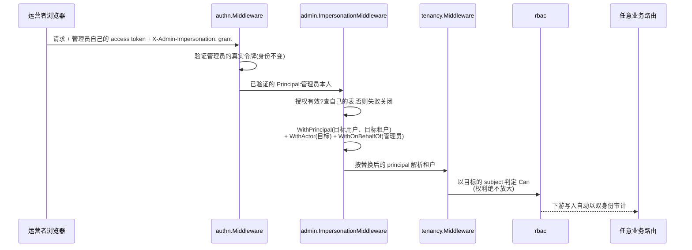

# admin

go/admin 是运营后台后端:站在每个其它模块既有能力之上的平台员工操作面。用户指南的 [admin 页](/zh-cn/docs/user-guide/modules/capabilities/admin/)讲表面;本页讲设计决策——其中最大的一条是 admin **不允许变成什么**。

## 职责与边界

**admin 不是新的数据源,而是既有能力的操作面。** 它坐在模块依赖图最顶端;没有任何模块依赖它。这个位置给它放心触达几乎所有下层模块的自由,也同时是它唯一的硬边界:**它不得引入任何其它模块为了与它共存而需要知道的新概念。** admin 需要下层模块配合的每一处,都是纯增量——可选模块、新方法——对没有装配 admin 的宿主零变化。它渲染其它模块已经维护的声明式注册表(权限、配置 schema、通知类型),从不维护第二份清单。它也不新造平台员工身份:平台运营者就是一个普通 `authn` 用户,在 rbac 的 `SystemDomain` 伪租户下持有 `RoleBinding`——员工登录、MFA 与会话全走 authn 现成机制,"谁能进后台"和任何其它 `resource:action` 一样是一条普通 `admin:*` 权限,没有特殊路径。

这个模块的外形也是本组唯一的认可例外:它直接 import 其下每个模块的具体包,而非经由结构类型化无 import 模块接口。同层模块接口的存在是为了不让兄弟模块互相耦合;admin 没有兄弟——它是其下一切的运营控制台,硬塞模块接口只会掩盖它是什么。真正成立的例外是安全那些:无跨模块外键,每次跨租户读取都走经审计的系统上下文包装加下游模块自己的既有方法。

## 租户台账:便利,绝非权威

`pkgcore.TenantID` 是不透明字符串;平台上没有任何地方回答"存在哪些租户、各是什么状态"——直到 admin 建台账。设计问题是"租户"作为一等实体该住在哪里,而诱人的答案——把它提升进概念上天然归属它的 `tenancy` 模块,一张 tenants 表、强制的创建入口、每次写入前校验存在性——以本仓库纪律使之具体的成本理由被否决:tenancy 是几乎所有模块共坐的地板,lockstep 发布下改动它意味着*每个已交付模块*都要在下一版决定要不要校验租户存在性,为的只是运营后台一个模块的展示需求,不成比例。取而代之,admin 拥有一张平台数据表 `admin_tenants`,它是**运营台账,绝非权威数据源**:其它模块继续把 `tenant_id` 当不透明字符串,没有写入会咨询台账,缺一行从不使业务写入失败。两条填充路径:事件驱动的惰性建档(admin 订阅 org 真实的根节点创建事件,租户首现即落一行 active)与运营者在任何业务数据存在之前的手工登记。台账只记录,不设卡。给它牙齿的是另一个默认关闭的机制:

**暂停经 tenancy 的可选模块生效,而不是经 admin 路由。** `tenancy.Middleware` 增加了一个 `TenantStatusResolver` 选项——结构类型化接口,默认缺席时行为零变化——admin 的 `TenantService` 是它唯一的真实实现者。宿主接一次即可;此后,解析出来但被暂停的租户在紧接的下一次请求就被编码错误拒绝,宿主中间件之后的每条非白名单路由都如此,其它模块的路由也包括在内。台账与 tenancy 共用同一套状态词汇,没有翻译层能静默误读未来的第三种状态;台账缺席的租户读作 active——台账的最终一致性滞后永远变不成假暂停。

## 模拟登录:授权凭据,绝非铸造的会话

后台最精细的能力是"看这个用户看到的东西"。诱人的实现——给目标用户铸造一对正常的 access/refresh 令牌——因三个叠加的理由被否决:这样的令牌与用户自己的令牌在任何下游都无法区分,泄露即是对该用户的完整会话劫持,而用户既看不见也无法在设备列表里下线它;它要给身份地基模块 authn 增加一个只有一家消费方需要的永久概念;它与 authn 的 refresh 轮换设计冲突——同一 refresh 令牌的并发使用按盗窃处理,管理员与目标用户并发操作会互相触发反重放逻辑。交付的机制把模拟登录当作**绑在管理员自己已验证会话上的授权凭据**:admin 自己表里的一行短时效(30 分钟、不可续)、可随时吊销的授权行,经请求头出示,而真正被验证的始终是管理员自己的访问令牌。在 `authn.Middleware` 与 `tenancy.Middleware` 之间——链路顺序永不改变——一个普通的 net/http 中间件把已验证的 principal 换成目标用户,并把真实管理员放进 `OnBehalfOf` 上下文槽位。双身份审计记录是设计另一半早已预备的:`Actor`/`OnBehalfOf` 是独立分层的上下文,dbkit 既有的自动写捕获因此无需任何修改就能产出"Actor = 被模拟用户、OnBehalfOf = 真实管理员"的行;模拟的开始与结束本身也是显式 Emit 的审计事件,审计壳可按 on-behalf-of 管理员过滤。

五条属性各有测试钉住。凭据始终是管理员自己的(只换身份,权限判定用*目标*的 subject——模拟绝不把管理员的权利放大成后门);无效、过期、已结束或他人的授权失败关闭、请求原样通过;目标不存在或在目标租户无成员身份时,在任何授权行存在之前即被拒绝;被模拟用户收到强制、不可退订的安全通知,其文案是静态的——绝不能把运营者的自由文本理由或身份泄露给被调查者;活着的授权在管理员 `admin:impersonate` 权限被撤销的那一刻结束——服务订阅 rbac 的角色撤销事件并重查权限(绝不只信事件本身,因为第二张授权角色必须让授权活下来)。

## 跨租户读取:经审计包装的循环

跨租户读取——用户检索、成员关系拼装、审计查询、发送记录、用量看板——共用同一机制:以申报目的、点名运营者的 `tenancy.WithSystemContext` 进入,然后调用下游模块**既有的按租户方法,在应用层跨相关租户循环**。审计包装在每次进入时发布 system-context-entered 事件,"运营者操作全量记录、不做读豁免"因此被焊进机制而非逐端点重写——连技术上不需要隔离逃生舱的检索也留下轨迹,因为它返回明文邮箱与电话。被否决的替代方案划出边界:给每个业务仓库加 `ListAcrossTenants` 旁路,成本随模块数线性上涨,每个旁路都是一处需要单独审查的新隔离绕过点;给 admin 单独开一条不受限的数据库连接,则正是本代码库明令禁止的裸 SQL 旁路。

同一条薄包装姿态贯穿整个面:审计壳把查询参数翻译到 `compliance.AuditQuery`,导出腿入队 jobs 任务而非在请求里同步收集;角色管理包住 `rbac.Service`(系统域作为角色管理目标被拒绝,只持 `admin:roles_manage` 的调用方无法把平台运营权委托给自己);用量看板把 `go/metering` 与 `go/billing` 的按租户读拼成一视图,自己没有任何聚合表。接线对必要性诚实:五个 `With*` 选项(`WithAuthn`、`WithOrg`、`WithCompliance`、`WithNotification`、`WithQueue`)是强制的,缺失即 装配以点名错误失败,因为这些面少了它们一个都跑不起来——`WithMetering`/`WithBilling` 可选,没有计量维度的宿主不该为启动而竖两个模块——rbac 模块接口经 装配返回之后单独的 `AttachRBAC` 调用抵达,因为 rbac 的权限目录只许在每个模块都注册完之后冻结。那次 attach 之前,模拟授权一个都生不出来;失败关闭的契约是响亮的,绝不静默降级。

## 对外稳定面

公开 API 是台账、模拟登录与检索服务、审计壳与导出腿、角色管理、用量看板与通知发送记录检索,连同它们规格生成的 HTTP 片段。看板自带一条诚实的注记:它的 API 刻意**不**冻结——还没有生产宿主接它并发现参数不够用,第一次真实集成可能还会重塑它。

## Source

- 模块纪律:[go/admin/AGENTS.md](https://github.com/vislake/speed/blob/main/go/admin/AGENTS.md)

## 相关

- [能力模块组设计](/zh-cn/docs/developer-docs/modules/capabilities/)——[compliance](/zh-cn/docs/developer-docs/modules/capabilities/compliance/) 的查询消费方
- 使用:[admin](/zh-cn/docs/user-guide/modules/capabilities/admin/)
- 地基:[总体架构](/zh-cn/docs/developer-docs/architecture/)、[设计原则](/zh-cn/docs/developer-docs/design-principles/)
