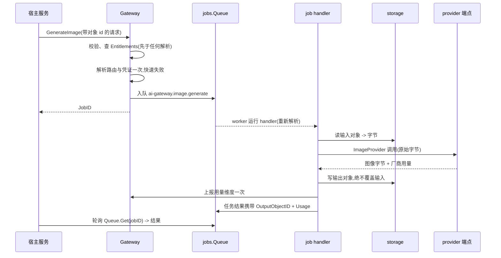

# ai-gateway

ai-gateway 是通往各家 LLM 与图像生成端点的供应商无关网关。用户指
南的 [ai-gateway 页](/zh-cn/docs/user-guide/modules/capabilities/ai-gateway/)
讲模块提供什么;本页讲它为什么长成这样。

## 职责与边界

模块是推理端点的*客户端*——它自己从不跑推理,也不交付自建推理服务(本地的 Ollama/vLLM 风格宿主以 OpenAI 兼容 provider 的配置变体抵达,因为这类宿主说同一套线上协议;哪天它偏离协议,就变成注册表里多一个注册项,接口不变)。业务代码只调 `Gateway` 门面——`Chat`、`ChatStream`、`GenerateImage`——从不触碰 provider、凭证或厂商 SDK。收费刻意不是本模块的事:ai-gateway 与 billing、metering 同层,不能 import 两者——收费的宿主通过 `go/billing` 的预扣/确认/退还生命周期包住网关调用(reference-app 的 smilesim 服务就是交付的形状),本模块的用量上报接缝被同一条边界限定在分析级。

## 抽象所有供应商,而不让抽象僵化

`ChatProvider` 是一条窄接口——`Chat` 与 `ChatStream`——`ImageProvider` 是它的三方法多模态孪生(`TextToImage`/`ImageToImage`/`Inpaint`)。防止抽象僵化的泄压阀是 `Params map[string]any`,原样透传给厂商:厂商特有选项走在 map 里,新厂商的怪癖因此永不逼出新接口方法。默认实现不需要任何厂商 SDK——`OpenAICompatibleProvider` 与它的图像孪生只用标准库 `net/http` 与 `encoding/json` 说 OpenAI 兼容线上协议,所以它们可以轻易对着 `httptest` 端点测试,也不会给消费方的 `go.sum` 增加任何第三方依赖。两个 provider 家族各有自己的 `pkgcore.SeamRegistry`,内置实现自行注册——本仓库每个基础设施接缝都用的 `database/sql` 式注册表,每次调用重新 `Build`,改过的凭证无需缓存失效即被拾取。

模型路由是构造期决策——`WithModelRoute(逻辑键, provider, 厂商模型)`——刻意不是动态 `go/config` 项:路由是宿主装配者做一次的基建组合决策,不是租户可调的运行时值;未路由的键是编码错误,绝不静默回退到可能按与调用方预期不同的费率计费的默认模型。

## 对象引用边界画在 job handler

图像统一经 storage 流转;业务代码的请求与结果形状只携带 storage 对象 id(`InputObjectID`、`OutputObjectID`),从不携带一个字节。有意思的决策是引用与字节之间的翻译发生在哪里:**在 job handler 内部,绝不在 `ImageProvider` 内部。** `ImageProvider` 自己的方法交换原始字节,因为每次任务全新解析出的 provider 来自 config 是扁平字符串 map 的注册表——装不下活着的 storage 句柄——也因为强迫每个未来的第三方 provider 内嵌自己的 storage 管道,会把简单的厂商适配器(连同它的测试)绑死在 `go/storage` 上。handler 是存储 I/O 唯一发生的地方:引用译成字节、调厂商、把结果写成新对象、上报用量。与 chat 同理:provider 交换内容,不交换存储指针。

## 按设计异步,jobs 是唯一机制

`Gateway.GenerateImage` **完全没有同步对应物**——比 chat 更严(chat 默认同步)。图像任务按设计异步:校验、查 Entitlements、把路由与凭证解析一次以对明显坏掉的配置快速失败,然后入队恰好一个 `jobs` 任务、立即返回其 id。厂商调用、存储 I/O 与用量上报全部发生在 handler 里,而 handler 重新解析路由与凭证——任务可能在与入队调用很久之后、甚至在不同的副本上执行。调用方经 `jobs.Queue.Get` 取结果,与 storage 自己的缩略图派生任务同一轮询形状——ai-gateway 不需要维护第二套任务状态系统。job handler 绝不能让厂商收两次费,所以 handler 在调厂商**之前**先占自己的任务行,并在尝试写结果之前就记录"厂商已应答";重试复用厂商先前的应答,绝不重跑调用。

## 凭证、BYOK 与 SSRF 边界

凭证住在一张仿 `go/config` 的层级表里:平台行(运营者的默认 key)与租户行(BYOK),租户覆盖下行至平台默认的解析次序,同一个空串租户哨兵。key 经宿主注册的 dbkit 序列化器加密存储——没有盲索引,因为凭证只按 `(provider, scope, tenant)` 查,从不按自身值查。平台行的写入走带审计的系统上下文包装、申报用途;读写凭证的 HTTP 面在读方向上刻意只写——GET 答 provider/scope/base URL,绝不答 key,因为任何响应都不得回显秘密。

真正的边界是 SSRF 防护。租户管理员可以把 BYOK 凭证指向任意*公网* OpenAI 兼容端点——这是刻意保留的合法能力。但平台自己的网络随后会带着租户的 key 拨这个 URL,所以租户可影响的那一层有两道检查:创建时校验(协议白名单、对照 webhook SSRF 规则同一组封锁网段做地址分类)与拨号时复核——**钉住实际连上的地址**:解析一次、拒绝被封锁的候选、按校验过的 IP 字面量拨号,绝不二次解析让 DNS rebinding 应答改道。平台层按作用域而不是按漏洞留在这两道检查之外:运营者自选的内网 LLM 网关是合法的平台默认。经 DNS 到达的拒绝永不回显解析出的地址——那会把拒绝变成内网 DNS 侦察的甲骨文。

## 结构接缝,以及为什么不可能 import

`Entitlements` 与 `UsageRecorder` 是可选、结构类型化的接缝,镜像 `billing.EntitlementsService.Check` 与 `metering.Recorder.Record` 的真实形状——两者都接线的宿主用一行闭包满足它们。接缝存在正是因为 billing 与 metering 坐在 ai-gateway **自己的层**:任何方向的 import 边都被模块边界纪律禁止——让 compliance 直接 import `go/sharing` 合法的那条同层规则(见 [compliance 页](/zh-cn/docs/developer-docs/modules/capabilities/compliance/)),正是让这两个 import 非法的规则。Entitlements 检查跑在凭证与 provider 解析**之前**,被拒的调用方永远不会被计费;用量只在成功时上报——流式响应在携带真实 token 数的终止块,绝不在流开头的投机时刻。

## 对外稳定面

模块的公开 API 是两个 provider 接口与注册表、内置的 OpenAI 兼容 provider、`Gateway.Chat`/`ChatStream`/`GenerateImage`、凭证服务与它的三操作 HTTP 面——全部由 reference-app 端到端消费(consult 走 chat,smilesim 走图像,凭证路由两者共用)。动态模型路由、写入时的 key 校验、图像任务的进度上报都是记录了理由的延后项。

## Source

- 设计:[docs/internal/08-ai-gateway.md](https://github.com/vislake/speed/blob/main/docs/internal/08-ai-gateway.md)
- 模块纪律:[go/ai-gateway/AGENTS.md](https://github.com/vislake/speed/blob/main/go/ai-gateway/AGENTS.md)

## 相关

- [能力模块组设计](/zh-cn/docs/developer-docs/modules/capabilities/)——与 [billing](/zh-cn/docs/developer-docs/modules/capabilities/billing/) 共用的那一层
- 使用:[ai-gateway](/zh-cn/docs/user-guide/modules/capabilities/ai-gateway/)
- 地基:[总体架构](/zh-cn/docs/developer-docs/architecture/)、[设计原则](/zh-cn/docs/developer-docs/design-principles/)
