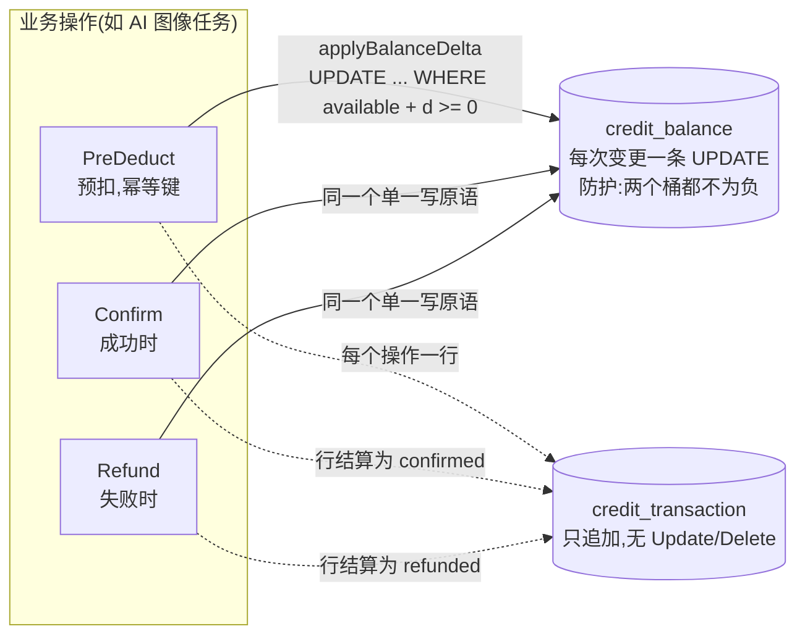

# billing

billing 是 speed 的商务模块:`Plan`/`Feature`/`Grant`/`Entitlements`
领域模型、渠道无关的 `Subscription`/`Invoice` 生命周期,以及信用账
本。用户指南的 [billing 页](/zh-cn/docs/user-guide/modules/capabilities/billing/)
讲模块提供什么;本页讲它外形背后的设计决策。

## 职责与边界

billing 决定*一个租户被允许做什么、欠什么*——它自己从不移动资金,这条边界是刻意画的。模块交付真实、可验签的支付渠道实现,但没有任何已接线的消费方拿它们打真实账户:真正的资金移动需要真实渠道凭证,库类仓库无法持有;交付一条未经证实的资金路径比不交付更糟。reference-app 真实消费 billing 的另外两半——异步 AI 仿真任务周围的信用点,以及作为每次 AI 调用判定闸门的 `Entitlements.Check`——支付网关生命周期则作为如实记录、指名道姓的缺口。billing 自己的 HTTP 面刻意只读(两个 GET):本代码库真正发生的信用消费按构造就是服务端侧的,交付一个没人调用的写端点,正是这个模块在别处拒绝的投机式提前建造。

## 两种计费模式,同一套账本纪律

设计始于一个市场现实:国内与国际支付渠道的能力不同。Stripe 支持原生周期扣款;支付宝与微信在本仓库所服务的层级没有可靠的周期扣款原语。答案不是两套领域模型——而是**一套渠道无关的 `Subscription`/`Invoice` 模型,其生命周期由纯 Go 调用驱动**,外加第二条并行模式:国内按用付费产品真正跑在它上面的信用账本。UI 永远看不到渠道。每个渠道适配器把自己的 webhook 词汇归一化成统一的 `NormalizedEvent` 形状,差异被关在接缝之内。

两条 webhook 真相塑造了支付半边。回调**不可信**:其内容只是"去主动查一次"的触发信号,金额与状态永远以主动查询渠道的结果为准。回调**不可靠**——每个渠道的重试都会重复投递,也可能永远不来。重复投递被一张以渠道自身事件 id 为键的"先插入去重"账本拒掉(处理逻辑保持可重入作为第二道防线);永不抵达的情况由一个主动轮询的 `jobs` 任务兜底,定时重查卡住的行。为什么用持久化的账本行而不是进程内已见集合?重启后的副本必须照样拒绝重复投递——"某事件已处理"的记忆是平台数据,不是进程状态。

## 支付网关接缝:镜像 pki 的 SignerRegistry

`PaymentGateway` 与 `PaymentGatewayRegistry` 住在 billing 的**根包**,三个真实实现住在 `go/billing/gateway/{stripe,alipay,wechat}` 叶子子包——与 `go/pki` 的 `Signer`/`SignerRegistry` 拆分完全同形,理由也相同。单向规则是绝对的:网关子包可以 import billing 根包,反向永远不行。调用方只依赖接口与注册表,不 import 任何 provider;provider 从自己的 `init()` 注册,宿主空白导入自己想要的哪一家。只有 import 了 provider SDK 的那个叶子为此付依赖成本——隔离穿透 `go.mod`/`go.sum`(本仓库子包规则的计量成本纪律),depguard 再把每家 SDK 限制在各自的叶子,`stripe-go` 既进不了 `gateway/alipay`,也进不了根包。为什么接口放根包而不放子包?接缝若在 `gateway` 之下,billing 自己的领域代码为了指名它就得 import `gateway`——这正是让 `stripe.Subscription` 一类渠道类型随时间渗入领域模型的边。"渠道只是收款执行者"靠这个拆分强制执行,不是包装上的讲究。

## 信用账本:预扣、确认、退还

可能失败的按用付费需要两阶段模式:干活前预扣,成功确认,失败退还——否则每个项目都要自己实现,而且很容易漏掉退还那一半。账本是 `credit_balance`(每租户的 available 与 reserved 两个桶)加一张只追加的 `credit_transaction` 流水,每一行都是可对账的事实。只追加仓库只暴露 `Insert`/`Get`/`ListByTenant`,刻意**没有 `Update`/`Delete` 方法**——与 dbkit 审计账本同形,因为内嵌 `dbkit.Repository[T]` 会把金融账本绝不能有的可写性提升上来。

并发是账本的核心问题,答案是让 Go 层的读改写彻底出局:每次余额变更都汇入同一个 `applyBalanceDelta`——一条数据库仲裁的 `UPDATE`,WHERE 子句在同一条语句里护住两个桶都不为负。两条并发扣减由数据库自身的行锁串行化;后到者看到先到者已落地的变更,防护条件针对先变更后的值求值。纯可移植 SQL,SQLite 与 PostgreSQL 行为一致——没有方言特有的原子原语,没有进程锁。一句话设计规则:**余额由数据库仲裁;应用永不与它赛跑。**幂等补全这个模式:预扣在调用方强制的幂等键下铸造,重试的 `PreDeduct` 读回自己早先的行而不是二次扣减(插入走 `ON CONFLICT DO NOTHING`——唯一键冲突错误会毒化 PostgreSQL 上打开的事务,这个分歧只有真实 PostgreSQL 层能暴露,这正是 billing 带一个集成层的原因)。

## Entitlements:唯一的判定入口

`Entitlements.Check(ctx, featureKey, requested)` 是业务代码调用的唯一闸门——没有模块自己读订阅表或自行计算额度。Boolean 特性("该租户能不能用模型 X")与配额特性("本周期几次")共用同一机制,按模型访问闸门因此不需要第二套开关系统。配额判定读**实时计数器**,绝不读汇总表——聚合延迟会让超额请求漏过去。计数器经窄小的 `UsageReader` 接口抵达(billing 从不 import metering;两者同层,结构接缝是唯一合法的连接),配额检查没有接 reader 时以编码的配置错误失败关闭——绝不 panic,绝不猜测额度,否则超额租户会失败开放。一个存储形状值得单独说明:`Plan` 刻意不实现 `dbkit.TenantScoped`,因为一张表背着两张脸——平台级行(每个租户的查找都会回退到它)与租户定制行(只许一个租户看见)。没有任何单一数据域能力横跨两面;表格采纳 `go/config` 的现成答案(空串租户哨兵、由 store 自身签名强制隔离、以 `AssertNotTenantScoped` 为证),按 key 解析的读是 store 带护的两次查找。

## 取舍,记录在案而非藏起来

三处缺席都是刻意并写明理由的。信用点过期的*清扫任务*不交付——`CreditService.Expire` 存在,带键、可安全重试,但哪些点数何时过期是账本数据模型锚不住的产品策略,所以清扫是 `jobs` 宿主自己的决定。实时 webhook *接收*不挂载——验签、归一化与去重都已交付并测试;入站端点与它要驱动的状态迁移不交付,因为没有调用方能证明它们。`Register` 声明**零个 config 项**:没有任何已交付代码路径读旋钮,给没有代码路径挂靠的 schema 声明声明正是本仓库以先例拒绝的投机模式。

## 对外稳定面

模块的公开 API 是领域类型、`Entitlements.Check`、`CreditService` 的 `Grant`/`PreDeduct`/`Confirm`/`Refund`/`Expire`/`Balance`/`Transactions`、`PaymentGateway` 接缝与注册表,以及只读 HTTP 片段——reference-app 与审计轨迹钉住的表面。不冻结的是还没有真实调用方的部分:支付网关生命周期与配额/`UsageReader` 判定路径仍是预发布形状,第一次真实生产集成可能还会重塑它们。

## Source

- 模块纪律:[go/billing/AGENTS.md](https://github.com/vislake/speed/blob/main/go/billing/AGENTS.md)、[go/billing/gateway/AGENTS.md](https://github.com/vislake/speed/blob/main/go/billing/gateway/AGENTS.md)

## 相关

- [能力模块组设计](/zh-cn/docs/developer-docs/modules/capabilities/)与[同层接缝纪律](/zh-cn/docs/developer-docs/modules/capabilities/ai-gateway/)的模块设计主线
- 使用:[billing](/zh-cn/docs/user-guide/modules/capabilities/billing/)、[ai-gateway](/zh-cn/docs/user-guide/modules/capabilities/ai-gateway/)
- 地基:[总体架构](/zh-cn/docs/developer-docs/architecture/)、[设计原则](/zh-cn/docs/developer-docs/design-principles/)
