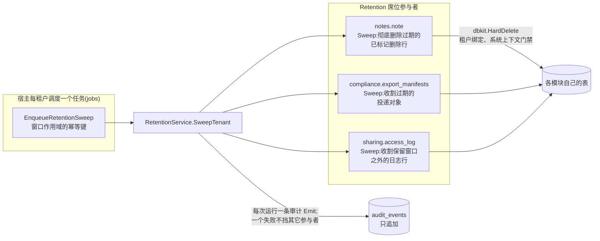

# compliance

go/compliance 是 speed 的治理层:保留期清扫、被遗忘权编排、数据导出的收集与投递、只读审计检索。用户指南的 [compliance 页](/zh-cn/docs/user-guide/modules/capabilities/compliance/)讲表面;本页讲模块为什么长成这样。

## 职责与边界

compliance **不发明任何机制**——它编排已经存在的机制。它造成的每次物理删除都经业务模块自己的 `dbkit.Repository[T].HardDelete` 运行,而 HardDelete 在 `go/dbkit` 里就是租户绑定、系统上下文门禁的(标记删除与彻底删除是 dbkit 的机制,不是本模块的);它产生的每条审计记录都走 `go/dbkit/audit` 的 `Emit`;连审计表上的数据库级只追加强制都是 `dbkit/audit` 自己迁移集里的一对触发器,因为表住在哪里,强制就住在哪里。模块没有 HTTP 面,也没有自己的调度——它是宿主驱动的 Go 级 API,通常由宿主经 `EnqueueRetentionSweep` 入队的 `jobs` 任务驱动。刻意缺席并记录在案:审计轨迹上的可选哈希链(没有消费方要它)、按时间分区归档(它点名的前提——只追加强制——已经就位,归档本身只是没有建造),以及一张 compliance 自有的擦除请求/清扫运行日志表。

## 为什么 compliance 不拥有任何表

模块的 `Migrations()` 返回空 `embed.FS` 是按设计的,而且值得讲清理由,因为它看起来像疏漏。每次编排运行的持久记录已经存在:每次 `SweepTenant`/`Erase`/`Export` 都以恰好一次 `dbkit/audit.Emit` 收尾,携带逐参与者的明细——一条只追加、可查询、带租户归属的记录。第二张 compliance 自有的表只会重复它。重试状态也不需要自己的行:参与者的回调契约性地幂等,重跑一次被打断的操作即收敛到完成——没有多步状态机需要持久化。`dbkit.MigrationRegistry` 也把空集明文记为合法而非降级。持久记录绝不可以携带的是失败参与者的原始错误文本——那段文本可能点名擦除行动要消灭的主体本身,而 `audit_events` 是唯一删不掉任何东西的表——所以审计记录与投递的清单只记分类(参与者名对 "failed" 标记),绝不记错误文本;文本住在返回的进程内结果 map 与被脱敏的失败点日志里,那是它的两个合法归宿。

## 组装座席:不改变模块契约的横切机制

compliance 对下层模块做的唯一改动,是在 `pkgcore` 上新增一个 registrar:`Retention` 席位,连同 `RetentionParticipant`(一个名字加三个回调——`Sweep`、`Erase`、`Export`,各自可选,只是既无 Sweep 也无 Erase 的参与者没有意义)与擦除所取的 `SubjectRef` 类型。`ComponentRegistry` 结构存在的意义,就是新增横切机制不必改动模块契约——在 lockstep 版本化下动那个契约会一次打破所有模块。参与者由拥有它们的业务模块注册(reference-app 的 notes 模块是真实那一个),compliance 自己的代码从不 import、也从不直接查询业务模块的表:每个回调调用自己的 `dbkit.Repository[T]` 方法。只注册保留与擦除、不注册导出的参与者,声明 `Export` 为 nil 即可——只想要清扫与擦除、永不做导出投递的宿主,连 `SharingCreator` 都不用接。

## 跨独立事务的部分失败

`SweepTenant`、`Erase`、`Export` 各调 N 个独立注册的参与者,各自有仓库,分布式部署下各自有连接——N 个参与者的删除无法合成一个跨模块事务(与禁止跨模块外键同一条推理)。一致的策略:一个参与者失败绝不挡其它参与者;失败按参与者名字逐一记录;操作仍然审计自己,明细齐全;只要有任何参与者失败,方法就返回一个特定编码的部分失败错误——只查 `err != nil` 的调用方也必须知道有事需要处理,绝不能把部分通过误当干净通过;恢复方式是重试而非回滚——幂等回调收敛剩余参与者,不重处理已经成功的事。计数在失败面前两个方向都存活:先彻底删了行再失败的参与者照样上报数字,不可逆操作的代价在审计记录里绝不低报。

`Erase` 的租户边界在任何事发生之前就强制:ctx 无租户即拒绝;`SubjectRef` 指名的租户与 ctx 携带的租户不同,在任何参与者运行之前即拒绝——这道门让"带着一条合规审计记录去彻底删除别家租户的行"成为不可能,跨租户不可擦除性质用同一个主体 id 在两个租户里证明。`Export` 是镜像:它从不进入系统上下文,因为每个参与者的导出回调读的就是 ctx 已限定的同一个租户。

## AuditQuery:过滤在应用层,并且诚实

审计读 API 有两个合法归宿——compliance 自有的新类型,或对 `dbkit/audit` 本身的补充——而后者自己的文档注释已把富查询 API 指派给 compliance。`AuditQuery` 因此不给 `audit.Repository` 加任何方法;它握住既有的导出读方法,在 Go 里过滤结果。这是一个真实的、写明了的取舍:一次查询取回租户列表会返回的每一行,再在内存里过滤——没有下推的 `WHERE actor = ?`,大轨迹的租户每次查询付 O(它的全部行)。为什么接受?机制留在单一处,诚实的代价写在调用点(跨租户查询点名自己的租户列表,代价可见而非藏起来),替代方案是为只有本模块消费方用的查询语言膨胀 dbkit 的面。有一个维度专为模拟登录问责而存在:`OnBehalfOf`——管理员在模拟期间的记录上永远不以 `Actor` 出现,只会按 actor 过滤的查询会让每个管理员各自的模拟行不可查,而"只能被写、永不能被查"的属性对问责来说等于不存在。admin 模块的审计壳(见 [admin 页](/zh-cn/docs/developer-docs/modules/capabilities/admin/))是这面的真实消费方。

## 导出:收集、落盘、经 sharing 投递

`ExportService.Export` 把每个参与者的数据收进一份清单,经 ObjectStore 接缝落盘,再经 `SharingCreator`——通常是真实的 `go/sharing.Service`——铸成一份 **24 小时、单次浏览、无密码**的分享。直接 import `go/sharing` 是让依赖图规则显形的架构对照:compliance 坐在 sharing *之上*,import 边合法——约束 billing 与 ai-gateway 的同层无 import 规则在这两者之间不适用,`SharingCreator` 接口是为测试隔离而存在,不是为躲开 import。投递形状经过斟酌:一个租户的完整数据是沉重的包裹,窗口取小时级而非 sharing 通用性的 30 天;单次浏览的 256 位令牌本身已是凭据,密码——需要单独投递渠道给收件人——只添活动部件,不加安全。导出以 `Sensitive: true` 创建,sharing 自己的敏感资源审计动作因此与 compliance 的请求与投递记录并行触发:一次完成的导出留下两条审计轨迹,各归事实发生处的属主。

## 对外稳定面

公开 API 是 `RetentionService`(`SweepTenant`、`SweepAllTenants`、`EnqueueRetentionSweep`)、`ErasureService.Erase`、`ExportService.Export`、`AuditQuery.Query`/`QueryAcrossTenants`/`Get`,以及纯函数 `RenderAuditReport`——加上它贡献给 `pkgcore` 的 registrar。reference-app 的 notes 参与者与它排定的保留清扫真实地驱动整个模块;尚未被消费的部分(`RenderAuditReport` 的报告字节)被直言点出,附可编译运行的示例作为补偿义务。

## Source

- 模块纪律:[go/compliance/AGENTS.md](https://github.com/vislake/speed/blob/main/go/compliance/AGENTS.md)

## 相关

- [能力模块组设计](/zh-cn/docs/developer-docs/modules/capabilities/)——[sharing](/zh-cn/docs/developer-docs/modules/capabilities/sharing/) 的投递消费方、[admin](/zh-cn/docs/developer-docs/modules/capabilities/admin/) 的查询消费方
- 使用:[compliance](/zh-cn/docs/user-guide/modules/capabilities/compliance/)
- 地基:[总体架构](/zh-cn/docs/developer-docs/architecture/)、[设计原则](/zh-cn/docs/developer-docs/design-principles/)
