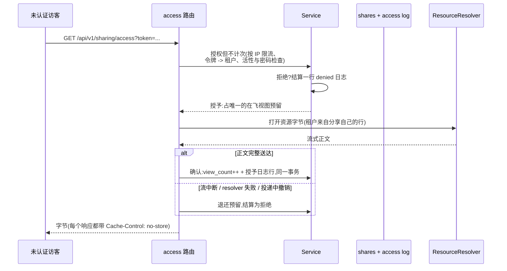

# sharing

go/sharing 实现公开分享链接:让平台从未认证过的外部访客,经由一个
受控入口查看一件内部资源——病人看自己的仿真结果、客户看一份报
告。用户指南的 [sharing 页](/zh-cn/docs/user-guide/modules/capabilities/sharing/)
讲模块的面;本页讲它为什么长成这样。

## 职责与边界

模块的工作刻意很窄:把一个承载令牌解析成一件资源,再把字节交给平台从未认证过的访客。其余都是别人的事。sharing 自己没有任何资源字节——`ResourceResolver` 接缝(结构类型化、无 import,因为 resolver 通常是宿主自己的 `go/storage` 组合)把已授权的分享变成真正的内容。它不造通用的敏感度分类器——创建调用只是声明 `Sensitive: true` 或不声明。它不渲染浏览器密码页——路由经请求头收密码,收集密码是宿主前端的展示层工作。它也无法强制"绝不能放在 CDN 后面"——撤销静默失效的头号常见原因——只能让路由能产生的每个响应都带上 `Cache-Control: no-store`,它在每条写路径的第一动作就这么做,参数绑定错误应答也不例外。

## 五条强制规则,每条都附为什么

设计文档固定了五条规则,每条都由一个通过的测试钉在代码里,而非交给约定:

1. **令牌密码学随机,至少 128 位。** 模块从 `crypto/rand` 取 256 位——令牌是对平台从未认证其持有者的资源的凭据。
2. **没有链接永生。** nil 过期解析为租户配置的默认值(未配置时为 30 天);显式请求永不失效的链接被直接拒绝;显式日期被钳在封顶之内,`9999-12-31` 无法走私"实际上永不失效"。租户配置的默认只能**抬高**生效封顶——宿主自己的策略被原样尊重,绝不暗中削低。
3. **撤销在紧接的下一次访问检查即生效。** `Access` 每次调用都从数据库重读该行;模块内没有任何分享状态的缓存。配合 no-store 头,这才是 revoke 之所以是真的。
4. **每次访问都有日志。** 对已知分享的每次授予*与*拒绝都结算一行访问日志(含结果与访客元数据),且日志写入不是尽力而为:轨迹未提交的访问以失败告终,绝不装作已处理——"已授予却没有轨迹"正是这条规则要堵的洞。
5. **表面不泄露任何关于租户的信息。** 未知令牌、已撤销、已过期、次数耗尽、密码缺失或错误,全部答同一个外观一致的 `ErrNotAccessible`——authn 对账号枚举施加的存在性披露抑制,原样施加到分享枚举上。

两项存储决策值得一提。模块只存令牌的 **SHA-256 哈希**——泄露的数据库备份换不来任何可用链接(与 org 邀请令牌同一推理)。分享密码由一个小型自足 argon2id 哈希器处理,而不是为这一个函数 import `go/authn`:authn 在依赖图上方好几层、表面很重,为一个哈希函数把它拉进来违反"计量依赖成本"的纪律。

## 服务未认证访客:从令牌解析租户

`AccessPublic` 是真正未认证的入口——ctx 根本不含租户。设计问题:没有租户的调用方怎么做租户域查询?答案是刻意窄小的平台数据表,把令牌哈希映射到所属租户;租户在**任何租户域查询之前**就从令牌解析出来、挂到 ctx 上,然后原样重进普通 `Access` 路径。为什么不用带审计的系统上下文逃生舱?它的扩权白名单点名 admin、compliance、jobs 与 authn——sharing 不在名单上,在 sharing 内部再造第二个临时逃生舱正是那条规则要防止的失控蔓延。为什么不用绕过租户过滤的裸 SQL 查找?旁路入口被明令禁止,且 GORM 租户插件在无租户 ctx 上按正确设计失败关闭。平台数据索引表干脆绕开冲突——**在知道租户之前就必须可解析的东西,自己就不能是租户域数据**,与 authn 的 `users` 表完全同款处理。这张表只有两列(哈希、租户),只回答一个问题;关于分享的每个其它事实仍然来自租户域行。

由于匿名面重进 `Access`,五条规则对匿名调用方全部成立,无需第二条需要手工同步的代码路径——错猜预算(见下)是那条匿名面自己的计费引入的、唯一如实记录在案的应答差异。

## 视图在投递时消耗,绝不在授权时

对进程内调用方,授权*就是*授予——决定与内容易手之间不会有东西失败。对 HTTP 服务,流可能半途死掉,所以路由跑一个镜像信用账本预扣/确认/退还的三段协议:授权后的服务先占分享的唯一在飞预留,投递正文,直到完整内容到达访客才在一次事务里提交浏览计数与授予日志行。每个不投递的服务形态——resolver 失败、流中断——都结算为拒绝,不消耗视图,所以 `MaxViews=1` 的分享经得起一次坏掉的首访,留给真正的重试。投递中途死掉的分享(已撤销、已过期)在数据库层拒绝确认,结算为拒绝。双向保证:**没投出去的字节永不花掉视图;投出去的字节绝不免费送出。** 在预留与结算之间崩溃的服务留下过期预留,30 分钟超时后被推定中断,由下一次访问或过期清扫的常规轮次收敛——任何比超时年轻的预留都绝不被自动收敛。

两道面向滥用的限流补全图景:前奏里的按 IP 检查(在令牌解析之前)与匿名面上的按令牌错猜预算——**判定之后**才计费,泄露链接的持有者无法耗尽合法密码持有者的预算。预算花完的 429 是与统一拒绝不同的、已识别令牌路径的应答差异——它披露令牌存在、分享有密码保护——如实记录,连同接受它的理由:与错误凭据无法区分的预算无法为它要拖慢的猜谜者定步。

## 对外稳定面

公开 API 是 `Service.Create`/`Access`/`AccessPublic`/`Revoke`/`Get`/`List`/`ListAccessLog`、清扫入口、两个 HTTP 面(真正公开的 access 路由与五个属主操作),以及模块自己的过期策略常量。它的一项配置项与访问日志的保留参与把模块连向治理数据的模块——reference-app 端到端消费两个 HTTP 面;compliance 的导出投递(见 [compliance 页](/zh-cn/docs/developer-docs/modules/capabilities/compliance/))是 `Create` 的第二个真实消费方,把自己的 24 小时投递窗口钳在 sharing 的封顶之内。

## Source

- 设计:[docs/internal/07-platform-services.md](https://github.com/vislake/speed/blob/main/docs/internal/07-platform-services.md)(sharing 一节)、[10-compliance-and-audit.md](https://github.com/vislake/speed/blob/main/docs/internal/10-compliance-and-audit.md)
- 模块纪律:[go/sharing/AGENTS.md](https://github.com/vislake/speed/blob/main/go/sharing/AGENTS.md)

## 相关

- [能力模块组设计](/zh-cn/docs/developer-docs/modules/capabilities/)——过期策略的消费方在 [compliance](/zh-cn/docs/developer-docs/modules/capabilities/compliance/)
- 使用:[sharing](/zh-cn/docs/user-guide/modules/capabilities/sharing/)
- 地基:[总体架构](/zh-cn/docs/developer-docs/architecture/)、[设计原则](/zh-cn/docs/developer-docs/design-principles/)
