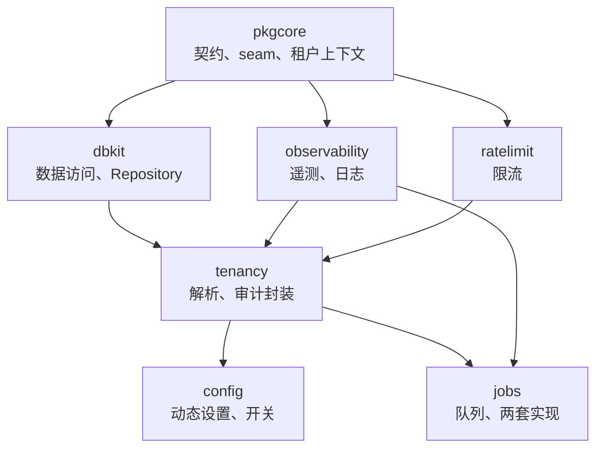

# core 组——设计

core 组的七个模块是每个 speed 二进制的依赖地板。分工,每模块一句话:

- **pkgcore**——装配契约(`Module`/`Registry`/`Kernel`)、带 N 套实现与能力声明的基础设施 seam 接口、租户上下文原语、结构化错误与消息目录。不 import 任何其它 speed 模块。
- **dbkit**——双方言数据访问层:安全包裹的 `Open`、带标记删除与门禁硬删除语义的强制泛型 `Repository[T]`、迁移聚合、字段级加密与盲索引。在上下文已携带租户之后执行租户隔离。
- **tenancy**——隔离的输入侧:决定请求携带哪个租户(解析中间件)、系统上下文逃生舱的带审计封装,以及每个仓储必须运行的隔离断言套件。
- **observability**——导出器选择是一个选项的 OpenTelemetry 装配、默认开启脱敏的上下文感知结构化日志器、标签有界的 HTTP 埋点。
- **config**——基于数据库、schema 先行的动态设置与功能开关存储,值可热改、热生效。
- **jobs**——异步任务队列契约,配两套实现:`StandaloneQueue`(SQLite 为底、进程内)与 `queue/asynq`(Redis 为底),共同满足一套冻结的 `Queue`/`Task`/`Job`/`Handler` 形态。
- **ratelimit**——以 KVStore 为底的共享限流器,一次一维;纯库,不实现任何模块契约。

## core 模块的两种形态

七个模块分两种形态,认清形态就知道怎么用:

- **内核组装的模块**——`config` 与 `jobs`(以及 core 之上的每个模块)实现 `pkgcore.Module`,经一次 `Register` 调用贡献路由、配置 schema、权限、事件与任务处理器,由内核组装。`config` 还需要在引导完成后调它的 `Attach`,因为它的 schema 是从注册表*合并*声明折出的。
- **直接使用、不经内核**——`tenancy` 的中间件守 HTTP 入口,`observability.Init` 在进程启动时跑,`jobs` 队列由宿主构造并启动(队列 seam 刻意没有内核座位),`ratelimit` 是无物可注册的纯库。

## 贯穿全组的三个设计线索

三个想法反复出现在这七页,因为它们就发源于这片地板:

- **打包追随依赖解析。** Go 按包解析依赖,所以实现永不与接口同包:dbkit 的方言驱动、observability 的导出器、jobs 的 Redis 队列各居子包,消费者只为 import 的东西付账。付的是实测代价,不是断言。
- **接口按最弱实现设计。** `KVStore` 不暴露 Redis 专属能力,`Repository[T]` 把"不存在"与"不是你的"折叠成一个答案,队列契约是两种部署形态的交集。锚点是已注册实现中最弱的那个,不是"standalone 那个"。
- **fail-closed 是默认姿态。** 上下文无租户——拒绝读取;解析失败且路由不在白名单——拒绝请求;状态源不可达——拒绝,绝不"假定正常"。每个逃生舱都存在,但显眼、受限、留痕。

以下各页讲各自模块拥有什么、拒绝拥有什么及其原因、形态背后的取舍、一张图呈现的关键机制,以及冻结给消费者的面。按依赖序阅读:[pkgcore](/zh-cn/docs/developer-docs/modules/core/pkgcore/)、[dbkit](/zh-cn/docs/developer-docs/modules/core/dbkit/)、[tenancy](/zh-cn/docs/developer-docs/modules/core/tenancy/)、[observability](/zh-cn/docs/developer-docs/modules/core/observability/)、[config](/zh-cn/docs/developer-docs/modules/core/config/)、[jobs](/zh-cn/docs/developer-docs/modules/core/jobs/)、[ratelimit](/zh-cn/docs/developer-docs/modules/core/ratelimit/)。

本页的用户指南对应物是 [core 模块使用指南](/zh-cn/docs/user-guide/modules/core/),从消费者一侧看同样的七个模块。
