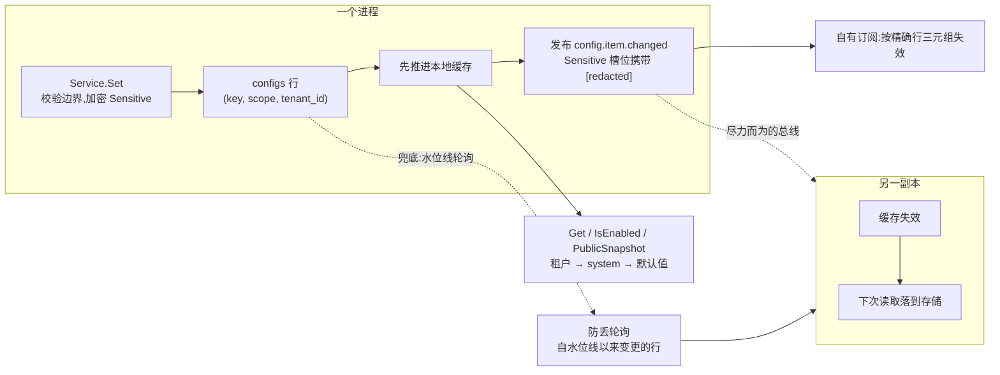

# config:可热生效的动态配置

config 拥有 speed 的运行时配置层:基于数据库、schema 先行的设置存储,值可在运行期修改并热生效——功能开关、租户品牌项、默认限额、AI 模型默认参数。其作用域模型有三层(`system` → `tenant` → `user`,末层预留未实现),读取从具体层向宽层回退;它也拥有运行时的功能开关:模块在 pkgcore 的注册表上声明开关,本模块把声明折进自己的 schema、运行期走开关依赖链、并把启用清单提供给前端。它是常开模块之一,没有关闭选项。

## 职责与边界

- **引导解析不是本模块的事。** 如何够到基础设施——DSN、地址、部署模式、组装 preset、主密钥——在进程启动时一次性决定:键声明在 `pkgcore` 的 bootstrap 席位、由通用加载器 `pkgcore/config` 解析(独立的零依赖包,本模块绝不能 import);声明键材料的派生约定——每个键路径一个 purpose 串(`pkgcore.BootstrapKeyPurpose`),配合 `dbkit.DeriveKey`——也在席位与工具箱侧。混两者会掉进"数据库连接串存在数据库里"的鸡生蛋死结:引导值按定义运行期不可变;动态值存在的意义恰恰是被改。
- **不渲染任何内容。** `Locales()` 返回空 embed.FS;端点每个面向用户字符串都是结构化错误码。双语目录渲染内容,不渲染 schema——条目描述是代码里的英文散文,如实记录为局限。
- **模块不是自己规则的消费者。** "被禁功能答 404 而非 403""被禁开关跳过路由注册与后台任务、绝不跳过迁移"由消费开关的模块执行,不由本模块——它只回答什么被启用,别无其它。
- **租户解析被委托。** pre-auth 端点咨询宿主接线的 `tenancy.Resolver`;域名到租户的映射属于 tenancy 一侧。
- **持久审计行只经可选的 compliance 模块存在。** 本模块每次写入的记录就是变更事件本身;它从不写审计行。

## 设计:声明与冻结是两个分离的步骤

模块的接线拆成两步,拆分本身承重。**Register** 声明永远不需要已组装注册表的东西——审计 purpose、两条路由路径、变更事件、审计动作。**Attach** 只在所有模块都注册完之后(即 `Kernel.Bootstrap` 返回之后)发生,因为服务的 schema 是从注册表的*合并*条目与开关声明折出来的——别的模块拥有的条目是它的头等公民,schema 不可能在注册完成前存在。Attach 要求注册不能碰的东西:已迁移的 `*gorm.DB`;只要有任一注册条目是 `Sensitive` 就必须有 cipher(否则 `ErrCipherRequired`——没有密钥的宿主读写这类值必然泄露);以及轮询间隔。它带幂等守卫(`ErrAlreadyAttached`),服务在 Register 与 Attach 之间的窗口回答 `config.service_not_attached` 而非空指针崩溃——宿主接线 bug 以编码错误浮现,绝不崩。

Schema 先行让这个存储可以被安全地管理:每个条目声明类型、默认值、边界、`Sensitive`/`Public` 位、说明与分组,声明时校验自相矛盾,Attach 时校验只有全注册表才看得见的问题——跨模块重复键、开关依赖普通条目、开关成环。三个红利:管理面可以按 schema 渲染表单而非逐条目写页面;写入经范围校验;文档自动生成。

## 设计:作用域层级,以及行为什么是平台数据

一个值恰居一个作用域层,以三元组 `(key, scope, tenant_id)` 寻址——表的主键,system 层以空字符串租户哨兵存储。读取窄到宽:租户层、system 层、再到 schema 默认值。无租户上下文从不查租户层。各层的写入资格由服务——而非调用方或 HTTP 层——强制:租户写归属上下文租户,绝不归属调用方提供的 id;system 写要求带审计的系统上下文。`configs` 表因此是平台数据,刻意永不 `TenantScoped`——租户过滤会让每个租户回退都要读的 system 层不可见——由 `AssertNotTenantScoped` 证明,是"形如租户数据的表"中记录在案的例外。

## 设计:Sensitive 项止步于模块边界

`Sensitive` 条目在存储前以宿主的 `dbkit.Cipher` 封存;明文只存在于服务缓存与有资格的 `Get` 响应里。在一切明文本会越过的边界,它被替换成稳定的 `[redacted]` 标记:变更事件负载(两个取值槽都放标记——明文绝不跨出模块)、`Watch` 投递、日志与错误。`Public` 与 `Sensitive` 由声明校验互斥,pre-auth 端点按构造不可能泄露敏感值——少了一类要审的泄露。

## 设计:热更新是事件加防丢轮询

`Set` 写入行,**先**推进进程自己的缓存、再发布变更事件,事件携带 key、scope、租户、actor 与旧值→新值(Sensitive 项脱敏)。事件同时是本模块对写入时刻的声明式审计记录——它携带合规记录需要的一切——发布失败不回滚写入:行与本地缓存都已推进,`Set` 报 `ErrAuditPublishFailed`,把审计当强制的宿主可以自行反应。

订阅者与对等实例经本模块对事件的订阅保持缓存一致——按精确行三元组失效,绝不全量冲刷——**外加**一个有界兜底:防丢轮询。因为一条事件丢失会让副本一直服务陈旧配置直到下一次写入碰巧落地,每个进程按宿主选择的间隔(默认 30 秒;单实例宿主可设 0 关闭)轮询自其水位线以来变更的行;水位线查询是含端点的(`>=`),扫掠期间写入的行保证被下一轮看见。周期性全量缓存对账把歪斜写者时钟本可造成的永久陈旧压缩成有界值(虽不能消除),缓存突变代际守卫关闭读透回填的竞态(读者的写前值绝不可能在取代它的写入之后落入缓存)。分层形态是刻意的:事件给即时性,轮询给收敛,对账给有界的最坏情况。

## 取舍与"为什么"

- **动态值进表、引导值进 loader**——这一分离保证"我该连哪个数据库"在任何数据库存在之前就可回答;两者永不共用机制。
- **变更事件就是审计记录**——模块不依赖审计消费者存在;谁订阅谁就拿到谁、何时、何事、旧→新。代价如实记录:未组装 compliance 消费者的宿主,必须把发布失败自行当作可行动信号。
- **pre-auth 端点回退平台默认、绝不报错**——未匹配的 Host、失败的解析器或根本没有解析器都以 200 读默认值,因为登录页渲染不出来才是最糟的失败模式;单个未设置或不可解码的条目从公开快照中省略,而非拖着端点为所有租户宕掉。
- **`user` 层被拒绝而非半建**(`ErrUserScopeUnavailable`)——第三层需要自己的存储、解析与资格设计,不是往校验清单加一行。
- **线上契约归片段,逐键层仍手写**——两个端点由 `api/openapi.yaml` 声明(`config_getPublicConfig` / `config_getSystemFeatures`),它生成的操作为主消费面;但公开配置 body 只能记成动态键映射,`@speed/api-client` 的类型化封装因此保留为逐键映射层,而不是被生成取代。

## 对外的稳定面

Register/Attach 接缝(`ErrAlreadyAttached`/`ErrCipherRequired`/`ErrServiceNotAttached`)、`Service` 的读写面(`Get`/`GetTyped`/`Set`/`Watch`/`IsEnabled`/`EnabledFlags`/`PublicSnapshot`/`Refresh`/`Close`)、作用域词汇及其资格、`ConfigItem`/`FeatureFlag` 声明契约、导出的 `PathPublic`/`PathSystemFeatures` 常量、两个端点的 OpenAPI 片段(`api/openapi.yaml`)、其生成的 `api.ServerInterface` 与两个端点的响应形态、`config.item.changed` 事件形态,以及 `config.*` 错误码族。

## Source

- 模块纪律:[go/config/AGENTS.md](https://github.com/vislake/speed/blob/main/go/config/AGENTS.md)

## 相关页

- [总体架构](/zh-cn/docs/developer-docs/architecture/)——本模块 Register/Attach 拆分所挂的装配契约
- core 组:[pkgcore](/zh-cn/docs/developer-docs/modules/core/pkgcore/)、[dbkit](/zh-cn/docs/developer-docs/modules/core/dbkit/)、[tenancy](/zh-cn/docs/developer-docs/modules/core/tenancy/)
- 使用视角:[用户指南中的 config](/zh-cn/docs/user-guide/modules/core/config/)
