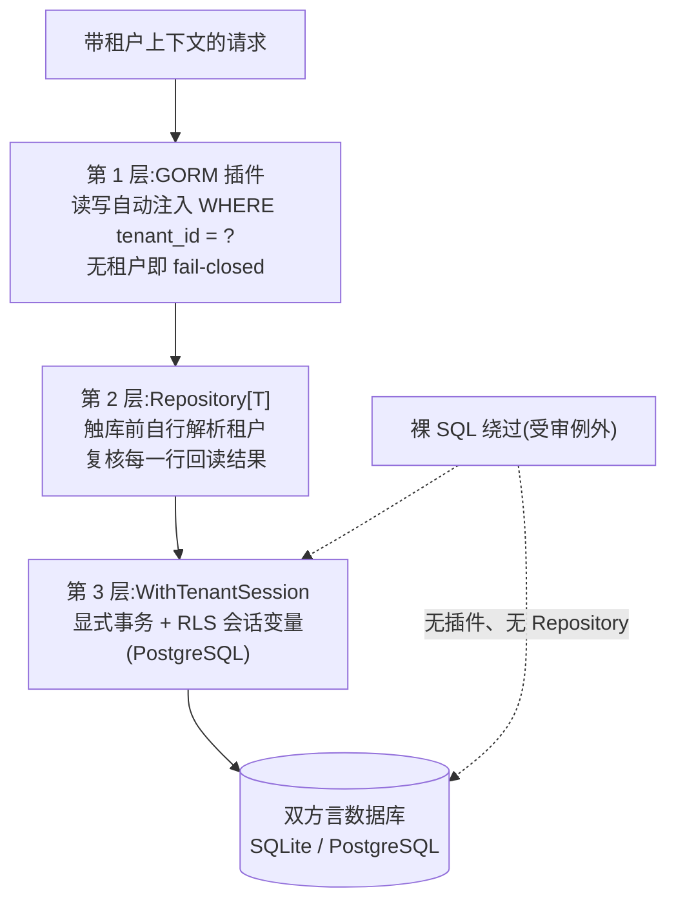

# dbkit:内置隔离的双方言数据访问层

dbkit 是 speed 的数据访问层:取得 `*gorm.DB` 的唯一合法入口(`Open`)、每个业务模块仓储必须组合(embed)而非手握裸连接的强制泛型 `Repository[T]`、聚合各模块版本化 SQL 迁移的 `MigrationRegistry`,以及 schema 需要的密码学设施——字段级 AES-256-GCM 加密、让加密字段可按精确匹配查询的 HMAC 盲索引、以及让宿主只管理一个根密钥而非每列一个密钥的 HKDF 派生(`DeriveKey`)。它紧贴 pkgcore 之上,实现三道强制租户隔离层的全部 Go 侧接线。

## 职责与边界

dbkit 在**上下文已经携带租户之后**执行隔离。决定上下文带哪个租户属于 tenancy;验签属于 authn。边界清单是显式的:

- **不能 import tenancy,也不能 import observability。** 依赖图是 `pkgcore -> dbkit -> tenancy`;tenancy 自己依赖 dbkit(用它的 `Repository[T]` 与 `TenantScoped`),反向 import 即成环;observability 因同样的自底向上理由不可达。因此 dbkit 直调 `pkgcore.MustTenantFromContext`,并关掉 GORM 的查询日志而不是接进结构化日志。
- **`Repository[T]` 刻意最小**:`List` 不带过滤与分页——只有增/按 id 读/改/删/全列。真实查询形态属于上层模块,建在插件保护的 `*gorm.DB` 之上。
- **dbkit 不做授权。** `HardDelete` 的系统上下文门禁只查存在性——谁有资格持有系统上下文是调用侧白名单(admin、compliance、jobs、authn),在包外执行。
- **第三层依赖的 PostgreSQL 角色与 RLS 策略是部署侧职责**,本包假定其存在而不负责创建。
- **身份数据与平台数据被结构性排除在 `Repository[T]` 之外**——其泛型约束要求 `TenantScoped`,而这两个分域*不许*实现它。这类模块直接使用 `Open` 返回的裸 `*gorm.DB`,这是安全的而非漏洞:隔离插件忽略一切未实现 `TenantScoped` 的模型。

## 设计:为什么是三道相互独立的隔离层

"忘了按租户过滤"被当作安全缺陷而非风格问题——所以绝不只靠一种机制。三层刻意相互独立,即便下层缺失、配错或被绕过,各自依然成立:

1. **GORM 插件**——`Open` 在每条返回的连接上自动安装,因此不存在"碰巧未受保护"的 `*gorm.DB`。对实现 `TenantScoped` 的模型,它在读侧注入 `WHERE tenant_id = ?`(查询与行两条回调链都注册,`db.Model(&M{}).Scan(&dtos)` 这类投影形态同样被覆盖),在每次 create 时强制 `tenant_id` 列——覆盖调用方填进结构体的任何值——上下文无租户时以 `ErrMissingTenantContext` fail-closed。
2. **强制泛型 `Repository[T]`**——在触库*之前*自行从上下文解析租户,不信任第 1 层会拦住缺租户的调用。它对每行回读结果复核租户,同样 fail-closed。其检查独立完备:即便对一个没有插件的连接它也正确执行隔离——这正是它自己的单元测试的运行方式。每个方法还经由 `WithTenantSession` 走真实调用,那是承载第 3 层的通道。
3. **PostgreSQL 行级安全**——受限角色加按事务会话变量(`app.current_tenant`)键控的策略,由数据库本身在 Go 层之下强制:即便第 1、2 层都被裸 SQL 绕过,兜底依然成立。

每层为不同的失败负责:插件让常规路径天然安全;Repository 让必经路径即便面对坏连接也独立安全;RLS 让蓄意绕过也在数据库失败。第 3 层的接线是 `WithTenantSession`——每个 `Repository[T]` 方法的真实数据库调用都经它路由;显式事务是真实、被接受的代价,换来的是"第 3 层经由唯一合法的数据访问路径可达",而不是只有记得手动调它的代码才受保护。(其 GUC 设置步骤是 `set_config(...)` 函数调用而非 `SET LOCAL`:PostgreSQL 的 `SET` 语法不接受绑定参数作值,已对真实服务器证实。)

## 设计:为什么 Repository 是泛型且强制的

租户数据业务仓储组合 `dbkit.Repository[T]` 而非手握 `*gorm.DB`——隔离设计的核心手段。三个性质使它成为正确的手段:

- **租户不可伪造。** `Create` 无条件用上下文租户覆盖模型的 `TenantID`,调用方填什么都没用;想靠填结构体把行插进别的租户是不可能的。
- **失败被折叠,这本身就是隔离性质。** `FindByID`/`Update`/`Delete` 对"无此 id"与"此 id 属别的租户"一律回 `ErrRecordNotFound`,刻意不可区分——把差异暴露出来本身就是跨租户信息泄露。
- **读取 fail-closed。** 上下文无租户即 `pkgcore.ErrNoTenant`,发生在触库之前——这正是每个 worker 陷阱所警告的形态:任务处理器必须显式重建租户上下文,否则仓储直接拒绝。

## 设计:删除语义是两个阶段,不是一个开关

两个都成立却互相冲突的真实需求:手滑删错要能找回;合规要求某些删除不可逆——"删了但还在"不算数。一个 `Delete` 同时扛两种含义两头不讨好,dbkit 因此把生命周期拆开:

- **标记删除是按模型显式声明的可选能力**(`SoftDeletable`:模型携带 `DeletedAt`/`DeletedBy`)。实现它的 `T` 的 `Delete` 落地为一次 UPDATE,被只读自动 scope 从普通查询中隐藏——未选入的模型 `Delete` 行为逐字节不变。`Restore` 恰好撤销那次标记。
- **彻底删除是独立、受限的入口,不是参数。** `HardDelete` 是真正的物理 DELETE,门禁只查系统上下文的存在性——普通租户上下文在触库前即被拒绝;租户本身仍然强制且绑定:系统上下文绝不顶替租户,也绝不把删除越出 ctx 租户的行。门禁冗长醒目的命名沿 `WithSystemContext` 的命名原则——不可逆操作不该经一个随手可打的调用触达。

软删行仍是真实、明文存在的行(在 SQLite——standalone 方言——上隐藏*完全*是 Go 层性质,因为那里没有 RLS);只有硬删除才让数据真正消失。这正是软删文档拒绝让任何面向调用方的表述暗示"软删即满足被遗忘权"的原因。

## 设计:加密是数据层设施,配盲索引

加密必须在第一条敏感记录落库之前就位——它是数据层能力,不是合规模块的附件。打上 GORM serializer 标签的字段以 32 字节密钥用 AES-256-GCM 封存(每次调用全新随机 nonce,轮换经退役密钥链)。但加密字段无法查询,而手机号与邮箱*就是*登录标识:答案是盲索引——一个独立、明文、带索引的列,存 `HMAC-SHA256(key, normalize(value))`。按构造只支持等值:确定性索引只能精确匹配,前缀或模糊检索会泄露加密本想隐藏的结构。查询两侧被绑进同一个 `BlindIndexer`(列、密钥、归一化器),写与查不可能漂成不同的规范形;内置归一化器就是设计承诺的规范形——手机号 E.164、邮箱小写。加密密钥与盲索引密钥绝不能是同一字节;`DeriveKey`(HKDF、按 purpose 打标)是宿主用"一个根密钥"而非"每列一个密钥"来满足该规则的途径。

## 取舍与"为什么"

- **选 GORM,不选 ent 或 sqlc。** ent 指望单一 schema graph 做代码生成,与独立模块演化相克(下游给 `User` 加字段几乎不可能);sqlc 要按方言各写一套查询文件,给不出通用 `Repository[T]`。GORM 是纯 struct + tag,下游直接嵌入组合、无生成流水线——而它的回调机制正是让租户过滤注入成为可能的抓手。
- **双方言约束是硬规则而非偏好**——ID 应用层生成(绝不用 `gen_random_uuid()`)、JSON 用 `datatypes.JSON`(绝不用 JSONB 操作符)、禁原生数组、不写 `NOW()`,迁移是 Atlas 从 GORM 模型生成的按方言版本化 SQL,生产禁用 `AutoMigrate`(不可审计、不可回滚)。两个方言驱动住在各自子包(`dialect/sqlite`、`dialect/postgres`),按 `database/sql` 式注册表登记——消费者 import 需要的那个,只背一套驱动的依赖闭包。
- **裸 SQL 是带兜底的受审例外。** 插件无法拦截 `db.Raw`/`db.Exec`——逃生舱为报表与批量查询存在,必须显式绑定租户,合法形态是把语句放进 `WithTenantSession` 的 `fn`,让第 3 层兜住手写 WHERE 的差错。
- **错误折叠且不回显值。** `ErrDecryptionFailed` 刻意不区分密钥错误与数据被篡改;采集与校验路径绝不把敏感值回显进 params、日志或响应。

## 对外的稳定面

`Open`/`Options`(连接池限额刻意不可覆盖)、`TenantScoped`/`TenantModel`/`SoftDeletable`/`Auditable` 标记契约、`Repository[T]` 的语义(fail-closed、折叠的 not-found、按能力分流的 `Delete`、`Restore`、带门禁的 `HardDelete`)、`WithTenantSession`、`MigrationRegistry`、`Cipher`/`BlindIndexer`/`DeriveKey` 契约、`dbkit.*` 错误码族,以及每个模型必须遵守的字段名约定(导出 `ID`/`TenantID` 字符串字段)。

## Source

- 模块纪律:[go/dbkit/AGENTS.md](https://github.com/vislake/speed/blob/main/go/dbkit/AGENTS.md)

## 相关页

- [设计原则](/zh-cn/docs/developer-docs/design-principles/)——本页设计所执行的隔离规则
- core 组:[pkgcore](/zh-cn/docs/developer-docs/modules/core/pkgcore/)、[tenancy](/zh-cn/docs/developer-docs/modules/core/tenancy/)、[config](/zh-cn/docs/developer-docs/modules/core/config/)、[jobs](/zh-cn/docs/developer-docs/modules/core/jobs/)
- 使用视角:[用户指南中的 dbkit](/zh-cn/docs/user-guide/modules/core/dbkit/)
