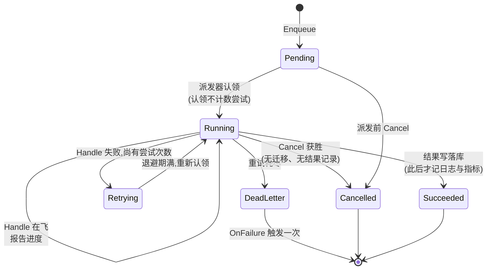

# jobs:一套异步契约,两种部署形态

jobs 是 speed 的异步任务队列:每种部署模式都实现同一套 `Queue`/`Task`/`Job`/`Handler` 契约,配两套实现——`StandaloneQueue`,standalone 模式以 SQLite 持久任务表为底的进程内 worker 池;`queue/asynq` 的 `Queue`,分布式模式的 Redis 实现。一切需要异步运行东西的模块——storage 的派生生成、notification 的投递、billing 的账单、AI 生成任务、webhook 投递——都坐在这个契约上。最重要的设计事实是:`Handler` 永远不知道自己跑在哪套实现之下。

## 职责与边界

- **没有业务逻辑,也没有业务补偿。** 队列对失败补偿的全部涉入就是 `FailureHook` 这个面:重试耗尽后需要退钱(如退回信用点预留)的处理器实现 `OnFailure`。两套实现都不特判任何任务类型,也不知道"退钱"是什么意思。
- **队列不在契约之外自行决定重试策略形态**——`MaxRetries`、超时、延迟、优先级都是逐次入队的选项;standalone 侧的退避算式与分布式侧 asynq 自己的公式实现的是同一套记录在案的重试语义。
- **`jobRecord` 是平台数据,永不 `TenantScoped`。** standalone 派发器的认领查询一次扫描*跨全部租户*的合格任务——按租户轮询交错以执行公平与逐租户并发上限——这是 `dbkit.Repository[T]` 服务不了、其泛型约束也不会编译通过的访问形态。租户仍是真实、带索引的列,由逐租户闸门与 `Get`/`Cancel` 的访问检查显式读取。
- **`StandaloneQueue` 不自造 `*gorm.DB`**——调用方从 `dbkit.Open` 传入一个,本模块从不调 `dbkit.Open`,也不 import `dbkit.Repository[T]`。
- **队列没有声明席位**——没有任何东西向它声明;它是一个普通组件(`queue.standalone`,分布式组合里是 `queue.asynq`),像任何组件一样由组合选择,这正是下面的打包决策重要的原因。
- **没有 asynqmon,没有从死信重新入队的 API**——如实记录的局限,不是沉默的缺口。

## 设计:为什么租户上下文在每个 worker 内部重建

这是整个包围绕的陷阱:`Enqueue` 调用与最终的 `Handle` 调用跑在完全不同的上下文上,可能相隔数分钟或数小时——入队时的 `context.Context` 从未被持久化,因为上下文无法持久化。worker 若天真地使用自己周边的上下文,就会在错误——或没有——的租户下执行业务,handler 里任何 `dbkit.Repository[T]` 调用都会 fail-closed。设计靠构造而非约定关闭它:

- **`Task` 自带 `TenantID` 字段,必填非空。** 与 HTTP handler 不同,`Enqueue` 合法地来自没有单一周边租户的地方——平台级调度器循环为每个租户入队一条清理任务。`pkgcore.Event.TenantID` 出于同一理由长成同一形状。
- **每套实现只有一个挂租户的点。** standalone 侧 `jobContext(tenant)` 在 `context.Background()` 之上构建 handler 上下文——刻意不从派发器生命周期派生,关闭队列绝不取消在飞的 `Handle`。分布式侧租户骑在 asynq 的 `Task.Headers` 里(绝不在 payload 里,payload 必须保持调用方自己的不透明字节),`processTask` 把它重建到 asynq 自己构造的逐次尝试上下文上——这正是让 asynq 自己的超时强制与取消能触达真实 `Handle` 调用的原因。
- **证明非同义反复**:两套实现都被端到端测试——任务从一个完全不带租户的上下文入队,由做真实仓储调用的 handler 执行——测试通过只能由 worker 自己的重建解释。

## 设计:两套实现、一个契约——以及 Redis 那套为什么是子包

两套实现满足同一冻结形态——`Queue`(`Enqueue`/`Get`/`Cancel`)、`Task`、`Job`、`Handler`、`EnqueueOption` 及其默认值逐字共享。宿主需要的额外方法(`RegisterHandler`/`Start`/`Close`/`DeadLetterJobs`)住在可移植接口之外、各具体类型之上。两种模式真实有别之处,差异被如实记录而非糊过去:standalone 的 SQLite 行永久保留,分布式任务对 `Get()` 的可见性受 asynq 保留窗口约束;`Cancel` 在 standalone 侧不抢占在飞 handler,分布式侧尽力而为地打断;优先级在 standalone 侧是连续排序、分布式侧折成三队列;`FailureHook` 在 standalone 侧于死信持久化之后触发、分布式侧在 asynq 归档写之前触发——hook 调用本身在两侧都是"已永久失败"的唯一信号。

打包是可移植契约里承重的一半:`asynq.Queue` 住在自己的 `queue/asynq` 子包,因为 Go 按包解析依赖——若它坐在根包,每个消费者——包括只跑 standalone 模式的——都得在自己的 go.mod 里背 asynq、go-redis 及其传递闭包。拆分靠实测而非断言:只消费 `StandaloneQueue` 的消费者的 go.mod 彻底失去 asynq、robfig/cron、spf13/cast 与 x/time。实现永不与接口同包——depguard 规则只豁免子包,业务文件伸手够 SDK 立刻挂 lint。

分布式半边通篇遵守"配置而非重造"规则:asynq 自己的重试/归档机制、退避公式、超时强制与 `ResultWriter` 进度通道照原样使用;需要薄层的地方都是有意为之的映射。薄层恰好存在于 asynq 原生机制表达不了契约之处:租户 header;逐租户并发闸门(asynq 没有任何按 key 的并发语义——快速弹回配 `IsFailure` 报 false,被节流的任务永不烧重试预算);幂等认领 key(asynq 自己的 TaskID 去重按队列作用域,同一 key 不同优先级的两次入队会造出两个任务);取消标记(`DeleteTask` 会毁掉 `Get()` 的可见性契约——改为标记加读不到标记即 fail-closed 的派发前检查);以及每次入队必设的 `Retention`(不设则 asynq 在成功瞬间删掉任务记录,`Get()` 直接坏掉)。

standalone 侧的生命周期刻意两阶段:派发时刻认领把行翻成 `running`,但尝试只在 worker 交接时才*计数*——已认领未开始的任务对 `Get()` 诚实报告,认领到交接窗口里的崩溃从不消耗一次从未跑过的尝试。单写者闸门(`queue_writers` 注册配心跳陈旧时刻)是崩溃恢复安全的前提:只有闸门证明无活写者残留后,`Start` 才把中断的 `running` 行重置回 `pending`——两个写者绝不可能双重执行一行被握在手中的任务。结果写携带属主 token 于 WHERE 子句,每条结果的日志与指标只在条件写报告真实迁移之后触发——每次尝试恰有一条真实记录。

## 取舍与"为什么"

- **SQLite 进程内 vs Redis 上的 asynq,永无模式分支**——宿主在构造时选实现;业务代码两者都不持有。进程内形态兼任契约套件(`queuetest.AssertConforms` 对两套都跑)的测试替身。
- **成熟库而非手造 Redis 队列**——asynq 自带重试、延迟、调度与归档机制,不值得重造;代价(按队列的去重作用域、无按 key 并发、记录寿命)由上面那层薄薄的记录在案层支付,而非付在队列机制上。
- **逐租户公平是两个机制**——候选选择按租户轮询交错(泛滥租户永远填不满整个认领窗口),并发闸门按租户准入;各自关闭对方关不掉的口子。分布式侧只需要第二个,因为 asynq 自己的出队没有可交错的批次。
- **失败钩子触发,队列自己从不补偿**——hook 没有更多表面,边界由此被强制。

## 对外的稳定面

可移植契约——`Queue`、`Task`(自带 `TenantID`、幂等键语义)、`Job`、`Handler`/`FailureHook`、`EnqueueOption` 与默认值(`DefaultMaxRetries`/`DefaultTimeout`)——两套实现逐字一致;错误族(`jobs.job_not_found`/`jobs.invalid_task`/`jobs.duplicate_handler_type`/`jobs.handler_not_registered`/`jobs.queue_writer_active`)两侧共享。每套实现的构造选项与生命周期(`Start`/`Close` 语义、fail-closed 取消规则)属于各自稳定面的一部分。

## Source

- 模块纪律:[go/jobs/AGENTS.md](https://github.com/vislake/speed/blob/main/go/jobs/AGENTS.md)

## 相关页

- [总体架构](/zh-cn/docs/developer-docs/architecture/)与[设计原则](/zh-cn/docs/developer-docs/design-principles/)——本页落实的打包与异步纪律
- core 组:[pkgcore](/zh-cn/docs/developer-docs/modules/core/pkgcore/)、[dbkit](/zh-cn/docs/developer-docs/modules/core/dbkit/)、[tenancy](/zh-cn/docs/developer-docs/modules/core/tenancy/)
- 使用视角:[用户指南中的 jobs](/zh-cn/docs/user-guide/modules/core/jobs/)
