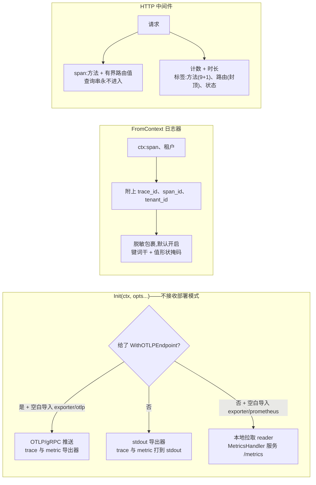

# observability:遥测接线、上下文日志、有界的指标

observability 是三类可观测信号的基座:`Init` 装配 OpenTelemetry 的 `TracerProvider` 与 `MeterProvider` 并装成进程全局——每个模块自己的 `otel.Tracer`/`otel.Meter` 调用都能触达;`FromContext` 提供上下文感知的结构化日志器;HTTP `Middleware` 开启请求 span 并记录请求计数/时长指标。它提供接线,不提供内容:各领域的必埋指标(队列积压、outbox 滞后、投递率)属于拥有那些领域的模块,而每个模块都已在自己包路径上埋了自己的那一行。

## 职责与边界

- **不拥有任何领域指标。** 设计文档的逐领域必埋表是各归属模块的义务;本包绝不为它们投机地预先建设埋点。
- **`Init` 不接收部署模式。** 导出器选择只由一个选项决定——是否给了 `WithOTLPEndpoint`——因为导出器选择是实现组装问题,绝不是模式问题:指向真实 Collector 的单进程组装与多副本部署一样用 OTLP 导出器。
- **日志消息本身从不被扫描,API 响应是另一套机制。** 脱敏的边界在属性层——明文 PII 与完整 prompt 两类被如实记录为类级缺口:它们的命名空间随业务代码增长,没有任何值形状能把它们与普通标识符分开;这两类里什么算敏感由调用方声明。
- **根包不背导出器 SDK。** 两个导出器族各居子包,空白导入以取 `init` 副作用——`database/sql` 驱动模式,每类 seam 一个注册槽,因为本包每类恰好只有一套内置实现。只做日志的消费者永不继承 gRPC/protobuf 或 Prometheus 依赖树;depguard 规则只豁免所属子包,把任一 SDK import 回根包的改动会立刻挂 lint。

## 设计:为什么日志来自上下文、脱敏无条件开启

日志是给机器查询的,不是给人读故事的:拼接出来的一句话既无法过滤、无法聚合,也无法接回它的 trace。`FromContext` 因此是请求或任务作用域代码取得日志器的唯一合法途径——日志器来自上下文,绝不在请求路径里新建——它从活动 span 附上 `trace_id` + `span_id`、从上下文附上 `tenant_id`,各自独立可选,让一行日志携带整条关联链。消息是常量字符串,一切变量进入全栈统一的 snake_case 属性。

脱敏包裹 `FromContext` 返回的每个日志器,**默认开启且调用侧无法逐次关闭**——层位于调用方与宿主插入的任何 sink 之间。两条规则在属性层生效。键匹配:键含敏感词干(`token`、`secret`、`password`、`authorization`、`credential`、`key`……)的属性整值替换——过度脱敏只费噪音,脱敏不足费的是泄露,所以词干刻意从严,配词界规则保住 `prompt_tokens` 这类合法诊断字段与 `key_id` 这类关联字段(永不脱敏)的可读性。值形状:字符串被扫描凭据形状——`Bearer`/`Basic` 头、JWT、厂商前缀密钥、URL 查询参数里的秘密——命中区域就地掩码,`provider auth failed ... with Bearer [REDACTED]` 这类报错保持可读。日志消息永不扫描、非 error 结构体值从不内省:该层是凭据类的兜底,局限如实记录而非糊过去。

span 通道靠*构造*而非第二遍脱敏保持干净:查询串——凭据所在——永不变 span 名或属性;span 的路由属性与名字携带指标侧的有界路由值,绝不携带把租户与资源 id 带进追踪后端的原始路径。非法 UTF-8 字节——net/http 照收、却会让整批 OTLP 导出的 proto3 marshal 失败——在任何标签或属性成形前被替换。

## 设计:攻击者够得到的每个指标标签都有界

硬规则是 `tenant_id` 永不当指标标签——租户上千即百万级时间序列,Prometheus 的典型事故源;租户维度属于 span 属性与日志字段,它们对高基数容忍得多。但请求指标另外三个标签中有两个的输入是未认证调用方原样控制的,因此在喂给 instrument 之前各自设了同样的界:

- **路由标签**取自 `URL.Path`(mux 自己的 `Pattern` 在这一层不可见——而且 pre-auth 404/403 照样能到达本层),于是限位器最多跟踪 `MaxRouteLabelValues` 个不同值、把每个值截到 `MaxRouteLabelLength` 字节(按 UTF-8 边界)、净化非法字节,超出的折叠进一个固定哨兵。宿主在装配期用真实路由表喂限位器(`RegisterMountedRoutes`),启动期垃圾无法在真实路由被请求前就把它们折叠进溢出桶。
- **方法标签**经纯集合匹配折叠进九个标准 HTTP 方法加一个固定溢出值——完全不保留攻击者的 token,该维度以常量内存封顶。

有界路由值同时是 span 上的披露上界:trace 也是数据保护规则的出口,所以 span 的路由属性与名字共用指标侧的有界值。中间件按固定链序装在 `tenancy.Middleware` *之外*——这正是其所在层还不知道租户的原因:`AnnotateTenant` 作为独立函数存在,由解析出租户后的 handler 调用,因为 span 不像普通 context 值,它活得过链条的上下文分叉。

## 取舍与"为什么"

- **导出器子包而非模式参数**——`Init` 签名不收部署模式,错误组装根本无从表达;遥测是否出进程由选项决定,未空白导入的导出器以点名该 import 的错误失败(`/metrics` 则点名它的 404)——`database/sql` 式代价被接受。
- **脱敏无退出开关**——逐次关闭开关正是安全规则要铲除的走火口;代价(键仅"含有"词干的良性字段丢值)是被接受的噪音,不是缺陷。
- **全局 Provider 而非逐层传递**——OTel 的全局 `SetTracerProvider`/`SetMeterProvider` 让每个模块能裸调 `otel.Meter` 埋点、让日志器的 span 查找免上下文;`Init` 可重复调用,先拆除前一对 Provider,重复初始化不会泄漏导出器。
- **用宿主路由表喂路由限位器**——这是熔断器而非精度修复:折叠在挂载前缀粒度,同一挂载下的不同模板共用一个标签。这是在缺少真实路由捕获机制时为基数设界所接受的代价。

## 对外的稳定面

`Init` + `Config`/`Option`、`MetricsHandler`、两个注册槽(`RegisterOTLPExporters`/`RegisterLocalMetricsReader`)、`FromContext`/`WithLogger` 日志契约及其脱敏行为、`Middleware`/`AnnotateTenant`/`RegisterMountedRoutes` 与导出的界(`MaxRouteLabelValues`、`MaxRouteLabelLength`、溢出哨兵)、全栈统一的 snake_case 属性键,以及 `tenant_id` 永不当指标标签的规则。

## Source

- 设计:[docs/internal/09-observability.md](https://github.com/vislake/speed/blob/main/docs/internal/09-observability.md)(技术栈选择、结构化日志规则、必埋指标表、高基数规则)、[03-deployment-modes.md](https://github.com/vislake/speed/blob/main/docs/internal/03-deployment-modes.md)(导出器拆分)
- 模块纪律:[go/observability/AGENTS.md](https://github.com/vislake/speed/blob/main/go/observability/AGENTS.md)

## 相关页

- [设计原则](/zh-cn/docs/developer-docs/design-principles/)——本页设计所执行的日志与安全规则
- core 组:[pkgcore](/zh-cn/docs/developer-docs/modules/core/pkgcore/)、[jobs](/zh-cn/docs/developer-docs/modules/core/jobs/)
- 使用视角:[用户指南中的 observability](/zh-cn/docs/user-guide/modules/core/observability/)
