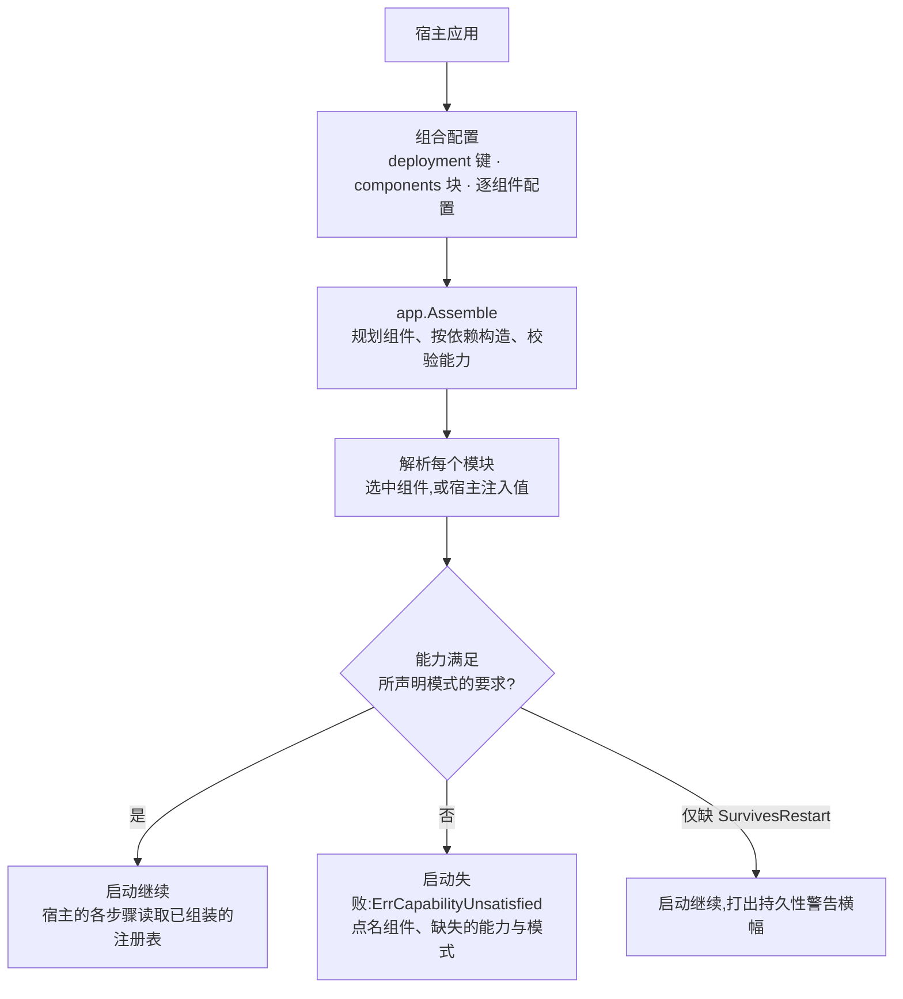

# pkgcore:装配契约与依赖底座

pkgcore 是所有 Go 模块共同 import、却不 import 任何其它 speed 模块的依赖底座。它只拥有七件事:模块/组件装配契约、租户上下文原语、基础设施模块接口(`KVStore`/`EventBus`/`Mailer`/`ObjectStore`)及各自进程内或纯标准库实现、装配借以解析与校验组合的能力/组件注册表机制、合并后的后端消息目录、`DeploymentMode` 枚举,以及每个模块的强制一致性测试套件。其余由三个子包(`apperr`、`config`、`i18n`)与一族实现子包(Redis、PostgreSQL、NATS、S3、Memcached 支撑的实现)承载。

## 职责与边界

底座定义契约、解析基础设施,不实现任何业务行为。边界清单是显式的:

- **不做数据库访问**(dbkit)、**不做 SQL 层租户强制**(tenancy)、**不做日志与追踪**(observability)、**不做运行期配置**(config *模块*)、**不执行任务**(jobs)。模块只声明,何时运行由装配决定。
- **不 import 任何其它 speed 模块**——dbkit 不行,observability 也不行(哪怕结构化日志再诱人);底座不能依赖其上的任何东西。这正是 `Component.Migrations` 是裸 `embed.FS` 而非 dbkit 类型、pkgcore 自己的日志调用直用 `log/slog` 的原因。
- **根包零第三方依赖**。子包需要的一切(go-redis、pgx、nats.go、minio-go、gomemcache)都藏在各自子包的构造函数后面,任何 SDK 类型都不跨模块接口。
- **SMS 传输经组合解析,不设注册表**:`sms.console` 与 `sms.http` 是产物为 `SMSSender` 模块的组件,消费组件把它声明为要求——notification 要求一个,authn 取它为可选——传输因此和其他一切一样跟随组件选择。
- **模块契约刻意止于裸字节**:预签名 URL、对象元数据、EXIF 剥离、MIME 探测与保留期都属于 `go/storage`——该契约的第一个真实消费者。预签名是只有 S3 支撑的实现能满足的能力,而接口按较弱的一方设计,不能长出它。

## 设计:装配契约为什么是单一 `Register` 调用

每个模块随附一个 `Component` 描述符——名字、七个生命周期回调、`Requires`/`Provides` 契约令牌与资产 embed(迁移、语言包、OpenAPI 片段)——把自己拥有的一切——路由、配置 schema、功能开关、权限、任务处理器、通知类型、事件、审计动作——经一次 `Register(reg *pkgcore.ComponentRegistry)` 声明体注册出去,由描述符的 `Init` 回调执行。声明面就是该注册表上的十个注册座席,每种机制一个。

**为什么一个声明体而不是八个?** 锁步版本下,改描述符契约就是一次同时打破所有模块的破坏性变更。新增一类横切机制变成声明面上的一个新座席——一个座席访问器加上它背后的注册器;既有模块不改、不重编译。声明面的存在正是为了"加机制永不改描述符契约"——模块资产(迁移、语言包、OpenAPI 片段)随模块代码一起 embed、版本与资产永不脱节,出于同一理由。

注册是声明式的,声明在别处兑现:权限清单喂给运营后台的角色配置面,配置与开关 schema 喂给自动生成的配置文档,通知类型喂给用户侧偏好矩阵。注册期规则由这个形状推出:注册期间不做 I/O(只声明,何时运行由装配定);不依赖注册顺序(`Requires`/`Provides` 令牌声明,装配的计划排序构造并拒绝环);不吞注册器错误(重复 key 是跨模块的 bug,不是合并)。

## 设计:部署模式与实现组装

两条轴被严格保持正交,pkgcore 正是落实这一区分的地方。**部署模式**声明拓扑——跑几个副本,因此每个模块的实现必须具备哪些能力。**实现组装**决定每个模块实际用哪套实现。模式从不选择实现,只约束实现。让这一分离成立的典型反例:单进程部署对接真实 SMTP、真实 S3、真实支付网关,是小客户安装的常规生产形态;而分布式部署照样可以在联调环境挂 Mailpit 与支付沙箱。

机制:每套实现声明自己能做什么(`MultiReplicaSafe`、`SurvivesRestart`、`Stateless`——第三个位是后加的,让 console 邮件器这类无状态实现免于一条对它而言不指称任何损失的"重启丢失"警告横幅——外加 go/pki 的 `Signer` 实现经自己的注册表声明的 `KeyNeverLeavesBoundary`,装配的能力校验刻意不与它作比较),每种模式声明自己要求什么(分布式要求所有承载共享状态的模块都 `MultiReplicaSafe`,单进程不要求任何能力),装配的 Prepare 阶段是唯一逐组件比较两集合的地方。无法在声明模式下运行的组装在启动时失败,报 `ErrCapabilityUnsatisfied`,点名组件、缺失的能力位与模式——刻意不是一族按模式硬编码的哨兵,因为实现一旦有 N 套,"缺少分布式实现"这种说法本身就不成立。仅缺 `SurvivesRestart` 时是启动横幅而非失败:操作者必须确切知道哪些数据不跨重启存活。

组合由配置组装,而非模式参数:组合配置在 `components` 块下列出二进制选择的组件(每组件一项,`nil` 选中、`false` 剔除)并携带 `deployment` 键;`app.Assemble` 随后驱动整条八阶段生命周期。两个设计后果由此而来。其一,框架不预设"生产""测试"之类组合——哪组组装算生产是应用组装者的判断,`deployment` 键默认 standalone。其二,业务代码根本拿不到模式值,"业务逻辑里不许 `if mode == standalone`"这条纪律靠"无物可分支"来执行。

## 设计:实现像 `database/sql` 驱动一样注册

每个基础设施接口有 N 套实现,N ≥ 1——从不是固定的两套。一个二进制包含哪些实现由应用组装者决定,打包方式追随 Go 按包解析依赖的特性:每套实现住在自己的子包里,经自己的 `init()` 在包级全局注册上自注册为组件(`kv.redis`、`eventbus.postgres`、`objectstore.s3`……);进程内内置实现以同样方式由根包登记(`kv.memory`、`eventbus.memory`、`mailer.console`、`mailer.smtp`、`objectstore.local`)。provider 实现一路都是组件:ai-gateway 的 chat 与 image provider、billing 的支付网关、pki 的签名器各自携带描述符、由组合选中,经与每个基础设施组件相同的装配解析。组合选中某分布式实现的前提是宿主的二进制 import 了对应子包——空白导入足矣——否则装配以 `ErrUnknownComponent` 拒绝该选择,点名组件并列出已注册的组件:这是 `database/sql` 式交易中被接受的代价,编译期错误变成启动期错误,而报错信息会指名"缺的那行 import"。

捆绑全部内置实现不是"有得有失"的取舍,因为它没换来任何东西:跑任意组装这个属性在分包之后依然可得——想要它的应用把实现全部 import 进来,代价一分不少;分包只是把这个属性从强制变成可选。这也是为什么新实现是子包、从不是新模块——模块是按领域内聚划分的发布单元,锁步下每多一个模块就要多一份 `go.work` 条目、CI 矩阵行与版本标签,而子包这些全都不需要。

还有两条规则防止 N 套实现漂成 N 种方言。**接口按已注册实现中最弱的一方设计**:`KVStore` 不暴露服务端脚本、流水线、任何只有 Redis 能满足的数据类型——它暴露的原子操作(`IncrByFloat`/`IncrByFloatWithTTL`/`CompareAndSwap`)是每套后端都能做成原子的语义。**每套实现必须通过该模块的一致性测试套件**(`eventbustest.AssertConforms`/`kvstoretest.AssertConforms`/`mailertest.AssertConforms`/`objectstoretest.AssertConforms`),且按能力位门控——声明是套件要验证的承诺:双实例工厂形态把 `MultiReplicaSafe` 变成"两条真实连接之间的行为主张",另有重启协议对真实重启的状态持有服务验证(或如实否证)`SurvivesRestart`。进程内实现同时就是测试替身——平台上绝大多数单元测试不需要容器的原因。

## 取舍与"为什么"

- **租户上下文原语落在 pkgcore 而非 tenancy**(ADR 0002)。dbkit 的仓储读取必须拿上下文里的租户 fail-closed,而 dbkit 不能 import tenancy(tenancy 依赖 dbkit);原语因此放在两者都能 import 的唯一下层模块,tenancy 在其上加带审计的便捷封装。
- **`WithSystemContext` 命名冗长、必须携带已声明的 purpose 与 actor**——逃生舱要显眼、受限、留痕,看不见的逃生舱就是漏洞。pkgcore 本身不绕过任何东西:标记自身不抑制任何行为,由拥有过滤与数据访问的层次决定系统上下文改变什么。
- **根包零第三方依赖靠实测而非断言**——每次新增对裸消费者的代价按仓库既定方法测量,因为代价沿依赖图向上复利。
- **错误是码,不是文案**(`apperr`):机器可读、稳定,由客户端经自己的目录解析;params 只装声明过的安全标量,另设 `WithSensitiveParam` 通道专供仅服务端可见的诊断。

## 对外的稳定面

消费者可依赖的冻结契约:`Component` 描述符与 `ComponentRegistry` 座席;`Requires`/`Provides` 解析、八阶段生命周期与 `app.Assemble`/`app.Shutdown` 语义;模块接口及其可观察语义(TTL 过期规则、`IncrByFloat` 不延长存活 key 的过期、能力位及其声明);包级全局注册上的内置实现名;租户上下文与 Actor 上下文原语;`apperr` 契约(码、params、`SensitiveParams`、装饰派生新值);config loader 与 i18n 契约;以及本模块的错误码族。锁步之下,改动其中任何一项都是破坏性变更。

## Source

- 设计:[ADR 0002](https://github.com/vislake/speed/blob/main/docs/adr/0002-tenant-context-primitives-live-in-pkgcore.md)
- 模块纪律:[go/pkgcore/AGENTS.md](https://github.com/vislake/speed/blob/main/go/pkgcore/AGENTS.md)

## 相关页

- [总体架构](/zh-cn/docs/developer-docs/architecture/)与[设计原则](/zh-cn/docs/developer-docs/design-principles/)——本页所挂的两页
- core 组其余各页:[dbkit](/zh-cn/docs/developer-docs/modules/core/dbkit/)、[tenancy](/zh-cn/docs/developer-docs/modules/core/tenancy/)、[observability](/zh-cn/docs/developer-docs/modules/core/observability/)、[config](/zh-cn/docs/developer-docs/modules/core/config/)、[jobs](/zh-cn/docs/developer-docs/modules/core/jobs/)、[ratelimit](/zh-cn/docs/developer-docs/modules/core/ratelimit/)
- 使用视角:[用户指南中的 pkgcore](/zh-cn/docs/user-guide/modules/core/pkgcore/)
