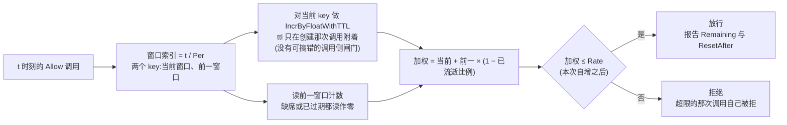

# ratelimit:一次一维,以 KVStore 为底

ratelimit 是 speed 的共享限流原语:`Limiter` 决定调用方提供的 `key` 上再多一次命中是否落在调用方提供的 `Limit` 之内,后端完全由 `pkgcore.KVStore` 承担。六个互不相干的业务模块各自独立需要限流——authn 的防暴力、integration 的三层 API Key 节流、notification 的验证码预算、org 的邀请限额、ai-gateway 的按租户请求频率、sharing 的公开链接防滥用——把同一个计数器各写一遍、每遍略有不同,不如对着"每种部署模式都提供的那一个接口"一次做对。

## 职责与边界

这是一个**纯库**,与仓库里其它模块都不同:它不实现 `pkgcore.Module`,不注册路由、配置 schema、功能开关或权限。没有要接进内核的东西;消费者直接调 `ratelimit.New`。刻意的边界由"无业务语义"推出,具体而言:

- **不知道租户是什么。** 要按租户限流的调用方在调 `Allow` 之前自己把租户编进 key;本包从不读 `TenantFromContext` 或任何 tenancy 形态的东西。
- **不知道 HTTP 是什么。** `Decision` 是纯数据;把拒绝翻译成带 `Retry-After` 与配额头的 429 完全是调用方的活——这也让限流器可用于 HTTP 之外(比如节流一个后台派发器)。
- **不知道"账号、IP、邮箱、API Key"是什么意思。** 它们全是消费者选的 key 字符串;多维组合是调用方*自己*做的事——每个维度一次 `Allow`。刻意不存在多 key 或升级感知的变体。
- **没有动态配置。** `Limit` 取值由每个调用点在代码里直接给——与"不实现模块契约"同一理由:它是库,不是内核组装的组件。
- **既不替你决定 fail-open 也不决定 fail-closed。** `Allow` 原样返回 KVStore 失败,让每个调用点自己选——登录守卫与成本限流器可以合法地不同。
- **没有自己的集成测试层。** 真实分布式 KVStore 后端是否正确是该后端自己的测试责任;本包唯一的契约对象是 `KVStore` 接口,内存 store 已完全满足它。

## 设计:为什么算法是滑动窗口*计数*而非滑动窗口*日志*

算法由 `KVStore` 自己的契约逼出,不是从菜单里挑的。滑动窗口*日志*需要有序、可按范围查询的结构——典型是有序集合——以便逐条修剪并统计请求时间戳;`KVStore` 刻意只提供不透明字节值加 `IncrByFloat`/`IncrByFloatWithTTL`/`CompareAndSwap`,因为它按它必须跑于其上的最弱后端设计——standalone 模式的内存 map——不能长出只有 Redis 能满足的数据类型而不打破这个对称。每窗口一个计数器只需要"自增"加"界定窗口的过期":

- 时间被切成 `limit.Per` 长的固定窗口,每窗口一个存储 key(由调用方 key 派生);
- 一次命中经 `IncrByFloatWithTTL` 自增当前窗口 key——该原语只在*创建 key 的那次调用*上附着界定窗口的过期——把"自增"与"仅首次命中时附窗口过期"折成一个原子调用。两步替代方案(先自增、再有条件附 TTL)在每个窗口边界携带一个真实、有安全后果的过量放行竞态:落在两步间隙里的并发自增被静默覆盖。单一原语同时铲掉两个失败模式;
- 判定把当前窗口计数加上前一窗口计数按"此刻已越过边界多远"缩放的加权——这个近似关闭了经典固定窗口洞:卡着边界横跨的突发本可把速率放到 2 倍。横跨边界的突发测试被专门建成"朴素固定窗口下必挂、本算法下必过";
- 每次调用都是命中:把计数推过限的那次请求自己被拒——绝不是它后面的那次。

## 设计:为什么它在 pkgcore 之外,为什么形态被冻结

限流是只有*部分*消费者需要的共享原语;每个模块都背的依赖底座只该装每个模块都要的东西——`KVStore`/`EventBus`/租户上下文。ratelimit 因此与 dbkit、observability 同处一层图深,除 pkgcore 外零依赖、零第三方 import。让它保持"原语"而非"产品"的形态:

- **一次一维。** 多维限流(authn 的 IP+账号守卫、integration 的全局+租户+Key 栈)是组合——每个维度一次 `Allow`,任一拒绝即整体拒绝。这防止原语形态被最先落地的某个消费者固化。
- **渐进/升级语义是业务逻辑。** authn 的"失败越多延迟越长、直至锁定"建在 `Allow` 报告的朴素计数之上;本包的职责止于"这个 key 在窗口速率下是否超限、还剩多少预算"。
- **`Rate: 1` 以编码错误拒绝。** 在加权公式加"每次调用都是命中"之下,持续饱和的客户端收敛到每窗口至多放行 `Rate − 1`——Rate 为 1 时即从第二个窗口起永久锁死。"每周期一次"的自然拼法无法被字面兑现,因此在触库之前即被拒绝——拒绝方向安全,而不是把它交付成"首次使用一天后才出现的锁死"。
- **整个 seam 是一个接口、一个判定。** `Limiter` 只有 `Allow(ctx, key, limit)`;每次调用都记命中;没有"只查不计"模式。`Decision.Remaining` 是加权近似,记录在案地不是精确倒计时;唯一共享的换算(`RetryAfterSeconds`,向上取整,亚秒余数绝不读作"立即重试")住在这里,让它的边界行为只有一个被测试的家。

## 取舍与"为什么"

- **六个消费者共享一个计数器而非六份拷贝**——模块存在正因为替代方案(六个略有不同的滑动窗口计数器,各有各的窗口/TTL 竞态)严格劣于对着"每种部署模式都提供的那一个接口"一次做对。
- **用近似换精确**——滑动窗口计数是滑动窗口日志的近似,为的是 `KVStore` 最弱后端契约表达不了有序日志;固定窗口会放行的边界突发是被加权挽回的、被接受的精度损失。
- **调用方 key 维度而非内置维度**——调用方组合 key 与维度,原语因此永不需要知道租户、账号或协议;代价是粗心 key(明文地址)会原样落进 store——这正是文档化的消费者一律以盲索引为 key、绝不明文标识符的原因。
- **无模块契约、无配置 schema**——可调阈值需要 schema、管理面与内核;调用点代码直给取值让库保持零依赖,决策留在调用方看得见的地方。

## 对外的稳定面

`Limiter`/`Limit`/`Decision`/`New`、"每次调用都是命中"与加权计数语义、`RetryAfterSeconds`,以及两个错误哨兵(`ErrInvalidLimit`,`ErrRateOneUnsupported` 包在其内)——外加"KVStore 失败原样透传、由调用方归类"的规则。

## Source

- 设计:[docs/internal/11-cross-cutting.md](https://github.com/vislake/speed/blob/main/docs/internal/11-cross-cutting.md)(限流:独立模块、单一维度、无业务语义)、[01-architecture.md](https://github.com/vislake/speed/blob/main/docs/internal/01-architecture.md)(图内位置)
- 模块纪律:[go/ratelimit/AGENTS.md](https://github.com/vislake/speed/blob/main/go/ratelimit/AGENTS.md)

## 相关页

- [设计原则](/zh-cn/docs/developer-docs/design-principles/)——本页设计遵循的最弱实现与打包规则
- core 组:[pkgcore](/zh-cn/docs/developer-docs/modules/core/pkgcore/)、[jobs](/zh-cn/docs/developer-docs/modules/core/jobs/)
- 使用视角:[用户指南中的 ratelimit](/zh-cn/docs/user-guide/modules/core/ratelimit/)
