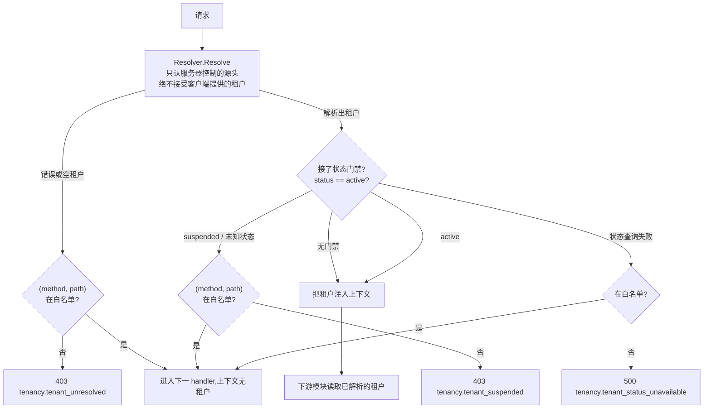

# tenancy:决定请求携带哪个租户

dbkit 在上下文已经携带租户之后执行隔离;tenancy 决定**这个上下文最初带的是哪个租户**:每个 HTTP 入口都跑在其后的 net/http 中间件、业务代码在少数合法理由下刻意走出租户过滤的带审计途径,以及其它模块每个仓储必须运行的隔离断言套件。它紧贴 dbkit 之上,依赖 dbkit 的原因只有一个:`tenancytest` 子包——它的断言泛型于 dbkit 自己的类型,必须待在依赖方向允许的位置——dbkit 之上,绝不反向。

## 职责与边界

- **这里没有 `JWTResolver`,整个模块不验任何签名。** 验签、管密钥、从 claims 读租户是 authn 的活——authn 依赖 tenancy,不是反过来;认证态解析器若放在本包,会逼出依赖图刻意避免的 import 环。authn 自带实现 `Resolver` 的类型,本包无需为此改变任何东西。
- **没有任何租户过滤机制。** GORM 插件与 `Repository[T]` 全部住在 dbkit,`Open` 在 tenancy 登场之前就已装好;tenancy 既不安装也不包装它们。
- **不做授权。** `DomainResolver` 不授予任何数据访问——它只决定任何人在证明身份之前,登录页该展示什么。
- **不建 RLS**——部署侧职责,两个包共同假定其存在。
- **根包只 import pkgcore。** `resolver.go`、`middleware.go`、`system_context.go` 从不碰数据库;只有 `tenancytest` import dbkit 与 gorm。

## 设计:解析器契约与中间件为何 fail-closed

`Middleware(resolver, opts...)` 每请求恰好咨询一次 `Resolver` 并完全信任它。每个实现必须遵守的契约以硬规则而非描述的形式写下:**租户来自服务器自己控制的源头**——已验令牌的 claims、数据库查询——绝不来自身为被解析请求所附的 header、查询参数或请求体。`Middleware` 上不存在任何读取客户端提供租户提示的选项,因为接受它正是多租户系统最常发生水平越权的方式。解析出的租户以 `pkgcore.WithTenant` 注入请求上下文;下游每个模块都继承这份保护。

中间件形态 fail-closed:解析不出租户的请求被拒(403 `ErrTenantUnresolved`),**除非**其(method, path)在白名单上——白名单内时下一个 handler 照常运行,但上下文里*没有租户*,下游不会把它误认成已解析租户。白名单匹配对方法与路径都是精确字符串比较:无前缀、无通配、无 GET 隐含 HEAD——每个需要豁免的 (method, path) 对各自登记。另两处细节同样承重:解析器报成功但返回*空*租户,与解析失败同等待遇(自定义解析器不得拿 `("", nil)` 当"无需租户"的信号);解析器自己的错误永不进响应体——认证态解析器的内部可能携带细节。

可选租户状态门禁遵守同一条纪律:经 `WithTenantStatusResolver` 接线后,解析出的租户状态只要不是 `TenantStatusActive` 即以 `ErrTenantSuspended` 拒绝,`Status` 调用自身出错则以 `ErrTenantStatusUnavailable` 拒绝——状态源不可达是要修的故障,绝不是"没有消息就是好消息"。默认关闭、完全增量:未接线的宿主其中间件行为逐字节不变。门禁不缓存任何东西,暂停在下一个非白名单请求即刻生效。

## 设计:逃生舱先审计、后授予

平台运营确有合法的无租户上下文操作——admin 跨租户检索、定时清理、注册流程——没有逃生舱这些模块根本无法实现。设计原则:让逃生舱存在,但显眼、受限、留痕——让开发者不会退回裸 `*gorm.DB`(那才是真正失控)。

原始原语(`pkgcore.WithSystemContext`)落在 pkgcore,因为位于 tenancy 之下的 dbkit 需要它——ADR 0002 破环决策的细节见 [pkgcore 页](/zh-cn/docs/developer-docs/modules/core/pkgcore/)。tenancy 在其上加的是问责半边:`tenancy.WithSystemContext` 调用原语并**在返回提升后的上下文之前发布一条审计事件**;发布失败时,调用方拿回的是原封未动的上下文与一个错误——"授予了逃生舱却没有对应审计记录"正是这个封装存在的意义。三个约束让逃生舱有意义:

- **每次授予都携带已声明的 purpose 与 actor。** `Purpose` 是必填枚举,由调用模块事先 `RegisterSystemPurpose` 注册,不接受自由文本——"随手填一个"不可能发生。
- **白名单决定谁能持有它。** 跨租户加宽(看或动超出单一租户的行)限死在 admin、compliance、jobs、authn,由 code review 与两个函数自身的文档注释把关——把关点刻意不是 depguard 规则,因为 pkgcore 根包有合法导入者(dbkit 即在其中)必须保持放行。
- **系统上下文自身不放大任何东西。** `Repository[T]` 只在唯一一处查询它——作为 `HardDelete` 的拒绝门禁,从不作为放大器;在已带租户的上下文上授予它不会放大读取,在裸上下文上授予它也不顶替租户——仓储照样 fail-closed。绕过租户过滤不等于绕过授权;拥有过滤的层次决定系统原因改变什么。

平台范围写门禁(如 config 的 system 层、ai-gateway 的平台凭据)同样经此带审计入口行使;它绝不允许从 HTTP 中间件"顺手"注入——只在具体 handler 或任务内部、尽可能小的作用域开启。

## 设计:隔离套件双向断言

`tenancytest.AssertIsolated` 经调用方自己的工厂造两个租户的数据,断言完整契约:list 限定于调用租户;跨租户读、改、删被拒且不损坏真实行、不制造幻影行;`Create` 覆盖伪造的 tenant id;无租户上下文 fail-closed。`AssertNotTenantScoped` 断言*反向*——身份与平台表确实不受租户过滤插件影响:在无租户与两个任意租户下驱动它,证明可见性不随任何租户形态变化。反向断言存在,是因为它抓的失败代价高昂:本该全局可见的表被误加过滤,在生产里表现为"数据莫名其妙消失",比隔离泄露难追得多。仓储跑哪套由数据分域表决定——租户数据与关联数据跑 `AssertIsolated`,身份数据与平台数据跑 `AssertNotTenantScoped`——CI 的隔离覆盖检查器强制每个租户数据仓储都有它的套件。

## 取舍与"为什么"

- **解析返回租户,不返回上下文**——`Resolver` 签名是 `Resolve(r) (TenantID, error)`。这个窄形态正是中间件顺序不可商量的原因:`authn.Middleware` 必须先跑,因为令牌未验之前租户解析器无物可读。
- **`DomainResolver` 回退默认租户、绝不报错**——为未认证场景刻意立下的、窄而记录在案的例外:登录页必须还能渲染出东西。任何其它解析器不得照抄这个行为。
- **白名单豁免不携带已解析租户,只携带"无"**——需要豁免的 pre-auth 路由得到的是彻底没有,因此"租户未知前必须可用"的路由不可能意外继承一个租户。
- **带审计的封装住在这里而非 pkgcore**——审计发布依赖的机制(事件总线、未来的消费者)没有理由住进依赖底座。

## 对外的稳定面

`Resolver`(及其"服务器控制源头"规则)、`DomainResolver`、`Middleware` + `WithAllowlist`(精确匹配语义)+ `WithTenantStatusResolver`(封闭状态词汇)、`ErrTenantUnresolved`/`ErrTenantSuspended`/`ErrTenantStatusUnavailable` 错误族、`WithSystemContext` 的"先审计后授予"契约与 `tenancy.system_context.entered` 事件,以及 `tenancytest` 的两套断言套件。

## Source

- 设计:[ADR 0002](https://github.com/vislake/speed/blob/main/docs/adr/0002-tenant-context-primitives-live-in-pkgcore.md)
- 模块纪律:[go/tenancy/AGENTS.md](https://github.com/vislake/speed/blob/main/go/tenancy/AGENTS.md)

## 相关页

- [总体架构](/zh-cn/docs/developer-docs/architecture/)与[设计原则](/zh-cn/docs/developer-docs/design-principles/)——本模块所操作化的隔离纪律
- core 组:[pkgcore](/zh-cn/docs/developer-docs/modules/core/pkgcore/)、[dbkit](/zh-cn/docs/developer-docs/modules/core/dbkit/)、[config](/zh-cn/docs/developer-docs/modules/core/config/)
- 使用视角:[用户指南中的 tenancy](/zh-cn/docs/user-guide/modules/core/tenancy/)
