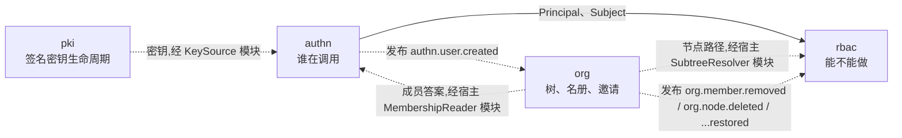

# identity 组设计

Go 侧有三个模块扛起 speed 产品的身份与访问面,它们把同一个问题切成三段:**谁在调用**(`authn`)、**他能不能做这件事**(`rbac`)、**在组织的哪一片里能做**(`org`)。本页是这次切分的地图——三个模块之间的关系,以及每条边界为什么落在现在的位置。随后的模块设计页逐个讲每份设计的故事:`authn` 在前(谁),`rbac` 其次(能不能),`org` 殿后(给授权提供边界的树与名册)——这个顺序同时镜像模块依赖图与一个请求穿过中间件链的路径。

[用户指南的 identity 页](/zh-cn/docs/user-guide/modules/identity/)讲怎么接线、怎么用;这些页面讲每个模块为什么长成现在的样子——每一条论断都能回溯到 Source 里点名的模块自己的 `AGENTS.md`。

## 三个模块,各答一问

| 模块 | 回答什么 | 拥有什么 |
|---|---|---|
| `authn` | 谁在调用? | 用户、会话、刷新令牌、登录历史、外部身份、MFA 因子、恢复码、租户 SSO 配置 |
| `rbac` | 这个 `Subject` 能不能执行这个动作,在树的哪一片里能? | 角色、角色权限、角色绑定、冻结的权限目录 |
| `org` | 租户长什么样,谁在里面? | 组织树、成员关系、邀请 |

切分跟随[租户隔离设计](/zh-cn/docs/developer-docs/architecture/)的数据分域:用户是**身份数据**——一个人可以属于多个租户,所以 `users` 不带 `tenant_id`,绝不租户化;而把一个人桥进某个租户的成员关系是**关联数据**,与租户数据一样按租户隔离。rbac 的三张表全是租户数据或关联数据。组内每张表都跑与自身分域匹配的隔离套件(authn 身份表跑 `AssertNotTenantScoped`,org 与 rbac 的表跑 `AssertIsolated`),CI 强制。

## 为什么三者互不 import

本组的定义性属性是它**不**依赖什么。`authn`、`rbac`、`org` 之间没有任何 Go import 边——两个方向都没有——这个"没有"是设计,不是打包的偶然结果。每条缺失的边各有各的理由,而本该由那条边承载的协作,全部经由宿主注入的模块跨过边界:

- **`rbac` 从不 import `authn`。** 授权只知道身份的唯一样东西——`Subject{TenantID, UserID}`——由认证方组装好再调用进来。一个知道用户怎么登录的引擎,无法被采用不同认证方式的宿主复用,测试时也不得不先立起一套登录栈。这正是访问控制层变得不可测、不可复用的经典反例。
- **`authn` 从不 import `org`。** 成员关系经由宿主注入的 `MembershipReader` 模块询问,org 的名册是它的规范实现。模块缺失意味着**拒绝,绝不放行**:令牌为之签发的那个租户,是多租户产品里被利用最多的横向越权入口,所以这个问题在每次登录时被问、在每次刷新时被再问,问的方式是失败即拒。
- **`org` 从不 import `authn`。** 它通过 `authn.user.created` 事件认识新用户——只凭事件的字符串名,负载用 JSON 往返探测,绝不引用发布方的类型——并且只存一个 id 字符串。org 甚至不*声明*这个事件,因为在同一个宿主里两个模块同时启动时,声明别人的事件会在 bootstrap 处撞车。
- **`rbac` 与 `org` 之间也没有边。** rbac 在判定时需要节点的物化路径;org 的 `Scope` 接口提供它,所有签名只用标准库类型构成,于是 rbac 在自己包里声明同一组方法、结构化地接受 `*ScopeService`。任何 `OrgNode` 类型都不跨过这条边界。
- **`authn` 以同样的方式够到 `pki`。** 它的 `KeySource` 模块在 authn 内声明,由 `go/pki` 的 `Service` 结构化满足——两个方向都没有 import 边;宿主在组装时把它们接上(见 authn 设计页的令牌一节)。

这条模式在每条边上用的是同一种手法:模块接口的签名只用标准库类型,由消费方声明、产出方实现、宿主接线——宿主是唯一同时出现两个包名的地方。参考应用里,演示身份层填的正是真实消费者会用真实模块去填的那些模块接口——这正是它们存在的意义。

## 用事件替代 import——编排

上面两种协作是**事件驱动**的,事件严格沿模块图向下流动:

1. `authn` 在注册或即时开通之后发布 `authn.user.created`。`org` 订阅:幂等地确保新用户的根节点与成员关系存在,让新账号拿到工作区。订阅是健壮的——发布方不存在不是错误,重投的事件不会造出第二个根或第二个席位。
2. `org` 发布 `org.member.removed`、`org.node.deleted` 及它们的恢复孪生。`rbac` 订阅并**收割**(reap):被移除成员的角色绑定被撤回(标记删除、可恢复),悬在已删节点上的绑定被吊销,被恢复的成员或节点拿回恰好被那次收割撤回的授权。一个进不了租户的人名下残留的授权行是潜伏的访问,等着别处的某个 bug——复活一场会话、恢复一条成员关系——把它变成现实;所以清理属于事件,不属于一场可能永远不会跑的清扫。

每个订阅者只把事件当作一个字符串名加一个 JSON 形状的负载探测。这是模块边界规则在消息上的应用:不 import 结构、不声明外来事件,外加四情形韧性契约(无发布方、不认识负载、无租户、真活要干),让一个模块的无知永远不会看起来像另一个模块的失败。

## 中间件顺序

模块在 HTTP 链上按一个固定顺序相遇,由参考应用的组合式 HTTP 测试钉死:`authn.Middleware` 若有令牌则验之,从不猜租户;`tenancy.Middleware` 把验过的 principal 变成租户上下文;`rbac.RequirePermission` 在路由前把关。authn 自己的路由——登录发生在任何租户存在之前——直接从它的中间件输出挂出,绝不下游于租户解析。[总体架构页](/zh-cn/docs/developer-docs/architecture/)讲这条链;[身份与访问域页](/zh-cn/docs/user-guide/domains/identity-access/)从操作角度走一遍。

## 阅读顺序

- [authn 设计](/zh-cn/docs/developer-docs/modules/identity/authn/)——谁在调用:凭证、令牌、会话、撤销、联合登录、MFA——以及模块为何在拒绝时给出无差别回答。
- [rbac 设计](/zh-cn/docs/developer-docs/modules/identity/rbac/)——`Subject` 能否行动、能在哪棵子树里:自研引擎、冻结目录、事件失效的缓存。
- [org 设计](/zh-cn/docs/developer-docs/modules/identity/org/)——给另外两个模块供数据的树、名册与邀请,以及让子树查询廉价且双方言一致的存储模型选择。

## Source

- [go/authn/AGENTS.md](https://github.com/vislake/speed/blob/main/go/authn/AGENTS.md)、[go/rbac/AGENTS.md](https://github.com/vislake/speed/blob/main/go/rbac/AGENTS.md)、[go/org/AGENTS.md](https://github.com/vislake/speed/blob/main/go/org/AGENTS.md)
- 本页(组内 hub);[总体架构](/zh-cn/docs/developer-docs/architecture/)、[设计原则](/zh-cn/docs/developer-docs/design-principles/)
- 用户指南:[identity 组模块](/zh-cn/docs/user-guide/modules/identity/)、[身份与访问域页](/zh-cn/docs/user-guide/domains/identity-access/)
