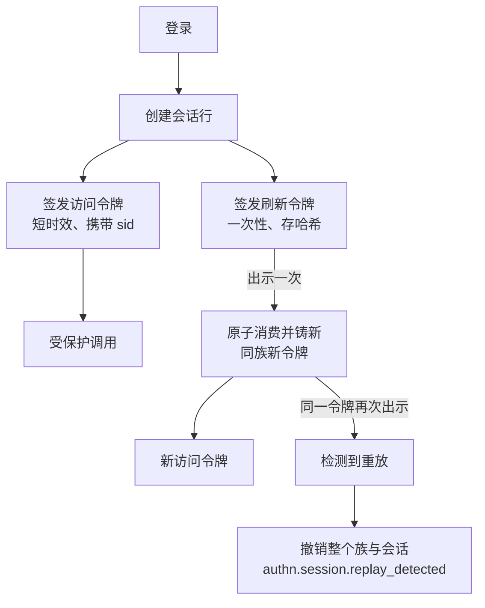

# authn

认证:调用者是谁。绝不是他能做什么。本页解释模块形态背后的"为什么"——数据分域的选择、令牌与会话机制、以及拒绝回答;怎么用看[用户指南的 authn 页](/zh-cn/docs/user-guide/modules/identity/authn/)。

## 职责与边界

authn 拥有身份域:账号、凭证、会话及其撤销,密码、手机号加短信码、社交渠道与企业 SSO 各条登录通路,MFA 与 step-up,以及同一会话内的租户切换。它发布 `authn.user.created`,自己什么也不发——`notification` 与 `org` 各自对事件作出反应。边界在每一侧都按同一条纪律画:

- **没有角色或策略判定。** `Principal` 刻意不带权限清单——令牌里的权限会随签发冻结整个令牌生命期。能做什么是 rbac 的问题。
- **没有成员关系,没有组织树。** "这个用户是不是这个租户的活跃成员"经由宿主注入的 `MembershipReader` 模块询问(org 的名册是规范实现);模块缺失就拒绝,绝不放行。
- **验证码之外不发任何消息**——安全规则单列的同步例外。SAML、WebAuthn/passkey、QQ/微博/支付宝渠道则按设计缺席:SAML 会把依赖强加给每个消费方、覆盖的却只是 OIDC 已覆盖的企业场景,后两者还在等一个设计决定。

## 身份表刻意不租户化

模块拥有九张表:八张身份域(`users`、`sessions`、`refresh_tokens`、`login_attempts`、`user_identities`、验证码、MFA 因子、恢复码)加一张租户域表 `tenant_sso_configs`(企业连接按租户配置)。每张身份表跑 `AssertNotTenantScoped`:一个人属于多个租户,把人锁进一个租户会让多租户情形根本不可表示。身份数据因此用不了 `dbkit.Repository[T]`(它的约束要求 `TenantScoped`),authn 的仓库持文档化的裸 `*gorm.DB` 形态,配以惯常的补偿规则。`sessions.current_tenant_id` 看起来像例外,其实不是:它记录会话当前签发令牌所属的租户,而成员关系在每次刷新时都对着它**重新验证**,从不被信任。

## 密码:自描述哈希的 argon2id

密码用 argon2id——当下 OWASP 首选,比 bcrypt 更抗 GPU 破解。两个决定让这个选择经久。**PHC 参数串随每个哈希一起存储**,绝不放进需要与验证方保持同步的一列:提高成本因此是配置变更而非迁移,`Login` 在主人下一次成功登录时顺手升级哈希。**成本参数是 bootstrap 配置;策略是动态配置。** 参数取决于机器、必须跨副本一致、绝不能从管理台调——操作者能把登录调到毫无成本的便宜,或调到足以自伤的慢。策略(最小长度、黑名单)正相反——动态、NIST 形态:长度优先,绝不强制符号大杂烩。

## 访问令牌:Ed25519,经生命周期取钥

访问令牌用 Ed25519 EdDSA 签名,短时效,携带 `sub`/`tid`/`sid`/`amr`——刻意**不带 email**(bearer 凭证会被复制进客户端存储、代理日志与 trace 属性,本模块控制不了那些地方的脱敏)也**不带权限**(会随签发冻结)。

- `Signer`/`Verifier` 在每次 `Issue`/`Verify` 时从 `KeySource` 模块现取密钥,不持固定密钥集。`WithKeySource` 是唯一、强制的注入点——被删的静态 `KeySet` API 没有向后兼容路径:一条后备密钥通路就是第二条签令牌的路。
- 模块接口由 `go/pki` 的 `Service` 结构化满足,两个方向都没有 import 边;pki 在该模块接口背后拥有密钥生命周期状态机(`pending → active → retiring → retired`),由自己的到期扫描驱动,authn 只消费密钥。

模块接口存在,是因为长期有效的签名密钥是单点故障:一旦泄露,它伪造的令牌无人能辨。生命周期按计划退役旧钥、所有副本读同一批密钥行,轮换不需要协同重部署。验证还有第二道防线:令牌头的 `alg` 要对着签名密钥自己声明的算法核对,叠加在解析器单-EdDSA 白名单之上。

## 会话:有状态,因为撤销是硬需求

纯无状态 JWT 回答不了"现在就把这台设备下线"。解法:每次登录建一条 `sessions` 行;访问令牌带 `sid` claim,默认短时效(15 分钟);刷新令牌长效、绑会话、存哈希。**撤销会话 = 把行标记 revoked**:刷新立即失败,未过期的访问令牌最多再活一个 TTL。等不了一个 TTL 的部署选立即模式:`KVStore` 里的撤销清单,每个验过的请求查一次 `session_id`——每请求一次 KV 读,明码标价的代价。模式是**构造期选项**,绝不是动态配置项:请求期读到的值无法给另一个模式下构造的 manager 补装强制。

## 刷新轮换:一次性令牌,重放即失窃

刷新令牌是一次性值,存哈希。每次刷新消费旧令牌、在同一族里铸新令牌,一次原子 compare-and-swap。**出示已消费的令牌意味着存在第二份拷贝**,所以回应是撤销整个族与会话、发布 `authn.session.replay_detected`——否则偷令牌的人拿着已经轮换走的那枚还能继续登录。

两个后果对消费者明说而非隐藏:**同一刷新令牌的两次并发刷新与失窃不可区分,按失窃处理**——客户端必须串行化刷新。而刷新在*解析*令牌与*提交*轮换之间重新验证成员关系,绝不在提交之后:一次短暂故障不能把调用方的令牌花掉、让他此后合法的重试付出真失窃的代价。

## 每次拒绝回答都一样

登录是枚举 oracle 的窝,设计用无差别回答堵死:账号不存在、密码错误、没设密码、账号被停用、密码正确但账号解析不到成员关系——全部返回同一个不带参数的 `authn.invalid_credentials`。账号不存在也要付一次 argon2id 推导的代价,秒表无法重新打开错误信息已关上的 oracle;具体原因改记在 `login_attempts` 行上。同一条纪律覆盖每个暴露存在性的回答,绑定操作与会话吊销都在内;尝试表存被尝试标识符的盲索引,绝不存标识符本身。

## 限流与联合登录:让渠道安全的规则

登录、注册、发码、验码、step-up 全部坐在 `go/ratelimit` 的滑动窗口后面,再叠本模块的**渐进式**层:登录失败累计指数增长的延迟、有界饱和——延迟本身就是锁定。每次检查在 `KVStore` 出错时失败即拒。

社交渠道与企业 SSO 共用一条账号绑定规则:邮箱已属于本站账号的外部身份,**只有当 provider 声称地址已验证且渠道在信任名单上**才允许自动关联——其余一律拒绝,也从不告诉调用方是哪个条件没过,因为一个愿意发出"别人已验证地址"账号的 provider,否则就会把那个人的账号也发出来。企业 SSO 加第三个条件:账号必须是**配置该身份提供方的租户的活跃成员**——否则它的管理员只要把公共域名加进白名单,就能登进该域名下任何平台账号。微信以 `unionid` 为键、绝不用 `openid`——应用级 id 会把同一个人劈成跨应用的两个账号。最后登录方式是社交或 SSO 的账号无法脱掉那条渠道。

## MFA 与 step-up:提升只活一枚令牌

TOTP 只用标准库实现,钉在 RFC 4226/6238 官方测试向量上;开通发十个恢复码,只展示一次。step-up 的决定:完成的 step-up 铸一枚 `amr` 已带因子的新访问令牌,但**绝不写回会话行**——此后的自然刷新从会话*原始*认证方式铸令牌,让提升成为周期性重证而非永久解锁。替换已激活因子要求 `principal.AMR` 已带一次完成的 step-up:裸的——读作失窃的——访问令牌不能自己 enroll 一个因子,悄悄夺走别人的活跃因子。

## 值得知道的取舍

- **不自建 IdP,不强制第三方身份依赖。** 自建因范围与责任被否;硬绑 Auth0/Ory 会给每个消费方强加付费依赖、把身份挪出自己的库表。authn 是 OIDC relying party,不是身份提供方。
- **无差别拒绝牺牲诊断。** 一切失败压成一个回答;细节移进 `login_attempts`,操作者与账号主人可读。
- **重放偏执要求客户端自律。** 把两次并发刷新当失窃,是"自动发现令牌被盗"成立的代价;刷新因此是必须串行化的操作。
- **登录时刻不强制第二因子。** 已开通因子的账号仍可仅凭第一因子登录;step-up 只守敏感操作。登录时刻的完整 MFA 是更大的交互式设计,按现状记录,不造半个。

## 对外稳定面

宿主组合所对的表面刻意小而稳:`NewModule` 及其选项——`WithKeySource` 与 `WithBlindIndexKey` 强制(两者都没有安全默认)、`WithMembershipReader`(缺失即拒绝)、分布式部署必须 `WithSMSSender`——`Principal` 类型(只有身份,绝无权限)、服务流程(`Register`/`Login`/`Refresh`/`SwitchTenant`/`Logout`),以及 spec 生成的 HTTP 片段:`/api/v1/authn` 下二十二个操作,直接从 `authn.Middleware` 输出挂出——多数操作发生在任何租户存在之前,少数在租户内动作的操作,租户来自令牌自己的 claim。

## Source

- [go/authn/AGENTS.md](https://github.com/vislake/speed/blob/main/go/authn/AGENTS.md)——Rules、决策面与 Known limitations

## 相关页

- [identity 组设计](/zh-cn/docs/developer-docs/modules/identity/)——组内 hub;[org 设计](/zh-cn/docs/developer-docs/modules/identity/org/)——authn 模块背后的成员答案;[rbac 设计](/zh-cn/docs/developer-docs/modules/identity/rbac/)——从不 import 本模块的授权侧
- [总体架构](/zh-cn/docs/developer-docs/architecture/)——中间件顺序与接线契约
- 用户指南:[authn 模块](/zh-cn/docs/user-guide/modules/identity/authn/)、[身份与访问域页](/zh-cn/docs/user-guide/domains/identity-access/)、[identity 组模块](/zh-cn/docs/user-guide/modules/identity/)
