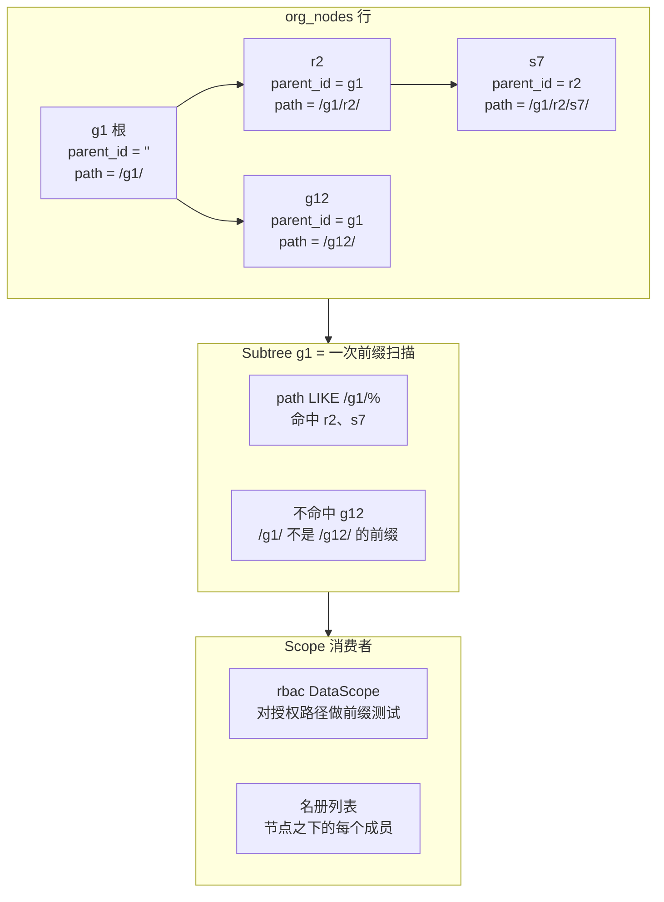

# org

租户的组织树、绑在节点上的成员关系、以及创建它们的邀请。`org` 是两个邻居背后的数据——authn 的成员检查与 rbac 的子树范围授权。本页解释存储模型与操作背后的"为什么";怎么用看[用户指南的 org 页](/zh-cn/docs/user-guide/modules/identity/org/)。

## 职责与边界

范围内:每个租户一个根,根下任意深度,节点携带业务定义的 `Kind`;建、改名、移动、删除节点;名册——每人每租户一条成员关系,绑在节点上,节点下方的子树就是他的数据范围;邀请的发出、投递、撤回与接受;只读的 `Scope` 视图;以及让新用户拿到工作区的订阅。

刻意放在范围外,各归其主、各带理由:

- `users` 超过 id 字符串的一切——`authn` 的身份数据;org 从事件或 subject 学到用户 id,别的什么都不存。
- 成员关系上的角色——`rbac` 按 (tenant, user, node) 键控的策略;`[]string` 列没有可移植的双方言形态。
- 邀请邮件之外的任何消息——`notification`;业务模块发布事件,发什么由订阅方决定。
- 吊销被移除成员的会话——`authn`;org 发布 `org.member.removed`,伸手进会话状态正是这个事件存在的意义。
- 真实的 `SubjectResolver`——`authn`;org 只提供模块接口与失败即拒默认(未接线时 401)。
- 动态配置 schema——一个也没有:界都是常量,经选项覆盖;声明一份 org 会静默无视的 schema,是撒谎的 schema。

## 树:邻接加物化路径

每个节点存 `ParentID`——权威的结构边——与 `Path`——派生的查询索引——外加 `Depth`。`TreeService` 一起写两者;两者不一致的行是损坏,不是受支持的状态。

两种替代形态被否决:**闭包表**每节点 O(depth) 行、每次移动重写 O(子树 × depth) 行,为的是买祖先查询——而物化路径在 Go 里 split 一个字符串就答了;**递归 CTE** 两个引擎今天都支持,但这里的可移植原则是"结构上不可能分叉",不是"两边碰巧都支持"。

前缀表示带两条承重性质,都由测试钉住:**路径以分隔符结尾**,让"自身加后代"对变长 id 是一个朴素前缀测试——`/g1/` 不是 `/g12/` 的前缀,而 `/g1` 会是(`/g1/r2` 与 `/g1/r20` 的陷阱也是必测用例);**id 字母表钉死为 `[0-9a-f-]`**——没有 `LIKE` 元字符,没有大写。这个字母表正是方言同一性证明成立的原因:SQLite 的 `LIKE` 大小写不敏感、PostgreSQL 大小写敏感,但没有任何两条存储路径可以只差大小写,所以两个引擎选出相同的行——而含大写的 id 方案必须重新裁定整个表示。

移动在 **Go 里**重写路径、绝不用 SQL `replace()`,`CreateChild` 从父节点存储路径派生 path 与 depth——新行不可能与父节点不一致。

## 两个看着很小、其实不小的存储决定

**`parent_id` 是空串哨兵,不是 `NULL`。** 兄弟同名唯一索引是 `UNIQUE(tenant_id, parent_id, name)`,而 `NULL` 在两个引擎的唯一索引里都"自不相同"——两个根会在索引静默失效的情况下共存。空串是普通可比值,索引才名副其实——`go/config` 的租户作用域列早已立下先例。

**`memberships` 是关联数据,而关联数据就要租户化。** 正因为 `users` 刻意不租户化(一个人,多个租户),桥接行*必须*租户化:跨租户可读的成员关系,等于把一个租户的名册露给另一个租户。`Membership` 跑 `AssertIsolated`,`user_id` 只存裸引用——没有跨模块外键。

## 子树语义:删除能做什么、不能做什么

范围跟随树,所以结构编辑是危险点:

- **删除绝不重新安置孤儿。** 有子的节点报 `org.node_has_children`,除非调用方显式要级联——把孤儿重挂上去会静默放宽每个绑定成员的数据范围:一次由删除执行的权限提升。
- **删除绝不把成员关系带走。** 子树里有人绑定就报 `org.node_has_members` 拒绝,级联与叶子一样——结构编辑不能静默改变"谁在租户里"或"他能看见什么"。检查跑在删除自己的锁事务内部,单独的先读会让并发的 `Add` 把成员关系悬在已删节点上。
- **租户根永不可删**;移动根不需要自己的规则——第二个根构造不出来,环检查已覆盖每个候选目标。

拒绝背后是一条并发纪律:每个"先决定再写"的树操作都是原子的——一个事务,首条语句就拿下它需要的行锁(方言中立的盲 `UPDATE`),或一条数据库仲裁的条件语句——关掉的是真实、可复现的窗口。

## 软删与恢复:逐节点,绝不级联

`OrgNode` 与 `Membership` 实现 `dbkit.SoftDeletable`;`Delete`/`Remove` 标记删除,两条真实唯一索引在同一迁移里收窄成局部索引(`WHERE deleted_at IS NULL`)——软删的行不能继续占着租户想收回的名字或席位的槽。`org_invitations` 不碰——邀请本就一次性、会过期。

恢复设计显眼地承载模块的纪律:

- **恢复逐节点,绝不级联。** 级联恢复只能靠按批次自己的 `deleted_at`/`deleted_by` 关联认"那次级联的行"——那是启发式,不是身份:它分不清级联行与更早的主动删除,恢复祖先会复活一行别人有意删掉的东西。
- **恢复拒绝死父节点。** 把节点放回仍标记删除的父节点之下,前缀扫描与祖先链会对"什么可见"各执一词,`CreateChild` 还能从孤儿链上长出新子树——正是表示层称为损坏的"路径与父链不一致"状态。
- **恢复在父节点当前路径下重新表达该行。** 活跃父节点可能在子节点被软删期间移动过,不清除标记、不重新派生 `Path`/`Depth`,就会复活一行路径指着旧位置的行。恢复在同一事务内、从已锁的活跃父节点重新派生,并拒绝已被活跃行占走的槽。

两个恢复各自发布自己的事件(`org.node.restored`、`org.member.restored`)——恢复是它自己的事实,而事件正是 rbac 复原被收割绑定的依据。

## 邀请:用邮件建立同意,别无其它

邀请是模块唯一一条建立同意的消息——对永不接受的人什么也不再发,同一地址再来一次新的 `Invite` 就吊销上一枚令牌。每个机制都是一个小安全决定:

- **令牌永不落库。** `crypto/rand` 32 字节,只留 SHA-256 哈希——备份泄露也得不到可用链接。
- **地址静态加密加盲索引**供精确查找,盲索引密钥必须是独立于加密密钥的另一把。限流键用盲索引,绝不用地址——地址进了 KV 键就是 PII 泄露——投递按租户与按收件人双向限流。
- **邮件按被邀请人的语言环境渲染**,邀请时由请求体点名,绝不读操作者的 `Accept-Language` 头——被邀请人自己还没发过任何请求。

**接受是无租户的,解析是诚实的。** 新被邀请的人没有受邀租户的成员关系、通常也没有令牌——在令牌之上再要租户 claim,会让邀请这个流程存在的意义本身不可能。接受路径从令牌自己解析出邀请的租户:经一张刻意窄小、不租户化的 `token_hash → tenant_id` 索引表,与每次邀请同事务写入,然后原封不动重入普通租户化流程。索引行从不更新,所以被吊销或过期的令牌仍能解析、回答各自的编码错误,而不是误导性的查无此邀请。谁在接受由宿主的 `SubjectResolver` 证明,它未接线时失败即拒——送到一个邮箱的令牌并不证明令牌背后地址的归属。

## authn 订阅与免 import 模块接口

`authn.user.created` 是 org 与 authn 唯一的协调点,它的字符串名只出现在一处。org 订阅——绝不声明或发布外来事件,那会在 bootstrap 撞车——契约是韧性:发布方不存在不是错误;不认识的负载丢弃而不让发布方失败;无租户的事件什么都不做;真事件重建租户上下文、幂等地确保根与成员关系。

同一种结构手法朝外指:`Scope`、`FeatureGate`、`SubjectResolver` 的每个签名只用标准库类型,消费方在自己包里声明同一组方法、结构化地接受 org 的实现——rbac 永远不知道 `OrgNode` 是什么,因为返回 `[]OrgNode` 的方法会毁掉这个性质。`FeatureGate` 是同一手法指向 config 的 `IsEnabled`;`SubjectResolver` 是认证侧填的模块接口。

## 值得知道的取舍

- **反规范化的路径买来查询的简单。** `Path` 复制了 `ParentID` 链蕴含的信息,两者绝不能不一致——代价是让复制保持诚实的写纪律。
- **拒绝胜过静默修复。** 删除不重挂、不带走成员、恢复不复活:每一条会悄悄改变"谁看见什么"的结构编辑都被拒绝,由调用方执行显式动作。

## 对外稳定面

`Module.Tree()`/`Members()`/`Invitations()`/`Scope()` 是服务把手;四个已声明权限(`PermissionRead`、`PermissionManage`、`PermissionInviteMember`、`PermissionRemoveMember`)点明宿主在 org 路由上把关的词汇,接受邀请是唯一不需要常驻授权即可达的路由;八个生命周期事件(`org.node.*`、`org.member.*`)是对订阅者的公开契约;spec 生成的 HTTP 片段在 `/api/v1/org` 下带十一个操作——租户永远来自上下文,绝不来自表面。

## Source

- [go/org/AGENTS.md](https://github.com/vislake/speed/blob/main/go/org/AGENTS.md)——裁定、并发纪律、软删与 Known limitations

## 相关页

- [identity 组设计](/zh-cn/docs/developer-docs/modules/identity/)——组内 hub;[authn 设计](/zh-cn/docs/developer-docs/modules/identity/authn/)——org 名册应答的模块;[rbac 设计](/zh-cn/docs/developer-docs/modules/identity/rbac/)——org 的树为之划范围的授权、org 的事件驱动的收割
- [总体架构](/zh-cn/docs/developer-docs/architecture/)——数据分域与免 import 纪律
- 用户指南:[org 模块](/zh-cn/docs/user-guide/modules/identity/org/)、[身份与访问域页](/zh-cn/docs/user-guide/domains/identity-access/)、[identity 组模块](/zh-cn/docs/user-guide/modules/identity/)
