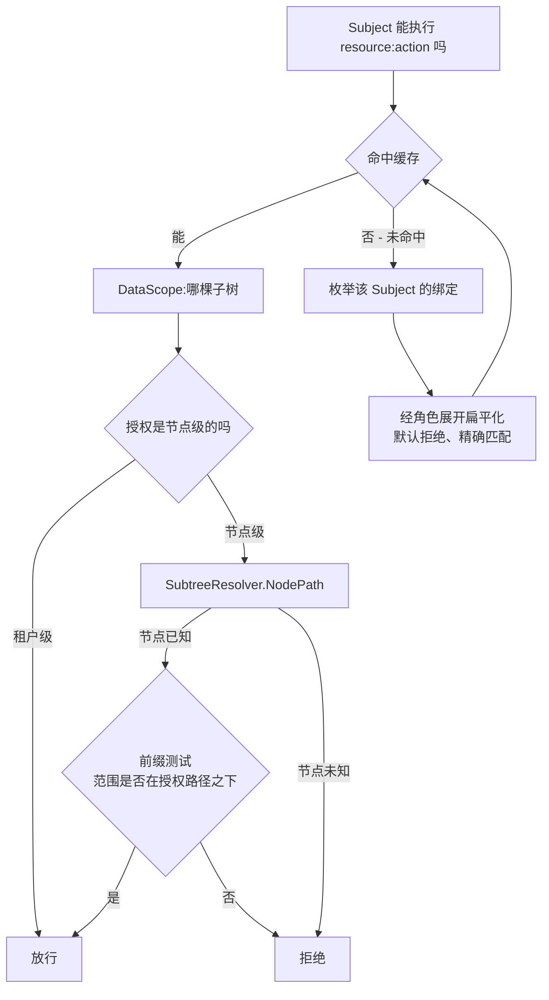

# rbac

基于角色的访问控制:`Subject` 能否对某资源执行某动作,以及能在租户组织树的哪一片里执行。本页解释形态背后的"为什么"——为什么是租户化表上的自研引擎而非现成策略库、每条冻结语义为什么长这样;怎么用看[用户指南的 rbac 页](/zh-cn/docs/user-guide/modules/identity/rbac/)。

## 职责与边界

rbac 做判定。它不做身份识别——它的定义性属性是它**不**依赖什么:

- **不 import `authn`,源码与测试都不。** 授权只知道身份的唯一样东西,`Subject{TenantID, UserID}`,由认证方组装好再调用进来。一个知道用户怎么登录的引擎,无法被采用不同认证方式的宿主复用,测试时也不得不先立起登录栈。
- **不 import `org`。** 对树的全部认知是两个在 rbac 内声明、由宿主实现的接口:`SubtreeResolver`,在判定时刻把节点 id 映射成物化路径;`WithSubjectResolver`,认证方借此供入 Subject。resolver 缺失或失败,对节点级绑定就是**拒绝**——解析不出的收窄绝不放宽成整租户授权。
- **没有自己的 HTTP 路由。** 角色管理是运营后台的表面(`go/admin` 提供),`/me` 属于 authn。rbac 对 HTTP 层的全部贡献是 `RequirePermission`/`RequirePermissionFunc`——固定中间件链在认证之后点名的那道闸。没有可用 Subject、权限串解析不了、普通拒绝——一律不可区分地答 `403 rbac.permission_denied`。
- **没有权限通配符**(`billing:*`):通配符语法是需要专门设计决策的安全面,不是实现时随手猜一个。匹配精确,`notes:read` 不蕴含 `notes:write`。
- **rbac 不给自己授权。** `PermissionRead`/`PermissionManage` 给调用方把关角色管理的词汇;引擎从不自己检查它们——给自己授权的引擎必须为"谁可以授出第一个角色"开特例,而授权引擎里的特例正是漏洞所在。

## 为什么自研,不用 Casbin

设计的 RBAC 语义最初画在 Casbin 的 `RBAC with domains` 模型上;落地实现改成**三张 `dbkit` 托管、租户化表上的自研引擎**,理由逐条记录:

1. `casbin_rule` 没有 `tenant_id` 列——租户藏在策略串里。全产品最安全敏感的一张表,会一次性退出**全部三层**租户隔离:插件注入不了过滤、用不了 `Repository[T]`、行级安全策略没有可比的列。隔离退化成"调用方传对了 domain 串"。
2. Casbin 的 `gorm-adapter` 自己持有 `*gorm.DB` 并自行发查询——正是本仓库数据规则要禁的裸访问形态。
3. Casbin 真正的价值——可插拔 `model.conf`、ABAC、RESTful matcher——在这里全部用不上:判定链就是 `subject → bindings → role → permissions` 加一次物化路径前缀判断。为没人调用的机制往每个消费者的 `go.sum` 里塞两个第三方依赖,这笔账不划算。

## 三张租户表加一份冻结目录

`rbac_roles` 与 `rbac_role_permissions` 是租户数据;`rbac_role_bindings` 是关联数据(用户 × 租户 × 角色——数据分域表里 memberships 形状的那一行)。三张都嵌 `dbkit.Repository[T]`,都跑 `tenancytest.AssertIsolated`(rbac 没有身份或平台表——反向套件零次,是刻意的);`user_id`/`node_id` 是裸 id 引用,没有外键。

权限**目录**是平台数据,**但没有表**:一份冻结的内存快照,内容是每个模块声明的每个 `resource:action`。`Module.Attach`——恰好一次,在 `Kernel.Bootstrap` 返回之后——拍下快照;第二次 `Attach` 失败(`ErrAlreadyAttached`):对"一笔授权是否合法"的判定集合而言,一份不同的第二快照是安全差异。

`"system"` 伪租户承载平台运营授权,而对每一层来说它都是一个**普通租户 id**:它的行走同一批仓库、同一把隔离插件、同一条代码路径。没有任何地方为它分支——这正是它可信的原因——它也不是通配符:system 域授权拿不到任何客户租户的数据。

## 一次判定是什么

`Can` 是粗闸:这个 Subject 在自己租户里**任何一处**持有 `resource:action` 吗?`DataScope` 是行过滤器:在树的**哪一片**?冻结语义如下,每条带理由:

1. **默认拒绝。** 没有匹配的授权就是拒绝,不是错误。
2. **绑定只在自己的租户内授权**——由租户化仓库在结构上保证;读取用 Subject 的租户,绝不用上下文的。
3. **匹配精确。** 不存在通配符语法。
4. **未声明的权限在检查时拒绝、在授出时驳回。** 严格属于 typo 还改得了的地方;检查绝不能让请求变成 500。
5. **`Can` 单独不滤行。** 它无视树的范围;返回租户数据的 handler 还必须调 `DataScope` 并据此过滤。
6. **解析不出的节点级绑定一律拒绝。** 没接 resolver,或节点已消失,意味着该绑定对 `DataScope` 没有贡献——绝不放宽成整租户。这是 `Can` 与 `DataScope` 合法地不一致的唯一情形。
7. **授出幂等,吊销严格。** 授出发现活已干完,那是目标已经达成;吊销发现无物可销通常不是——常见原因是范围不匹配,报成功等于声称"权限已收回"而用户其实还拿着。

**节点路径只解析、不存储。** 绑定存节点 id,绝不存物化路径:成员在树里移动后权限必须立刻跟随,反规范化的路径列恰恰在那一刻过期。这也是为什么决策缓存存节点 id,不存路径。

## 决策缓存:失效优先

决策按 Subject `(tenant, user)` 缓存,存的是已角色展开的授权。一个在吊销之后还继续答"能"的缓存比没有更糟,所以失效优先:

1. **事件。** 每次授出、吊销、角色变更都发布到 `EventBus`;服务订阅自己的事件,本地写与远端写经同一条代码路径收敛。绑定变更丢一个 Subject;角色变更丢整个租户(授权按展开态存储,没有角色反查 Subject 的索引)。
2. **TTL 过期**(默认 30 秒)把丢事件的损失上界在一个 TTL 内——刻意不做动态配置项,那会加一条依赖图里没有的 `rbac → config` 边。
3. **清理协程**回收过期条目;过期本身在读取时强制。

发布失败在本地缓存失效*之后*上报:写入已提交、本进程已经正确,但别的副本还没被告知——调用方在重试与至多一个 TTL 的分歧之间选择。收敛对真实 Redis 总线验证过,不是假设。

## 让表保持诚实:org 事件驱动的收割

残留的授权行是潜伏的访问:成员被移除后还活着的绑定、作用域指向树里已消失节点的绑定,都在等别处的 bug 把它变成现实。rbac 因此订阅 org 的生命周期事件(`org.member.removed`、`org.node.deleted` 及 `...restored` 孪生),只凭事件的字符串名认识它们、用 JSON 往返探测负载——绝不引用 org 的类型,绝不声明或发布外来事件;不带 org 模块的宿主上它们永不触发。

收割走与管理员 `RevokeRole` 完全相同的**标记删除路径**,在每行上写 `revoke_origin` 标记(主动、`member-removal`、`node-deletion`)——于是 `RestoreRole` 撤销被收割的绑定与撤销手动吊销毫无二致,恢复侧订阅也只复原匹配事件收割的行,绝不复活主动吊销。成员恢复侧在取消标记前复查每行节点;无法验证的行在 origin 下失败即拒。接了 `jobs.Queue` 的宿主把收割当可重试的队列任务跑;没接的宿主同步执行,残留按设计永久——这正是队列买走的代价。

软删采用得很**窄**:只有 `RoleBinding` 实现 `dbkit.SoftDeletable`,因为它是模块唯一真正的删除形操作;`Role` 与 `RolePermission` 没有可改造的删除路径。唯一索引 `(tenant, user, role, node)` 在同一迁移里收窄成局部索引(`WHERE deleted_at IS NULL`),撤销后立刻以同一范围重新授权不再被占位挡住。`RestoreRole` 像 `AssignRole` 一样幂等;多个软删行共享同一元组时恢复*最近*吊销的那一行;并且——与 `org` 的"拒绝死父节点"刻意相反——容忍节点已无法解析的绑定:绑定是叶子的授权事实,不是结构行,`DataScope` 早已把解析不出的节点当作无贡献处理。

## 值得知道的取舍

- **自研引擎胜过策略库。** 三表模型在每一层买来租户隔离,代价是重新实现判定——判定链短、语义早已被设计定死,这笔代价算小。
- **缓存更信事件、不信时间。** TTL 是兜底不是机制;事件失效让吊销数秒内跨副本收敛,而不是等一个 TTL。

## 对外稳定面

消费者对着 `Authorizer` 编程(`Can`、`DataScope`、`ListPermissions`——authn 的 `/me` 渲染的那份扁平排序清单)、授权生命周期(`DefineRole`、`AssignRole`、`RevokeRole`、`RestoreRole`、`EnsureBuiltinRoles`)、`Subject`/`Scope` 类型、`RequirePermission` 及其 `*Func` 变体。内置角色编码三个产品决定:`owner` 持全部已声明权限,`admin` 持除 `rbac:manage` 外的一切(没有这个排除,两个角色就完全相同),`member` 什么也不持——普通成员持什么是产品决定,默认拒绝同样适用于播种。内置权限集是冻结目录的函数,绝不是字面清单。

## Source

- [go/rbac/AGENTS.md](https://github.com/vislake/speed/blob/main/go/rbac/AGENTS.md)——冻结语义、收割、软删与 Known limitations

## 相关页

- [identity 组设计](/zh-cn/docs/developer-docs/modules/identity/)——组内 hub;[authn 设计](/zh-cn/docs/developer-docs/modules/identity/authn/)——谁组装 Subject;[org 设计](/zh-cn/docs/developer-docs/modules/identity/org/)——本模块收割所跟随的树与事件
- [总体架构](/zh-cn/docs/developer-docs/architecture/)——中间件顺序
- 用户指南:[rbac 模块](/zh-cn/docs/user-guide/modules/identity/rbac/)、[身份与访问域页](/zh-cn/docs/user-guide/domains/identity-access/)、[identity 组模块](/zh-cn/docs/user-guide/modules/identity/)
