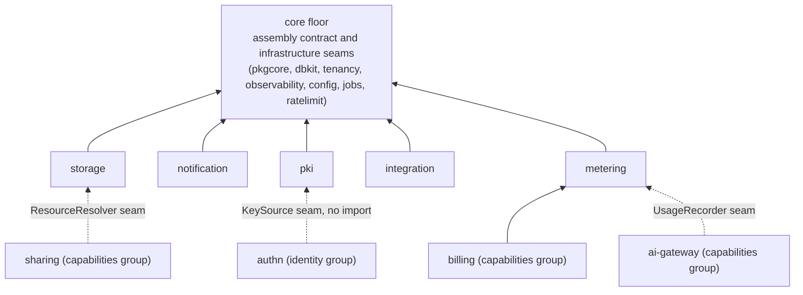

# Platform services

本组覆盖五个平台模块的设计:`go/storage`(媒体对象)、
`go/notification`(外发消息)、`go/pki`(签名密钥与 X.509 证书)、
`go/integration`(租户的对外 API 面)与 `go/metering`(用量计量)。
每个模块页陈述其职责与边界、形态背后的设计取舍、核心机制及其
设计理由,并指出哪部分表面是冻结的公开 API。每一条论断都能回溯
到 Source 小节点名的模块自己的 `AGENTS.md`。

## 本组与 core 底座的分界

core 组的模块——组装契约(`pkgcore`)、双方言数据库与仓储层
(`dbkit`)、租户解析(`tenancy`)、可观测性、动态配置、任务队列与
限流——是消费者项目**在其之上构建**的面。services 组则是产品
真正变成功能的部分。core 模块常常无表无路由;services 组的每个
模块都带着完整业务能力的全套:真实的表与双方言迁移、挂在
`/api/v1/*` 的 OpenAPI 片段、声明的权限、审计动作、事件与任务
处理器——全部经由[模块接线契约](/zh-cn/docs/developer-docs/architecture/)
那一次 `Register(reg Registrar)` 调用注册。

五个模块还共享[设计原则](/zh-cn/docs/developer-docs/design-principles/)
对业务模块的要求:租户只从请求上下文读取、永不来自请求;长任务
走 `jobs` 队列而不是阻塞 HTTP 请求;凡是入队与执行之间可能变化
的决定,都在它真正起作用的那一刻复查——投递时、落定时、验签时——
而不是冻结在发起调用的那一刻;每个模块在参考应用里有真实消费者
之前不算完成。

## 五个模块的位置与相互关系

`storage`、`notification`、`pki` 坐在队列之上的同一层:各自用
`jobs` 承担异步半场——缩略图派生与到期清扫、消息投递、驱动密钥
轮转的到期扫描。`integration` 与 `metering` 的位置则各有原因:
integration 在依赖图中居高位,因为它要把**别的**模块的领域事件
变成 webhook 却不能 import 它们;metering 居低位,因为上层的
`billing` 要经结构缝读取它的汇总来判定配额。

五个模块互不 import。它们之间、以及它们与其它组模块的协作,一律
由宿主接线或走免 import 的结构缝:

- `authn` 永不 import `pki`;它自己声明 `KeySource` 接口,由 pki
  的 `Service` 结构性满足(见 [pki
  页](/zh-cn/docs/developer-docs/modules/services/pki/))。
- `notification` 永不 import `authn`、`rbac` 或 `org`:用户的地址在
  发送时刻经宿主提供的 `UserAddressResolver` 缝解析;业务模块也
  永不 import `notification`——它们发布领域事件,由宿主决定哪些
  事件变成哪些通知。
- `integration` 的 webhook 映射是构造期选项,由宿主填入变换函数,
  因为只有宿主能越过模块边界看到两侧;`go/integration` 本身既不
  import 发事件的模块,也不改动平台注册表。
- `storage` 的队列由宿主接线;`metering` 进入 `ai-gateway` 的通道
  是可选的 `UsageRecorder` 缝,不是 import。

各页的正文展开这些边界为何存在——替代方案的代价正是理由,不是
风格偏好。

## 页面

- [storage](/zh-cn/docs/developer-docs/modules/services/storage/)——
  媒体对象:元数据在租户表,字节在对象存储,完成时以对已存字节
  的实际探测为权威的传输协议。
- [notification](/zh-cn/docs/developer-docs/modules/services/notification/)——
  建立在活类型注册表(而非模板库)之上的外发消息、外部联系人
  同意台账,与发送时刻复查。
- [pki](/zh-cn/docs/developer-docs/modules/services/pki/)——带真实
  生命周期的签名密钥与证书:pending、active、retiring、retired、
  revoked。
- [integration](/zh-cn/docs/developer-docs/modules/services/integration/)——
  租户的对外 API 面:强制到期的 API Key,与由显式"内部事件到公开
  事件"映射喂养的 webhook。
- [metering](/zh-cn/docs/developer-docs/modules/services/metering/)——
  两级可靠性的用量计量:分析级 fail-open,计费级 outbox 保证。

[用户指南的 services
区](/zh-cn/docs/user-guide/modules/services/)从操作面记录同样的五个
模块——你接什么线、每个调用做什么;这些页面回答为什么。

## 相关页

- [总体架构](/zh-cn/docs/developer-docs/architecture/)——模块图、
  接线契约、部署模式与实现组装。
- [设计原则](/zh-cn/docs/developer-docs/design-principles/)——每个
  模块遵守的纪律。
- [API 契约](/zh-cn/docs/developer-docs/api-contract/)——各模块的
  OpenAPI 片段如何变成生成接口与合并文档。
