# integration

`go/integration` 是租户的对外 API 面,两个方向:**入站**,租户发给
自己脚本与第三方系统的 API Key,连同保护平台、租户与单把 Key 互不
拖累的限流;以及**出站**,把业务模块的内部领域事件变成签名 HTTP
投递的 webhook。[integration 使用
页](/zh-cn/docs/user-guide/modules/services/integration/)展示表面;
本页是两半背后的设计推理。

## 职责与边界

模块不认证用户、自己也不做任何授权:`Service.Authenticate` 与
`AuthMiddleware` 把出示的密钥解析到它的归属租户,路由如何映射到
scope 是宿主自己的执行——建在模块返回的 scopes 之上。模块**拥有**
的是凭证生命周期与投递管线。它刻意不交付自己的入站网关产品——没
有请求日志、没有路由到 scope 的表——也没有对"被密钥认证的请求该
如何限流"的立场,只提供可组合的部件(`LayeredLimiter`、
`HTTPGuard`)供宿主接线。

## API Key 半场:不会悄悄过期的凭证

关键设计决策是关于"一把 Key 系在什么上、随时间发生什么":

- **Key 属于租户,从不属于创建它的人。** `CreatedBy` 是记录在案
  的责任人,不是归属纽带——集成不能因为某人离开租户就断掉。设计
  真正要求的是**可见性**:列表通过可选成员检查器标记创建者已离职
  的 Key,让租户注意到它需要一个新责任人,而 Key 本身不受触动。
- **Scopes 在签发时冻结。** 请求的 scopes 在创建时刻被校验为创建
  者当前权限的子集,此后没有任何东西改写它们。创建者日后被提升或
  降级,既不扩宽也不收窄已发出的 Key——权限在调用方脚下悄悄漂移,
  比一把需要刻意轮换的 Key 更糟。
- **原始密钥从不落库。** 只存它的 SHA-256 哈希——纯哈希,不是刻
  意慢的密码哈希,因为输入是 32 字节满熵随机,攻击者没有可利用的
  字典。明文 `Prefix`(`sk_...`)让操作员在列表里区分两把 Key,却
  永远看不到其余部分。
- **到期强制且封顶。** 永不过期的 Key 是最常见的凭证泄漏面,所以
  未指定的请求缺省为配置寿命,超过它的请求被拒绝而非默默钳制。
  轮换是建新 + 吊销旧;两个写入刻意不在一个事务里(仓储层没有
  跨调用的事务缝),所以中途失败留下两把活 Key——安全方向的盈余,
  回报给调用者,绝不是锁死。

`Authenticate` 以**同一个对外无差别的回答**拒绝——不存在的 Key、
已吊销的 Key、已过期的 Key 刻意不可区分,与 authn、sharing 的
bearer 拒绝同一门无枚举纪律。在租户进入上下文之前仅凭密钥解析
归属租户,需要一张非租户作用域的表来查询——于是一张窄的、两列的
平台表(hash、tenant)专为此查询存在,与 Key 行同事务写入。替代
方案——绕过租户作用域仓储用裸 SQL 够到它——正是平台仓储规则要
阻止的那类旁路。

限流组合三层相互独立的层——全局、租户、Key——完全由
`go/ratelimit` 的单维 `Allow` 调用搭成,首拒即短路,`HTTPGuard`
把拒绝翻译成带 `Retry-After` 与 `X-RateLimit-*` 头的 429。限流闸
放在**认证之外**:伪造的 Key 否则会在无任何约束、不记任何预算的
情况下够到 `Authenticate` 的查找。中间件从 `X-API-Key` 读凭证,
从不读 `Authorization: Bearer`——在以外层是 authn 中间件的宿主里,
`Authorization` 已被全局认领,一个存在但验不过的 bearer 会在
API-Key 中间件运行之前就被 401。

## Webhook 半场:绝不原样转发内部事件

中心规则:**内部领域事件不是公开 API。** 事件带着内部字段结构;
一旦转发出去就成了事实上的契约,此后任何内部重构都会打破每个
接收方。所以管线从一层显式映射开始。

`EventMapping` 是宿主提供的构造期选项:每个内部事件类型一条声明,
把它配给一个公开类型、版本与一个刻意挑选暴露字段的变换函数。
变换必须是宿主代码——`go/integration` 不能 import 发事件的业务
模块,而拓宽 `pkgcore` 注册表不是单个模块的决策。宿主——程序里
唯一被允许越过模块边界看两边的位置——正好 import 两侧。投递信封
是带版本的(`{event: {type, version}, data: ...}`),于是破坏性
schema 变更就是新版本,绝不是原地改。

从映射往后,管线按"至少一次投递但不双发"构造:每个(订阅,观察到
的发生)一行投递记录,落在派生的幂等键下——数据库索引而非先查后
写是同一事件两个 handler 赛跑的背靠——每订阅一个 `jobs` 任务。
每次尝试是一次 HMAC-SHA256 签名 POST,时间戳盖在**签名内容内部**,
所以捕获的真实配对无法在伪造的较晚时间戳下重放。行的载荷只算一次、
重试绝不重算:一个签名必须覆盖一次投递每次尝试的逐字节稳定内容。

SSRF 防护发生在**两个时刻**,因为一个时刻不够。
`ValidateWebhookURL` 在订阅创建时拒绝被拦地址;投递客户端在每次
尝试时复查**正在连接**的地址,并直拨刚查过的那个 IP——这是对抗
DNS rebinding 的唯一防御(名字在创建与投递时解析到不同地址)。
两处拒绝都不回显解析出的地址:那段文本会被服务回租户的投递日志,
回显它等于把拒绝变成内网 DNS 侦察神谕。

重试与死信属于队列层的契约:模块以有界重试地平线入队,失败钩子
落定终态 `dead-letter` 记录。补偿——在这里就是记录终态——是业务
代码,绝不是队列机制。死信投递仍可经 Service 级方法重投:在新
周期作用域键下重新入队。

```mermaid
flowchart TD
    subgraph Inbound["inbound: API keys"]
        I1["request with X-API-Key"] --> I2["rate-limit guard<br/>global, tenant, key layers<br/>(outside authentication)"]
        I2 --> I3["Authenticate: owning tenant resolved<br/>from the hash alone"]
        I3 -->|"one outward-identical refusal"| I4["refused"]
        I3 --> I5["host API surface"]
    end
    subgraph Outbound["outbound: webhooks"]
        O1["internal domain event"] --> O2["host-supplied EventMapping:<br/>transform to the versioned public envelope"]
        O2 --> O3["match active subscriptions"]
        O3 --> O4["delivery row under an idempotency key<br/>plus one jobs task"]
        O4 --> O5["HMAC-signed POST,<br/>dial-time SSRF re-check"]
        O5 -->|"non-2xx"| O6["retry with backoff,<br/>bounded by the queue"]
        O6 -->|"retries exhausted"| O7["dead-lettered, terminal record"]
    end
```

## 塑造模块的取舍

- **宿主提供的变换胜过拓宽注册表。** 映射本可以住进 `pkgcore`
  注册表字段;宿主选项的形态让依赖底座不动,变换函数留在跨模块
  知识所在处。
- **恢复即暂停。** Webhook 订阅实现了软删,但
  `RestoreWebhookSubscription` 总是让行以 `Active = false` 回来——
  与 org/rbac 的恢复先例刻意的分歧。恢复组织成员或授权恢复的是
  每次读取都被重新求值的内部事实;恢复 webhook 则会默默恢复向一
  个再没人看过的第三方 URL 发真实租户事件数据的自动 POST。撤销
  标记与暂停落在一次守卫写入里,不留"活且 active"的窗口。
- **死信记录不在状态里说它为什么死。** 一个终态服务三种成因
  (重试耗尽、入队后订阅被删、入队后订阅被暂停);操作员读
  `LastError` 找原因。模块把状态机收敛到两个终态,而不是为每个
  成因再长一个状态。

## 对外稳定面

- `/api/v1/integration` 下十个操作:四个 API-Key 操作(创建、列表、
  轮换、吊销)与 `/webhooks` 下六个 webhook 操作(订阅 CRUD 加
  恢复与投递列表),由模块片段生成。
- 入站密钥认证路由的 `Service.Authenticate` 与 `AuthMiddleware`;
  宿主自建入站面的 `LayeredLimiter` 与 `HTTPGuard`。
- Webhook 投递:订阅管理、`EventMapping`/`WithEventMapping`、带
  导出重放容忍度的签名头、Service 级重投。
- `integration:*` 权限(apikey 与 webhook 的 read/manage 对)、
  创建/吊销/轮换与订阅生命周期的审计动作、双语文案错误码、四张
  表与双方言迁移。

## Source

- 设计:[docs/internal/07-platform-services.md](https://github.com/vislake/speed/blob/main/docs/internal/07-platform-services.md)(integration 一节)、[11-cross-cutting.md](https://github.com/vislake/speed/blob/main/docs/internal/11-cross-cutting.md)(限流)
- 模块纪律:[go/integration/AGENTS.md](https://github.com/vislake/speed/blob/main/go/integration/AGENTS.md)

## 相关页

- [Platform services](/zh-cn/docs/developer-docs/modules/services/) 组导览;同组
  [storage](/zh-cn/docs/developer-docs/modules/services/storage/)、
  [notification](/zh-cn/docs/developer-docs/modules/services/notification/)、
  [pki](/zh-cn/docs/developer-docs/modules/services/pki/)、
  [metering](/zh-cn/docs/developer-docs/modules/services/metering/)
- [总体架构](/zh-cn/docs/developer-docs/architecture/)——事件总线、中间件顺序(为何
  `X-API-Key` 不能骑在 `Authorization` 上)
- 使用:[用户指南的
  integration](/zh-cn/docs/user-guide/modules/services/integration/),
  以及 webhook 投递跑在其上的 [jobs
  队列](/zh-cn/docs/user-guide/modules/core/jobs/)
