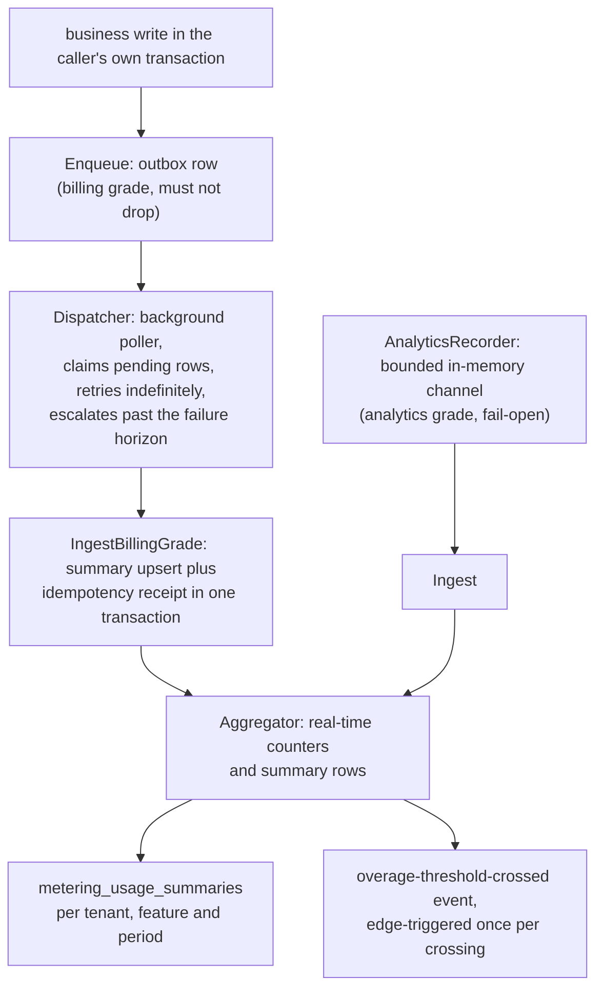

# metering

`go/metering` 是 speed 的用量计量模块:业务模块调用一个 `Recorder`
接口上报用量,与后端存储、聚合完全解耦。[metering 使用
页](/zh-cn/docs/user-guide/modules/services/metering/)展示调用;
本页讲模块为何把边界画在这里。

## 职责与边界

**计量只管测量与发信号;决定权在 billing。** 模块交付用量记录、
聚合与超额阈值跨越事件——刻意不带 Plan/Feature/Entitlement 领域
模型、信用点或配额执行中的任何一件。那些住在 `go/billing` 里,
它在模块图中位于 metering 之上并 import 它:billing 的 `UsageReader`
缝由 metering 的 `Aggregator` 结构性满足,配额决定经它读实时用量
计数。"零用量"绝不能对超额租户 fail-open,所以未接线的 reader 是
编码化错误,绝不是猜一个额度。

模块也没有 HTTP 面——它是业务模块进程内调用的 Go 级 API——没有
`jobs` 依赖:它的投递循环是进程内 goroutine 轮询器。直接依赖保
持克制而明确:仓内地基(pkgcore、dbkit、observability)、数据访问
的 GORM、计数器所基于的 OpenTelemetry 度量 API,以及一个小 UUID
包。

## 两级可靠性、两个调用入口

不是所有计量都能 fail-open。丢一条分析事件损失一个仪表盘数字;
丢一条计费事件损失的是收入——连同事后能让人发现损失的对账基准
数据一起没了。所以模块有两级、**两个不同的调用入口**,而不是带旗
标的同一个 `Record` 方法:

- **分析级**(`AnalyticsRecorder.Record`):fail-open。有界内存通道
  加后台 flush;缓冲满即丢事件并计数,flush 失败同样计入该丢失
  计数——丢事件计数对这级说出全部真相。
- **计费级**(`Enqueue` + `Dispatcher`):不允许静默丢失,也不允许
  静默双计。`Enqueue` 在**调用方自己的事务里**写一条 outbox 行;
  后台 `Dispatcher` 轮询 pending 行、投递进聚合器,无限重试,并在
  失败次数越过既定门槛后把永久失败的行升级为错误级告警。

为什么是 outbox 而不是第二次写或一条日志?outbox 让"业务成功了但
计量丢了"在物理上不可能:调用方的提交与计量的记录同生共死。代价
——每事件一次本地写——对计费级计量为之存在的低频高价值操作正好
合适;高频低价值的量按设计归分析级。

为什么计费级投递不放在 `Recorder` 接口后面?`Record(ctx, event)`
的签名放不下事务句柄,把保证路径硬塞进为"发了就不管"设计的形态
是选错抽象。`Enqueue(ctx, tx, event)` 是包级函数,正是为此。

幂等在每一层闭合重试环。`Enqueue` 以 `(tenant_id, idempotency_key)`
唯一索引去重,于是即使是在**新**调用方事务里的重试也返回既有行、
事务保持健康。outbox 行聚合已提交却重投的窗口由持久幂等回执闭合:
`IngestBillingGrade` 在同一次数据库事务里插回执与汇总 upsert,所以
两次写之间崩溃——或两个并发 Dispatcher——让事件恰好应用一次。
去重插入是 `ON CONFLICT DO NOTHING`,绝不是捕获错误:PostgreSQL
上语句错误会中止整个事务,捕获冲突等于毒化模块承诺保持健康的那
个事务。

**一个 feature 恰好属于一级。** 两级的落点都是同一张按租户、按
feature、按周期的计数器与汇总行,而行上不带级标记。经两级同时计量
的 feature 是任何读者都无法归因的混合体——计费数字默默混入分析级
被允许丢失的量。这条规则是调用方纪律,写在两个记录器调用作者都
会读到的地方。

## 聚合器:数据库为真,进程内求快

配额检查与仪表盘等不了批量聚合,所以 `Aggregator` 在进程内维护
实时计数器,并让每个事件在一条数据库仲裁的语句里折入数据库支撑的
`UsageSummary` 行——`INSERT ... ON CONFLICT DO UPDATE` 在服务端做
算术。汇总行是共享真值:第二个副本的折入经同一条原子语句落库,
进程重启后计数器在首次触碰时从汇总行重建。超额事件是边沿触发
的——每次阈值跨越恰好一个事件,绝不是一个后续事件一个。

outbox 表刻意是平台数据而非租户作用域——这是对"每张表都租户作用
域"字面读法的一处真实背离。`Dispatcher` 是必须找到**每个**租户
pending 行的后台进程;作用域仓储没有跨租户读路径,而受审计的系统
上下文逃生舱提升的是"谁可以问",不是"作用域仓储能看见什么"。表带
真实但不强制的 `tenant_id` 供操作员可见——与 jobs 自己的任务表
和审计轨迹同一形态——以 `AssertNotTenantScoped` 证明,绝不是
`AssertIsolated`。

认领顺序按重试排程公平行事:行只按自己的重试排程被认领,所以一
堆永久失败的行永远不会饿死它们身后的健康行,恢复的行在窗口打开
的那一刻即被够到,无论到达率如何。

## 塑造模块的取舍

- **调用方事务里的 outbox 胜过提交后发布。** 计费级的保证只有与
  业务写同原子才成立;代价是计费级调用方必须握着事务句柄——这正
  是 API 做成函数而非接口方法的原因。
- **进程内聚合器胜过分布式计数器后端。** 落地后端是进程内的;
  汇总保持共享的、数据库仲裁的记录——这让多进程正确性成为语句级
  性质,而非协调问题。
- **schema 声明、取值在构造。** 模块在注册表上声明周期桶与阈值
  配置项——只有 schema;聚合器读 Go 级选项。活读每租户配置值会为
  服务仍然只是占位的阈值添一条真实模块依赖:配额上限住在 billing
  的按计划 Grant 里,目前没有任何东西把它们接进 metering 的 Go 级
  阈值。
- **固定延迟重试,没有退避曲线。** 失败的行每轮询间隔至多重试一
  次,由其 `retry_after` 列排程;延迟不随尝试增长。排程同时就是
  公平机制,认领顺序绝不把从未失败的行排在失败行之前。

## 对外稳定面

- `Recorder`(以 `AnalyticsRecorder` 为落地的 fail-open 实现)、
  包级 `Enqueue` + `Dispatcher` 计费级对,以及带 `RealtimeCount`
  读与 `Ingest`/`IngestBillingGrade` 入口的 `Aggregator`。
- 三张表与双方言迁移:租户作用域的 `metering_usage_summaries` 与
  `metering_ingest_receipts`,平台数据 `metering_outbox_records`。
- 唯一发布的事件(`metering.overage_threshold.crossed`)、声明的配
  置项、`metering.*` 下的双语文案错误目录。
- 参考应用内的消费:`ai-gateway` 用量记录器缝在每次成功 AI 调用
  上喂分析级,admin 用量汇总端点读回结果行;`go/billing` 经结构
  化 `UsageReader` 是 metering 的第一个消费者。

## Source

- 模块纪律:[go/metering/AGENTS.md](https://github.com/vislake/speed/blob/main/go/metering/AGENTS.md)

## 相关页

- [Platform services](/zh-cn/docs/developer-docs/modules/services/) 组导览;同组
  [storage](/zh-cn/docs/developer-docs/modules/services/storage/)、
  [notification](/zh-cn/docs/developer-docs/modules/services/notification/)、
  [pki](/zh-cn/docs/developer-docs/modules/services/pki/)、
  [integration](/zh-cn/docs/developer-docs/modules/services/integration/)
- [总体架构](/zh-cn/docs/developer-docs/architecture/)——metering 在模块图中位于
  billing 之下
- 使用:[用户指南的
  metering](/zh-cn/docs/user-guide/modules/services/metering/)、
  [计费与计量域页](/zh-cn/docs/user-guide/domains/billing-metering/)
