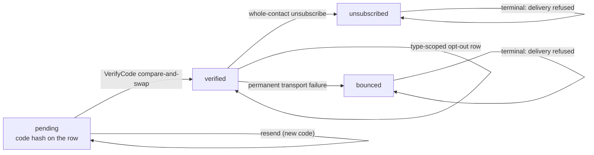
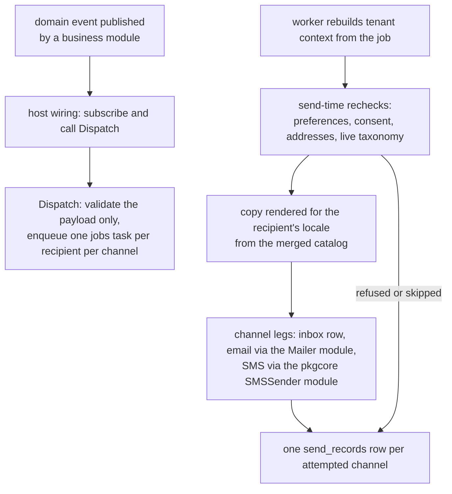

# notification

`go/notification` 是平台的外发消息模块:把租户的通知投递给它服务
的人——站内信、邮件、短信——走那些人选的渠道;对任何租户都不是
用户的联系人,则只在同意先被验证之后发送。[notification 使用
页](/zh-cn/docs/user-guide/modules/services/notification/)讲接线;
本页是设计故事。

## 职责与边界

模块是依赖图的**叶子**,这一事实驱动了下面几乎一切。它永不 import
`authn`、`rbac` 或 `org`:用户是从已验证调用者或领域事件学到的不
透明 id;用户的地址是身份数据,在发送时刻经宿主提供的
`UserAddressResolver` 模块解析,从不在这里落表。业务模块也永不
import `notification`——它们发布领域事件,**宿主**订阅并调
`Deliveries().Dispatch`,决定哪些事件变成哪些通知。模块自己的
`Register` 除自身 inbox-created 事件(供本副本实时扇出)外不订阅
任何东西。

两个后果随之而来。其一,"关掉通知"是接线问题而非代码改动——没有
任何业务模块点名这个模块。其二,设计允许的唯一例外——同步、强一致
的验证消息——由本模块用于自己的外部联系人验证,而 `authn` 的登录
码走 `authn` 自己的短信发送器:两个业务模块都不为"用户正在等的
消息"依赖 `notification`。

模块还刻意不拥有**文案**。通知类型的模板住在声明模块自己的双语
语言包里,按 `<type_key>.<channel>.<part>` 的 id 约定,投递时按收件
人 locale 从宿主合并的目录渲染。缺失模板 id 是编码化的内部失败——
绝不回退到另一种语言,绝不渲染半截消息。

## 活类型注册表,而非模板库

每个通知类型由所属业务模块在 `Register` 期间经
`reg.NotificationsSeat().Add` 声明:key(`<module>.<entity>.<action>`)、
默认渠道、收件人能否退订。事务型类型——验证码——不可退订。三个
设计决策挂在这张注册表上:

- **活的读取,从不快照。** 偏好写入与投递都查当前分类法,所以注册
  晚于 `notification` 自己 `Register` 的类型合法、未知类型或渠道在
  偏好边界就被拒绝、不可退订的类型无法被关掉。
- **偏好矩阵按类型 x 渠道**,缺失的行解析为类型声明的默认值。这
  刻意不是全局开关:"发生了什么"是业务事实,走哪些渠道是收件人
  的偏好。
- **注册表是交付物的形态,不是菜单。** 因为声明模块同时拥有类型
  与文案,就没有一个会与渲染它的代码漂移的中心模板库。

## 两类收件人,两套准入规则

系统用户与外部联系人(牙科集团的患者,例如——任何租户的用户都
不是)本质不同。用户走偏好矩阵;地址在发送时刻来自宿主的身份层。
外部联系人只存在于验证过它的那个租户里:一个渠道上的一条同意门控
地址,落在 `verified_contacts`,地址加密落库、盲索引列可查。

同意只经两条路径取得,各留审计痕迹:

- **双向确认(double opt-in)**——`pending` 行随身携带验证码的
  SHA-256 哈希(每联系人一个待验证码,骑在行上,从不单开表);
  `VerifyCode` 在一次性比较并交换中翻转状态。验证消息本身是
  未验证地址唯一允许收到的消息,其发送按租户与按地址双重限流。
- **业务方声明(business attested)**——当面或已成文的同意(患者签
  署的表格)让联系人直接以 `verified` 进入,携带 `ConsentRef`,
  责任可追溯。

`unsubscribed` 与 `bounced` 是终态:投递在触碰任何传输之前就拒绝
它们;重新声明也不可能复活一个叫租户停手的地址。同意是租户级的——
从一家诊所退订不改变另一家的任何事。更细的类型级退订是独立的
(租户、联系人、类型)行而非单元格集合,于是每次收窄都是独立的同意
事实、带自己的审计记录,共享行上也没有读改写竞争。

## 投递:Dispatch 只校验,发送时刻做决定

`Dispatch` 天生异步:它只校验载荷自身所需,然后按收件人 x 渠道各
入队一个 `jobs` 任务。入队与投递之间一切可能变化的东西——渠道偏好、
外部联系人的同意与状态、在档地址——都由任务在**发送时刻复查**,
绝不冻结进载荷。这正是让入队中途落下的退订或吊销在下一跳就生效
的机制。

每次尝试落定一行 `send_records`(平台数据,按派生幂等键去重),且
记录的错误文本永远不是传输的原话:行存有界分类,因为传输以它自己
选的形式回显地址,对自由文本做子串脱敏会系统性地漏掉最可能的输入。
"一次投递的多次重试间至多一次"的保证被如实陈述,双发窗口在内——
记录写在传输调用之后,模块明说而非假装可以绕开不可知之物。

站内信是一等渠道,不是邮件的附庸。站内投递先落行,行提交后才发布
`notification.inbox.created`——于是消费者(SSE 流、经总线跨副本)
读回的是行而不是与写者赛跑。流端点
(`GET /api/v1/notifications/stream`)刻意不在模块的 OpenAPI 片段里
——server-sent events 不是 OpenAPI 3.0 媒体类型——手工挂载并在片段
头部记录在案。

## 塑造模块的取舍

- **宿主接线胜过映射表。** 设计文档里"事件到通知"的映射本可以是
  模块自有的表;落地形态把订阅放在宿主手里——宿主本就同时 import
  两侧。`notification` 保持叶子位置,"什么事件发什么通知"的决定
  留在跨模块知识真正所在的地方。
- **没有聚合与投递限流。** 模块的限流管验证码发送与同意创建路径;
  常规投递按渲染原样发出。重放去重折叠相同的重复派发;刻意重发
  携带新的一次性发生标记。
- **地址经模块解析,而非身份表。** 用户收件人的验证按契约委托给宿主——
  resolver 必须返回宿主已验证的地址。这种不对称被写明:
  永不向未验证地址发送的规则在联系人侧以代码执行、在用户侧以契
  约执行,因为外部联系人没有宿主侧身份存储,而用户有。

## 对外稳定面

- `/api/v1/notifications` 下十一个操作(收件箱读取与已读家族、未读
  计数、类型目录、偏好读写、联系人花名册的列表/创建/验证/重发),
  由模块片段生成,外加手工挂载的 SSE 流。
- 服务访问器:`Preferences()`、`Contacts()`、`Deliveries()`。
- 六个必填宿主选项(`WithSMSSender`、`WithMailFrom`、两个联系人
  盲索引器、`WithDeliveryQueue`、`WithUserAddressResolver`)——
  缺任何一个 `Register` 都以各自具名错误拒启。
- 事件:`notification.inbox.created`;`notification.contact.*` 下的
  审计动作;双语文案错误码;四张租户表与两张平台表。

## Source

- 模块纪律:[go/notification/AGENTS.md](https://github.com/vislake/speed/blob/main/go/notification/AGENTS.md)

## 相关页

- [Platform services](/zh-cn/docs/developer-docs/modules/services/) 组导览;同组
  [storage](/zh-cn/docs/developer-docs/modules/services/storage/)、
  [pki](/zh-cn/docs/developer-docs/modules/services/pki/)、
  [integration](/zh-cn/docs/developer-docs/modules/services/integration/)、
  [metering](/zh-cn/docs/developer-docs/modules/services/metering/)
- [总体架构](/zh-cn/docs/developer-docs/architecture/)——中间件链、消息目录、短信模块
- 使用:[用户指南的
  notification](/zh-cn/docs/user-guide/modules/services/notification/)、
  [任务与通知域页](/zh-cn/docs/user-guide/domains/jobs-and-notifications/),
  以及投递跑在其上的 [jobs
  队列](/zh-cn/docs/user-guide/modules/core/jobs/)
