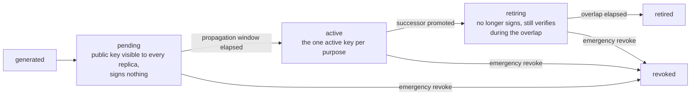

# pki

`go/pki` 拥有需要生命周期的密钥材料:签名密钥与 X.509 证书,从生成
经轮转到吊销。[pki 使用页](/zh-cn/docs/user-guide/modules/services/pki/)
展示接线;本页讲模块为何是这副形态——一副回答自对真实生产证书子
系统的诊断的形态(零轮转能力、平台 CA 与租户证书同表同弱钥、无
吊销、序列号可预测),那些失败直接变成了本模块的设计约束。

## 职责与边界

模块刻意**不是**通用 PKI:没有传输层 TLS 证书、没有 ACME、没有
OCSP 响应器(只有 CRL)、没有跨部署 CA 联邦、没有证书透明日志,
也没有任何导出私钥的 API。它的消费者是自持密钥材料的平台——签发
令牌、为自己的输出背书——而不是最终客户。

为什么是独立模块而不是谁的角落?密钥材料生命周期需要建表、`jobs`
排程与租户上下文,这三样都不该进 `pkgcore` 依赖底座;它与认证
(调用者是谁)是两件事,而 `authn` 已经是全库最大的模块;`dbkit`
在依赖图底层,把模块放进去即成循环。像任何业务模块一样,它携带
`Component` 描述符。

内部是两层、一条边界:**密钥生命周期层**(`Signer` 模块、状态机、到期
扫描)与建在其上的 **X.509 层**(CA 签发、证书、CRL)——一张证书就
是一把有生命周期的密钥外加一份由 CA 签名的身份声明。`authn` 消费
第一层,且绝不能看到第二层:JWT 验签只需要公钥与 kid,证书解析与
链校验对它是纯攻击面。

## Signer 模块:签名操作,不是取出私钥

模块的决定性决策是它的形状:`Signer` 暴露
`GenerateKey`/`Sign`/`Public`/`Destroy`——操作——没有任何把私钥
读回来的途径。`Protect`/`Unprotect` 式设计会让明文密钥必经本进程
内存,彻底毁掉 KMS 后端存在的意义。正是这个形状让"私钥永不离开
边界"成为可实现的能力:`vault` 与 `kmsaws` 两个提供商子包各自注册
两种模式——envelope 模式(密钥本地生成、由外部服务包裹,密文本
身**就是** key 引用——提供商不自持任何存储)与直签模式(密钥在外部
服务内部生成、永不导出,声明 `KeyNeverLeavesBoundary` 能力)。
`LocalSigner`,每个单元测试与独立启动都用的零依赖实现,刻意没有
该能力:签名要把私钥解密进进程内存——这是免依赖签名器的明码标价
的代价。

每个提供商住在自己的子包、自注册,`database/sql` 模型:从不
import `vault` 的宿主就不为它付任何代价。因为一个注册名携带一个
固定能力、而 envelope/直签之分是运行时模式,每个提供商注册两个名
(`signer.vault` 与 `signer.vault-direct`,kmsaws 一对同理)。

## 生命周期状态机:pending、active、retiring、retired、revoked

三个状态承载着设计的推理:

- **`pending` 因副本缓存而存在。** 副本缓存密钥集。直接升 `active`
  的密钥会让副本 A 用副本 B 还没见过的 kid 签名——轮转后几十秒
  内随机出现的登录失败。所以新密钥先进 `pending`:公钥半场经总线
  与事件失效的缓存传播到每个副本,只有传播窗口(数个缓存刷新周期)
  过后才能变 `active`。被诊断的系统没有这个状态,因为它根本不在
  运行时轮转。
- **`retiring` 重叠期由消费者定长,不由 pki。** 重叠期必须覆盖该
  密钥签过的最长寿凭证——对 `authn` 就是访问令牌 TTL。pki 不知道
  这个数字;消费者声明它——这正是 `authn` 的 `KeySource` 接口带
  `EnsurePurpose(ctx, purpose, algorithm, maxCredentialLifetime)`
  的原因,也是 `authn` 无需 import 就能说出它的原因。
- **模块管状态机,宿主管一切下发。** 一个 `jobs` 任务扫描临近到期
  的密钥、预备继任者并提升之;宿主按自己的节奏排程那次扫描——本
  模块从不自排执行,也从不推送到任何外部系统,因为下发目标因部署
  而异。退役材料的销毁遵循同构的划分:`ReclaimRetired` 是宿主显式
  调用的方法,绝不自动——直签模式下 `Destroy` 是真实的提供商侧
  删除,是任何扫描都不该擅自代劳的策略动作。

吊销立即生效且收敛:`RevokeSigningKey` 写入 `revoked` 并经模块自己
的事件使进程内密钥集缓存失效——一个副本上的吊销让每个副本立即排
除该密钥,不必等 TTL。

## 一张表绝不混两个数据域

被诊断系统的中心缺陷是平台 CA 与租户证书在同一张表、同一把弱钥。
这里,`pki_signing_keys`、`pki_authorities` 与吊销台账是平台数据;
`pki_certificates` 是**租户数据**,租户作用域、`AssertIsolated`。
任何业务表都不持有私钥:那三张表只带 `signer_name` + `key_ref`——
指向真正拥有材料的那个 `Signer` 的不透明指针;`pki_local_keys` 是
`LocalSigner` 自己的加密存储,没有其它代码碰它。

台账的存在出于跨域原因:租户作用域的读取永远无法枚举一把平台
CA 跨全部租户吊销过的每张证书,所以 `pki_certificate_revocations`
是反规范化、只追加的平台表,带真实但不强制的 `tenant_id`——与
jobs 与审计轨迹相同的让步。证书吊销是**台账仲裁的**:行转换与台账
插入都是守卫的单赢家语句,持有不同理由的并发吊销永远无法让两者
互相矛盾;对已吊销证书的重试是调和而非重复写入。序列号是 16 字节
随机数——绝不是时间戳,即诊断发现的那个冲突源。"每个 purpose 至
多一把 active 密钥"的不变量由数据库的部分唯一索引执行,而非应用
纪律。

X.509 层补上自签平台所需的一切:固定 subject 幂等建链(重启永不
铸第二条链)、拒绝链上任意位置已吊销权威的签发、经标准库自己的
`crypto/x509` 路径校验(绝非手写验证器)的链验证——拒绝已吊销证书
或直到根的任何已吊销权威——以及带 RFC 5280 编号的 CRL 生成。参考
应用把它端到端消费为 AI 输出背书层:租户证书为每个被观察到的成功
仿真输出签名,分享闸只有在证书可验证、签名验得过、实时内容摘要与
背书摘要一致时才放行被背书的输出。

## 塑造模块的取舍

- **消费者声明的重叠期 vs 模块自有的轮转策略。** 轮转节奏是 pki
  自己的配置;retiring 重叠期是消费者的凭证寿命。拆开两者是唯一
  能把算术算对的途径,因为只有消费者同时握着两个数字。
- **结构模块接口胜过 import。** `authn` 以纯标准库类型、零 pki import
  声明 `KeySource`;pki 的 `Service` 结构性满足它,由留在模块本身
  (而非测试文件)的编译期形状断言钉住。代价——未来签名变更会在
  恰好一处大声编译失败——正是目的。
- **权威与证书没有到期驱动生命周期。** 签名密钥层按排程轮转;
  X.509 层的生命周期是吊销形态。没有任何东西盯着
  `pki_authorities`/`pki_certificates` 的 `not_after` 自动续期——
  宿主自己跟踪证书到期并重新签发,参考应用 365 天有效期的背书
  证书让这一点成为真实的运维事实,而非假设。

## 对外稳定面

- 密钥生命周期层:`EnsurePurpose`、`ActiveSigner`、
  `VerificationKeys`、`RevokeSigningKey`、`ExportJWKS`——冻结 API,
  由 `authn` 经 `KeySource` 消费。
- X.509 层:`CreateRootCA`/`CreateIntermediateCA`/`IssueCertificate`/
  `SignCertificate`/`VerifyCertificate`/`RevokeCertificate`/
  `GenerateCRL`。
- `Signer` 模块:`signer.local`,以及 `vault`/`kmsaws` 子包的注册名,
  各含 envelope 与直签两变体与声明的能力。
- HTTP:`/api/v1/pki` 下五个操作(吊销签名密钥、吊销证书、两个
  JWKS 导出、CRL 拉取)。签名密钥吊销以平台域权限门控,证书吊销
  以租户域权限门控——一个名字无法跨越两个数据域,而平台半场的
  租户域持有者能停掉整个部署的令牌签发。
- 五张表横跨三个数据域、双方言迁移、`pki:*` 权限、四个审计动作、
  五个生命周期事件。

## Source

- 模块纪律:[go/pki/AGENTS.md](https://github.com/vislake/speed/blob/main/go/pki/AGENTS.md)

## 相关页

- [Platform services](/zh-cn/docs/developer-docs/modules/services/) 组导览;同组
  [storage](/zh-cn/docs/developer-docs/modules/services/storage/)、
  [notification](/zh-cn/docs/developer-docs/modules/services/notification/)、
  [integration](/zh-cn/docs/developer-docs/modules/services/integration/)、
  [metering](/zh-cn/docs/developer-docs/modules/services/metering/)
- [总体架构](/zh-cn/docs/developer-docs/architecture/)——`KeySource` 模块、中间件链、模块图
- 使用:[用户指南的
  pki](/zh-cn/docs/user-guide/modules/services/pki/)、
  [身份与访问域页](/zh-cn/docs/user-guide/domains/identity-access/)(参考应用如何把
  pki 接成 authn 的密钥源)
