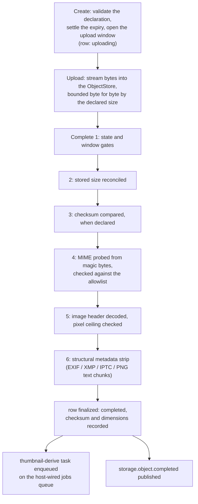
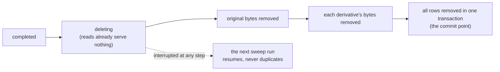

# storage

`go/storage` 是平台的媒体对象模块:一个租户的对象由数据库描述,
字节住在对象存储里,传输生命周期带服务端复验把字节送进送出。
本页讲模块为何是现在这个形态;[storage 使用
页](/zh-cn/docs/user-guide/modules/services/storage/)讲你接什么线、
调什么。

## 职责与边界

模块拥有的是**元数据,不是字节**——也不是存储本身。字节住在宿主
的 `ObjectStore` 里(独立部署是本地目录,分布式是 S3 兼容存储;模块
从不知道是哪个),经内核缝解析。模块拥有的是"一个对象的完整故事":
上传者在任何字节到达之前声明了什么,字节入库后管线确立了什么,
对象处在生命周期的哪一步。

它刻意**不做**的事:

- **不接受调用方提供的键。** 对象键由模块从租户与对象 id 推导,
  永不越过网络——消费方只按 id 指名对象。键一旦泄露就暴露了租户
  的存储布局。
- **没有预签名传输。** 上传与读取时字节都流经应用服务器。模块的
  复验管线反正要看这些字节,而中转也让本地存储与 S3 保持同一个
  协议形态。
- **没有定时器。** 过期在创建时定案、由宿主经队列排程的清扫
  **执行**——模块自己从不跑钟。保留期是宿主策略,模块只提供机制
  (`EnqueueExpirySweep`),节奏由宿主选。
- **不做病毒扫描、不写审计行。** 扫描钩子与审计落行是宿主的事;
  模块声明审计动作,需要行时由宿主在已声明动作下显式落。

## 三步协议:为什么以对字节的探测为权威

上传者的声明只是一面之词。`Create` 校验声明并以 `uploading` 状态
预留一行、开一个上传窗口;`Upload` 把请求体流式写入存储,逐字节
受声明大小约束;`Complete` 复验实际到达的内容,然后才把行落定为
`completed`。读面只服务 completed 对象——未完成的上传对任何读者
不可见。

为什么三步而不是一步?对象是媒体量级(MiB 级、图片居多),所以模块
在任何字节移动之前就拒绝坏声明、以流式而非整包缓冲搬运正文、并
把权威裁决留到字节真正可检视的那一刻。复验管线按固定顺序执行:

1. 状态与上传窗口门;
2. 已存大小与声明对账;
3. 声明了校验和则比较已存 SHA-256;
4. 媒体类型从内容魔数探测——绝不是文件名或调用方可控的头——
   对照白名单,再拿声明类型与探测结果对账;
5. 图片只解头部(`DecodeConfig`)并查像素上限(worker 绝不应解码
   传输管线已拒绝过的图片);
6. 结构性元数据剥离:移除位置与作者元数据的载体——JPEG 的 EXIF、
   XMP、IPTC 段,PNG 的 `eXIf` 与文本块族——然后对象才可读。
   患者照片带 GPS 坐标是等着发生的隐私事故,所以剥离在每次完成
   时执行,不是可选项。

剥离是结构性的、绝非重编码:像素数据逐字节原样通过,walkers 对
结构严格——元数据可剥但结构无法完整验证的文件**直接拒绝**,绝不
凭信任放行。白名单本身在注册时受闸门约束:一个媒体类型只有在模块
既能做像素检查**又能**做剥离时才可准入——被接纳的类型即是一句
承诺:管线的每一步对它都适用。

**过期在创建时定案,不悬空。** 不请求保留期的上传在宿主的配置上限
处到期——绝不会默默永久。永不过期的对象需要两次刻意动作:宿主先
选择开启(`WithNoExpiryAllowed`),再对单个对象显式请求。省略产生
有界生命,永不产生永久。

## 生命周期:崩溃收敛的删除与宿主排程的清扫

删除对象要字节与行一起消失,但崩溃可能落在任意两步之间——所以
协议按"可续跑、不重复"构造:

1. 把行标记为 `deleting`——从这一刻起任何读者都看不到它,因为
   读面只服务 completed 行;
2. 从存储删除原字节(按存储的删除契约幂等);
3. 按确定顺序删除各派生行的字节;
4. 在单事务里删除所有行——提交点;恰好一次竞争运行赢得它并发布
   删除事件。

任一步被打断都留下下一次清扫可收敛的工作;并发的第二次删除安静
收敛。协议只拒绝一种状态——仍处 `uploading` 的对象——因为在飞
上传属于传输运行时,直到窗口关闭;只有清扫能回收它。

派生生成(缩略图)镜像同一纪律:worker 先写派生字节、最后插派生行,
插入在单事务里以"对象行仍存在且为 completed"为闸。两步之间崩溃
只留下可重新派生的字节,绝无指向缺失内容的行;与插入竞争的删除
赢得闸门,不留任何需要日后补的窗口。

清扫对每个租户跑三阶段:续跑被打断的删除、回收窗口已关的
`uploading` 行、删除保留期已过的 completed 对象。一行的失败绝不
中断整轮——fail-fast 的清扫会在每轮第一个撞上同一行毒行、饿死其
后所有行——部分失败的一轮回报 `storage.sweep_partial_failure`,
点名失败行。

## 塑造模块的取舍

- **服务端中转传输胜过预签名 URL。** 预签名上传让字节不经过应用
  服务器,但把校验推给服务器无法像自己的探测那样信任的回调,并且
  每个存储实现都要带一套 presigner 机制。模块为它瞄准的独立部署
  与小副本形态接受了中转代价。
- **每对象串行化是进程内的。** Upload 与 Complete 经进程内锁表对
  单对象串行;分布式部署的两个副本共享存储却不共享锁。
  `ObjectStore` 缝没有 compare-and-swap,所以多副本交错是如实记录的
  残余,不是假装不存在的保证。
- **清扫由宿主排程。** 保留期执行依赖宿主排程清扫任务;一个不排程
  的宿主会保留一切。模块认为这是对的取舍:过期是策略问题,队列
  接线归宿主——但清扫任务的窗口化幂等键让并发入队不会互相竞争。

## 对外稳定面

- `NewModule(db, ...)`:大小与像素上限、媒体类型白名单(默认
  jpeg/png)、上传窗口与对象最长寿命等选项,以及必填的
  `WithQueue` 接线。
- 三个服务:`ObjectService`(传输生命周期与读面)、`DeriveService`
  (缩略图)、`LifecycleService`(删除、清扫、清扫入队)。
- HTTP:`/api/v1/storage` 下七个操作,由模块自己的 OpenAPI 片段
  生成、经编译断言校验的 handler 实现;内容响应无条件携带
  `X-Content-Type-Options: nosniff` 与
  `Content-Disposition: attachment`。租户只来自请求上下文。
- 错误码是带双语文案的 `storage.*` `apperr` 值;事件
  `storage.object.completed` 与 `storage.object.deleted`;权限
  `storage:read`、`storage:write`;两套双方言迁移。

## Source

- 设计:[docs/internal/07-platform-services.md](https://github.com/vislake/speed/blob/main/docs/internal/07-platform-services.md)(媒体存储一节)、[03-deployment-modes.md](https://github.com/vislake/speed/blob/main/docs/internal/03-deployment-modes.md)(`ObjectStore` 缝)、[04-data-and-tenancy.md](https://github.com/vislake/speed/blob/main/docs/internal/04-data-and-tenancy.md)(租户数据域)
- 模块纪律:[go/storage/AGENTS.md](https://github.com/vislake/speed/blob/main/go/storage/AGENTS.md)

## 相关页

- [Platform services](/zh-cn/docs/developer-docs/modules/services/) 组导览;同组
  [notification](/zh-cn/docs/developer-docs/modules/services/notification/)、
  [pki](/zh-cn/docs/developer-docs/modules/services/pki/)、
  [integration](/zh-cn/docs/developer-docs/modules/services/integration/)、
  [metering](/zh-cn/docs/developer-docs/modules/services/metering/)
- [总体架构](/zh-cn/docs/developer-docs/architecture/)——内核缝与能力校验
- 使用:[用户指南的
  storage](/zh-cn/docs/user-guide/modules/services/storage/)、
  [存储、分享与 AI 域页](/zh-cn/docs/user-guide/domains/storage-sharing-and-ai/),
  以及其异步半场跑在其上的 [jobs
  队列](/zh-cn/docs/user-guide/modules/core/jobs/)
