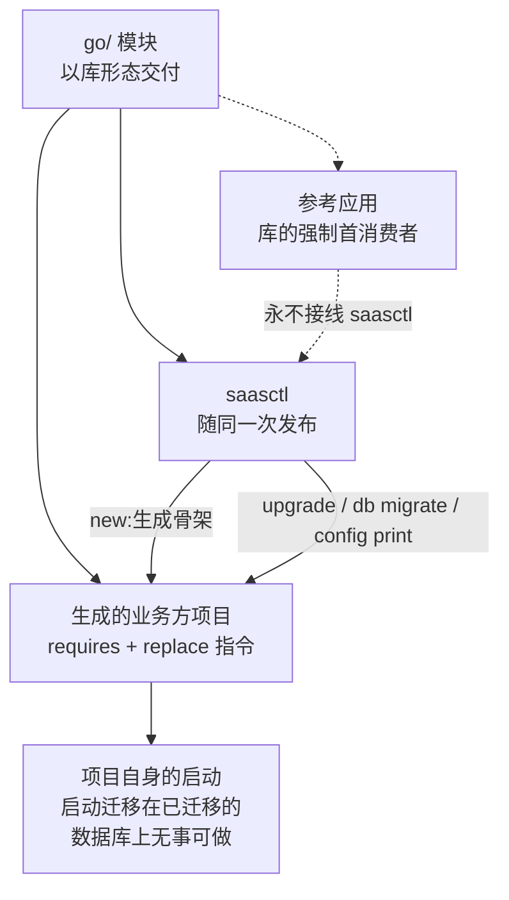

# saasctl

speed 交付的是库;而业务方把库变成应用的那一刻,也必须有人交付。
saasctl 就是那一刻的工具:塑造业务方实际运行的那个项目——生成项目
骨架(`new`)、把 speed require 迁到同一个发布版本(`upgrade`)、在
启动前应用所要求模块的 schema(`db migrate`)、预览一次启动会跑在
什么配置上(`config print`)。四个命令的用法在[用户指
南](/zh-cn/docs/user-guide/modules/tools/saasctl/);本页讲形态背后
的设计。

## 为什么是 CLI 模块

四个动作全部发生在尚无装配存在的地方——建目录、改 `go.mod`、应用
SQL、渲染配置——在启动之前与启动之外,从不进入启动本身;所以没有
一个能成为运行中应用的功能。CLI 让每个动作显式、可脚本化、可重复,
幂等被设计进来,于是第二次运行兼作一次校验;命令面刻意小而刻意用
标准库——plain `flag` 分发,没有 cobra。

为什么 CLI 以 **monorepo 里的模块**形态、随锁步发布,而不是一个独
立工具?它在版本层面与库耦合:内嵌模板必须跟着它编译的模块走,
`upgrade` 的版本语法是发布协调器自己的版本语法的双生。一个版本号
就是整个兼容面——对库如此,对维护其业务方的工具也如此——所以
saasctl 与它塑造的每个模块共享同一次发布、同一张 CI 矩阵、同一条
`AGENTS.md` 纪律。它不共享的是内核接线:参考应用永不组装它(见最
后一节)。

## 两条消费方故事,一个边界工具

speed 有两条不能混淆的消费方故事:**参考应用**是*库*的强制首消费
者;而**生成项目**消费 *saasctl*——并经由自己的 `go.mod` 消费库本
身。因此骨架必须真的能编译、能启动,而工具自身的证明是在真实项目
上跑通「生成—tidy—build—boot」周期,而不是再多一套参考应用套件。

## `new`:一个「构造即可用」的模板

骨架不是代码合成的:它是一棵内嵌的真实文件树,先对真实 speed
checkout 做一次真实 materialise、`go mod tidy`、`go build`,再把路
径转回 token。编译正确性由材料化应用的真实构建证明,绝不就地编译
——`//go:build ignore` 标记让内嵌树完全不进本模块自己的构建。单个
二进制随身携带模板:`new` 不需要另拉模板仓库,模板与生成器永远同
版本发布。

这棵树镜像参考应用的 `cmd/server` 形态,减去一切 demo 专属件——
没有 notes 模块,没有 demo 租户、授权、成员存储或种子数据。照抄参
考应用会让项目继承它的玩具身份层,所以主机模块(authn 的
`MembershipReader`、org 的 `SubjectResolver`、config resolver)保持
未接线、按各自模块的契约 fail closed,doc 注释把每个模块点名为主机
的第一项任务。诚实的后果被讲出来而非粉饰:没有成员存储,正确密码
与错误密码的回答一模一样,都是 401 `authn.invalid_credentials`。

可切换宇宙是最小组合 `{authn, rbac, org}` 加上它的四个闭包;必备五
件套(`pkgcore`、`dbkit`、`tenancy`、`config`、`observability`)永在。
选择是带向下闭包的正选:`--with` 列出你要什么,没有 `--without`——
排除 `authn` 就是不列它;选 `rbac` 或 `org` 而不带 `authn` 会被拒
绝,并点名 `authn` 为隐含依赖。`go/pki` 永不是选项:它作为
`KeySource` 静默跟随 `authn`——机制依赖,不是业务方主题。不同选择
之间只有两个文件不同——`go.mod` 的 require 集与 `server.go` 的接
线——`config.go` 逐字共享,因此启动契约永不随选择改变;正是这份稳
定,让下面两个命令在任何选择上都良定义。

## `upgrade`:把锁步发布当成改写问题

因为版本号就是整个兼容面,一次升级就是一次改写——把每个 speed
require 迁到目标版本——由 go 命令自己的解析器
(`golang.org/x/mod/modfile`)改写解析后的语法树并打印回来。只有每
条 speed require 的版本 token 变化;第三方 require 及其 `// indirect`
标记、`replace` 块、注释与格式逐字节保留,被改写的模块集合来自文
件自身的 require 行。`--version` 必填——尚无可用发布,版本发现尚未
实现,目标版本由调用方显式给出——写回前结果会从字节重新解析并自检;
检查拒绝那些
`replace` 或 `exclude` 会击败改写的文件(钉住其它版本的模块间
replace 在构建期胜出;exclude 目标版本等于宣告它不可用),否则一份
干净的改写报告就是在谎报项目实际构建的版本。

本工具产出的每个文件都受同一条规则管辖:**产物在交付前必须通过其
消费者的解析器。** `new` 用 `module.CheckImportPath`(go 命令自己的
校验器)校验生成 go.mod 将声明的模块路径,并把整份文档交给
`modfile.Parse`——其 `replace` 指令逐字嵌入解析出的 speed-root 路
径,而并非每个文件系统路径都是合法的 go.mod 语法。检查产物而非输
入,无需枚举消费者的词法在哪里会断。

## `db migrate`:require 图决定 schema

迁移宇宙是项目 `go.mod` 的 speed requires 与自带迁移的根模块——
`authn`、`config`、`org`、`pki`、`rbac`——的交集。`go.mod` 是项目
用了哪些模块的唯一权威陈述;宇宙从它导出、无需用户列举、不可能漂
移,而且 `pki` 的表只有在文件真正 require `go/pki` 时才迁移。

应用走与生成应用启动 `Apply` 同一个 `dbkit.MigrationRegistry`,同一
个启动环境,一模块一事务,每个文件落地即记入 `schema_migrations`
——纯版本化 SQL,从不是 `AutoMigrate`。重跑只应用未记录的,因此
「先 CLI 后启动」与「只靠启动」收敛到同一 schema。CLI 双生存在的
原因:运维需要在任何进程运行前让 schema 就位——首次启动的准备、
供应、CI。拒绝都点名理由:没有 speed requires 说明多半不是生成项
目;已有数据库却没有 `schema_migrations` 账本,则连同修复指引一起
拒绝。两种部署模式都被接受——分布式模式改变的是哪些组件组装真实
实现,绝不是项目数据库讲哪种方言。共享 SQLite 文件的危险用使用契
约回答而非锁:启动任何副本前先把 `migrate` 跑完。

## `config print`:应用自己启动配置的双生

`config print` 经由项目自己的 `cmd/server/config.go` 的 appconfig
双生——即内嵌模板里那份文件,双生关系由测试钉住——解析生成项目
的启动配置,所以打印的值与拒绝与应用的完全一致。原始值与有效值不
同时,两者都显示。超出启动本身的一步解析是 SQLite 路径:相对值经
唯一共享的 `EffectiveDBPath` 函数锚定到应用运行目录——`db migrate`
正是经它打开数据库,所以 print 报告的文件与 migrate 打开的文件按
构造相同。部分设置的 `APP_S3_*` 或 `APP_SMTP_*` 组、畸形输入,都
以应用自己的 `configFromEnv` 会抛出的同款编码错误拒绝。密钥行无论
环境里有什么一律渲染 `[redacted]`——绝不露字节、绝不露形状——哪
些变量是密钥,是一处被每一行渲染查阅的声明。

## 为什么参考应用永不接线它

强制首消费者规则按故事分别满足:参考应用证明库;saasctl 的消费方
是生成项目——放进参考应用,这个工具就是在操作自己的产物。因此它
的端到端证明是真实生命周期:材料化每个合法选择,真实联网 `go mod
tidy` 与 `go build`,迁移一个全新数据库,启动并对组装好的 HTTP 链
做冒烟。CI 化的形态是 scaffold-verify 流水线:每天对一个选择、在
两种部署模式下、对着真实 Redis、RustFS 与 Mailpit 容器跑完整周期。
证明无法展示的,被记录而非伪造——正确密码登录也在其列——范围限
制同样如此:`go.mod` golden 需要真实 tidy 流程(每当某个模块的依赖
集变化时),五个选择里有四个没有自己的 CI 双模式启动证明。两者都
是刻意、成文的裁剪,不是沉默的缺口。

## Source

- [saasctl AGENTS.md](https://github.com/vislake/speed/blob/main/go/saasctl/AGENTS.md) —
  四个命令的权威契约;本页的主要来源。
- [scaffold-verify.yml](https://github.com/vislake/speed/blob/main/.github/workflows/scaffold-verify.yml) —
  针对真实生成项目的每日端到端证明。
- [saasctl 用户指南](/zh-cn/docs/user-guide/modules/tools/saasctl/) — 四
  个命令的用法,从操作者一侧。
