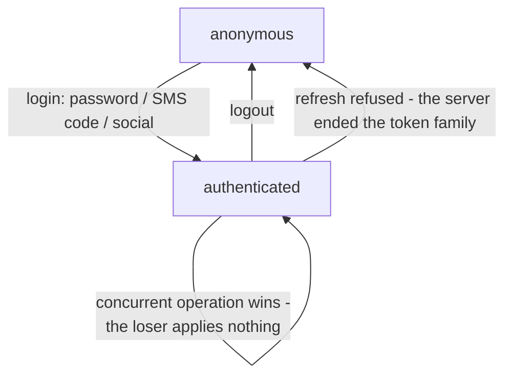

# @speed/auth-core:会话即内存状态机

`createAuthSession(store)` 把生成的 authn 操作——密码与 SMS 登录、
登出、租户切换、step-up、刷新,外加喂给注册与社交登录流程的 SMS 码
请求、register 与社交操作——编成一个可观测会话。本页解释会话为什么
长成这个样子:每个令牌住在哪里、并发操作之间的竞争如何裁决、权限检
查为什么从不抓取任何东西。怎么接进应用,看[用户指南的 auth-core 使用
页](/zh-cn/docs/user-guide/modules/web/auth-core/)。

## 职责与边界

会话层按构造就是无头的。**无 UI、无导航**:社交渠道的授权 URL 是一
个纯请求,上报给上层,之后由宿主自己的导航层决定——渲染活在 auth-ui
组件族。**无 storage 写入、无 `restore`**:重载即匿名;访问令牌坐在
调用方提供的存储里,刷新令牌在会话闭包内(见下)。**钩子只读、从不驱
动**:`useAuthState`、
`useCurrentTenant`、`usePermission` 读取宿主用 `attachSession` 挂上
的那一个会话(后绑生效),登录与登出由事件处理器调用,永远不由钩子调
用。React 是 peer 依赖——只有本来就渲染 React 的宿主才带上它。

## 设计:为什么令牌住在现在住的地方

authn API 在签发令牌的响应体里返回刷新令牌,不设刷新 cookie——authn
唯一设过的 HttpOnly cookie 是社交绑定 pre-auth 那个。于是刷新令牌要
么由会话闭包持有,要么就得写进某个地方,而设计拒绝把它写进任何地
方:两个令牌按必然性都是页面脚本可见的内存值,本包把这个面缩到最
小——刻意没有 storage API,也刻意没有 `restore`,因为一个悄悄重建
的会话会把"页面从用户离开起就是死的"这一事实藏起来。

## 设计:为什么一个存储就把会话与客户端接在一起

宿主用*同一个*存储构建客户端并交给 `createAuthSession`,再配
`refreshAccessToken: () => session.refresh()`。这一个接线让静默刷新
免费到手:任何请求——来自共享同一请求函数的任何包——的过期令牌 401
都跑一次刷新,重试的请求带着新令牌。刷新请求本身靠声明不带凭据(生成
mutator 的 `omitAccessToken`),且从不触碰令牌存储:它用请求体里的刷
新令牌认证,它自己的 401 保持终局,从不重入刷新路径。

## 设计:为什么竞争由代际裁决,败者什么都不应用

每个操作失败时以原始 `ApiError` 拒绝,而失败的操作零变更——存储、
持有的刷新令牌与快照与尝试之前分毫不差。有一种拒绝刻意不是
`ApiError`:当并发兄弟操作(第二次登录、切换、step-up)在本请求在飞
期间已提交到会话时,本请求的 2xx 是真实的,但它的答案不再描述会话
——什么都不应用,操作以 `OperationSupersededError` 拒绝,并携带赢者
的快照。理由是一次性副作用:租户切换的 `onSwitched`、登录后的重定向
绝不得为会话并未实际运行于其下的租户或身份触发。同一条失败即拒纪律也守着线上:违背契约的令牌签发 2xx——缺令牌、
principal 或字段——在任何状态变更前以 `client.protocol`(status 200)
拒绝。

## 设计:为什么刷新是带代际守卫的静默路径

`refresh()` 是唯一在坏消息面前以解析代替拒绝的操作。持有新对已存好
时解析 `true`;无物可刷、或服务器拒绝持有令牌时解析 `false`——会话
结束,本地登出,服务器已经终结了令牌族——租户切换在刷新在飞期间赢了
竞速时同样解析 `false`:以 401 发起这次刷新的那个请求是为旧租户说话
的,它必须失败,而不是在新租户下重放。传输失败重抛原始 `ApiError`,
存储与持有的令牌不动——刷新从不清空它们。

并发的 `refresh()` 调用呈现同一个持有的刷新令牌时共享一个在飞请求,
因为 authn 服务器把并行呈现同一令牌当作盗窃、轮换整个令牌族——会话
自己串行化它们;租户切换或 step-up 之后发起的调用呈现的还是同一个持
有令牌,所以仍然共享那次飞行。完成的 `logout` 赢过在它之后解析的刷
新;已提交的 login/切换/step-up 赢过 stale 刷新:败者对的访问令牌与
快照从不套上赢者的——只有一个例外,轮换出的刷新令牌本身,在赢者保
持持有令牌时收养进持有槽(切换或 step-up 不铸新令牌,而服务器已经为
那次刷新消费了持有令牌)。解析结果仍反映谁赢了:step-up 保持同一
principal,所以刷新解析 `true`,重试为被拒请求所代表的那一身份说话;
租户切换换了 principal,所以解析 `false`,原请求失败,而不是在一个它
从未请求过的 principal 下重放。

## 设计:为什么权限检查只是集合查询

`usePermission(domain, permission)` 回答"这个串是否在宿主挂上的那个
域的列表里"——`tenant` 域是 principal 在当前租户内持有的权限,
`system` 是平台职员权限。这里从不抓取、从不求值:已发布的
`/api/v1/authn/me` 只返回身份(`AuthnPrincipal` 不带权限),rbac 不
挂任何 HTTP 路由,所以从 /me 派生的列表由宿主经 `setPermissionSet`
挂上。会话在 principal 变更提交时应用生存规则——静默刷新或 step-up
保留两列表,租户切换丢租户列表、保系统列表,登录(哪怕是同一用户同
一租户)或匿名转换清两列表。每个钩子在挂上之前与登出之后都失败即
拒:匿名快照、null 租户、`false`。这些检查是 UX 便利,绝不是安全边
界——授权在服务器。

## 对外稳定面

`createAuthSession(store)`、`AuthSession` 与 `AuthSnapshot` 类型、
`subscribe` / `getSnapshot` 的观察契约;`attachSession` 与三个钩子;
`setPermissionSet` 与成文的生存规则;pre-session 操作
(`requestSMSCode`、`register`、`socialAuthorizeUrl`,成功也不改变会
话);`OperationSupersededError` 与 `isOperationSuperseded` 守卫;以
及失败契约本身——每个操作失败零变更、`refresh()` 以解析代替拒绝的
语义。

## Source

- 包契约与决策:[AGENTS.md](https://github.com/vislake/speed/blob/main/web/packages/auth-core/AGENTS.md)

## 相关页

- [前端架构](/zh-cn/docs/developer-docs/frontend-architecture/)——"会话状态:仅内存"一节就是本包
- 它所驱动的面的 Go 侧:[authn](/zh-cn/docs/developer-docs/modules/identity/authn/)——本会话所依的生成操作与令牌契约来自这个模块
- 怎么用:[用户指南的 auth-core 页](/zh-cn/docs/user-guide/modules/web/auth-core/)
- web HTTP 组其余设计页:[api-client](/zh-cn/docs/developer-docs/modules/web/api-client/)——传输、令牌存储与刷新缝;[api-sdk](/zh-cn/docs/developer-docs/modules/web/api-sdk/)——生成操作与无凭据刷新 mutator
