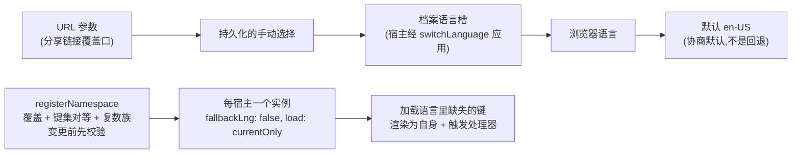

# i18n:双语命名空间,无回退

`@speed/i18n` 是前端的语言层:每宿主一个 react-i18next 实例、由固定协商链条选定的起始语言、带覆盖与对等校验的逐包命名空间注册,以及"另一个语言的文本不可能出现"的缺键纪律。它是 `go/pkgcore` 消息目录刻意的前端对应物:加载语言里缺失的键渲染为键本身并触发可见的处理器——绝不渲染成同一键在另一种语言里的文本。

## 职责与边界

- **每宿主一个实例,而非每包一个。** react-i18next 绑定从主入口再导出,宿主与组件包经同一个 `@speed` 包消费整个面;锁步单版本发布保证树里只有一份 react-i18next——第三方组件里的 `useTranslation` 因此安全。
- **拥有机制,不拥有文案。** 每个渲染包自带双语包、以自有命名空间注册;业务文案属于宿主。本包保证的是:注册在落地前就合法。
- **MUI 不进主 import 图。** locale 助手住在隔离子路径 `@speed/i18n/mui-locale`,永不使用 MUI 的消费者不会安装或解析它;`muiLocaleFor` 对未知标签抛错,绝不悄悄给中文界面配英文文本。
- **不渲染任何内容。** 这层的产物是一个实例与一个翻译函数。

## 设计:起始语言经协商而定,先命中者胜

`createI18n` 沿固定链条走,每个来源先对实例的支持集校验、不匹配即跳过:URL 参数(分享链接的覆盖口)→ 持久化的手动选择 → 用户的档案语言槽 → 浏览器语言 → `en-US` 默认。顺序即设计:显式意图压过存储偏好,存储偏好压过服务端解析的档案,档案压过浏览器。匹配双向放宽子标签但绝不跨语言:`ja-JP` 可选支持的 `ja`,`en` 可选 `en-US`,绝不选到另一种语言。两个后果是刻意的、彼此不同:

- 档案槽压过浏览器,却只在创建之后才喂得进来,所以对活实例应用语言要经 `switchLanguage`,其存储参数三态:`undefined` 用创建时绑定的存储,`null` 不持久化任何东西,`StorageLike` 则持久化到那个存储。应用服务端解析档案的宿主必须传 `null`:持久化会写入*手动*槽,而手动槽在之后每次访问都压过档案层,档案后续变更会在那个浏览器里一直被遮蔽,直到该槽被清除。
- 未知浏览器语言落到 `zh-CN` 默认是协商默认——本产品的母语,可覆盖;它与永不回退的缺键规则是两条不同的规则。

存储刻意尽力而为:失败的存储写只警告、绝不中止切换,创建时抛错的存储读就等于"无存储选择"。

## 设计:注册在任何变更之前完成校验

`registerNamespace` 在落地任何东西前检查一切:每个支持语言必须在场;所有包必须与参照语言携带同一叶键集,键不可能在一个语言里存在、在另一个语言里悄然缺失;叶必须是非空字符串——空翻译渲染为沉默,与丢键无从区分,被拒方式与 Go 目录相同;复数形式是带后缀的叶(`key_one`、`key_other`……),按普通键参与对等,且必须覆盖任一支持语言可能选出的每个计数类别——以渲染器同款的 `Intl.PluralRules` 校验。因为叶集相同,一种语言需要的形式每种语言的包都带:zh-CN 携带 `_one` 形式,en-US 的计数 1 会选它而 zh-CN 自己永不选。一个命名空间每实例只注册一次,名称是裸的、无作用域——宿主写在 `useTranslation` 里的短键,绝不是包标识,所以 `@speed/tokens` 被拒。

整语言或整键的缺口因此都在注册时以错误浮现;注册后出现的缺口无法经本包 API 驱动——测试删掉已注册命名空间的整份 en-US 包来证明渲染路径:键渲染为它自己,zh-CN 文本缺席,处理器触发。

## 设计:无回退,在实例上强制

`createI18n` 钉住 `fallbackLng: false` 与 `load: 'currentOnly'`,跨语言回退因此不可能,并常驻安装缺键处理。缺失的键渲染为键本身——绝不渲染成另一个语言的文本——并以结构化细节上报处理器(默认处理器可见地警告;宿主可提供 `onMissingKey`)。这份严格镜像后端:另一个语言的文本是关于渲染内容的静默谎言,而且永远不会被修。

## 对外的稳定面

`createI18n` 及其支持语言集(创建时校验的规范标签);`switchLanguage` 及其三态存储参数;`registerNamespace` 的契约与校验规则;缺键处理器的 `MissingKeyDetails` 形态;`muiLocaleFor` 的行为;`SPEED_LOCALE_STORAGE_KEY`;再导出的 react-i18next 绑定;以及每次校验抛出的、可执行的 `[speed-i18n]` 前缀错误。

## 相关页

- [前端架构](/zh-cn/docs/developer-docs/frontend-architecture/)——本包执行的无内联文本线索
- web 组:[组导览](/zh-cn/docs/developer-docs/modules/web/)、[ui-kit](/zh-cn/docs/developer-docs/modules/web/ui-kit/) 与 [layout-kit](/zh-cn/docs/developer-docs/modules/web/layout-kit/)——经此注册命名空间的包
- 后端镜像:[pkgcore](/zh-cn/docs/developer-docs/modules/core/pkgcore/)——`go/pkgcore` 的目录,本包镜像其对等规则
- 使用视角:[用户指南中的 @speed/i18n](/zh-cn/docs/user-guide/modules/web/i18n/)
